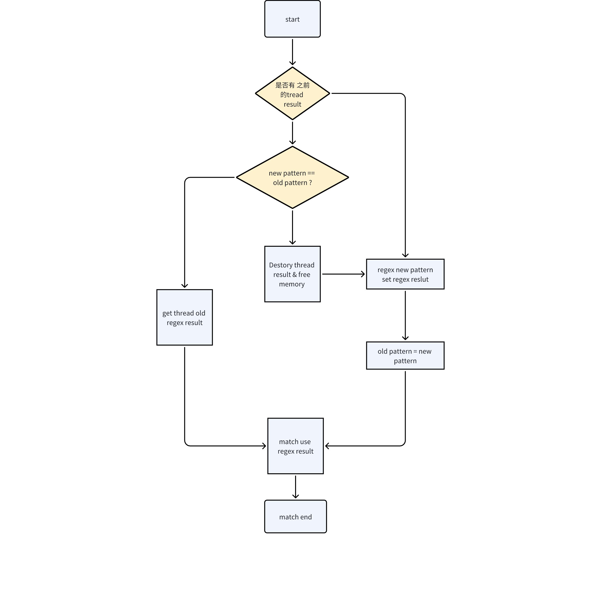

# nchar match 查询优化

## 1. 背景

在对nchar 类型做 match 或者 nmatch 查询的时候，目前查询速度较低，是因为每次 match 都要对 pattern 串做 regex compile 操作，因为 pattern 串在一次甚至多次查询中不改变，其 regex compile 结果可以保存，后续match 可以继续使用，可以优化。
[TD-26789](https://jira.taosdata.com:18080/browse/TD-26789)

## 2. 变更历史

| 日期 | 版本 | 负责人 | 主要修改内容 |
| --- | --- | --- | --- |
| 2024/04/11 | 0.1 | 任新胜 |  |
|  |  |  |  |

## 3. 定义

无

## 4. 行为说明

在做 match 查询或者 nmatch 查询的时候，使用了线程变量，可以保留 pattern 的 regex compile 结果，当 pattern 不发生变化的时候，不会重新 complile ，从而加快 match 的速度。
逻辑如下：


1. 不保存在上下文 context 原因：上次参数传递到最底层的算子比较困难，影响上的所有函数，尤其是这些函数本身都是同一类函数指针，该类型所有函数被影响，影响过大。看起来也比较丑
2. 不保存在全局而是线程变量的原因：全局保存要考虑多线程冲突，多线程使用不同的 pattern 时，会来回切换，影响效率，并且需要加锁，性能损耗比较严重
3. 保存在线程中，没有线程间竞争，至少本线程一批数据能够只 compile 一次完成match 过程 

## 5. 性能

- 最优情况：多次使用同一个 pattern或者同一时间只有一个 pattern 在进行match , 缓存一直生效，只用一次 compile 能完成一次或者多次的 match/nmatch；这应该是最多情况。
- 稍差情况，多个pattern 同时进行，但是每个 pattern 在一个线程中能完成一批数据的 match ，下一批数据可能会需要重新 compile， 总数据量/每批数据大小 是需要重新 compile pattern 的次数；这种情况不多，影响也不是很大
- 最差情况，是每条语句有多个 match pattern， match 的时候多个 pattern 来回切换，这样，性能不会比以前好；在 [TD-29679](https://jira.taosdata.com:18080/browse/TD-29679) 这个任务中继续优化
测试结果：
1. 在 4 核 8G 的虚拟机上测试，测试数据 taosBenchmark 生成，改动前后对比（select count(*) from st where c1  nmatch '^[0-9]';）
   - 1000W 数据命中 838W： 改动前 225s  改动后 27 s 左后
   - 100W 数据命中 83.8W：改动前25秒，改动后约 6s


测试人员测试结果：
优化还比较明显，同一台设备，差不多从193s提升到4s，虽然和pg的1s还有些差距，但比以前还是快多了。先关闭此任务。
```sql
old：
taos> select count(*) from st_common where v_nchar nmatch '^[0-9]';

       count(*)        |

========================

              16070699 |

Query OK, 1 row(s) in set (193.376229s)


taos> select count(*) from st_common where v_nchar match '^[0-9]';

       count(*)        |

========================

               3028982 |

Query OK, 1 row(s) in set (192.741505s)
```

```sql
new：
taos> use accuracy_db;
Database changed.

taos> select count(*) from st_common where v_nchar nmatch '^[0-9]';
count(*) |
========================
15951270 |
Query OK, 1 row(s) in set (4.157837s)

taos> select count(*) from st_common where v_nchar match '^[0-9]';
count(*) |
========================
3150519 |
Query OK, 1 row(s) in set (4.098071s)

taos>
```

## 6. 兼容性

    无影响

## 7. 运维

   无影响

## 8. 使用场景

  基础场景

## 9. 约束和限制

   无

## 10. 常见错误和排查

  无

## 11. 可观测性

  taosBenchmark 构造大量数据进行查询验证

## 12. 安装和卸载

   无

## 13. 文档

  不需要

## 14. 参考文档

  无
