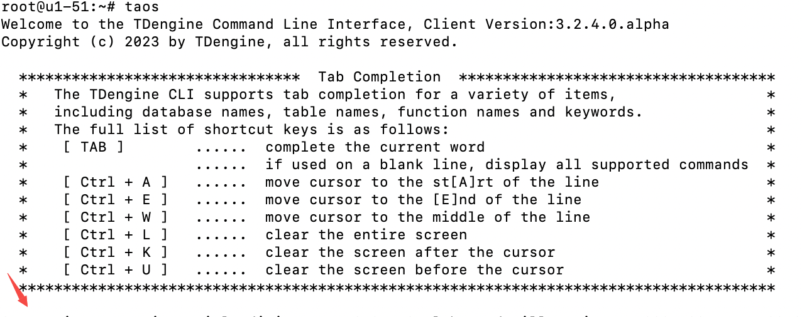
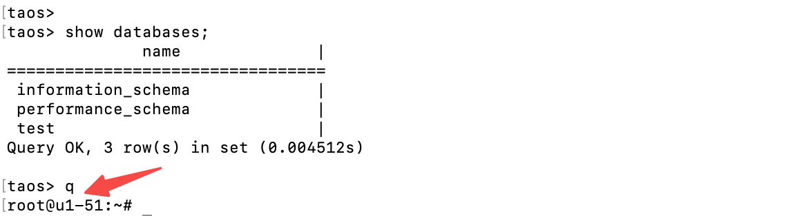
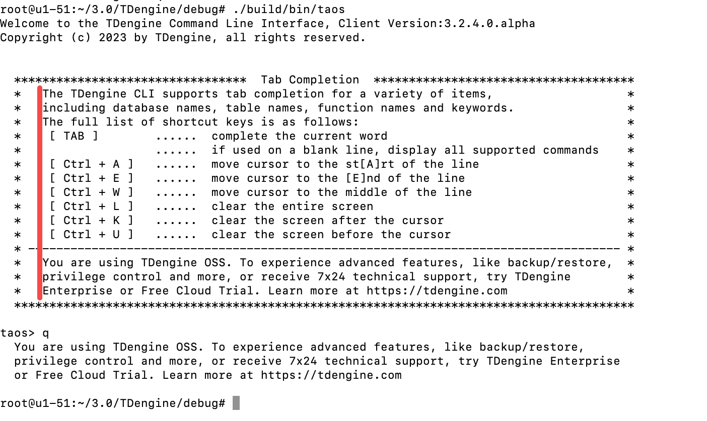
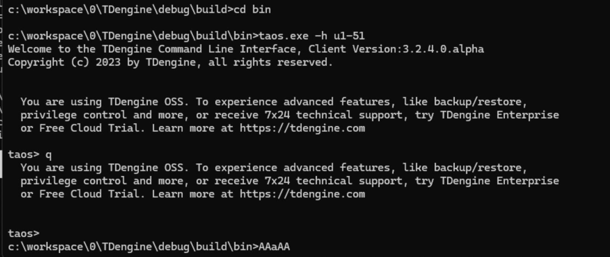

# taos-CLI 植入企业版推广信息

## 1. 背景

目前社区版 taos-CLI 中没有任何企业版相关的信息，很多用户不知道有企业版，为了让更多社区版用户了解到企业版，准备在社区版 taos-CLI 中植入推广企业版信息

## 2. 变更历史

| 日期 | 版本 | 负责人 | 主要修改内容 |
| --- | --- | --- | --- |
| 2024/3/12 | 0.1 | 段宽军 | 初稿 |
| 2024/3/13 | 0.2 | 段宽军 | 展示内容已确定，实际效果已出 |
| 2024/3/14 | 1.0 | 段宽军 | 定稿完成 |

## 3. 定义

  taos-CLI 社区版：根据 “show grants” 返回版本信息为 “community” 即判定为社区版 taos-CLI . 

## 4. 行为说明 {folded="true"}

#### **1）展示内容**

   因为 taos-CLI 是全英文语言交互环境，所以只能展示英文信息
   展示内容（Jeff 3-14确认后最终版）：
        You are using TDengine OSS. To experience advanced features, like backup/restore, privilege control and more, or receive 7x24 technical support, try TDengine Enterprise or Free Cloud Trial. Learn more at [https://tdengine.com](https://tdengine.com/)

#### **2）展示时机**

**    a) taos-CLI 启动欢迎页面下方：**
    这个区域用户的关注度较高

**    b) taos-CLI 退出命令后，展示企业版功能**
     这个区域用户的关注度低，但无感性好，愿意看的可以看

#### **3）实际效果 **

Windows 下效果：

#### **4）企业版及云服务器版  taos-CLI**

     本次功能仅在社区版，企业版及云服务器版的 taos-CLI 与原来一样，无变化。

## 5. 性能

     无影响

## 6. 兼容性

    无影响

## 7. 运维

   无影响

## 8. 使用场景

   社区版 taos-CLI

## 9. 约束和限制

   无

## 10. 常见错误和排查

   无

## 11. 可观测性

   在 taos-CLI 启动进入界面及退出后都会有展示

## 12. 安装和卸载

   无

## 13. 文档

  不需要

## 14. 参考文档

  无
