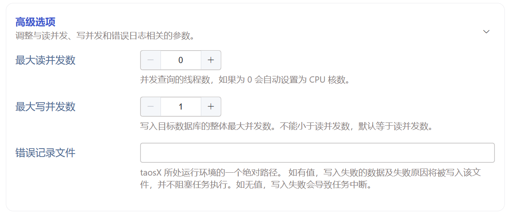

# Data In: Advanced Options for TDengine2

## 1. 背景

目前 taosX 支持的**所有外部数据源配置页面都**已添加"高级选项"部分，参考：[数据源统一参数 Advanced Options](https://taosdata.feishu.cn/wiki/M7DtwijKMinpPIkVxX0cYAE9n2K)。其中有两个比较通用的高级选项“**Read Concurrency**” 和 “**Write Concurrency**”。
对于内置的 TDengine2 数据源，在命令行模式下也有类似的选项，参考：[taosX Data Migration User Manual](https://taosdata.feishu.cn/wiki/wikcnlXBGv4UKBOGld94f6leHre)。
- 命令行模式下的 from dsn 支持参数  “workers” ，相当于 “Read Concurrency”
- 命令行模式下的 to dsn 支持参数 “concurrent-limit”，相当于 “Write Concurrency”
除了以上两个参数之外，还有一个交付部门在命令行模式下做数据迁移**必用的参数: **“fails-to”。这个参数指定一个本地路径把出错的数据和错误原因写入一个单独的文件，便于排查问题和恢复数据。
以上三个参数在命令行模式下的使用示例：
```bash {wrap}
taosx run \
-f "taos://localhost:6030/test?workers=5" \
-t "taos://192.168.0.30:6030/test?concurrent-limit=3&fails-to=error_data.txt"
```

**对于这三个参数，目前在 Explorer 的 TDengine2 任务配置页均不支持，故有此开发任务**。
<quote-container>
补充技术背景
对于 TD2 和 TD3 用查询的方式做数据迁移是 taosX 最早开发的功能，外部数据源是后来才开发的，统一数据源的配置更是最近才实现的改进。因此这个任务并不是新功能的开发，而是旧的配置方式向新的配置方式演进以及旧的参数命名向新的统一命名看齐。比如按照目前的设计“高级选项”中的参数最终都会成为任务的 from dsn 的一部分，而按照旧的配置方式 concurrent-limit 和 fails-to 只能出现在 to dsn 中。
</quote-container>

JIRA: 
TD-29146

## 2. 变更历史

| 日期 | 版本 | 负责人 | 主要修改内容 |
| --- | --- | --- | --- |
| 2024/03/14 | 0.1 | 丁博 | 初稿 |
| 2024/03/14 | 0.2 | 丁博 | 按 Wade review 意见修改 |
| 2024/03/15 | 1.0 | 丁博 | 修改参数名称和描述 |
|  |  |  |  |

## 3. 定义

无

## 4. 行为说明

### 4.1 配置入口  - 高级选项

TDengine 2 数据源配置页底部，新增“高级选项”部分。
“高级选项” 整体描述：
中文：**调整与****读并发****、****写并发****和****错误日志相关****的****参数**。
英文：**Adjust the**** ****parameters related to**** concurrency setting for reading from ****data source**** and  ****writ****ing into data sink****, and error log. **

### 4.2 配置参数

#### 4.2.1 读并发

中文名称： 最大读并发数
英文名称： Read Concurreny
参数类型： 数值
中文描述：并发查询的线程数，如果为 0 会自动设置为 CPU 核数。
英文描述：The number of threads for reading data from the source. If not set, the default value is the number of CPU cores.
默认值：0
是否必须：否

#### 4.2.2 写并发

中文名称： 最大写并发数
参数类型： 数值
英文名称： Write Concurreny
中文描述：写入目标数据库的整体最大并发数。不能小于读并发数，默认等于读并发数。
英文描述：The overall maximum concurrency for writing to the target database. It cannot be less than the read concurrency, and the default is equal to the read concurrency.
默认值：等于读并发
是否必须：否

#### 4.2.3 错误记录文件

中文名称： 错误记录文件
英文名称： File to write failed data
参数类型： 字符串
中文描述：taosX 所处运行环境的一个绝对路径。 如有值，写入失败的数据及失败原因将被写入该文件，并不阻塞任务执行。如无值，写入失败会导致任务中断。
英文描述：An absolute path of the environment where taosX is running. If set, the failed data and the reason for the failure will be written to the file and will not block task execution. If not set, a failed write will cause task interruption.
默认值：无
是否必须：否

### 4.3 配置界面



用户交互说明：
1. 最大读并发数默认值是 0。
2. 最大写并发数默认值是 1。
3. 如果读并发数为 0， 那么写并发数输入框加和减的 step 为  1。
4. 一旦读并发数改成非 0 值， 写并发的默认值就要和写并发相等，且加和减的 step 要和读并发数相等。

### 4.4 补充说明

1. 所有新增选项均不影响命令行模式下已有的行为。也就是说命令行模式下依然可以用 workers 指定读并发，用 concurrent-limit 指定写并发，用 fails-to 指定错误数据输出路径。
2. 在任务启动时会自动创建 fails-to 文件，创建文件失败会导致任务失败。
3. failes-to 参数在服务模式与命令行模式的行为差异。
服务模式：
- 有 fails-to ，不会重试失败的查询，记录错误到文件，不会阻塞任务。
- 没有 fails-to，失败进入 Interrupted 状态，任务继续重试，从上次失败的 checkpoint 开始写入。
CLI 模式：
- 有 fails-to, 记录错误到文件，不阻塞同步。
- 没有 fails-to，任务退出。
1. 数据写入错误日志示例
```plaintext {wrap}
data        device_log_16724306        2024-03-06 22:00:00 UTC..2024-03-06 22:10:00 UTC        [0x2653] Error while querying with sql "INSERT INTO `t_3285fed6d9907d212245c3aa176b6e6e` using `device_log_16724306` (`deviceId`) tags("113220801601") (`_ts`,`content`,`createTime`,`id`,`messageId`,`timestamp`,`type`) values(1709762400000,"{\"headers\":{\"deviceName\":\"862552061313885\",.......,"1765838811684630533",1709762400000,"reportProperty")": Internal error: `Value too long for column/tag: content`  Caused by:     Internal error: `Value too long for column/tag: content`  Stack backtrace:    0: <unknown>    1: <unknown>    2: doAsyncQueryFromParse              at /data/release/TDinternal/community/source/client/src/clientMain.c:1004:5    3: ctgCallUserCb              at /data/release/TDinternal/community/source/libs/catalog/src/ctgAsync.c:1040:4    4: execHelper              at /data/release/TDinternal/community/source/libs/qcom/src/queryUtil.c:124:28    5: taosProcessSchedQueue              at /data/release/TDinternal/community/source/util/src/tsched.c:163:8    6: start_thread    7: clone
```

一次写入错误对应一行输出，包括 4 个部分（下面说明的颜色与日志中的颜色相对应）：
1. 错误类型 data 或 meta
2. 错误的表和时间段
3. 错误码
4. 错误 sql
5. 错误堆栈

## 5. 性能

无

## 6. 兼容性

无

## 7. 运维

## 8. 使用场景

1. 读并发默认为 CPU 核数，在需要限制读并发以减轻源服务器压力的情况下，可以适当调小读并发数。
2. 在源服务器，taosX 服务器，目标服务器压力均较小，想提高数据迁移速度的情况下，可适当调大读并发数。
3. 对于需要严格控制写入顺序的情况，写并发应设置为 1 。
4. 机器负载允许的情况下，提高写并发可显著提高性能。

## 9. 约束和限制

无

## 10. 常见错误和排查

无

## 11. 可观测性

无

## 12. 安装和卸载

无

## 13. 文档

需要修改数据迁移文档。

## 14. 参考文档

[数据源统一参数 Advanced Options](https://taosdata.feishu.cn/wiki/M7DtwijKMinpPIkVxX0cYAE9n2K)
[taosX Data Migration User Manual](https://taosdata.feishu.cn/wiki/wikcnlXBGv4UKBOGld94f6leHre)
