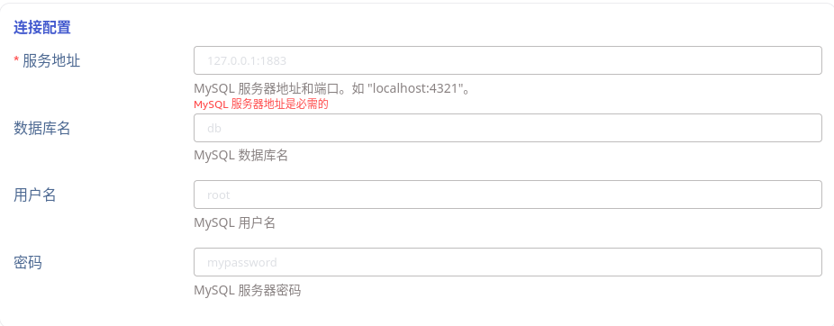
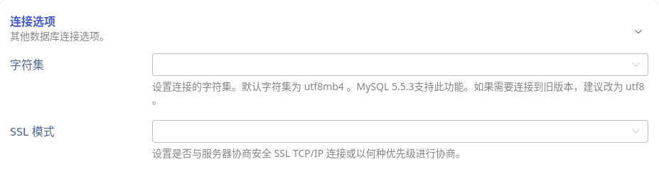
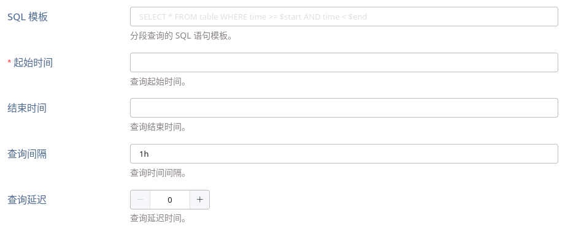
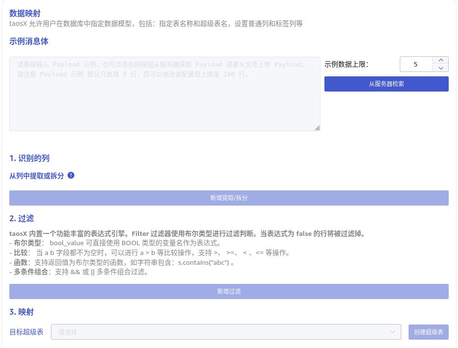

# Data In：关系型数据库

## 1. 背景

TDengine 时序数据库的使用场景愈加广泛，支持传统关系型数据库向 TDengine 平滑地进行迁移将是我们撬动客户的一个推手。在本文文档中，主要讨论对常用数据库，包括 Oracle、MySQL/MariaDB、PostgreSQL 的支持，并在设计上面向关系型数据库提供通用解决方案，既保持当前实现和 UI 的一致性，也便于扩展以后续支持更多关系型数据库。

## 2. 变更历史

| 日期 | 版本 | 负责人 | 主要修改内容 |
| --- | --- | --- | --- |
| 2024/03/15 | 0.1 | @霍琳贺 | 初稿 |
| 2024/03/21 | 0.2 | @霍琳贺 | 1. 安装脚本添加 Oracle 运行时库检查，机制同 PI SDK 检查。 1. 移除自定义 SQL ，保留分段查询机制。 |
| 2024/03/21 | 1.0 | @霍琳贺 | 定稿 |
| 2024/03/28 | 1.1 | @霍琳贺 | 1. 增加分库分表的用法及其实现方案 |

## 3. 定义

- 关系型数据库（RDBMS）：此处仅指 Oracle、MySQL、PostgreSQL。
- 数据源参数类型：
  - string：表示字符串类型参数，choices 列如果有值，表示应从列表中选择。
  - duration: 表示时间间隔，其在 DSN 中是形如 `1d` `5m` `10s` 的时间长度字符串。
  - datetime: 表示时间戳，其在 DSN  中是 RFC3339 格式字符串，形如：`2024-02-04T00:00:00+08:00`。

## 4. 行为说明

### 4.1 添加数据源

Explorer 数据源列表中，增加三种数据源： Oracle、MySQL、PostgreSQL。

### 4.2 关系型数据库数据源 UI

新增的关系型数据库数据源，使用一致的 UI 展示结构，包括：连接信息、SQL 查询、Transformer、高级选项 四大部分。

#### 4.2.1 连接信息

连接信息包括基本连接配置和连接选项两部分：
- 连接配置：包括服务地址和端口、数据库名、用户名、密码。对三种关系型数据库是通用的。



- 连接选项：包含其他可选连接参数和安全配置等。不同的数据源可能包含不同的可选参数。在 Explorer 中，以收起/展开的形式展示，默认为收起。以下是展开的形态（以 MySQL 其中两个参数为例）：



对于不同的数据源，连接参数包含：

| Source | ID | Name | Description | Type | Choices |
| --- | --- | --- | --- | --- | --- |
| charset | 字符集 | 设置连接的字符集。 默认字符集为 `utf8mb4` 。MySQL 5.5.3支持此功能。如果需要连接到旧版本，建议改为 `utf8` 。 | string | utf8mb4 utf8 latin1 utf16 utf32 big5 ... |
| ssl_mode | SSL 模式 | 设置是否与服务器协商安全SSL TCP/IP连接或以何种优先级进行协商。 默认为 PREFERRED，客户端将首先尝试SSL连接，但在失败时回退到非SSL连接。 | string | DISABLED： 使用非 SSL 连接。 PREFERERED：首先尝试SSL连接，但在失败时回退到非SSL连接。 REQUIRED：仅使用 SSL。 VERIFY_CA：与 `Required` 类似，但还要根据配置的CA证书验证服务器证书颁发机构（CA）证书。如果找不到有效的匹配CA证书，则连接尝试失败。 VERIFY_IDENTITY：与 `VerifyCa` 类似，但还需要执行主机名身份验证，方法是根据服务器发送给客户端的证书中的身份，检查客户端用于连接到服务器的主机名。 |
| ssl_ca ssl_client_key ssl_client_cert | CA 证书（PEM格式） 客户端 Key（PEM格式） 客户端证书（PEM格式） | 当 ssl_mode 为 VERIFY_CA 或 VERIFY_IDENTITY 时，可添加证书 | file 同其他数据源 SSL 一致 |  |
| application_name | 应用程序名称 | 设置应用程序可识别名称。无默认值。 | string |  |
| ssl_mode | SSL 模式 | 设置是否与服务器协商安全SSL TCP/IP连接或以何种优先级进行协商。 默认为 PREFERRED，客户端将首先尝试SSL连接，但在失败时回退到非SSL连接。 | string | DISABLE： 使用非 SSL 连接。 ALLOW: 使用非 SSL 连接，失败后回退到 SSL 连接。 PREFER：首先尝试SSL连接，但在失败时回退到非SSL连接。 REQUIRE：仅尝试 SSL 连接。 VERIFY_CA：与 `Require` 类似，但还要根据配置的CA证书验证服务器证书颁发机构（CA）证书。如果找不到有效的匹配CA证书，则连接尝试失败。 VERIFY_FULL：与 `VerifyCa` 类似，但还需要执行主机名身份验证，方法是根据服务器发送给客户端的证书中的身份，检查客户端用于连接到服务器的主机名。 |
| ssl_ca ssl_client_key ssl_client_cert | CA 证书（PEM格式） 客户端 Key（PEM格式） 客户端证书（PEM格式） | 当 ssl_mode 为 VERIFY_CA 或 VERIFY_IDENTITY 时，可添加证书 | file 同其他数据源 SSL 一致 |  |
| Oracle | **client_info** | 客户端信息 | 设置 DBMS_APPLICATION_INFO.SET_CLIENT_INFO ，需要注意 `CLIENT_INFO` 可以被任意用户读取，不要包含敏感信息。 | string |  |
|  | client_id | 客户端 ID | 设置 DBMS_SESSION.SET_IDENTIFIER ，以进行客户端识别。 | string |  |
|  | schema | 设置当前模式 | 与 `ALTER SESSION SET CURRENT_SCHEMA = ` 意义等同，设置为与用户名不同的模式以直接使用对象名称（表名等）。 | string |  |
|  | call_time | 调用超时 | 考虑设置此超时时间以避免查询长时间等待。 | duration |  |

联通性检查在连接信息之后。

#### 4.2.2 SQL 查询

Explorer 查询页面使用使用基于时间窗口的分段查询计划。根据起止时间（start, end）和查询间隔时间窗口（interval），确定查询计划。


各参数列表如下：

| ID | Name | Description | Type |
| --- | --- | --- | --- |
| sql | SQL 模板（SQL Template） | 用于查询的 SQL 语句。 | string |
| start | 起始时间（Start Time） | 应用于查询语句的起始时间。 | datetime |
| end | 结束时间（End Time） | 应用于查询语句的结束时间。 | datetime |
| interval | 查询间隔（Interval） | 用于分段查询的时间间隔。 | duration |
| delay | 延迟时长（Delay） | 用于同步未来时刻数据的等待时长。 与 InfluxDB、Historian 等数据源描述保持一致。 | duration |

- SQL 模板中必须使用预定义的时间占位符，且应**同时包含起止**时间，且起止时间占位符必须**成对出现**：
  - 时间戳起止 `${start}` `${end}`：表示 RFC3339 格式时间戳，如： `2024-03-14T08:00:00+0800`
  - 无时区时间戳起止 `${start_no_tz}` `${end_no_tz}`: 表示不带时区的 RFC3339 字符串：`2024-03-14T08:00:00`。
  - 日期起止：`${start_date}` `${end_date}`：表示仅日期，如：`2024-03-14`。
  - 时间起止：`${start_time}` `${end_time}`：表示仅时间，如：`08:00:00`。
- `**start**`**, **`**end**`：分段查询的起止时间记为 `[start, end)` ，使用左闭右开区间。**起始时间为必选项**。**结束时间为可选项**，不选时，同步将不会停止（即通过连续查询达到有延时的实时同步的目的）。
- `**interval**`：查询间隔时间窗口，将 `[start, end)` 分割为多个时间片，分别查询。
- `**delay**`**：**延迟时长。此参数仅在查询起止时间包含未来时间时有意义。在时间 `end` 到达时，延迟 `delay` 时长再进行查询，以等待该查询时段内的数据写入完毕。

##### 4.2.2.1 分库分表

如果有按时间分库分表的需求，即表名中包含日期（如 `table_202403` 为 2024 年 3 月数据表），可配合 `interval` 参数在 SQL 模板的表名中使用时间占位符

| name | description | Example |
| --- | --- | --- |
| Y | 年，完整的公历年表示，零填充的 4 位整数。 | 2001 |
| y | 年，公历年除以 100，零填充的 2 为整数。 | 01 |
| m | 月，整数月份(01 - 12) | 07 |
| b | 月，月份英文的缩写（3 个字母） | Jul |
| B | 月，月份英文全拼 | July |
| d | 日，日期的数字表示(01 - 31)，零填充的 2 位整数 | 08 |
| j | 日，一年中的第几天（001 - 366），零填充的 3 位整数。 | 189 |
| F | 日，相当于 `${Y}-${m}-${d}` | 2001-07-08 |

可以使用如下时间占位符的组合：

| Ymd | 日，完整的年月日表示，中间没有空格 | 20010708 |
| --- | --- | --- |
| ymd | 日，完整的年月日表示，中间没有空格，年为 2 位数字 | 010708 |
| md | 日，月日的数字表示，中间没有空格 | 0708 |
| dm | 日，日月的数字表示，中间没有空格 | 0807 |
| Yj | 日，以一年中的第几天表示的日期，中间没有空格 | 2001189 |
| yj | 日，以一年中的第几天表示的日期，中间没有空格，年为 2 位数字 | 01189 |

查询时，如果包含日占位符，时间分片后的结果不得跨日；如果包含月占位符，时间分片后的结果不得跨月；如果包含年占位符，时间分片后的结果不得跨年。

##### 4.2.2.2 任务状态变更

使用分段查询功能下，其任务状态变更条件和结果如下：
1. 任务执行完毕，进入 **已完成 **状态
2. 任务执行出错，进入 **已中断 **状态，并继续重试，同步任务以上次执行成功的 end' 作为新的 start' 开始执行。
3. 任务配置编辑时，**不允许**修改基础 SQL 语句。
4. 任务配置修改后，启动任务时需要对新的 start, end 及 checkpoint 的关系重新计算。如果修改了 end，且 end < checkpoint，则直接结束。

#### 4.2.3 Transformer （数据映射）

关系型数据库的数据映射部分，与 Historian 数据源保持一致：


需要注意：
1. 时间戳列映射到 TDengine 表时，如果原始类型是 TIMESTAMP 类型，不需要转换；如果是字符串类型，支持 RFC3339 格式字符串自动解析，其他情况需要拼接完整时间戳字符串后才能入库；日期、时间在不同列的，拼接合并后方可入库。

#### 4.2.4 高级选项

支持设置读并发数：
- 参数名：**最大读取并发数**
- 描述：数据源最大读取线程数限制，当默认参数不满足需要或需要调整资源使用量时修改此参数。
- 默认值：0，表示为当前 CPU 线程数。
- 取值范围：[0, 1000]

## 5. 性能

初次支持关系型数据库，无性能基准。

## 6. 兼容性

支持直连模式和

## 7. 运维

### 7.1 Oracle 运行时库

连接 Oracle 数据库需要安装 [**ODPI-C**](https://oracle.github.io/odpi/)** **库。

## 8. 使用场景

### 8.1 历史数据迁移

使用自定义 SQL 或过去时间分段查询，达到迁移历史数据的目的。

### 8.2 实时数据同步

使用未来时间分段查询，可达到迁移实时数据的目的。

### 8.3 分库分表

#### 8.3.1 按日期分表

假设我们有按照日期格式 `20240708` （2024 年 07 月 08 日）这样的日期分表的数据库：
```sql
create table meters_part_20240708(
  id int,
  ts time,
  current float,
  voltage int,
  phase float
);

insert into meters_part_20240708 values(1, "08:00:00", 2.1, 10, 0.1)
```

我们可以使用日期占位符构建如下 SQL 模板：
```sql
select id, concat('${F}', 'T', ts, '+08:00') as ts, current, voltage, phase
  from meters_part_${ymd};
```

其对应到 `20240708` 日期的表 SQL 如下：
```sql
select id, concat('2024-07-08', 'T', ts, '+08:00') as ts, current, voltage, phase
  from meters_part_20240708;
```

SQL 查询结果如下表：

| ts | id | current | voltage | phase |
| --- | --- | --- | --- | --- |
| 2024-07-08T08:00:00+08:00 | 1 | 2.1 | 10 | 0.1 |

之后使用 Transformer 功能可以进行进一步的数据映射。

#### 8.3.2 宽表列转行

假设我们有表 `mytable`，每分钟数据均为单独列，共 m00...m59 总计 60 列时序值（以下示例中我们仅用了 6 列，并插入了日期为 2024-04-04 ，时间为 01:00 - 01:05 的数据）
```sql
create table mytable(
  id int,
  dt date,
  hour smallint,
  m00 int,
  m01 int,
  m02 int,
  m03 int,
  m04 int,
  m05 int
);

insert into mytable values(1, '2024-04-04', 1, 0,1,2,3,4,5);
```

在我们 Transformer 支持 pivot （转置，行转列，或列转行）前，我们可以使用关系型数据库 union all 进行预处理以达到列转行的目的：
```sql
SELECT concat(dt, 'T', LPAD(hour, 2, '0'), ':00:00+0800') AS m, m00 AS value FROM mytable
UNION ALL
SELECT concat(dt, 'T', LPAD(hour, 2, '0'), ':01:00+0800') AS m, m01 AS value FROM mytable
UNION ALL
SELECT concat(dt, 'T', LPAD(hour, 2, '0'), ':02:00+0800') AS m, m02 AS value FROM mytable
UNION ALL
SELECT concat(dt, 'T', LPAD(hour, 2, '0'), ':03:00+0800') AS m, m03 AS value FROM mytable
UNION ALL
SELECT concat(dt, 'T', LPAD(hour, 2, '0'), ':04:00+0800') AS m, m04 AS value FROM mytable
UNION ALL
SELECT concat(dt, 'T', LPAD(hour, 2, '0'), ':05:00+0800') AS m, m05 AS value FROM mytable;
```

在这里的示例代码中，我们得到了期望的时序的结果，将以上 SQL 转为模板，或预先在数据库中创建视图后再用视图编写 SQL 模板，就可以使用我们的功能实现入库了。

| id | m | value |
| --- | --- | --- |
| 1 | 2024-04-04T01:00:00+0800 | 0 |
| 1 | 2024-04-04T01:01:00+0800 | 1 |
| 1 | 2024-04-04T01:02:00+0800 | 2 |
| 1 | 2024-04-04T01:03:00+0800 | 3 |
| 1 | 2024-04-04T01:04:00+0800 | 4 |
| 1 | 2024-04-04T01:05:00+0800 | 5 |

[View on DB Fiddle](https://www.db-fiddle.com/f/sGE126k2M9bNvKZ6GS1Edx/0)
---

## 9. 约束和限制

1. MySQL/PostgreSQL 数据库连接当前均不支持 socket 直连。
2. Oracle
   - 连接 Oracle 数据库需要安装 [**ODPI-C**](https://oracle.github.io/odpi/)** **库。
   - 支持 Oracle 客户端 11.2 以上。
   - 不支持自定义类型、XML 类型、JSON 类型。
3. 由于时区的存在，导致拼 sql 时往往会造成实际时间与拼接时间不一致，尤其是 sample 接口使用 ${start_time}  与 ${end_time} 筛选时非常明显，前端选择 2024-04-25 00:00:00 ~ 2024-04-25 16:00:00 时，后端实际使用 2024-04-24 16:00:00 ~ 2024-04-25 08:00:00 （零时区减 8 小时），where 条件则变为 ts >= '16:00:00' and ts < '08:00:00'，从而导致查询错误。此时，如果改为使用 local 时区，则 sample 接口与实际运行结果不一致。

## 10. 常见错误和排查

1. 连接错误在检查数据源时显示在 Explorer。
2. 创建任务和更新任务配置时，检查数据源可用性。
3. SQL 查询参数检查相关错误消息
   - 当 SQL 语句中不含时间占位符时，报错：Expect time range placeholders in SQL template.
   - 当 SQL 语句时间占位符不成对（仅包含 start*，或 end*）时，报错：The time range placeholders in SQL template must exist in pair.
   - 当 SQL 语句不合法时，报错：Syntax error in SQL template: xxx （具体错误信息）

## 11. 可观测性

可观测性所涉及的范围同其他数据源（Flat 类型数据源，如 MQTT、Historian）一致。
需要 @佘彦杰在 在 taosx TDinsight 中添加 MySQL、PostgreSQL、Oracle 数据源监控面板。

## 12. 安装和卸载

Oracle 的运行时依赖是否应该在安装时检查。需要对 Windows installler 和 Linux 安装脚本增加此部分检查。

## 13. 文档

- **需要**修改企业版文档
- **不需要**修改官网文档

## 14. 参考文档

1. [MySQL CharSet ](https://dev.mysql.com/doc/refman/8.0/en/charset-mysql.html)
2. [PostgreSQL SSL Mode](https://docs.rs/sqlx-postgres/latest/sqlx_postgres/enum.PgSslMode.html)
3. [Oracle ODPI-C](https://oracle.github.io/odpi/)

## 15. 附录

### 15.1 分段查询实现方案

在实现中，SQL 模板中的时间占位符将被各分段时间范围替换。例如，SQL 语句为  `select * from table where name = 'abc' and ts >= ${start} and ts < ${end}`，起始时间为 `2024-02-04 00:00:00 +08:00`，结束时间为 `2024-02-14 00:00:00 +08:00`，时间窗口为 1 天，则分段查询第一条语句将是：`select * from table where name = 'abc' and ts >= '2024-02-04T00:00:00+08:00' and ts < '2024-02-05T00:00:00+08:00'`，以此类推。
为了实现持续同步，我们使用“延迟时长”参数，对查询的起止时间做了如下约定：
- 对于一次查询任务，延迟时长记为 delay，当前时间记为 now ，起始时间记为 start'，结束时间记为 end'。
- 执行时刻 now >= end' + delay 时（表示这是一个历史数据查询），执行查询语句。
- 执行时刻 now  < end' + delay 时（未到结束时间，表示这是一个未来或实时数据查询），需要等待到 end' + delay 时刻到达，才执行查询。
- 每次查询写入成功后，更新 checkpoint 为 end'，作为断点续传的依据。
这样，我们将历史数据查询和实时数据同步使用统一的参数达成目的。

### 15.2 分段查询断点续传

仅当使用分段查询时支持断点续传。此时，断点 checkpoint 没有 key，即对同一个任务仅有一个时间断点，该断点记录为一个查询时间片的截止时段（`end'`）。需要注意的是，在并发数大于 1 时，需要保证较早时间片的数据已写入才能记录断点。

### 15.3 MySQL 数据类型映射关系对照表

| MySQL 字段类型 | Sample Data | Arrow 类型 | TDengine 类型 |
| --- | --- | --- | --- |
| TINYINT | i8 | Int8 | Int8 |
| TINYINT UNSIGNED | u8 | UInt8 | UInt8 |
| SMALLINT | i16 | Int16 | Int16 |
| SMALLINT UNSIGNED | u16 | UInt16 | UInt16 |
| MEDIUMINT | i32 | Int32 | Int32 |
| MEDIUMINT UNSIGNED | u32 | UInt32 | UInt32 |
| INT | i32 | Int32 | Int32 |
| INT UNSIGNED | u32 | UInt32 | UInt32 |
| BIGINT | i64 | Int64 | Int64 |
| BIGINT UNSIGNED | u64 | UInt64 | UInt64 |
| FLOAT | f32 | Float32 | Float32 |
| DOUBLE | f64 | Float64 | Float64 |
| DECIMAL | String | Utf8 | NChar(50) |
| CHAR | String | Utf8 | NChar(50) |
| VARCHAR | String | Utf8 | NChar(50) |
| TINYTEXT | String | Utf8 | NChar(50) |
| TEXT | String | Utf8 | NChar(50) |
| MEDUIMTEXT | String | Utf8 | NChar(50) |
| LONGTEXT | String | Utf8 | NChar(50) |
| BINARY | String | Utf8 | NChar(50) |
| VARBINARY | String | Utf8 | NChar(50) |
| TINYBLOB | String | Utf8 | NChar(50) |
| BLOB | String | Utf8 | NChar(50) |
| MEDIUMBLOB | String | Utf8 | NChar(50) |
| LONGBLOB | String | Utf8 | NChar(50) |
| DATE | String | Utf8 | NChar(50) |
| TIME | String | Utf8 | NChar(50) |
| DATETIME | DateTime | Timestamp(TimeUnit::Nanosecond, None) | Timestamp(TimeUnit::Nanosecond) |
| TIMESTAMP | DateTime | Timestamp(TimeUnit::Nanosecond, None) | Timestamp(TimeUnit::Nanosecond) |
| YEAR | u16 | UInt16 | Int16 |
| BIT | u8 | UInt8 | UInt8 |

### 15.4 Postgres 数据类型映射关系对照表

| Postgres 字段类型 | Sample Data | Arrow 类型 | TDengine 类型 |
| --- | --- | --- | --- |
| BOOL | String | Utf8 | NChar(50) |
| CHAR | String | Utf8 | NChar(50) |
| SMALLINT | i16 | Int16 | Int16 |
| SMALLSERIAL | i16 | Int16 | Int16 |
| INT2 | i16 | Int16 | Int16 |
| INT | i32 | Int32 | Int32 |
| SERIAL | i32 | Int32 | Int32 |
| INT4 | i32 | Int32 | Int32 |
| BIGINT | i64 | Int64 | Int64 |
| BIGSERIAL | i64 | Int64 | Int64 |
| INT8 | i64 | Int64 | Int64 |
| REAL | f32 | Float32 | Float32 |
| FLOAT4 | f32 | Float32 | Float32 |
| DOUBLE PRECISION | f64 | Float64 | Float64 |
| FLOAT8 | f64 | Float64 | Float64 |
| NUMERIC | String | Utf8 | NChar(50) |
| VARCHAR | String | Utf8 | NChar(50) |
| CHAR(N) | String | Utf8 | NChar(50) |
| TEXT | String | Utf8 | NChar(50) |
| NAME | String | Utf8 | NChar(50) |
| CITEXT | String | Utf8 | NChar(50) |
| BYTEA | String | Utf8 | NChar(50) |
| DATE | String | Utf8 | NChar(50) |
| TIME | String | Utf8 | NChar(50) |
| TIMESTAMP | String | Utf8 | NChar(50) |
| TIMESTAMPTZ | DateTime | Timestamp(TimeUnit::Nanosecond, None) | Timestamp(TimeUnit::Nanosecond) |
| UUID | "" | Utf8 | NChar(50) |
| BIT | String | Utf8 | NChar(50) |
| VARBIT | String | Utf8 | NChar(50) |
| JSON | String | Utf8 | NChar(50) |
| JSONB | String | Utf8 | NChar(50) |
| INTERVAL | String | Utf8 | NChar(50) |
| INT8RANGE | "" | Utf8 | NChar(50) |
| INT4RANGE | "" | Utf8 | NChar(50) |
| TSRANGE | "" | Utf8 | NChar(50) |
| TSTZRANGE | "" | Utf8 | NChar(50) |
| DATERANGE | "" | Utf8 | NChar(50) |
| NUMRANGE | "" | Utf8 | NChar(50) |
| MONEY | "" | Utf8 | NChar(50) |
| LTREE | "" | Utf8 | NChar(50) |
| LQUERY | "" | Utf8 | NChar(50) |
| TIMETZ | String | Utf8 | NChar(50) |
| INET | "" | Utf8 | NChar(50) |
| CIDR | "" | Utf8 | NChar(50) |
| MACADDR | "" | Utf8 | NChar(50) |

### 15.5 Oracle 数据类型映射关系对照表

| Oracle 字段类型 | Sample Data | Arrow 类型 | TDengine 类型 |
| --- | --- | --- | --- |
| Varchar2(_) | String | Utf8 | NChar(50) |
| NVarchar2(_) | String | Utf8 | NChar(50) |
| Char(_) | String | Utf8 | NChar(50) |
| NChar(_) | String | Utf8 | NChar(50) |
| Rowid | String | Utf8 | NChar(50) |
| Raw(_) | String | Utf8 | NChar(50) |
| BinaryFloat | f32 | Float32 | Float32 |
| BinaryDouble | f64 | Float64 | Float64 |
| Number(_, _) | String | Utf8 | NChar(50) |
| Float(_) | String | Utf8 | NChar(50) |
| Date | String | Utf8 | NChar(50) |
| Timestamp(_) | String | Utf8 | NChar(50) |
| TimestampTZ(_) | DateTime | Timestamp(TimeUnit::Nanosecond, None) | Timestamp(TimeUnit::Nanosecond) |
| TimestampLTZ(_) | DateTime | Timestamp(TimeUnit::Nanosecond, None) | Timestamp(TimeUnit::Nanosecond) |
| IntervalDS(_, _) | String | Utf8 | NChar(50) |
| IntervalYM(_) | String | Utf8 | NChar(50) |
| CLOB | String | Utf8 | NChar(50) |
| NCLOB | String | Utf8 | NChar(50) |
| BLOB | String | Utf8 | NChar(50) |
| BFILE | String | Utf8 | NChar(50) |
| RefCursor | String | Utf8 | NChar(50) |
| Boolean | String | Utf8 | NChar(50) |
| Object(_) | String | Utf8 | NChar(50) |
| Long | String | Utf8 | NChar(50) |
| LongRaw | String | Utf8 | NChar(50) |
| Json | String | Utf8 | NChar(50) |
| Int64 | i64 | Int64 | Int64 |
| UInt64 | u64 | UInt64 | UInt64 |

### 15.6 关于 MySQL & Postgres & Oracle 数据库中时间类型字段的处理

#### 15.6.1 查询条件

为了解决时区引发的使用混乱问题，我们将用户在 explorer 中输入的 sql 与 start/end 均赋予“explorer 时区”的属性，为了更清楚的理解这种变化，下面将举例说明：
```plaintext {wrap}

## 16. 用户输入：

sql: select * from test where ts >= ${start} and ts < ${end}
start: 2024-04-01 00:00:00+08:00
end: 2024-05-01 00:00:00+08:00

## 17. 旧的处理：

1. 得到“零时区”的字符串 start=2024-03-31 16:00:00 end=2024-04-30 16:00:00
2. 在“零时区”的连接中执行 sql 语句 select * from test where ts >= '2024-03-31 16:00:00' and ts < '2024-04-30 16:00:00';

## 18. 新的处理：

1. 得到“explorer 时区”的字符串 start=2024-04-01 00:00:00 end=2024-05-01 00:00:00
2. 在“explorer 时区”的连接中执行 sql 语句 select * from test where ts >= '2024-04-01 00:00:00' and ts < '2024-05-01 00:00:00';
```

与此同时，taosx 中拆分任务的时间段也需要赋予“explorer 时区”的属性，之前按“零时区”的 day 进行拆分查询，现在需要按照“explorer 时区”的 day 进行拆分查询。
上述两种处理，在查询中一般没有区别，它主要处理 ${start_time} 格式的占位符，如果用户输入 2024-04-01 00:00:00+08:00 与 2024-04-01 16:00:00+08:00，使用“零时区”的方式会变成 start >= '16:00:00' and end < '08:00:00' 语句，这与用户期望不符，而使用“explorer 时区”的方式则无此问题。
<quote-container>
注意：按时间分表的问题，需要保证 explorer 时区、表名时区、查询字段时区三者一致，否则将会出现在 table_20240401 表中查询 ts=2024-04-02 02:00:00 数据的可能性。
</quote-container>

#### 18.0.1 取值转换
