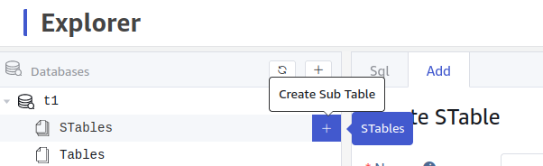
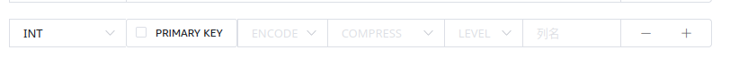
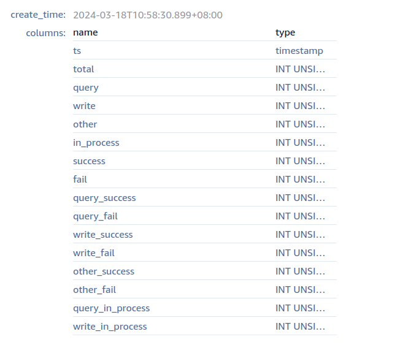

# Explorer 建表：支持复合主键和压缩增强

## 1. 背景

自 3.3.0.0 起，TDengine 支持[可配置存储压缩-Function Spec](https://taosdata.feishu.cn/wiki/St4WwSX5Ei3VfMk3yMUcv2DMnMh)，Explorer 中需要进行复合主键和压缩增强建表语句的支持。

## 2. 变更历史

| 日期 | 版本 | 负责人 | 主要修改内容 |
| --- | --- | --- | --- |
| 2024/03/21 | 0.1 | 顾香 | 霍琳贺编写初稿 |

## 3. 定义

无。

## 4. 行为说明

### 4.1 Explorer 需要支持在建表时配置复合主键和压缩选项

包括：
1. 数据浏览器树形窗口创建超级表
2. 数据浏览器树形窗口创建普通表
3. DataIn 部分支持 Transformer 的数据源配置数据映射时创建超级表

对于普通列（非标签列，包含主键列），支持一级压缩、二级压缩、压缩级别选项：

对于第二列，需要增加复合主键选框：

其中：
- ENCODE：编码算法列表（一级压缩），下拉列表可选：Simple8B、XOR、RLE、None(对应disabled)，默认值暂时未定（因 [可配置存储压缩-Function Spec](https://taosdata.feishu.cn/wiki/St4WwSX5Ei3VfMk3yMUcv2DMnMh) 中尚未确定，根据最终定稿，确定对于不同数据类型的默认值）
- COMPRESS：压缩算法列表（二级压缩），下拉列表可选： lz4、zlib、zstd、tsz、xz、None(对应disabled)，默认值暂时未定（因 [可配置存储压缩-Function Spec](https://taosdata.feishu.cn/wiki/St4WwSX5Ei3VfMk3yMUcv2DMnMh) 中尚未确定，根据最终定稿，确定对于不同数据类型的默认值）
- LEVEL：（特指二级）压缩算法内部的级别，下拉列表可选：
  - **high：**压缩率最高，压缩速度和解压速度相对最差。
  - **low：** 压缩速度和解压速度最好，压缩率相对最低。
  - **medium：**兼顾压缩率、压缩速度和解压速度。
  默认值为 medium。

### 4.2 Explorer 支持复合主键和压缩选项的展示

包括：
1. 数据浏览器树形窗口查看超级表信息
2. 数据浏览器树形窗口查看普通表信息

表结构信息中添加以下三列：encode、compress 、level 。分别对应其建表信息。
复合主键列在列名后加 `*` 号表示，`*` 号鼠标浮动在上面时显示中文提示“复合主键”或英文提示 “PRIMARY KEY”。
因为表结构信息增多，新版本 UI 将 **columns 和 tags 修改为上下结构展示**。

## 5. 性能

无。

## 6. 兼容性

Explorer 仅对 3.3.0.0 以上版本显示此特性，对旧版本保持原 UI。即 Explorer 能够根据 TDengine 版本自适应展示不同的行为。

## 7. 运维

无

## 8. 使用场景

无需说明。

## 9. 约束和限制

- 当使用复合主键时，复合主键列必须非空。这在 Transformer 中作为提示展示。

## 10. 常见错误和排查

无。

## 11. 可观测性

无变化。

## 12. 安装和卸载

无变化。

## 13. 文档

- **需要**修改企业版文档：需要对此特性添加说明，修改截图等。
- 不需要修改官网文档。

## 14. 参考文档

1. [可配置存储压缩-Function Spec](https://taosdata.feishu.cn/wiki/St4WwSX5Ei3VfMk3yMUcv2DMnMh)
2. [复合主键](https://taosdata.feishu.cn/wiki/OLQjwCpQhiRFE3kS8Uvc3sornRb)
