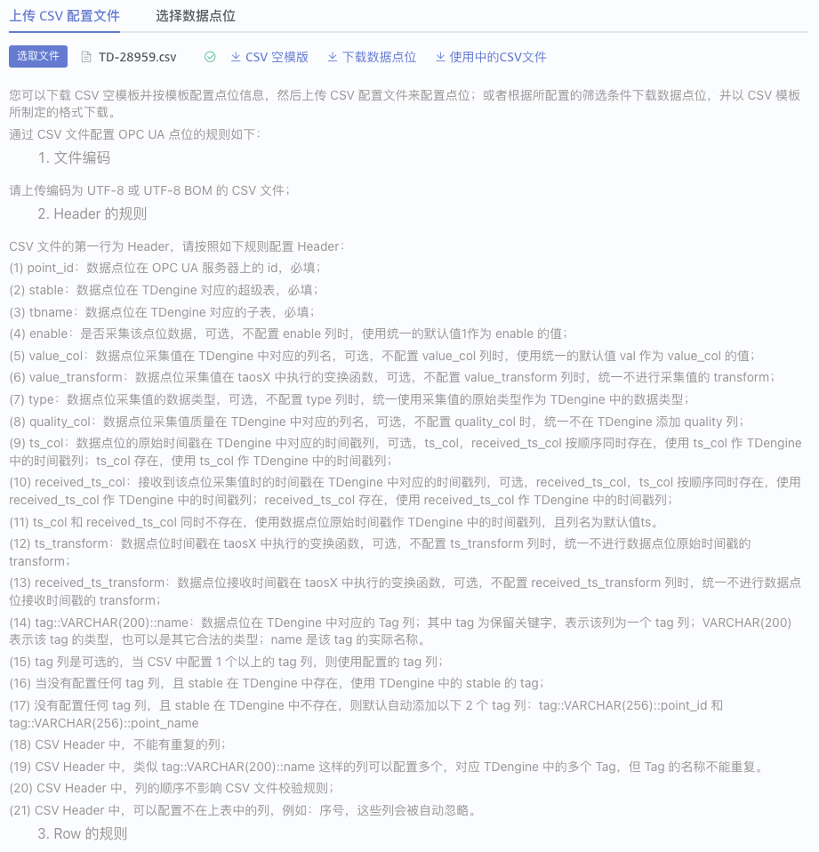

# OPC CSV 文件合法性校验

## 1. 背景

目前，taosX 中通过 CSV 文件配置 OPC DataIn 任务的点位时，没有对用户上传的 CSV 文件进行合法性校验，OPC  DataIn 任务直接运行。CSV 文件内部支持很多复杂的规则，提前检查 CSV 文件的合法性，可以避免在任务运行后报错。
这个 Functional Spec 的需求来源于[OPC 深度优化（讨论稿）](https://taosdata.feishu.cn/wiki/I9ygw9JAHifpylkzj3xcT1SRnBg)的第一部分。

## 2. 变更历史

| 日期 | 版本 | 负责人 | 主要修改内容 |
| --- | --- | --- | --- |
| 2024-03-13 | v0.1 | @杨志宇 | 初稿 |
| 2024-03-14 | v0.2 | @杨志宇 | 按照线上 Review 意见修改 |
| 2024-03-15 | v1.0 | @杨志宇 | 按照线下 Review 意见修改 |

## 3. 定义

无

## 4. 行为说明

### 4.1 CSV 文件的编码

用户上传的 CSV 文件的编码格式必须为以下格式中的一种：
1. UTF-8 with BOM
2. UTF-8（即：UTF-8 without BOM）
用户上传的 CSV 文件不满足编码格式时，提示用户进行转换。
**Note**：用户的 CSV 文件可能使用 Excel 编辑，Excel 编辑的 csv 文件通常是带 BOM 的。在 Linux / mac 编辑的 csv 文件通常不带 BOM。

### 4.2 Header 配置规则

Header 是 CSV 文件的第一行，规则如下：
1. CSV 的 Header 中可以配置以下列：
**表 4-1 Header 中的列**

| **序号** | **列****名** | **描述** | 适用的 **OPC 类型** | **是否必填** | **默认行为** |
| --- | --- | --- | --- | --- | --- |
| 1 | point_id | 数据点位在 OPC UA 服务器上的 id | UA only | 是 | 无 |
| 2 | tag_name | 数据点位在 OPC DA 服务器上的 id | DA only | 是 | 无 |
| 3 | stable | 数据点位在 TDengine 中对应的超级表 | both | 是 | 无 |
| 4 | tbname | 数据点位在 TDengine 中对应的子表 | both | 是 | 无 |
| 5 | enable | 是否采集该点位的数据 | both | 否 | 使用统一的默认值`1`作为 enable 的值 |
| 6 | value_col | 数据点位采集值在 TDengine 中对应的列名 | both | 否 | 使用统一的默认值 `val` 作为 value_col 的值 |
| 7 | value_transform | 数据点位采集值在 taosX 中执行的变换函数 | both | 否 | 统一不进行采集值的 transform |
| 8 | type | 数据点位采集值的数据类型 | both | 否 | 统一使用采集值的原始类型作为 TDengine 中的数据类型 |
| 9 | quality_col | 数据点位采集值质量在 TDengine 中对应的列名 | both | 否 | 统一不在 TDengine 添加 quality 列 |
| 10 | ts_col | **数据点位的原始时间戳**在 TDengine 中对应的时间戳列 | both | 否 |
| 11 | received_ts_col | **接收****到该点位采集值时的****时间戳**在 TDengine 中对应的时间戳列 | both | 否 |
| 12 | ts_transform | 数据点位时间戳在 taosX 中执行的变换函数 | both | 否 | 统一不进行**数据点位原始时间戳**的 transform |
| 13 | received_ts_transform | 数据点位接收时间戳在 taosX 中执行的变换函数 | both | 否 | 统一不进行**数据点位接收时间戳**的 transform |
| 14 | tag::VARCHAR(200)::name | 数据点位在 TDengine 中对应的 Tag 列。其中 `tag` 为保留关键字，表示该列为一个 tag 列；`VARCHAR(200)` 表示该 tag 的类型，也可以是其它合法的类型；`name` 是该 tag 的实际名称。 | both | 否 | 1. 配置 1 个以上的 tag 列，则使用配置的 tag 列； 1. 没有配置任何 tag 列，且 stable 在 TDengine 中存在，使用 TDengine 中的 stable 的 tag； 1. 没有配置任何 tag 列，且 stable 在 TDengine 中不存在，则默认自动添加以下 2 个 tag 列： - tag::VARCHAR(256)::point_id - tag::VARCHAR(256)::point_name |

1. CSV Header 中，不能有重复的列；
2. CSV Header 中，类似`tag::VARCHAR(200)::name`这样的列可以配置多个，对应 TDengine 中的多个 Tag，但 Tag 的名称不能重复。
3. CSV Header 中，列的顺序不影响 CSV 文件校验规则；
4. CSV Header 中，可以配置不在上表中的列，例如：序号，这些列会被自动忽略。

### 4.3 Row 配置规则

CSV 文件中的每个 Row 配置一个 OPC 数据点位。**注意： **
- 在 CSV Header 中没有配置的列，使用`表4-1 Header中的列`中的默认行为；
- 在 CSV Header 中配置了列，CSV Row 中为空，使用`表4-2 Row中的列`中的默认值。
Row 的规则如下：
1. 与 Header 中的列有如下对应关系：
**表 4-2 Row 中的列**

| **序号** | **Header 中的列** | **值的类型** | **值的范围** | **是否必填** | **默认值** |
| --- | --- | --- | --- | --- | --- |
| 1 | point_id | String | 类似`ns=3;i=1005`这样的字符串，要满足 OPC UA 的 ID 的规范，即：包含 ns 和 id 部分 | 是 |  |
| 2 | tag_name | String | 类似`root.parent.temperature`这样的字符串，要满足 OPC DA 的 ID 规范 | 是 |  |
| 3 | enable | int | - 0：不采集该点位，且在 OPC DataIn 任务开始前，删除 TDengine 中点位对应的子表； - 1：采集该点位，在 OPC DataIn 任务开始前，不删除子表。 | 否 | 1 |
| 4 | stable | String | 1. 符合 TDengine 超级表命名规范的任何字符串； 1. 如果存在特殊字符`.`，使用下划线替换 1. 如果存在`{type}`，则： - CSV 文件的 type 不为空，使用 type 的值进行替换 - CSV 文件的 type 为空，使用采集值的原始类型进行替换 | 是 |  |
| 5 | tbname | String | 1. 符合 TDengine 子表命名规范的任何字符串； 1. 如果存在特殊字符`.`，使用下划线替换 1. 对于 OPC UA： - 如果存在`{ns}`，使用 point_id 中的 ns 替换 - 如果存在`{id}`，使用 point_id 中的 id 替换 1. 对于 OPC DA： - 如果存在`{tag_name}`，使用 tag_name 替换 | 是 |  |
| 6 | value_col | String | 符合 TDengine 命名规范的列名 | 否 | val |
| 7 | value_transform | String | 符合 Rhai 引擎的计算表达式，例如：`(val + 10) / 1000 * 2.0`，`log(val) + 10`等； | 否 | None |
| 8 | type | String | 支持类型包括： - b/bool - i8/tinyint - i16/smallint - i32/int - i64/bigint - u8/tinyint unsigned - u16/smallint unsigned - u32/int unsigned - u64/bigint unsigned - f32/float - f64/double - timestamp/timestamp(ms) - timestamp(us) - timestamp(ns) - json | 否 | 数据点位采集值的原始类型 |
| 9 | quality_col | String | 符合 TDengine 命名规范的列名 | 否 | None |
| 10 | ts_col | String | 符合 TDengine 命名规范的列名 | 否 | ts |
| 11 | received_ts_col | String | 符合 TDengine 命名规范的列名 | 否 | rts |
| 12 | ts_transform | String | 否 | None |
| 13 | received_ts_transform | String | 否 | None |
| 14 | tag::VARCHAR(200)::name | String | tag 里的值，当 tag 的类型是 VARCHAR 时，可以是中文 | 否 | NULL |

1. point_id 或 tag_name 在整个 DataIn 任务中是唯一的，即：在一个 OPC DataIn 任务中，一个数据点位只能被写入到 TDengine 的一张子表。如果需要将一个数据点位写入多张子表，需要建多个 OPC DataIn 任务；
2. 当 point_id 或 tag_name 不同，但 tbname 相同时，value_col 必须不同。这种配置能够将不同数据类型的多个点位的数据写入同一张子表中不同的列。这种方式对应 “OPC 数据入 TDengine 宽表”的使用场景。

### 4.4 其他规则

1. 如果 Header 和 Row 的列数不一致，校验失败，提示用户不满足要求的行号；
2. Header 在首行，且不能为空；
3. Row 为 1 行以上；

### 4.5 校验失败

CSV 文件校验，只要不满足“4.1 到 4.4 节”中规则，则校验不通过，前端提示错误原因。
**表 4-3 CSV文件校验错误的提示**

| **序号** | **失败原因** | **中文提示** | **英文提示** | **备注** |
| --- | --- | --- | --- | --- |
| 1 | CSV 文件编码错误 | 无效的文件编码：{}， 请使用 UTF-8 或 UTF-8 BOM | Invalid CSV file encoding: {}, only UTF-8 and UTF-8 BOM are supported | {} 为用户上传的 CSV 文件编码，或 unknown |
| 2 | Header 中缺少 point_id / tag_name / stable / tbname | Header 中缺少 {} 列 | {} column is required in CSV header | {} 为缺少的 header 列 |
| 3 | Header 中存在重复的列 | Header 中存在重复的列： {} | Duplicate column: {} in CSV header | {} 为重复的 header 列 |
| 4 | Header 中有重复的标签 | Header 中有重复的标签： {} | Duplicate tag: {} in CSV header | {} 为重复的 header 标签 |
| 5 | 标签的格式以`tag::`开头，但不符合`tag::DATATYPE::tagname`的格式 | 无效的 tag: {}，请按照`tag::DATATYPE::tagname`的格式配置 | Invalid tag format: {}, use `tag::DATATYPE::tagname` | {} 为用户配置的 header 标签 |
| 6 | point_id 不满足`ns=3；i=1005`这样的格式，其中 ns 部分可以不存在 | 无效的 point_id: {}， 在 CSV 文件的 {} 行 | Invalid point_id: {} in CSV row: {row_index} | {} 是无效的 point_id，{row_index} 是行号 |
| 7 | enable 不是 0/1 | 无效的 enable: {}， 在 CSV 文件的 {} 行 | Invalid enable: {} in CSV row: {row_index} |  |
| 8 | type 的类型无效 | 无效的 type: {}， 在 CSV 文件的 {} 行 | Invalid type: {} in CSV row: {row_index} |  |
| 9 | 无效的 value_transform | 无效的 value_transform: {}， 在 CSV 文件的 {} 行 | Invalid value_transform: {} in CSV row: {row_index} |  |
| 10 | 无效的 ts_transform | 无效的 ts_transform: {}， 在 CSV 文件的 {} 行 | Invalid ts_transform: {} in CSV row: {row_index} |  |
| 11 | 无效的 received_ts_transform | 无效的 received_ts_transform: {}， 在 CSV 文件的 {} 行 | Invalid received_ts_transform: {} in CSV row: {row_index} |  |
| 12 | point_id 不唯一 | point_id: {} 在 OPC DataIn 任务中应该唯一，在 CSV 文件的第 [{}， {}]行重复 | point_id: {} should be unique in one OPC DataIn Task, duplicated in CSV row: [{r1}, {r2}] |  |
| 13 | tag_name 不唯一 | tag_name: {} 在 OPC DataIn 任务中应该唯一，在 CSV 文件的第 [{}， {}]行重复 | tag_name: {} should be unique in one OPC DataIn Task, duplicated in CSV row: [{r1}, {r2}] |  |
| 14 | point_id 或 tag_name 不同，tbname 相同，value_col 不同 | 当 point_id: [{p1}， {p2}] 不同，tbname: {} 相同时，value_col: [{}， {}] 应该不同，错误发生在第 [{r1}， {r2}] 行 | value_col:{} should be different when point_id: [{p1}, {p2}] have the same tbname: {} at row: [{row_1}, {row_2}] |  |
| 15 | Header 和 Row 的列数不相等 | Header 和 Row 的列数不相等 | The number of columns of Header and Row is not equal |  |
| 16 | Header 为空 | Header 为空 | Lack of header in CSV file |  |
| 17 | Row 为空 | Row 为空 | Lack of row in CSV file |  |

### 4.6 在 UI 上展示 CSV 配置点位的规则

去掉 CSV 文件的首行说明，在 explorer UI 和文档中，对 CSV 文件配置点位的规则进行说明。
修改后，CSV 文件，如下所示：
```plaintext
0,point_id,enabled,stable,tbname,value_col,type,received_ts_col,tag::VARCHAR(200)::tagname
1,ns=3;i=1001,1,opc_real,t_{ns}_{id},val,,ts,Constant
2,ns=3;i=1002,1,opc_real,t_{ns}_{id},val,,ts,Counter
3,ns=3;i=1003,1,opc_real,t_{ns}_{id},val,,ts,Random
4,ns=3;i=1004,1,opc_real,t_{ns}_{id},val,,ts,Sawtooth
5,ns=3;i=1005,1,opc_real,t_{ns}_{id},val,,ts,Sinusoid
6,ns=3;i=1006,1,opc_real,t_{ns}_{id},val,,ts,Square
7,ns=3;i=1007,1,opc_real,t_{ns}_{id},val,,ts,Triangle
```

修改后，explorer 的 UI，如下图所示：


OPC UA 和 OPC DA 是 2 种不同的任务类型，根据类型的任务显示对应的 CSV 点位配置规则。

#### 4.6.1 OPC UA 中文

```yaml
description: |
    您可以下载 CSV 空模板并按模板配置点位信息，然后上传 CSV 配置文件来配置点位；或者根据所配置的筛选条件下载数据点位，并以 CSV 模板所制定的格式下载。

    通过 CSV 文件配置 OPC UA 点位的规则如下：
    
      - 文件编码
    
    请上传编码为 UTF-8 或 UTF-8 BOM 的 CSV 文件；
    
      - Header 的规则
    
    CSV 文件的第一行为 Header，请按照如下规则配置 Header：
    
    (1) point_id：数据点位在 OPC UA 服务器上的 id，必填；
    
    (2) stable：数据点位在 TDengine 对应的超级表，必填；
    
    (3) tbname：数据点位在 TDengine 对应的子表，必填；
    
    (4) enable：是否采集该点位数据，可选，不配置 enable 列时，使用统一的默认值1作为 enable 的值；
    
    (5) value_col：数据点位采集值在 TDengine 中对应的列名，可选，不配置 value_col 列时，使用统一的默认值 val 作为 value_col 的值；
    
    (6) value_transform：数据点位采集值在 taosX 中执行的变换函数，可选，不配置 value_transform 列时，统一不进行采集值的 transform；
    
    (7) type：数据点位采集值的数据类型，可选，不配置 type 列时，统一使用采集值的原始类型作为 TDengine 中的数据类型；
    
    (8) quality_col：数据点位采集值质量在 TDengine 中对应的列名，可选，不配置 quality_col 时，统一不在 TDengine 添加 quality 列；
    
    (9) ts_col：数据点位的原始时间戳在 TDengine 中对应的时间戳列，可选，ts_col，received_ts_col 按顺序同时存在，使用 ts_col 作 TDengine 中的时间戳列；ts_col 存在，使用 ts_col 作 TDengine 中的时间戳列；
    
    (10) received_ts_col：接收到该点位采集值时的时间戳在 TDengine 中对应的时间戳列，可选，received_ts_col，ts_col 按顺序同时存在，使用 received_ts_col 作 TDengine 中的时间戳列；received_ts_col 存在，使用 received_ts_col 作 TDengine 中的时间戳列；
    
    (11) ts_col 和 received_ts_col 同时不存在，使用数据点位原始时间戳作 TDengine 中的时间戳列，且列名为默认值ts。
    
    (12) ts_transform：数据点位时间戳在 taosX 中执行的变换函数，可选，不配置 ts_transform 列时，统一不进行数据点位原始时间戳的 transform；
    
    (13) received_ts_transform：数据点位接收时间戳在 taosX 中执行的变换函数，可选，不配置 received_ts_transform 列时，统一不进行数据点位接收时间戳的 transform；
    
    (14) tag::VARCHAR(200)::name：数据点位在 TDengine 中对应的 Tag 列；其中 tag 为保留关键字，表示该列为一个 tag 列；VARCHAR(200) 表示该 tag 的类型，也可以是其它合法的类型；name 是该 tag 的实际名称。
    
    (15) tag 列是可选的，当 CSV 中配置 1 个以上的 tag 列，则使用配置的 tag 列；
    
    (16) 当没有配置任何 tag 列，且 stable 在 TDengine 中存在，使用 TDengine 中的 stable 的 tag；
    
    (17) 没有配置任何 tag 列，且 stable 在 TDengine 中不存在，则默认自动添加以下 2 个 tag 列：tag::VARCHAR(256)::point_id 和 tag::VARCHAR(256)::point_name
    
    (18) CSV Header 中，不能有重复的列；
    
    (19) CSV Header 中，类似 tag::VARCHAR(200)::name 这样的列可以配置多个，对应 TDengine 中的多个 Tag，但 Tag 的名称不能重复。
    
    (20) CSV Header 中，列的顺序不影响 CSV 文件校验规则；
    
    (21) CSV Header 中，可以配置不在上表中的列，例如：序号，这些列会被自动忽略。
    
      - Row 的规则
    
    CSV 文件的第二行开始为数据行，每一行对应一个数据点位的配置信息。请按照下面的规则配置 Row。
    
    一个 Row 中，与 Header 列对应的关系如下：
    
    (1) point_id：类似ns=3;i=1005这样的字符串，必填；
    
    (2) stable：符合 TDengine 超级表命名规范的任何字符串；如果存在特殊字符.，使用下划线替换；如果存在{type}，则：CSV 文件的 type 不为空，使用 type 的值进行替换；CSV 文件的 type 为空，使用采集值的原始类型进行替换；
    
    (3) tbname：符合 TDengine 子表命名规范的任何字符串；如果存在特殊字符.，使用下划线替换；如果存在{ns}，使用 point_id 中的 ns 替换，如果存在{id}，使用 point_id 中的 id 替换；
    
    (4) enable：0，不采集该点位，且在 OPC DataIn 任务开始前，删除 TDengine 中点位对应的子表；1，采集该点位，在 OPC DataIn 任务开始前，不删除子表。
    
    (5) value_col：符合 TDengine 命名规范的列名
    
    (6) value_transform：符合 Rhai 引擎的计算表达式，例如：(val + 10) / 1000 * 2.0，log(val) + 10等；
    
    (7) type：支持类型包括：b/bool，i8/tinyint，i16/smallint，i32/int，i64/bigint，u8/tinyint unsigned，u16/smallint unsigned，u32/int unsigned，u64/bigint unsigned，f32/float，f64/double，timestamp/timestamp(ms)，timestamp(us)，timestamp(ns)，json
    
    (8) quality_col：符合 TDengine 命名规范的列名
    
    (9) ts_col：符合 TDengine 命名规范的列名
    
    (10) received_ts_col：符合 TDengine 命名规范的列名
    
    (11) ts_transform 和 received_ts_transform：支持 +、-、*、/、% 操作符，例如：ts / 1000 * 1000，将一个 ms 单位的时间戳的最后 3 位置为 0；ts + 8 * 3600 * 1000，将一个 ms 精度的时间戳，增加 8 小时；ts - 8 * 3600 * 1000，将一个 ms 精度的时间戳，减去 8 小时；
    
    (12) tag::VARCHAR(200)::name：tag 里的值，当 tag 的类型是 VARCHAR 时，可以是中文。
    
    同时，多个Row之间还需要满足：
    
    (13) point_id 在整个 DataIn 任务中是唯一的，即：在一个 OPC DataIn 任务中，一个数据点位只能被写入到 TDengine 的一张子表。如果需要将一个数据点位写入多张子表，需要建多个 OPC DataIn 任务；
    
    (14) 当 point_id 不同，但 tbname 相同时，value_col 必须不同。这种配置能够将不同数据类型的多个点位的数据写入同一张子表中不同的列。这种方式对应 “OPC 数据入 TDengine 宽表”的使用场景。
    
      - 其他规则
    
    (1) 如果 Header 和 Row 的列数不一致，校验失败，提示用户不满足要求的行号；
    
    (2) Header 在首行，且不能为空；
    
    (3) Row 为 1 行以上；
```

精简版@杨志宇 页面上只放这些吧：
```yaml
description: |
    OPC 数据写入使用 csv 文件定义每一个数据点位到 TDengine 数据子表的映射规则：
      - point_id：必填，数据点位在 OPC UA 服务器上的 id；
      - stable：必填，数据点位对应的 TDengine 超级表；
      - tbname：必填，数据点位对应的 TDengine 子表；
      - enable：可选，默认值 '1'，指定是否采集该点位数据。0-不采集并且删除对应子表，1-采集点位数据，没有子表时创建子表；
      - value_col：可选，默认值 'val'。数据点位采集值在 TDengine 中对应的列名；
      - value_transform：可选，数据点位采集值在 taosX 中执行的变换函数，目前仅支持数值计算表达式，详见 transform 文档的 expr 表达式说明；
      - type：可选，默认值取源数据类型。数据点位采集值的数据类型，可用于替换超级表名称中的占位符 {type}；
      - quality_col：可选，数据点位采集值质量在 TDengine 中对应的列名；
      - ts_col/received_ts_col：必填，TDengine 时间戳主键定义：只存在 ts_col 时使用原始时间戳作为主键，只存在 received_ts_col 时使用采集时间戳作为主键，两列都存在时，居前的时间戳列作为主键；
      - ts_transform：可选，原始时间戳变换函数，参考 transform 数值计算表达式 expr 的说明；
      - received_ts_transform：可选，采集数据时间戳变换函数，参考 transform 数值计算表达式 expr 的说明；
      - tag::VARCHAR(200)::name：可选/可配置多个tag列；数据点位在 TDengine 中对应的 Tag 列；其中 tag 为保留关键字，表示该列为一个 tag 列；VARCHAR(200) 表示该 tag 的类型，也可以是其它合法的类型；name 是该 tag 的列名。
    
    更多填写规则请参考企业版文档(加链接可以跳转)。
```


#### 4.6.2 OPC UA 英文

```yaml
description: |
    You can either download the empty CSV template file first, configure data points according the format designed by the template, then upload the CSV file to configure the data points, or download data points according to the specified filter rules, and download in the format designed by the CSV template.
    
    The rules for configuring OPC UA data points through a CSV file are as follows:
    
      - File Encoding
    
    Please upload a CSV file encoded in UTF-8 or UTF-8 with BOM.
    
      - Header Rules
    
    The first line of the CSV file is the Header. Please configure the Header according to the following rules:
    
    (1) point_id: The id of the data point on the OPC UA server, required;
    
    (2) stable: The super table for the data point in TDengine, required;
    
    (3) tbname: The sub-table for the data point in TDengine, required;
    
    (4) enable: Whether to collect data for this point, optional. If the enable column is not configured, a uniform default value of 1 will be used as the value of enable;
    
    (5) value_col: The column name of the data point's collected value in TDengine, optional. If the value_col is not configured, a uniform default value of val will be used as the value of value_col;
    
    (6) value_transform: The transform function executed in taosX for the data point's collected value, optional. If value_transform is not configured, transform will not be applied uniformly;
    
    (7) type: The data type of the data point's collected value, optional. If the type column is not configured, the original type of the collected value will be used as the data type in TDengine;
    
    (8) quality_col: The column name of the data point's collected value quality in TDengine, optional. If quality_col is not configured, the quality column will not be added in TDengine;
    
    (9) ts_col: The original timestamp of the data point corresponding to the timestamp column in TDengine, optional. If both ts_col and received_ts_col are present, ts_col will be as the timestamp column in TDengine; If only ts_col is present, it will be used as the timestamp column in TDengine;
    
    (10) received_ts_col: The timestamp column in TDengine corresponding to the time when the data point's collected value was received, optional. If both received_ts_col and ts_col are present, received_ts_col will be used as the timestamp column in TDengine; If only received_ts_col is present, it will be used as the timestamp column in TDengine;
    
    (11) If ts_col and received_ts_col are both not present, the data point's original timestamp will be used as the timestamp column in TDengine, and the column name will be the default value `ts`;
    
    (12) ts_transform: The transform function executed in taosX for the data point's timestamp, optional. If ts_transform is not configured, there will be no transform applied uniformly for the data point's original timestamp;
    
    (13) received_ts_transform: The transform function executed in taosX for the data point's received timestamp. If the received_ts_transform column is not configured, there will be no transform applied uniformly for the data point's received timestamp;
    
    (14) tag::VARCHAR(200)::name: Tag column corresponding to the data point in the TDengine. `tag` is reserved keyword, indicating that the column is a tag column. `VARCHAR(200)` indicates the type of the tag in TDengine. `name` is the actual name of the tag.
    
    (15) The tag columns are optional. If more than one tag column is configured in the CSV, the configured tag columns is used.
    
    (16) If no tag column is configured and stable exists in TDengine, use the tag of stable in TDengine.
    
    (17) If no tag column is configured and the stable does not exist in the TDengine, the following two tag columns are automatically added by default: `tag::VARCHAR(256)::point_id` and `tag::VARCHAR(256)::point_name`
    
    (18) The CSV Header cannot contain duplicate columns.
    
    (19) In the CSV Header, you can configure multiple columns such as `tag::VARCHAR(200)::name`, which correspond to multiple tags in the TDengine, but the Tag names must be unique.
    
    (20) In the CSV Header, the column order does not affect the CSV file verification rule.
    
    (21) The CSV Header contains columns that are not in the preceding table, such as serial number. These columns are automatically ignored.
    
      - Row rules
    
    The second row of the CSV file starts with a data row. Each row corresponds to the configuration information of a data point. Configure the Row according to the following rules.
    
    In a Row, the relationship with the Header column is as follows:
    
    (1) point_id: string like: `ns=3;i=1005`;
    
    (2) stable: any string that complies with the TDengine table naming convention. If there are special characters`.`, replace with `_`; If `{type}` exists and the type value is not empty, `{type}` is replaced with the value of type. If `{type}` exists and the type value is empty, `{type}` is replaced with the original type of the collected value.
    
    (3) tbname: any string that complies with the TDengine table naming convention. If there are special characters`.`, replace with `_`; If `{ns}` exists, `{ns}` is replaced with the ns value in point_id; if `{id}` exists, the `{id}` is replaced with the id value in point_id;
    
    (4) enable: 0 or 1, 0 means does not collect the data point and deletes the sub-table corresponding to the data point in the TDengine before the OPC DataIn task starts. 1 means collect the data point and do not delete the sub-table before the OPC DataIn task starts.
    
    (5) value_col: a column name that complies with the TDengine naming convention
    
    (6) value_transform: a calculation expression that conforms to the Rhai engine, for example: (val + 10) / 1000 () 2.0, log(val) + 10, etc.;
    
    (7) type: Supports the following types: b/bool, i8/tinyint, i16/smallint, i32/int, i64/bigint, u8/tinyint unsigned, u16/smallint unsigned, u32/int unsigned, u64/bigint unsigned, f32/float, f64/double, timestamp/timestamp(ms), timestamp(us), timestamp(ns), json
    
    (8) quality_col: a column name that complies with the TDengine naming convention
    
    (9) ts_col: a column name that complies with the TDengine naming convention
    
    (10) received_ts_col: a column name that complies with the TDengine naming convention
    
    (11) ts_transform and received_ts_transform: Support +, -, *, /, % operators, such as ts / 1000 * 1000, set the last 3 positions of a ms timestamp to 0; ts + 8 (3600 * 1000, adding 8 hours to a timestamp with ms accuracy; ts-8 * 3600 * 1000, an ms precision timestamp, minus 8 hours;
    
    (12) tag::VARCHAR(200)::name: tag in TDengine. If the tag type is VARCHAR, the value can be Chinese.
    
    At the same time, multiple rows also need to meet:
    
    (13) point_id is unique throughout the DataIn task, that is, in an OPC DataIn task, a data point can only be written to one sub-table of the TDengine. If you need to write a data point to multiple sub-tables, you need to create multiple OPC DataIn tasks;
    
    (14) If point_id is different but tbname is the same, value_col must be different. This configuration can write data from multiple points of different data types to different columns in the same sub-table. This method corresponds to the application scenario of OPC data entering TDengine Wide table.
    
      - Other rules
    
    (1) If the number of columns in Header and Row is inconsistent, the verification fails, and the required row number is displayed.
    
    (2) Header Contains the first line and cannot be empty.
    
    (3) Row indicates more than one row.
```

#### 4.6.3 OPC DA 中文

```yaml
description: |
    您可以下载 CSV 空模板并按模板配置点位信息，然后上传 CSV 配置文件来配置点位；或者根据所配置的筛选条件下载数据点位，并以 CSV 模板所制定的格式下载。
    
    通过 CSV 文件配置 OPC DA 点位的规则如下：
    
    1.文件编码
    请上传编码为 UTF-8 或 UTF-8 BOM 的 CSV 文件；
    
    2.Header 的规则
    CSV 文件的第一行为 Header，请按照如下规则配置 Header：
    - tag_name：数据点位在 OPC DA 服务器上的 id，必填；
    - stable：数据点位在 TDengine 对应的超级表，必填；
    - tbname：数据点位在 TDengine 对应的子表，必填；
    - enable：是否采集该点位数据，可选，不配置 enable 列时，使用统一的默认值1作为 enable 的值；
    - value_col：数据点位采集值在 TDengine 中对应的列名，可选，不配置 value_col 列时，使用统一的默认值 val 作为 value_col 的值；
    - value_transform：数据点位采集值在 taosX 中执行的变换函数，可选，不配置 value_transform 列时，统一不进行采集值的 transform；
    - type：数据点位采集值的数据类型，可选，不配置 type 列时，统一使用采集值的原始类型作为 TDengine 中的数据类型；
    - quality_col：数据点位采集值质量在 TDengine 中对应的列名，可选，不配置 quality_col 时，统一不在 TDengine 添加 quality 列；
    - ts_col：数据点位的原始时间戳在 TDengine 中对应的时间戳列，可选，ts_col，received_ts_col 按顺序同时存在，使用 ts_col 作 TDengine 中的时间戳列；ts_col 存在，使用 ts_col 作 TDengine 中的时间戳列；
    - received_ts_col：接收到该点位采集值时的时间戳在 TDengine 中对应的时间戳列，可选，received_ts_col，ts_col 按顺序同时存在，使用 received_ts_col 作 TDengine 中的时间戳列；received_ts_col 存在，使用 received_ts_col 作 TDengine 中的时间戳列；
    - ts_col 和 received_ts_col 同时不存在，使用数据点位原始时间戳作 TDengine 中的时间戳列，且列名为默认值ts。
    - ts_transform：数据点位时间戳在 taosX 中执行的变换函数，可选，不配置 ts_transform 列时，统一不进行数据点位原始时间戳的 transform；
    - received_ts_transform：数据点位接收时间戳在 taosX 中执行的变换函数，可选，不配置 received_ts_transform 列时，统一不进行数据点位接收时间戳的 transform；
    - tag::VARCHAR(200)::name：数据点位在 TDengine 中对应的 Tag 列；其中 tag 为保留关键字，表示该列为一个 tag 列；VARCHAR(200) 表示该 tag 的类型，也可以是其它合法的类型；name 是该 tag 的实际名称。
    - tag 列是可选的，当 CSV 中配置 1 个以上的 tag 列，则使用配置的 tag 列；
    - 当没有配置任何 tag 列，且 stable 在 TDengine 中存在，使用 TDengine 中的 stable 的 tag；
    - 没有配置任何 tag 列，且 stable 在 TDengine 中不存在，则默认自动添加以下 2 个 tag 列：tag::VARCHAR(256)::point_id 和 tag::VARCHAR(256)::point_name
    - CSV Header 中，不能有重复的列；
    - CSV Header 中，类似 tag::VARCHAR(200)::name 这样的列可以配置多个，对应 TDengine 中的多个 Tag，但 Tag 的名称不能重复。
    - CSV Header 中，列的顺序不影响 CSV 文件校验规则；
    - CSV Header 中，可以配置不在上表中的列，例如：序号，这些列会被自动忽略。
    
      - Row 的规则
    CSV 文件的第二行开始为数据行，每一行对应一个数据点位的配置信息。请按照下面的规则配置 Row。
    一个 Row 中，与 Header 列对应的关系如下：
    - tag_name：类似`root.parent.temperature`这样的字符串，必填；
    - stable：符合 TDengine 超级表命名规范的任何字符串；如果存在特殊字符.，使用下划线替换；如果存在{type}，则：CSV 文件的 type 不为空，使用 type 的值进行替换；CSV 文件的 type 为空，使用采集值的原始类型进行替换；
    - tbname：符合 TDengine 子表命名规范的任何字符串；如果存在特殊字符.，使用下划线替换；如果存在{tag_name}，使用 tag_name 替换；
    - enable：0，不采集该点位，且在 OPC DataIn 任务开始前，删除 TDengine 中点位对应的子表；1，采集该点位，在 OPC DataIn 任务开始前，不删除子表。
    - value_col：符合 TDengine 命名规范的列名
    - value_transform：符合 Rhai 引擎的计算表达式，例如：(val + 10) / 1000 * 2.0，log(val) + 10等；
    - type：支持类型包括：b/bool，i8/tinyint，i16/smallint，i32/int，i64/bigint，u8/tinyint unsigned，u16/smallint unsigned，u32/int unsigned，u64/bigint unsigned，f32/float，f64/double，timestamp/timestamp(ms)，timestamp(us)，timestamp(ns)，json
    - quality_col：符合 TDengine 命名规范的列名
    - ts_col：符合 TDengine 命名规范的列名
    - received_ts_col：符合 TDengine 命名规范的列名
    - ts_transform 和 received_ts_transform：支持 +、-、*、/、% 操作符，例如：ts / 1000 * 1000，将一个 ms 单位的时间戳的最后 3 位置为 0；ts + 8 * 3600 * 1000，将一个 ms 精度的时间戳，增加 8 小时；ts - 8 * 3600 * 1000，将一个 ms 精度的时间戳，减去 8 小时；
    - tag::VARCHAR(200)::name：tag 里的值，当 tag 的类型是 VARCHAR 时，可以是中文。
    同时，多个Row之间还需要满足：
    - tag_name 在整个 DataIn 任务中是唯一的，即：在一个 OPC DataIn 任务中，一个数据点位只能被写入到 TDengine 的一张子表。如果需要将一个数据点位写入多张子表，需要建多个 OPC DataIn 任务；
    - 当 tag_name 不同，但 tbname 相同时，value_col 必须不同。这种配置能够将不同数据类型的多个点位的数据写入同一张子表中不同的列。这种方式对应 “OPC 数据入 TDengine 宽表”的使用场景。
    
      - 其他规则
    - 如果 Header 和 Row 的列数不一致，校验失败，提示用户不满足要求的行号；
    - Header 在首行，且不能为空；
    - Row 为 1 行以上；
```

#### 4.6.4 OPC DA 英文 

```yaml
description: |
    You can either download the empty CSV template file first, configure data points according the format designed by the template, then upload the CSV file to configure the data points, or download data points according to the specified filter rules, and download in the format designed by the CSV template.
    The rules for configuring OPC DA data points through a CSV file are as follows:    
      - File Encoding
    Please upload a CSV file encoded in UTF-8 or UTF-8 with BOM.
      - Header Rules
    The first line of the CSV file is the Header. Please configure the Header according to the following rules:
    - tag_name: The id of the data point on the OPC DA server, required;
    - stable: The super table for the data point in TDengine, required;
    - tbname: The sub-table for the data point in TDengine, required;
    - enable: Whether to collect data for this point, optional. If the enable column is not configured, a uniform default value of 1 will be used as the value of enable;
    - value_col: The column name of the data point's collected value in TDengine, optional. If the value_col is not configured, a uniform default value of val will be used as the value of value_col;
    - value_transform: The transform function executed in taosX for the data point's collected value, optional. If value_transform is not configured, transform will not be applied uniformly;
    - type: The data type of the data point's collected value, optional. If the type column is not configured, the original type of the collected value will be used as the data type in TDengine;
    - quality_col: The column name of the data point's collected value quality in TDengine, optional. If quality_col is not configured, the quality column will not be added in TDengine;
    - ts_col: The original timestamp of the data point corresponding to the timestamp column in TDengine, optional. If both ts_col and received_ts_col are present, ts_col will be as the timestamp column in TDengine; If only ts_col is present, it will be used as the timestamp column in TDengine;
    - received_ts_col: The timestamp column in TDengine corresponding to the time when the data point's collected value was received, optional. If both received_ts_col and ts_col are present, received_ts_col will be used as the timestamp column in TDengine; If only received_ts_col is present, it will be used as the timestamp column in TDengine;
    - If ts_col and received_ts_col are both not present, the data point's original timestamp will be used as the timestamp column in TDengine, and the column name will be the default value `ts`;
    - ts_transform: The transform function executed in taosX for the data point's timestamp, optional. If ts_transform is not configured, there will be no transform applied uniformly for the data point's original timestamp;
    - received_ts_transform: The transform function executed in taosX for the data point's received timestamp. If the received_ts_transform column is not configured, there will be no transform applied uniformly for the data point's received timestamp;
    - tag::VARCHAR(200)::name: Tag column corresponding to the data point in the TDengine. `tag` is reserved keyword, indicating that the column is a tag column. `VARCHAR(200)` indicates the type of the tag in TDengine. `name` is the actual name of the tag.
    - The tag columns are optional. If more than one tag column is configured in the CSV, the configured tag columns is used.
    - If no tag column is configured and stable exists in TDengine, use the tag of stable in TDengine.
    - If no tag column is configured and the stable does not exist in the TDengine, the following two tag columns are automatically added by default: `tag::VARCHAR(256)::point_id` and `tag::VARCHAR(256)::point_name`
    - The CSV Header cannot contain duplicate columns.
    - In the CSV Header, you can configure multiple columns such as `tag::VARCHAR(200)::name`, which correspond to multiple tags in the TDengine, but the Tag names must be unique.
    - In the CSV Header, the column order does not affect the CSV file verification rule.
    - The CSV Header contains columns that are not in the preceding table, such as serial number. These columns are automatically ignored.
      - Row rules
    The second row of the CSV file starts with a data row. Each row corresponds to the configuration information of a data point. Configure the Row according to the following rules.
    In a Row, the relationship with the Header column is as follows:
    - tag_name: string like: `root.parent.temperature`;
    - stable: any string that complies with the TDengine table naming convention. If there are special characters`.`, replace with `_`; If `{type}` exists and the type value is not empty, `{type}` is replaced with the value of type. If `{type}` exists and the type value is empty, `{type}` is replaced with the original type of the collected value.
    - tbname: any string that complies with the TDengine table naming convention. If there are special characters`.`, replace with `_`; If `{tag_name}` exists, `{tag_name}` is replaced with the tag_name value in tag_name column;
    - enable: 0 or 1, 0 means does not collect the data point and deletes the sub-table corresponding to the data point in the TDengine before the OPC DataIn task starts. 1 means collect the data point and do not delete the sub-table before the OPC DataIn task starts.
    - value_col: a column name that complies with the TDengine naming convention
    - value_transform: a calculation expression that conforms to the Rhai engine, for example: (val + 10) / 1000 * 2.0, log(val) + 10, etc.;
    - type: Supports the following types: b/bool, i8/tinyint, i16/smallint, i32/int, i64/bigint, u8/tinyint unsigned, u16/smallint unsigned, u32/int unsigned, u64/bigint unsigned, f32/float, f64/double, timestamp/timestamp(ms), timestamp(us), timestamp(ns), json
    - quality_col: a column name that complies with the TDengine naming convention
    - ts_col: a column name that complies with the TDengine naming convention
    - received_ts_col: a column name that complies with the TDengine naming convention
    - ts_transform and received_ts_transform: Support +, -, *, /, % operators, such as ts / 1000 * 1000, set the last 3 positions of a ms timestamp to 0; ts + 8 * 3600 * 1000, adding 8 hours to a timestamp with ms accuracy; ts-8 * 3600 * 1000, an ms precision timestamp, minus 8 hours;
    - tag::VARCHAR(200)::name: tag in TDengine. If the tag type is VARCHAR, the value can be Chinese.
    At the same time, multiple rows also need to meet:
    - tag_name is unique throughout the DataIn task, that is, in an OPC DataIn task, a data point can only be written to one sub-table of the TDengine. If you need to write a data point to multiple sub-tables, you need to create multiple OPC DataIn tasks;
    - If tag_name is different but tbname is the same, value_col must be different. This configuration can write data from multiple points of different data types to different columns in the same sub-table. This method corresponds to the application scenario of OPC data entering TDengine Wide table.
      - Other rules
    - If the number of columns in Header and Row is inconsistent, the verification fails, and the required row number is displayed.
    - Header Contains the first line and cannot be empty.
    - Row indicates more than one row.
```

#### 4.6.5 CSV 文件校验接口

在用户上传CSV文件后，前端需要调用接口，检查CSV文件是否合法。CSV 文件未通过校验，提示用户错误原因，不允许创建任务。CSV 文件通过校验，可以创建任务。
Request URL:
```plaintext {wrap}
GET /ds/in/point/file/is_valid?dsn=opcua://192.168.2.16:53530/OPCUA/SimulationServer?csv_config_file=%40%2e%2Ffiles%2F1712062211810%2F05%2ecsv
```

Response
正确
```json
{
    "valid": true,
    "message": "csv file is valid"
}
```

错误
```json
{
    "code": 65535,
    "message": "check csv file failed, cause: failed to open file: ./files/1712062211810/05.csv, cause: No such file or directory (os error 2)"
}
```

## 5. 性能

1. CSV 文件校验发生在 OPC DataIn 任务启动之前，对性能没有影响。
2. CSV 文件解析时，可以提前构造 transform 需要 Rhai Expression Engine，这个改造可以提高性能。

## 6. 兼容性

1. taosX-1.6.0 之后，CSV 文件的首行不是规则说明。使用 taosX-1.6.0 之前的版本的 CSV 文件，需要删除首行。
2. taosX-1.6.0 之后，CSV 文件中 stable 不能为空。使用 taosX-1.6.0 之前的版本 stable 可能为空。

## 7. 运维

无

## 8. 使用场景

1. TDengine 中不建任何超级表和子表，使用规则生成
2. 提前建好超级表，所有子表使用规则生成，~~且~~~~不应该改变超级表的 schema~~~~；~~
3. 提前建好超级表和所有子表，~~taosX 不应该生成任何表，且不应该改变超级表的 schema；~~
4. 提前建好超级表和部分子表，即：点位在 CSV 文件中存在，子表在 TDengine 中不存在~~，taosX 会按照规则自动建表~~；
5. 不同点位入 TDengine 同一子表，子表需要是“宽表”，value_col 不同；
6. 相同点位入 TDengine 的不同子表，需要多个 DataIn 任务。
在场景 2～4 中，TDengine 的超级表 schema 和 CSV 文件中配置的 Schema 不一致时，taosX 会在 TDengine 中添加列/标签，不会删除列/标签；

## 9. 约束和限制

无

## 10. 常见错误和排查

CSV 文件校验，只要不满足“4.1 到 4.4 节”中规则，则校验不通过，前端提示错误原因。

## 11. 可观测性

无

## 12. 文档

无

## 13. 参考文档

- [OPC 深度优化（讨论稿）](https://taosdata.feishu.cn/wiki/I9ygw9JAHifpylkzj3xcT1SRnBg)
- TDengine 表名的命名规范：https://docs.taosdata.com/taos-sql/limit/#%E5%90%8D%E7%A7%B0%E5%91%BD%E5%90%8D%E8%A7%84%E5%88%99
- TDengine 列名的命名规范：https://docs.taosdata.com/taos-sql/limit/#%E8%A1%A8%E5%88%97%E5%90%8D%E5%90%88%E6%B3%95%E6%80%A7%E8%AF%B4%E6%98%8E

## 14. 附录1：优化页面中的规则描述

OPC UA 中文
```yaml {wrap}
description: |
    您可以下载 CSV 空模板并按模板配置点位信息，然后上传 CSV 配置文件来配置点位；或者根据所配置的筛选条件下载数据点位，并以 CSV 模板所制定的格式下载。

    通过 CSV 文件配置 OPC UA 点位的规则如下：
    
      - 文件编码： 请上传编码为 UTF-8 或 UTF-8 BOM 的 CSV 文件；
    
      - CSV 模版的第一行是 Header，包括以下列：
    
    (1) point_id：数据点位在 OPC UA 服务器上的 id，必填；
    
    (2) stable：数据点位在 TDengine 对应的超级表，必填；
    
    (3) tbname：数据点位在 TDengine 对应的子表，必填；
    
    (4) enable：是否采集该点位数据，可选，默认值为 1；
    
    (5) value_col：数据点位采集值在 TDengine 中对应的列名，可选，默认值为 val；
    
    (6) value_transform：数据点位采集值在 taosX 中执行的变换函数，可选，默认不进行 transform；
    
    (7) type：数据点位采集值的数据类型，可选，默认使用采集值的原始类型作为数据类型；
    
    (8) quality_col：数据点位采集值质量在 TDengine 中对应的列名，可选，默认不添加 quality 列；
    
    (9) ts_col：数据点位的原始时间戳在 TDengine 中对应的时间戳列，可选；
    
    (10) received_ts_col：接收到该点位采集值时的时间戳在 TDengine 中对应的时间戳列，可选；
    
    (11) ts_transform：数据点位时间戳在 taosX 中执行的变换函数，可选，默认不进行 transform；
    
    (12) received_ts_transform：数据点位接收时间戳在 taosX 中执行的变换函数，可选，默认不进行 transform；
    
    (13) tag::VARCHAR(200)::name：数据点位在 TDengine 中对应的 Tag 列；其中 tag 为保留关键字，表示该列为一个 tag 列；VARCHAR(200) 表示该 tag 的类型；name 是该 tag 的名称；tag 列是可选的。
    
      - 详细的 CSV 配置规则请参看企业版文档。
```

OPC UA 英文
```yaml {wrap}

```

OPC DA 中文
```yaml {wrap}
description: |
    您可以下载 CSV 空模板并按模板配置点位信息，然后上传 CSV 配置文件来配置点位；或者根据所配置的筛选条件下载数据点位，并以 CSV 模板所制定的格式下载。
    
    通过 CSV 文件配置 OPC DA 点位的规则如下：
    
    1.文件编码：请上传编码为 UTF-8 或 UTF-8 BOM 的 CSV 文件；
    
    2.CSV 模版的第一行是 Header，包括以下列：
    
    (1) tag_name：数据点位在 OPC DA 服务器上的 id，必填；
    
    (2) stable：数据点位在 TDengine 对应的超级表，必填；
    
    (3) tbname：数据点位在 TDengine 对应的子表，必填；
    
    (4) enable：是否采集该点位数据，可选，默认值为 1；
    
    (5) value_col：数据点位采集值在 TDengine 中对应的列名，可选，默认值为 val；
    
    (6) value_transform：数据点位采集值在 taosX 中执行的变换函数，可选，默认不进行 transform；
    
    (7) type：数据点位采集值的数据类型，可选，默认使用采集值的原始类型作为数据类型；
    
    (8) quality_col：数据点位采集值质量在 TDengine 中对应的列名，可选，默认不添加 quality 列；
    
    (9) ts_col：数据点位的原始时间戳在 TDengine 中对应的时间戳列，可选；
    
    (10) received_ts_col：接收到该点位采集值时的时间戳在 TDengine 中对应的时间戳列，可选；
    
    (11) ts_transform：数据点位时间戳在 taosX 中执行的变换函数，可选，默认不进行 transform；
    
    (12) received_ts_transform：数据点位接收时间戳在 taosX 中执行的变换函数，可选，默认不进行 transform；
    
    (13) tag::VARCHAR(200)::name：数据点位在 TDengine 中对应的 Tag 列；其中 tag 为保留关键字，表示该列为一个 tag 列；VARCHAR(200) 表示该 tag 的类型；name 是该 tag 的名称；tag 列是可选的。
    
      - 详细的 CSV 配置规则请参看企业版文档。
```

OPC DA 英文
```javascript {wrap}

```
