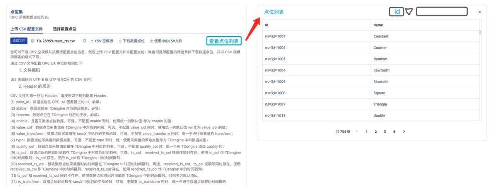
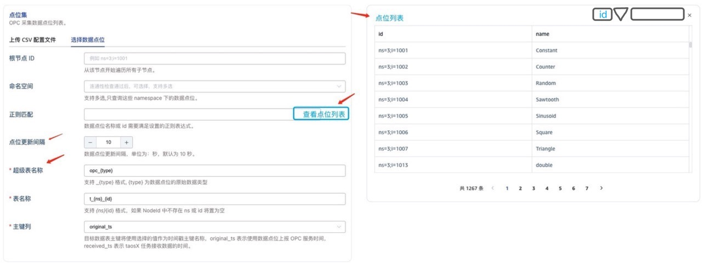
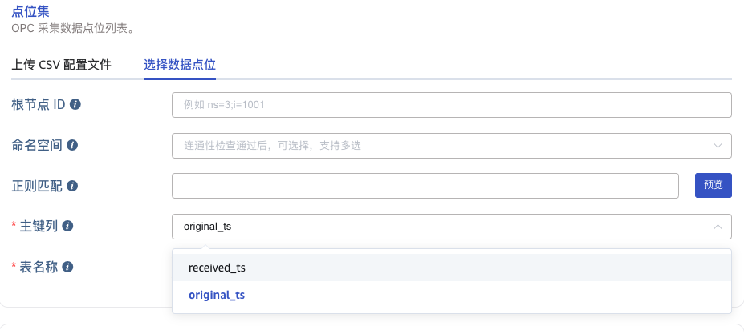

# OPC 查看和动态调整点位列表

## 1. 背景

在梅州卷烟厂项目中，用户在 OPC Server 中添加数据点位不是一次性的，是分多次陆续添加的。按照目前 taosX OPC Data In 的设计，在每次添加数据点位后，需要用户调整任务的 CSV 配置文件，停止任务，重新上传 CSV 文件，启动任务。因此，用户提出了以下需求：
1. 可以观察到当前任务的数据点位列表；
2. 可以自动获取到新增的点位并加入到任务中。
这个 Functional Spec 的需求来源于[OPC 深度优化（讨论稿）](https://taosdata.feishu.cn/wiki/I9ygw9JAHifpylkzj3xcT1SRnBg)的第 4 部分。

## 2. 变更历史

| 日期 | 版本 | 负责人 | 主要修改内容 |
| --- | --- | --- | --- |
| 2024-03-20 | v0.1 | @杨志宇 | 初稿 |
| 2024-03-21 | v0.2 | @杨志宇 | 按照线上 Review 意见修改 |
| 2024-03-22 | v1.0 | @杨志宇 | 按照线下 Review 意见修改 |

## 3. 定义

无

## 4. 行为说明

### 4.1 动态调整点位列表

对于通过 “上传 CSV 配置文件” 创建的 DataIn 任务，始终以 CSV 文件中配置的点位列表为准，在任务运行过程中不会动态调整点位列表。
对于通过 “选择数据点位” 创建的 DataIn 任务，可以根据选择条件在任务运行过程中动态调整点位列表并自动应用。

### 4.2 配置参数

通过 “选择数据点位” 创建任务时，有以下配置项。

| **配置项（中文）** | **配置项（英文）** | **参数** | **适用的 OPC 类型** | **是否必填** | **默认值** | **备注** |
| --- | --- | --- | --- | --- | --- | --- |
| 根节点 ID | Root node ID | root | both | 否 | 空 |  |
| 命名空间 | Namespaces of point | namespaces | ua-only | 否 | 空 |  |
| 正则匹配 | Regex pattern | pattern | both | 否 | 空 |  |
| 点位更新模式 | Point Update Mode | update_mode | both | 是 |  | 可选的模式包括： - None：不开启动态点位更新； - Append：开启动态点位更新，但只追加； - Update：开启动态点位更新，追加或删除； |
| 点位更新间隔 | Point Update Interval | update_interval | both | 否 | 600 | 在“点位更新模式”为 Append 和 Update 时生效。 单位：秒，默认值是 600，最小值：60，最大值：2147483647； |
| 超级表名称 | Super table Name | super_table_expression | both | 是 |  | <stable_prefix>_{type} |
| 表名称 | Table Name | child_table_expression | both | 是 |  | <tbname_prefix>_{ns}_{id} |
| 主键列 | Primary Key | table_primary_key | both | 否 |  | 默认值为 original_ts |
| 主键列名 | Primary Key Name | table_primary_key_alias | both | 否 |  | 默认值为 original_ts |

#### 4.2.1 OPC-UA

修改后的 OPC-UA 配置文件，以下是和“选择数据点位”相关的配置项：
```toml
[points] # config for collect opc points.
regex = "^My.*" # regex for point name
update_mode = "none/append/update" # mode for updating the point list
update_interval = 600 # interval for updating the point list 

[points.ua]
root = "ns=3;i=85" # root node id
namespaces = ["ns1", "ns2", "ns3"]
```

注意：OPC-UA 配置中，不再有 limit 参数，即：不限制点位数量。

#### 4.2.2 OPC-DA

修改后的 OPC-DA 配置文件，以下是和“选择数据点位”相关的配置项：
```toml {wrap}
[points] # config for collect opc points.
regex = "^My.*" # regex for point name
update_mode = "none/append/update" # mode for updating the point list
update_interval = 600 # interval for updating the point list 

[points.da]
access_path = "root.parent.temperature" # as same as root
```

注意：OPC-DA 配置中，不再有 limit 参数，即：不限制点位数量。

### 4.3 UI

#### 4.3.1 上传 CSV 配置文件

1. 如果当前任务是采用 “上传 CSV 配置文件” 模式创建的，则默认显示 “上传 CSV 配置文件” 的标签；
2. 在 “上传 CSV 配置文件” 中增加 “**查看点位列表**” 按钮，用户可以在右侧 “**点位列表**” 中查看 CSV 文件配置的点位列表；
3. 用户不需要进入编辑模式，就能点击 “查看点位列表”。
4. “点位列表” 中展示 “enabled” 列；
5. “点位列表” 增加 Filter，过滤后，只显示匹配输入内容的点位；
6. 需要调整的 UI 页面包括：OPC-UA 和 OPC-DA。
下面是修改后 UI 的示意图：


#### 4.3.2 选择数据点位

1. 如果当前任务是采用 “选择数据点位” 模式创建的，则默认显示 “选择数据点位” 标签；
2. 修改 “预览” 按钮改为 “**查看点位列表**” 按钮，用户可以在右侧 “**点位列表**” 中查看：满足过滤条件的点位列表；
3. 增加 “点位更新模式”，可选项包括：不更新（none），只追加（append），更新（update）；
4. 增加 “点位更新间隔”，用户可以设置点位更新的时间间隔，默认是 600 秒；
5. 增加 “超级表名称” 的配置项，用户必须配置超级表的命名规则；
6. 用户不用进入编辑模式，就能点击 “查看点位列表”。
7. “点位列表” 增加 Filter，过滤后，只显示匹配输入内容的点位；
8. 需要调整的 UI 页面包括：OPC-UA 和 OPC-DA。
下面是修改后 UI 的示意图：


## 5. 性能

1. 调整点位列表，主要修改在 OPC connector 中，对 taosX 本身的性能没有影响。
2. OPC connector 中，“点位更新” 和 “数据采集” 是 2 个独立的线程，“点位更新” 对 “数据采集” 的性能造成影响，需要基于以下假设：
   - OPC server 的点位列表更新频繁；
   - 发生更新时，需要对“点位更新”加锁，“数据采集” 每次从 OPC Server 拉取数据需要获取锁；
   - OPC connector 在订阅模式下，执行 unsubscribe 操作耗时严重；
3. 配置参数“点位更新间隔”的最小值为 60s，默认值为 600s。“点位更新间隔” 越大，对数据采集性能的影响越小，但点位更新的延迟越大；反之，对数据采集性能的影响越大，点位更新的延迟越小。

## 6. 兼容性

1. taosX-1.5.0 任务升级到 taosX-1.6.0 后，任务可以正常执行；也可以配置超级表名；
2. 使用 taosX-agent-1.6.0 之前的版本，动态调整点位列表的功能，即使配置了也不生效；

## 7. 运维

无

## 8. 使用场景

1. 用户通过 “查看数据源配置” 进入配置页面，点击 “查看点位列表” 按钮，能查看当前任务正在采集的数据点位列表；
2. 用户通过 “选择数据点位” 模式创建 DataIn 任务，
   - OPC server 增加点位，且点位符合 “选择数据点位” 的条件，点位列表应该增加，点位数据入库；
   - OPC server 删除点位，且点位符合 “选择数据点位” 的条件，点位列表应该删除，点位数据不再入库。

## 9. 约束和限制

用户创建 OPC DataIn 任务时，如果是通过 “上传 CSV 配置文件” 创建的任务，不支持动态调整数据点位。

## 10. 常见错误和排查

无

## 11. 可观测性

用户可以通过“查看点位列表”，查询当前任务的点位列表，提高了 OPC DataIn 任务的可观测性。

## 12. 文档

无

## 13. 参考文档

- [OPC 深度优化（讨论稿）](https://taosdata.feishu.cn/wiki/I9ygw9JAHifpylkzj3xcT1SRnBg)

## 14. 附录 1: 动态调整点位列表的实现方式

按照@霍琳贺 的意见，使用监听配置文件变更的方式，实现动态调整点位列表，流程如下：
1. 用户配置点位过滤条件，包括：root，namespaces，expr；
2. taosX 生成配置文件，创建 DataIn 任务。同时，如果“点位更新模式”为 append 或 update 时，启动 “点位更新”线程。
3. taosX 的 “点位更新” 线程，每 n 秒执行一次点位更新，更新操作包括：
   - 查询所有符合过滤条件的点位，形成点位列表：to_list；
   - 对比 to_list 和当前点位列表 cur_list，找出新增的点位：add_list，删除的点位：del_list；
   - append 模式下，如果 add_list 为空，则等待进入下次点位检查；如果 add_list 不为空，将 add_list 写入配置文件的点位列表；
   - update 模式下，如果 add_list 和 del_list 都为空，则等待进入下次点位检查；如果 add_list 或 del_list 不为空，同 to_list 替换 cur_list，写入配置文件的点位列表；
4. OPC connector 在开始任务时，监听配置文件，当配置文件有变化时，处理点位列表的变更，完成动态调整点位列表。
优点：
1. 对现有 OPC connector 和 taosX 的改动不大；
2. taosX 内部维护当前点位列表 cur_list 和符合规则的列表 to_list，不需要增加和 OPC connector 的接口。
风险：
1. 监听文件变更，在各种 OS 下是否兼容

## 15. 附录 2: “选择数据点位”时配置主键列和主键列名

目前，“选择数据点位”配置主键列时，只能选择 2 个选项：received_ts 和 original_ts。如下图所示：


这个选择框的含义：选择使用原始时间戳或接收时间戳作为主键，同时，使用 original_ts 或 received_ts 作为主键名。这限制了用户不能在 TDengine 中使用自定义的主键列名，比如：ts。所以，建议修改一下这个 UI，改为下面的方式：


改动包括：
1. “主键列” 变为可选的，默认为 original_ts；
2. 增加“主键名称”，可选的，用户不配置时使用默认值 ts；
3. original_ts 和 received_ts 在前端显示可以替换为“数据原始时间戳” 和 “数据接收时间戳”。
