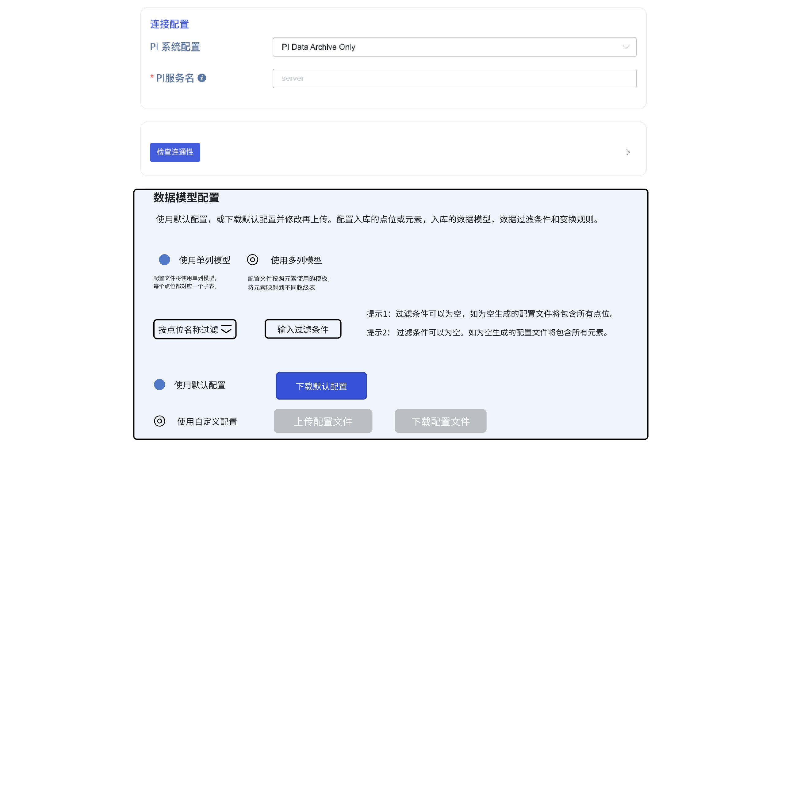
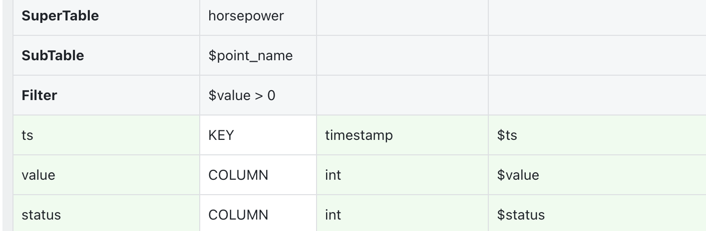
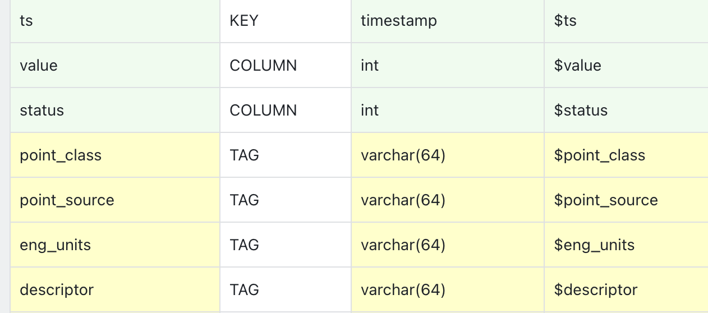

# PI System Transformation

## 1. 背景

PI System 数据导入 TDengine 是 taosX 的重要功能。用户在导入 PI System 数据的时候，希望能最大程度保留原来在 PI System 定义的元数据，同时希望能做原数据做一定变换。因此开发此功能。

## 2. 变更历史

| 日期 | 版本 | 负责人 | 主要修改内容 |
| --- | --- | --- | --- |
| 2024/4/9 | 0.1 | 丁博 | 初稿 |
| 2024/4/10 | 0.2 | 丁博 | 根据线上review 意见更改 |
| 2024/4/11 | 1.0 | 丁博 | 根据 Wade，周营昭，任新胜，霍琳贺线下评审意见定稿 |
| 2024/2/30 | 1.1 | 丁博 | 根据最新实现调整 |
| 2024/5/30 | 1.2 | 丁博 | 添加 transfrom 限制 |

## 3. 定义

**PI template**: PI 数据模型定义，类似数据库的超级表定义。
**PI attribute**: PI 数据模型属性定义，类似数据库中表的字段定义。通过 Template 和 attribute 可以对现实中采集设备做抽象描述。
**PI element**: PI 数据实例，对应现实中具体的一台数据采集设备。
**点位：**一个点位对应一个监测点。对于 AF 模式，一个 element 的一个 attribute 可以关联一个点位。
**UOM**: 测量单位。在 PI 系统新增一个点位的时候可以选择所属的 UOM，比如：密度单位 g/L (gram per liter)，频率单位 Hz （hertz）。

## 4. 行为说明

### 4.1 用户界面

#### 4.1.1 界面设计

##### 4.1.1.1 条件过滤按钮

过滤条件按钮是一个下拉菜单，有 2 个选项：
- 按点位名过滤
- 按模板名过滤
当“**连接配置**”选择的是“PI Data Archive Only” 时， 入库模型只能选择“单列模型”，过滤条件只能选择“按点位名过滤”。
当“**连接配置**”选择的是“PI Data Archive and Asset Framework Server”，两种入库模型都可以选择，过滤条件只能选择“按模板名过滤”。
过滤条件只影响默认配置。用户上传的配置文件，不受过滤条件影响。
<quote-container>
Archive only 只支持 "按点位名过滤"
AF 支持 模板名过滤
</quote-container>

##### 4.1.1.2 使用默认配置

当选择“**使用默认配置**”时，“**上传配置文件**”和“**下载配置文件**”两个按钮都不可用。
系统根据 3 方面的输入决定默认配置文件的内容：
1. 连接配置是 “PI Data Archive Only” 还是 ““PI Data Archive and Asset Framework Server”
2. 使用“单列模型”还是“使用多列模型”
3. 过滤条件。
“**下载默认配置**”按钮是永远可用的，无论是否使用默认配置。**下载的内容由当前的选项决定。如果提交任务前，用户修改了选项，那么最终生效的默认配置以提交任务时的选项为准。**

#### 4.1.2 过滤条件语法

以下内容摘录自 PI System 开发文档 AF-SDF.pdf 1195 页。对于过滤点、元素和模板通用。
The query string (or match pattern can include regular characters and wildcard characters. Regular characters must match exactly the characters specified in the query string. Wildcard characters can be matched with arbitrary fragments of the query string. Wildcard characters can be escaped using the single backslash (\) character. Use a double backslash (\\) to match a single backslash. The syntax of the query string has the following rules: 
- If null or empty string, then everything will be matched. 
- If no wildcards, then an exact match on the query string is performed. 
- Wildcard can be placed anywhere in the query string and matches zero or more characters. 
- Wildcard **? **can be placed anywhere in the query string and matches exactly one character. 
- One character in a set of characters are matched by placing them within **[ ]**. For example, **a[bc] ****,**would match *'ab' *or *'ac'*, but it would not match *'ad' *or *'abd'*. 
- One character in a set of characters are not matched by placing them within **[! ]**. For example, **a[!bc] **would match *'ad'*, but it would not match *'ab'*, *'ac'*, or *'abd'*. 
- A character in a range of characters from *first *to *last *is matched using the following syntax: **[*****first ***
***last*****]**. For example, **a[a-c] **would match *'aa'*, *'ab'*, or *'ac'*, but it would not match *'ad' *or *'abc'*. 

### 4.2 配置文件

#### 4.2.1 配置文件概述

数据模型配置文件是一个不规则的具有多重功能的 CSV 文件。这个配置文件的第一个功能是描述超级表的结构，第二个重要功能是描述 PI 中的点或元素到超级表的映射。我们用两个不同构的表格分别实现了上述两个功能。描述超级表的表格在上，描述映射的表格在下，它们被编辑在同一个 CSV 文件。这两个表格都没有表头，每一列的含义会在文件的注释部分说明。
配置文件包含了很多超级表的定义。我们定义了一些功能性的**关键词**来即用来**标记某个超级表定义的开始，同时也用来完成一些特殊的功能。**这些关键词都必须出现在超级表 schema 正式开始之前。例如:

第一个关键词是 “**SuperTable**”，它表示一个超级表定义的开始，它的右边紧跟这个超级表的名字。所以它有“标记开始”和“定义超级表名”两个作用。
第二个关键词是“**SubTable**”，它出现的位置必须是 “SupterTable” 关键词行之后，超级表结构定义开始之前。它的作用是表示子表名映射规则。比如对于单列模型，默认的子表名是 $point_name, 你可以增加在  poin_name 前后增加前缀或后缀。配置文件中所有以 $ 开头的值为对源数据中某个属性的引用。如果是单列模式的数据，$point_name 就是一个内置的属性。还有很多其它内置属性，在“单列模型配置文件”一节会做详细说明。
第三个关键词“**Filter**”，它出现的位置同样必须是 “SupterTable” 关键词行之后，超级表结构定义开始之前。它定义了数据入库前的过滤规则。
第四个关键词是“**Template**”，它出现的位置同样是“SupterTable” 关键词行之后，超级表结构定义开始之前。它定义了数据入库前的过滤规则。它只出现在多列模型的配置文件中，仅用来表示自动生成这个超级表定义的时候，参考的是 PI 系统中的哪个 Template。**这个关键词是可选的。**我们给用户自由从头开始自定义一个超级表，不参考任何已有的 Tempalte。
下面重点描述 schema 定义部分。这一部分为 4 列。

第一列为列名；第二列为列类型分为：KEY、COLUMN和TAG。第三列为列的数据类型，为 TDengine 支持的数据类型。第四列本质上不属于 schema 定义，而是 transform 规则。
在定义完超级表之后，对于单列模型配置文件，后面是点位列表；对于多列模型配置文件，后面是元素列表。
点位列表的每一行都有关键字是 “**POINT**”，元素列表的每一行都有关键字 “**ELEMENT**”。
最后需要说明的是，所有关键字都不区分大小写。

#### 4.2.2 配置文件的约束

概述部分已经描述了文件结构上的约束和保留字的约束（即关键词）。除此之外，还有以下约束：
1. 引用的变量的约束，即 $ 符号后面的变量名的约束。
   - 单列模式可用的变量有：$ts, $value, $point_name, $point_id, $point_class, $point_source, $eng_unit, $descriptor, $exdesc, $source_tag, $template_name, $element_name, $path
   - AF 单列模式可用的变量除了以上变量之外还有：$templates，$elements，$paths
   - 多列模式下可用的变量有两类：
      - 系统内置的变量：$path, $element_id
      - Template 的属性对应的变量
  要想知道有哪些可用的名称，最便捷的方法是下载默认的配置文件。
1. 映射表达式规则约束，参考本文 4.2.6 节。
2. 过滤表达式规则约束，参考本文 4.2.7 节。 

#### 4.2.3 用户可做的修改

在满足配置文件语法约束的条件下，用户可以对配置文件做任意修改，包括：
1. 修改超级表名
2. 修改子表名
3. 增删 column 
4. 增删 tag 
5. 修改列名和标签名
6. 添加过滤规则
7. 更改列的映射规则
8. 增删点位或增删元素
9. 增删超级表

#### 4.2.4 单列模型配置文件

##### 4.2.4.1 默认 schema 生成规则

1. 系统按照用户指定的过滤规则扫描所有匹配的点位（对于 AF 单列模型，实际扫描的为 element 或 template）。
2. **根据测量单位(UOM)在生成的**** ****csv**** ****文件里自动列出超级表以及超级表的**** ****schema **（不按数据类型）。缺省的TAG包含点位的所有属性。如果采用AF template/element的，TAG里带有template name, element name，还带有树状结构的path, path还有可能多个。每个树状结构就是一个维度，对应一个TAG, TAG名字缺省值就是root节点的名字。
3. 默认超级表名为 PI UOM 的名字加上属数据类型，例如：“ampere_double”。如果该点位没有指定 UOM，则默认的超级表名为类型名，例如： "ts_double"。
   - 对应 AF 单列模式，数据类型对应的是属性的 Value Type
4. 默认子表名为点的名称。
5. TAG 列对应的 TDengine 类型统默认为 NCHAR(100)
6. 默认的 Schema 中，时间戳列名称为 ts， 值列名称为 value， 其它 tag 列名称为 PI 系统中对应的属性名。

##### 4.2.4.2 完整示例

|  |
|  |
| # UOM 1 |  |  |  |  |
| **SuperTable** | horsepower |  |  |  |
| **SubTable** | ${point_id} |  |  |  |
| **Filter** | $value > 0 |  |  |  |
| ts | KEY | timestamp | $ts |  |
| value | COLUMN | int | $value |  |
| status | COLUMN | int | $status |  |
| path | TAG | NCHAR(100) | $path |  |
| point_id | TAG | NCHAR(100) | $point_id |  |
| point_name | TAG | NCHAR(100) | $point_name |  |
| point_class | TAG | NCHAR(100) | $point_class |  |
| point_source | TAG | NCHAR(100) | $point_source |  |
| eng_units | TAG | NCHAR(100) | $eng_units |  |
| descriptor | TAG | NCHAR(100) | $descriptor |  |
| exdesc | TAG | NCHAR(100) | $exdesc |  |
| source_tag | TAG | NCHAR(100) | $source_tag |  |
| element_paths | TAG | NCHAR(200) | $element_paths |  |
| # UOM 2 |  |  |  |  |
| ***SuperTable*** | kilowatt |  |  |  |
| **SubTable** | ${point_id} |  |  |  |
| ts | KEY | timestamp | $ts |  |
| Value | COLUMN | int | $value |  |
| path | Tag |  |  |  |
| point_name | Tag | NCHAR(100) | $point_name |  |
| point_class | Tag | NCHAR(100) | $point_class |  |
| point_source | Tag | NCHAR(100) | $point_source |  |
| eng_units | Tag | NCHAR(100) | $eng_units |  |
| descriptor | Tag | NCHAR(100) | $descriptor |  |
| exdesc | Tag | NCHAR(100) | $exdesc |  |
| source_tag | Tag | NCHAR(100) | $source_tag |  |
| element_paths | Tag | NCHAR(100) | $elements |  |
| Point Name 1 | Point | SuperTable A |  |  |
| Point name 2 | Point | SuperTable B |  |  |
| Point Name 3 | Point | SuperTable A |  |  |
| Point Name 4 | Point | SuperTable B |  |  |

#### 4.2.5 多列数据模型配置文件

##### 4.2.5.1 默认配置文件生成规则

1. 系统根据用户指定的过滤条件扫描所有元素或模板。
2. 根据模板生成超级表的 schema。如果element没有对应的template, 则自动生成一个template, 名字是temp_element_name, 这个template只有一个element。
3. 超级表的表名默认为模板名按照“名称映射规则”转换而来。
4. 子表名默认为元素名。如果元素名有重复，则用“$element_name_$element_id” 作为子表名。
5. column, tag的名字与模板里的定义也完全一致。只不过名称会做下转换。参考“名称映射规则”。
6. 配置文件的元素列表共有 4 列，分别是元素名称，元素类型（固定为 Element）， 元素对应的超级表，元素 ID， 元素路径。

#### 4.2.6 默认名称映射规则

PI 系统中的模板名、属性名按照以下规则映射为 TDengine 的超级表名和列名：
1. 名称中只能出现数字字母下划线
2. 大小字母会转小写字母
3. 非数字字母下划线会转下划线

##### 4.2.6.1 完整示例

|  |
| --- |
| **SuperTable** | smart_meter |  |  |  |
| **Template** | SmartMeter |  |  |  |
| **SubTable** | ${element_id} |  |  |  |
| ts | KEY | timestamp | $ts |  |
| col1 | COLUMN | float | $Metric1 |  |
| col2 | COLUMN | int | $Metric2 |  |
| col3 | COLUMN | double | $Metric3 |  |
| element_name | TAG | NCHAR(100) | $element_name |  |
| path | TAG | NCHAR(100) | $path |  |
| tag1 | TAG | NCHAR(100) | $attribute1 |  |
| tag2 | TAG | NCHAR(100) | $attribute2 |  |
| **SuperTable** | car |  |  |  |
| **Template** | car |  |  |  |
| **SubTable** | ${element_name} |  |  |  |
| **Filter** | $metric1 > 0 |  |  |  |
| ts | KEY | timestamp | $ts |  |
| col1 | COLUMN | float | $metric1 |  |
| col2 | COLUMN | int | $metric2 |  |
| col3 | COLUMN | double | $metric3 |  |
| col4 | COLUMN | float | $metric1 + $metric2 |  |
| element_name | TAG | NCHAR(100) | $element_name |  |
| path | TAG | NCHAR(100) | $path |  |
| attribute1 | TAG | NCHAR(100) | $attribute1 |  |
| attribute2 | TAG | NCHAR(100) | $attribute2 |  |
| attibute3 | TAG | NCHAR(100) | $attribute3 |  |

#### 4.2.7 映射规则语法

如果表达式中间有逗号，支持用 `` 包裹整个表达式。例如 ： `element_paths.replace('\', '.')`

##### 4.2.7.1 字符串类型映射规则

对于字符串类型，只支持 “format” 变换，参考： [Transformer 使用手册](https://taosdata.feishu.cn/wiki/QgMvwLzBpiDq4qk7X3ccOSDGnSg) 2.4.2 节。

| Function | description | e.g |
| --- | --- | --- |
| pad(len, pad_chars) | pads the string with a character or a string to at least a specified length | $point_name.pad(5, '0') // 结果为"1.200" |
| trim | trims the string of whitespace at the beginning and end | $abc.trim() // 结果为"abc ee" |
| sub_string(start_pos, len) | extracts a sub-string，两个参数： 1. start position, counting from end if < 0 1. *(optional)* number of characters to extract, none if ≤ 0, to end if omitted | "012345678".sub_string(5) // "5678" "012345678".sub_string(5, 2) // "56" "012345678".sub_string(-2) // "78" |
| replace(substring, replacement) | replaces a sub-string with another | "012345678".replace("012", "abc") // "abc345678" |

##### 4.2.7.2 数值类型映射规则

对于数值类型，只支持“expr” 变换，语法参考：[Transformer 使用手册](https://taosdata.feishu.cn/wiki/QgMvwLzBpiDq4qk7X3ccOSDGnSg) 2.4.2 节。注意需要在变量名前添加 $ 符号。

###### 4.2.7.2.1 expr 基础数学运算

基本数学运算支持加`+`、减`-`、乘`*`、除`/`。
比如数据源采集数值以设置度为单位，目标库存储华氏度温度值。那么就需要对采集的温度数据做转换。
解析的源字段为 `temperature`，则需要使用表达式`temperature * 1.8 + 32`。

###### 4.2.7.2.2 Expr 中使用数学函数

| Function | description | e.g |
| --- | --- | --- |
| sin、cos、tan、sinh、cosh | Trigonometry | $a.sin() |
| asin、acos、atan、 asinh、acosh | Arc-trigonometry | $a.asin() |
| sqrt | Square root | $a.sqrt() // 4.sqrt() == 2 |
| exp | Exponential | $a.exp() |
| ln、log | Logarithmic | $a.ln() // e.ln() == 1 $a.log() // 10.log() == 1 |
| floor、ceiling、round、int、fraction | Rounding | $a.floor() // (4.2).floor() == 4 $a.ceiling() // (4.2).ceiling() == 5 $a.round() // (4.2).round() == 4 $a.int() // (4.2).int() == 4 $a.fraction() // (4.2).fraction() == 0.2 |

#### 4.2.8 过滤规则语法

语法参考：[Transformer 使用手册](https://taosdata.feishu.cn/wiki/QgMvwLzBpiDq4qk7X3ccOSDGnSg) 2.3 节。
注意需要在变量名前加 $ 符号。

## 5. 性能

无

## 6. 兼容性

PI 连接器、Agent 和 taosX 必须同步升级。
升级后，PI 的已有配置将失效，不再兼容原有配置数据和已有的同步数据。

## 7. 运维

无

## 8. 使用场景

1. 在默认 schema 基础上减少一些列。
2. 在默认 schema 基础上修改列名。
3. 在默认配置基础上，修改子表名映射规则。
4. 在默认配置基础上，修改超级表名映射规则。
5. 在默认 schema 基础上，基于已有的列增加新的列。
6. 入库前，对某些列的值设置过滤条件。
7. 入库前，对某些列的值进行变换。
8. 修改点位到超级表的映射，将点映射到完全自定义的超级表。

## 9. 约束和限制

1. 配置生效后，无论源端怎么变化，都按照生效的配置拉取数据。
2. Tag 列的 transform 表达式不能引用 metrics 列
3. 子表名映射规则只能引用 Tag 列的值

## 10. 常见错误和排查

无

## 11. 可观测性

无

## 12. 安装和卸载

需要按照 taosX 版本 1.6 或以上版本。

## 13. 文档

需要修改企业版文档

## 14. 参考文档

[PI System Transformation](https://taosdata.feishu.cn/docx/JQrBdfSdpoQythxm181cjgemn6e)
[PI Transform 开发文档](https://taosdata.feishu.cn/wiki/WuTKwsleRieVyDk7B07ckKXWnEf)
[Transformer 使用手册](https://taosdata.feishu.cn/wiki/QgMvwLzBpiDq4qk7X3ccOSDGnSg)

## 15. 附录

### 15.1 PI 连接器与 taosX server 的协议

1. PI 连接器发送给 taosX 的是带 schema 的数据。
2. PI 连接器按照默认的表名映射规则和默认 schema 组织数据。
