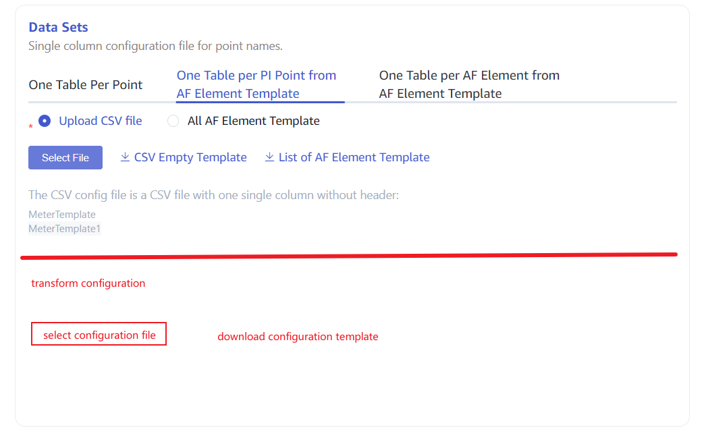

# PI 数据源支持 transform (已废弃)

## 1. 背景

taosX 的核心功能之一就是 ETL。而 ETL 的核心又是 transform。taosX 从数据源读取数据后，经过解析、提取拆分、数据过滤、映射，最终写入 TDengine 数据表中。目前 mqtt, csv, opc, kafka, historian 数据源都已支持 transform。 PI 数据源的 transform 功能处于缺少状态，因此开发此功能。
背景部分会花较长的篇幅描述 PI 数据源的现状。如果你对 PI 数据源目前的功能已经熟悉，可以跳过下面的部分。 

### 1.1 PI 数据源现状

从 PI 的数据模型到 TDengine 的数据模型的映射是由 PI 连接器完成的。PI 连接器以 PI element 的 attribute 为单位订阅 PI 系统的原始数据，并按照用户指定的方式将原始数据映射到 TDengine 中对应的超级表和子表。
PI 连接器支持以两种方式指定要订阅的点集（简称源数据集）：指定点位或指定模板。同时PI 连接器也支持两种入库模型：单列模型和多列模型。但是如果用户以点位的方式指定源数据集，就只能以单列模型入库。所以共有以下 3 种配置方式：
1. **按点位配置源数据集并使用单列模型入库**
用户上传一个 CSV 文件，指定要采集的点位。这个 CSV 文件中只有一列，每一行代表一个 element 的一个 attribute， 例如编号为1010的电表的电流。PI 连接器会根据点位的**数据类型**** **创建超级表。同一类型的数据被汇总到超级表pitag_{datatype} 中，每一个点位对应一个子表，子表名称为 ${element_name}_${property}。
1. **按 t****emplate 配置****源数据集并使用单列模型入库**
用户上传一个 CSV 文件，指定一些 PI template。这个 CSV 文件中只有一列，每一行代表一个 template 的名称。PI 连接器会将所有基于这些 template 建的 element 的 attribute 根据**数据类型**汇总到超级表 pitag_{datatype} 中，每一个采集点位对应一个子表，子表名称为 ${element_name}_${property}。
1. **按 t****emplate 配置****源数据集并使用****多列模型****入库**
同上，用户上传一个 CSV 文件，指定一些 PI template。这个 CSV 文件中只有一列，每一行代表一个 template 的名称。与 2 不同的地方在于，PI 连接器会为每一个 template 建立一个超级表，并为使用该 template 的每一个 element 建立一个子表。超级表名称采用 template 名称，子表名称使用 element 名称。
以上 3 种配置方式对应 taosExplorer 任务创建页面的** Data Sets **部分的 3 个 Tab，如下图：


### 1.2 PI 数据源特点

PI 数据源入库的目标超级表可以是多个。这是与其它支持 transform 的数据源(mqtt，CSV，kafka，historian）明显不同的地方。针对每一个目标超级表都需要配置一套单独的 transform 规则。从这个角度讲，PI transfrom 的配置和执行比其它数据源复杂。

## 2. 变更历史

| 日期 | 版本 | 负责人 | 主要修改内容 |
| --- | --- | --- | --- |
| 2024/04/05 | 0.1 | 周营昭 | 完成初稿 |
| 2024/04/07 | 0.2 | 丁博 | 丰富细节，增加易读性 |
| 2024/04/07 | 0.3 | 周营昭，丁博 | 增加支持没有 template 的 element |

## 3. 定义

**PI template**: PI 数据模型定义，类似数据库的表定义。
**PI attribute**: PI 数据模型属性定义，类似数据库中表的字段定义。通过 Template 和 attribute 可以对现实中采集设备做抽象描述。
**PI element**: PI 数据实例，对应现实中具体的一台数据采集设备。

## 4. 行为说明

基于4月3日讨论的结论，考虑2种方案。
**方案 1 ****:**
使用 CSV 文件配置 transform 规则，前端实现简单。
**方案 2 ****:**
要求 taosExplorer 具备可视化配置 transform 的功能，对每一个 PI template 都可以单独配置字段拆分、过滤、表名映射、字段映射的规则。
由于上线时间要求，本版本内容暂时只讨论方案 1。
以下行为说明对于 PI 和 PI Backfill 两种任务类型通用。

### 4.1 界面设计

原 **Data Sets** 配置部分增加 trasfrom 配置。如下图：


用户需要先点击 “download configuration template” 按钮，下载**配置模板**。然后修改模板添加自定义的 transform 规则。最后上传模板，完成配置。

### 4.2 配置模板说明

配置模板是根据用户在“transfrom configuration” 的上一步指定的 template 动态生成的 CSV 文件，每一行对应一个模板的一个属性，或对应一个 element 的 attribute，或对应一个 point 的 attibute。文件包含 5 列：“目标名称”，“属性名称”， “数据类型”， “transfrom 规则”， “规则说明” 。最后两列默认为空，需要用户补全。
用户下载得到的模板文件示例如下：
```plaintext
object_type,object_name,atribute_name,data_type,transfrom,transform_description
template,env-monitor,ts,timestamp,,
template,env-monitor,temperature,float,,
template,env-monitor,humidity,float,,
template,meter,ts,timestamp,,
template,meter,current,float,,
template,meter,voltage,int,,
element,Meter_100008,ts,,
element,Meter_100008,current,,
element,Meter_100008,voltage,,
point,car_JA0001,speed,float,,
```

用户修改后的配置文件，示例如下:（为方便阅读，以表格形式说明，实际为 CSV 文件）：

| object_type | object_name | attribute_name | data_type | transform | transform_description |
| --- | --- | --- | --- | --- | --- |
| template | env-monitor | ts | timestamp | ts + 8 * 3600 * 1000 | 时区矫正 |
| template | env-monitor | temperature | float | temperature * 1.8 + 32 | 摄氏度转为华氏度存储 |
| template | env-monitor | humidity | float |  |  |
| template | meter | ts | timestamp |  |  |
| template | meter | current | float | current * 1000 | 单位从安转为毫安 |
| template | meter | voltage | int |  |  |
| element | Meter_100008 | ts | timestamp |  |  |
| element | Meter_100008 | current | float | current * 1000 | 单位从安转为毫安 |
| element | Meter_100008 | voltagle | int |  |  |
| point | car_JA0001 | speed | float |  |  |

说明
1. transform 规则的中使用的变量名**只能为对应**** attribute ****的****名称**, 不能包含其它 attibute 的名称。如果未配置 transform 规则，则按照原默认规则映射。
2. 对于字符串类型，只支持 “format” 变换，参考： [Transformer 使用手册](https://taosdata.feishu.cn/wiki/QgMvwLzBpiDq4qk7X3ccOSDGnSg) 2.4.2 节。
3. 对于数值类型，只支持“expr” 变换，参考：[Transformer 使用手册](https://taosdata.feishu.cn/wiki/QgMvwLzBpiDq4qk7X3ccOSDGnSg) 2.4.2 节。
4. data_type 为  TDengine 的数据类型，而不是 PI 系统的数据类型。

### 4.3 上传配置文件

在上传配置文件时， taosX 会对所有的 transform 规则进行校验。如果校验不通过，界面弹出错误消息，任务创建失败。校验规则有以下项目：
1. CSV 文件的编码，同 opc csv 模板文件编码校验规则。
2. 配置内容校验
   - object_type: 必填，可选项有 template 、element 和 point;
   - object_name: 必填。
   - attribute: 必填。
   - data_type: 必填。
3. transform 表达式校验。使用 rhai 表达式引擎实际运行校验。

### 4.4 表名映射规则

PI 连接器按照固定的规则，将 PI 中定义的数据模型映射到 TDengine 的数据模型。具体规则如下：
PI template 名称到超级表名称的映射规则：请 @任新胜补充。 补充。
PI element 名称到子表名称的映射规则: 请@任新胜补充。 补充。
PI attribute 名称到子表名称的映射规则： 请@任新胜补充。 补充。

## 5. 性能

1. 对连接器性能无影响。
2. 根据配置的 transform 表达式计算复杂度，对 taosX 性能有相应的影响。

## 6. 兼容性

完全兼容历史配置。

## 7. 运维

无。

## 8. 使用场景

对采集数据和存储数据的业务含义不同时，基于表达式做转换。

## 9. 约束和限制

1. 暂不支持过滤。

## 10. 常见错误和排查

无。

## 11. 可观测性

无。

## 12. 安装和卸载

无。

## 13. 文档

需要修改企业版文档。

## 14. 参考文档

[Transformer 使用手册](https://taosdata.feishu.cn/wiki/QgMvwLzBpiDq4qk7X3ccOSDGnSg)
[外部数据源概览](https://taosdata.feishu.cn/wiki/I1FOwXHsQizWDpkcu07c2epznGh)

## 15. 附录

我们基于用户熟悉的 PI 系统的数据模型来定义 transform，但是 taosX server 并不知道 PI 中定义的数据模型。那么 taosX 如何将用户定义的 transform 规则应用到接收到的每一批数据上呢？
答案就在 4.4 节定义的默认映射规则。根据这个规则，taosX server 将 transform 从 “PI 视图” 转换成 “TDengine 视图”。因此这个规则必须**固定且可逆**。
