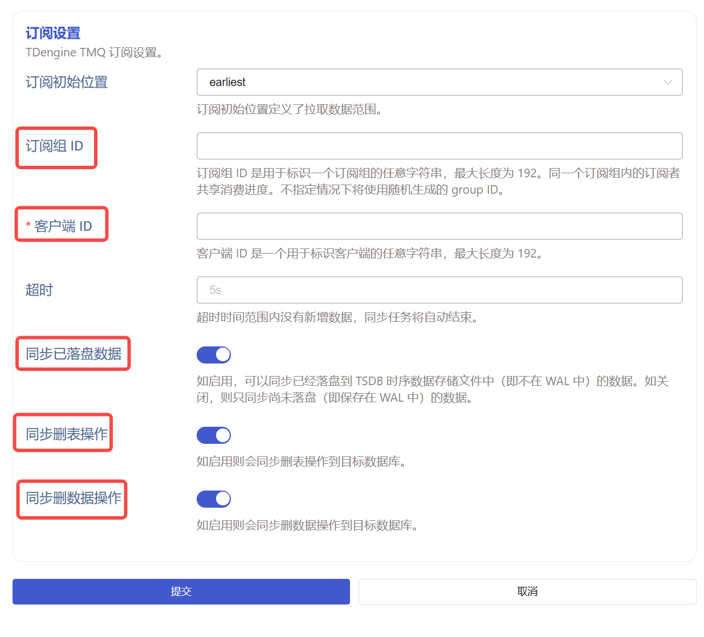
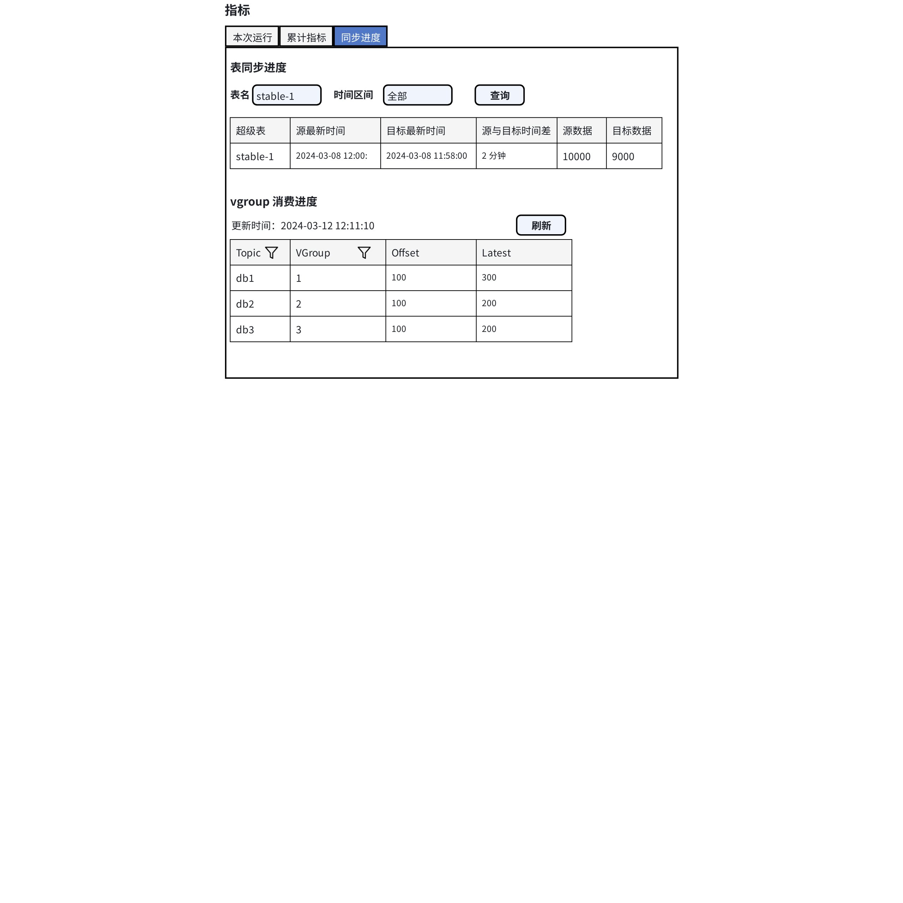

# TD3 到 TD3 的配置和可观测性优化

## 1. 背景

随着越来越多的数据同步任务从使用命令行模式改为使用服务模式，并用 Explorer 统一管理，客户对 Explorer 的可用性和可观测性提出了更高的要求。主要体现在两方面：
1. 以前命令行支持的参数，现在 Explorer 页面上也要支持。
2. 能观察到数据同步的进度。
观测 “进度”与我们在 1.5.0 所完善的 metrics 是不同的需求。任务的 metrics 是对象固定的单维度观察，而进度观察是对象不固定的多维度观测。比如当同步一个数据库的时候，用户期望观察到每个超级表的同步进度，因为超级表的数量不固定所以观测的对象个数不固定。同时“进度”也是多个指标综合的结果，进度至少包括：源库数据量和目标库数据量的比较，源库最新的时间戳和和目标库最新时间戳的比较。所以对于进度的观察是一个新的特性。
除了对于正常场景的改进需求，客户对于异常场景也提出了改进要求。客户经常遇到的两个异常场景是：
1. 在同步数据过程中，源库的某个表的 schema 发生了变化导致同步失败。
2. 在同步数据过程中，源库的某个表被误删，删除操作传导到了目标端（在订阅的 topic 启用了 with meta 功能时），导致数据丢失。
对于异常场景 1，客户希望能改进日志，打印出导致失败的超级表名和子表名。
对于异常场景 2，经过讨论决定：对于 TDengine 3 数据源，在创建任务的时候增加一个选项，用于过滤掉删除表的 meta 消息。
以上 4 点改进分别对应以下 4 个 jira 任务：

TS-4541


TS-4542


TS-4537


TD-29014

<quote-container>
背景部分参考链接： [PCS一级部署项目-taosX相关改进需求](https://taosdata.feishu.cn/wiki/QD1fwgyxUiWZjOkPRP2czmLvnxU)
</quote-container>

## 2. 变更历史

| 日期 | 版本 | 负责人 | 主要修改内容 |
| --- | --- | --- | --- |
| 2024/3/11 | 0.1 | 丁博 |  |
| 2024/3/12 | 1.0 | 丁博 | 根据评审会议修改 |

## 3. 定义

- TDengine3 数据源任务： 指 taosX 中通过 TMQ 订阅的方式同步一个集群的数据到另一个集群到数据传输任务。
- Meta 消息：taosX  从 TMQ 订阅到的消息分为两类，一类是 Meta， 包含建表，删表，删数据等操作。一类是 Data，只包含数据。
- with meta: 创建 topic 时的一个选项，如果带有 with meta 则订阅到的消息会包含 Meta 消息。 

## 4. 行为说明

### 4.1 TDengine3 数据源配置变化

1. Explorer 订阅设置部分新增 “订阅组 ID” 选项。类型为字符串，无默认值，可为空。
2. Explorer 订阅设置部分新增 “客户端 ID” 选项。类型为字符串，无默认值，必填。
3. Explorer 订阅设置部分新增 “同步已落盘数据” 选项。类型为布尔值，默认 true。
4. Explorer 订阅设置部分新增 “同步删除操作” 选项。类型为布尔值，默认 true。
新增的选项和描述如下图所示：


1. 英文版的标签和文字描述
- Group ID
- Client ID
- TSDB Data: If enabled, the data that has been persisted in time series data storage files will be replicated too; otherwise, only the data still in WAL (write ahead log) will be replicated.
- Table Deletions: If enabled, the table deletion operations on the source side will be replayed on the sink side.
- Data Deletions: If enabled, the data deletion operations on the source side will be replayed on the sink side.

### 4.2 任务进度

#### 4.2.1 Explorer

1. 界面设计
TDengine3 数据源 merics 页面新增“同步进度”选项卡。页面设计如下图所示：


- 手动输入指定超级表或子表，查询表同步进度。一次只能输入一个表名，可指定时间范围，手动触发查询。
- 查询的时间范围默认为 “全部”，下拉可设置查询的起始时间。
- VGroup 消费进度支持按 Topic 和 Vgroup ID 过滤。需要手动刷新。
1. 英文版界面
- 同步进度： Replication Progress
- 表同步进度：Data Replication Progress of Single Stable/Table
- 表名：Stable/Table Name
- 时间区间：Time Range
- 查询：Query
- 表头：Stable/Table, Latest Timestamp at Source, Latest Timestamp at Sink, Time Difference, Number of Rows at Source, Number of Rows at Sink
- vgroup 消费进度： Replication Progress per Vgroup
- 更新时间：Updated at
- 刷新：Refresh

#### 4.2.2 API 变化

新增 2 个接口
1. GET /tasks/{id}/vgroup_progress
```json
{
  "update_time": 1710237231820
  "data":[
    {
        "topic": "topic1",
        "vgroup": 1,
        "offset": 100,
        "latest": 200
    }
  ]
}
```

1. GET /tasks/{id}/table_progress?table=test.meters&start=2024-03-10T00:00:00Z&end=2024-03-10T15:00:00Z
Start 和 end 是可选的，格式为带时区的符合 RFC3339 的字符串，如果为空则统计整个表的数据量
```json
{
  "table_name": "table_test",
  "from_last_ts": 1710237231820,
  "to_last_ts": 1710237231820,
  "from_count": 100,
  "to_count": 200
}
```

#### 4.2.3 给 taosKeeper 的监控数据变化

新增 taosx_task_progress  表， 标签包括： taosx_id, task_id, topic, vgroup 目前只有 TDengine3 数据源任务有进度数据。
字段包括：

| ts | 上报数据时间 |
| --- | --- |
| offset | 源表最新时间戳 |
| latest | 目标表最新时间戳 |

默认每 10 秒更新一次数据。

### 4.3 写入失败的异常日志增加表名

写入失败会打印 Error 级别的日志，日志中包含写入失败的行数，列数和具体数据。由于写入出错的位置不同，客户可能看到两种形式的错误日志。
第一种例如：
```plaintext
03/11 11:23:10.254786 ERROR [tmq_to_td:108] [main->cli->run->tmq_to_td->sync{consumer.id=2}->write_data{consumer.id=2}] Write data error: [0x4000] Internal error: `Invalid message`
03/11 11:23:10.277618 ERROR [tmq_to_td:113] [main->cli->run->tmq_to_td->sync{consumer.id=2}->write_data{consumer.id=2}] Details about the failed data: Table view with 80 rows, 3 columns, table name "t1"
+-------------------------------+-----+-----+
| ts                            | v1  | t1  |
+===============================+=====+=====+
| 2024-02-22T15:48:16.174+08:00 | 10  | tt1 |
+-------------------------------+-----+-----+
| 2024-02-22T15:48:17.220+08:00 | 10  | tt1 |
+-------------------------------+-----+-----+
```

第二种例如：
```plaintext
write table failed: [0x0118] Internal error `Parameter error`, with block: table name "t1"
+-------------------------------+-----+-----+
| ts                            | v1  | t1  |
+===============================+=====+=====+
| 2024-02-22T15:48:16.174+08:00 | 10  | tt1 |
+-------------------------------+-----+-----+
| 2024-02-22T15:48:17.220+08:00 | 10  | tt1 |
+-------------------------------+-----+-----+
```

<quote-container>
*补充实现细节，仅供参考。第一种错误对应  tmq_write_raw 接口。此时 taosX 并不知道 raw data 对应的表名和具体数据，而是通过再次调用 fetch_raw_block 接口获取 RawBlock 得到的。第二种*情况对应  taos_write_raw_block 接口。在使用 tmq_write_raw 写入失败时，如果错误码满足一定条件，会继续尝试通过 taos_write_raw_block 接口写入)
</quote-container>

## 5. 性能

任务进度监控可能对性能有所影响。具体影响因素包括：1. vgroup 数量 2. 查询的频率

## 6. 兼容性

无

## 7. 运维

本文中的功能和特性都只限于使用 Explorer 创建的数据同步任务。

## 8. 使用场景

主要使用场景为：从一个 TD3 集群同步数据到另一个 TD3 集群。
1. 通过观察表同步进度，可以知道任务运行是否正常。比如目标集群最新时间戳不再变化时，且源库最新时间戳还在变化，表示同步异常。
2. 如果因为未知错误导致数据写入出错，可通过观察日志中的：1. 错误码 2.错误消息 3.错误的表 4. 错误的具体数据来诊断问题。
3. 某些情况下需要重新订阅所有数据，此时可通过更改订阅的 Group ID 实现。

## 9. 约束和限制

### 9.1 监控任务进度的限制

1. 对于多个边缘侧数据源向一个中心同步超级表数据的场景，以超级表为单位的任务进度统计未必能真实的反映本任务的进度。比如目的库超级表子表有 1 万个，而某个任务对应的源库这个超级表的子表只有 1000 个。此时目标端的 count 值会远大于源库的count 值，目标端的时间戳也可能远大于源端的时间戳。 此种场景下进度监控不具备参考意义，请使用每个边端所对应的任务的 metrics 进行判断。
2. 如果订阅的 Topic 是带过滤条件的查询语句，表进度统计中的数据量不能作为同步进度的参考。
3. 订阅的是 TSDB 中的数据，看不到 vgroup 的消费进度，只要订阅 WAL 中的数据时才能获取到 vgroup 消费进度。

### 9.2 错误日志的限制

目前 RawBlock 没有提供获取超级表名的接口，错误日志只能打印出出错的子表名。

## 10. 常见错误和排查

如果同步数据失败，可以通过任务 id 过滤所有任务相关的日志，例如：
```plaintext
grep task.id=10 taosx.log.2023-10-10
```

## 11. 可观测性

1. Explorer 页面有较大修改，参考行为说明部分。
2. TDinsight 监控面板也会新增任务进度的 Panel。

## 12. 文档

需要修改企业版文档 “数据写入/TDengine 3” 页面。

## 13. 参考文档

无
