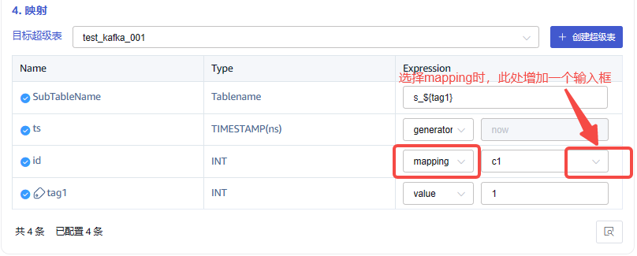

# Transformer：支持配置 mapping 默认值

## 1. 背景

taosX 可以通过 transformer 中的 mapping 配置源数据与目标数据的映射，当前实现中没有对源数据不存在的情况做特殊处理，如果源数据不存在则目标数据直接赋空值。
客户提出功能需求，如果源数据不存在可以指定默认值，经过讨论，此需求符合大众使用场景且很有意义，所以准备对 mapping 进行升级。
相关 jira：

TS-4508

## 2. 变更历史

| 日期 | 版本 | 负责人 | 主要修改内容 |
| --- | --- | --- | --- |
| 2024/03/20 | 0.1 | @张元湃 | 初稿 |
| 2024/03/21 | 0.2 | @张元湃 | 根据 review 意见修改 |

## 3. 定义

无

## 4. 行为说明

### 4.1 数据源配置 UI



如上图所示，在数据源配置页面的 `4.映射` 中，`Expression` 选择 mapping 时，增加默认值输入框，同时需要根据目标数据的类型对输入框做自动适配：

| **字段类型** | **输入框类型** | **校验规则（非必填）** |
| --- | --- | --- |
| TINYINT | 数字输入框 | 仅能输入 -128~127 的整数 |
| TINYINT UNSIGNED | 数字输入框 | 仅能输入 0~255 的整数 |
| SMALLINT | 数字输入框 | 仅能输入 -32768~32767 的整数 |
| SMALLINT UNSIGNED | 数字输入框 | 仅能输入 0~65535 的整数 |
| INT | 数字输入框 | 仅能输入 -2147483648~2147483647 的整数 |
| INT UNSIGNED | 数字输入框 | 仅能输入 0~4294967295 的整数 |
| BIGINT | 数字输入框 | 仅能输入 -9223372036854775808~9223372036854775807 的整数 |
| BIGINT UNSIGNED | 数字输入框 | 仅能输入 0~18446744073709551615 的整数 |
| FLOAT | 数字输入框 | 仅能输入 -3.4E38~3.4E38 的小数，有效位数 6-7 |
| DOUBLE | 数字输入框 | 仅能输入 -1.7E308~1.7E308 的小数，有效位数 15-16 |
| BOOL | 下拉框 | 下拉选项：(null)、true、false |
| VARCHAR/NCHAR | 文本输入框 | 输入文本（长度限制待定，taosX 可以根据内容长度自动扩展列宽） |
| TIMESTAMP | 时间选择器 | - |

同时需要注意，由于主键时间戳与 tag 列有其特殊性，不应该设置默认值，所以需要进行限制。

### 4.2 任务参数变化

任务参数中的 parser 字段增加 mapping 的默认值（非必填，没有则保持现有逻辑不变），参数对比如下：
```json {wrap}
// 现状：
{
  "parser": {
    "parser": {
      "mutate": [
        {
          "map": {
            "id": {
              "cast": "c0",
              "as": "INT"
            }
          }
        }
      ]
    }
  }
}

// 修改后
{
  "parser": {
    "parser": {
      "mutate": [
        {
          "map": {
            "id": {
              "cast": "c0",
              "as": "INT"
              "default": "10"
            }
          }
        }
      ]
    }
  }
}
```

### 4.3 数据映射处理

以 [4.2](https://taosdata.feishu.cn/docx/VxPtdOjVSosW2dxCKYPcVMwynHe#DlJ3dfCLMoW5eExkq9hcg8mpnVe) 中配置为例进行说明，如果源数据中 c0 字段不存在或者内容为空（空值，不包括空字符串`""`），则将默认值 10 填充到目标数据的 id 字段中。

## 5. 性能

略有影响，微乎其微。

## 6. 兼容性

无

## 7. 运维

无

## 8. 使用场景

参考背景部分。

## 9. 约束和限制

每种类型的默认值要符合该类型的合法值约束。

## 10. 常见错误和排查

无

## 11. 可观测性

关于 taos Explorer 中的变化已在 [4.1](https://taosdata.feishu.cn/docx/VxPtdOjVSosW2dxCKYPcVMwynHe#doxcnGA4ecOdhSt3bkPM0r4kgrg) 中进行说明。

## 12. 安装和卸载

无

## 13. 文档

- **需要**修改企业版文档
- **不需要**修改官网文档

## 14. 参考文档

无
