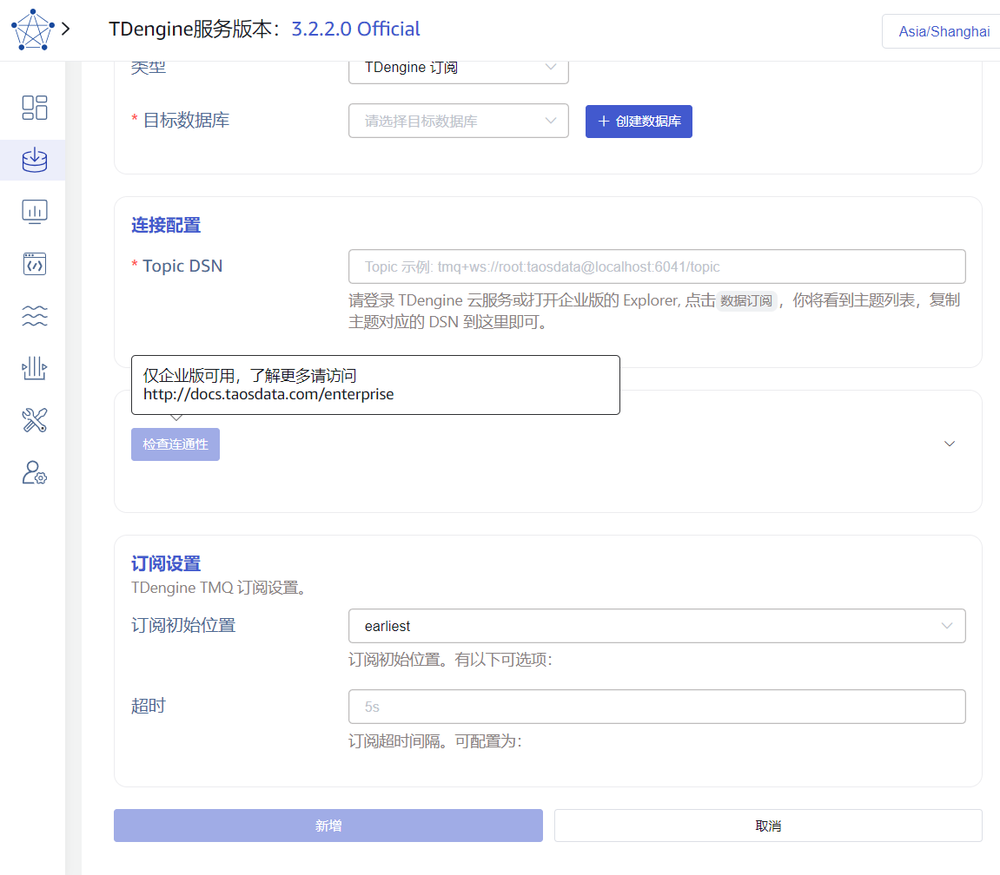
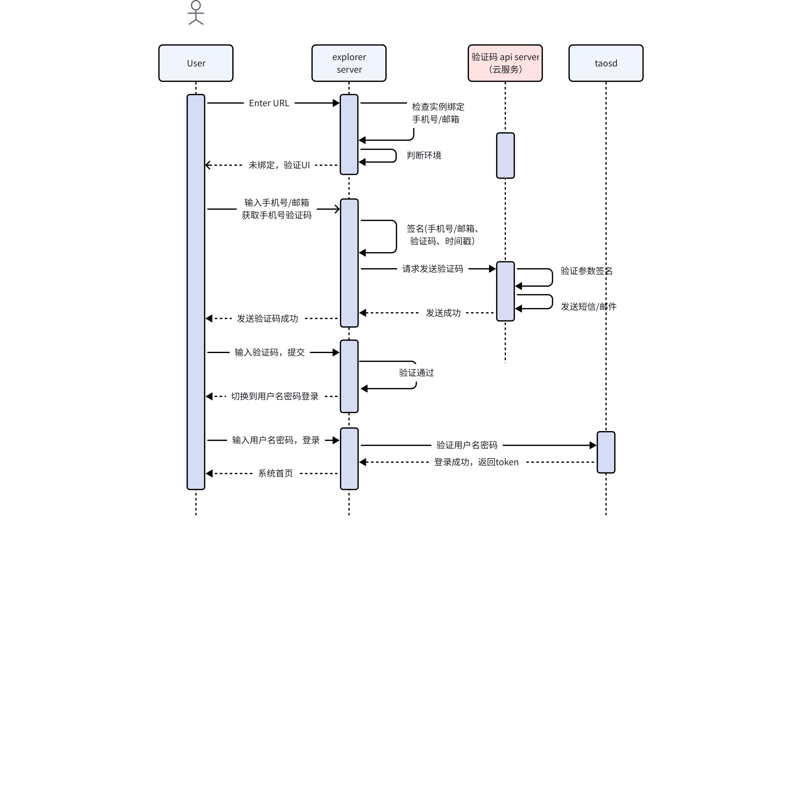
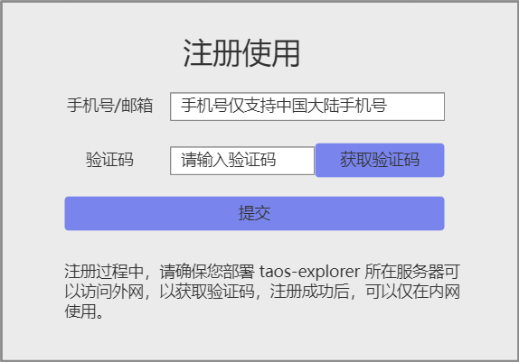

# taos-explorer 社区版

## 1. 背景

目前每天有大量的用户在使用 TDengine 开源版，但是不知道这些用户的联系方式，无法形成有效的销售线索，而且很多开源用户希望有可视化管理界面。因此公司决定要提供 taosExplorer 免费版（不开源）的开发需求，并确定要达成的目标：
1. 让开源用户了解企业版的功能
2. 隔一定的时长（可配置，目前设为7天），在 taosExplorer 右下角弹出系统信息提示用户：“目前使用的是 TDengine 开源版，无数据库备份恢复功能，无数据库实时同步功能，无法使用多级存储，无法零代码接入各种数据源，无权限管理。而 TDengine 企业版解决了这些问题，而且还提供更多的功能。欢迎联系 TDengine 团队，咨询 TDengine 企业版。”。有按钮“取消”，“联系”，点击联系，马上弹框，让用户输入联系信息。
3. 对于选择开源版的，第一次打开 taosExplorer 用 root 账号登录时，需要用户输入手机号，然后发送验证码，确认手机号的真实性，以获得开源用户手机号。
4. 开源用户可以体验企业版的功能，促进开源用户转化为付费用户(一期非必要)。
一期希望能达成前3项目标即可。
确定基于现有的 explorer，将部分功能 disable 后，功能页面依然可见，但是功能按钮置灰，点击后提示仅企业版可用，出一个能够快速发布的开源版本。基于会议达成共识，下一章节将现有 explorer 功能罗列出来，明确开源版开放的功能。

## 2. 变更历史

| **日期** | **版本** | **撰写人** | 备注 |
| --- | --- | --- | --- |
| 2024-02-06 | 0.1 | 周营昭 | 初稿 |
| 2024-03-20 | 0.2 | 周营昭 | 修改验证码方式，支持手机号+邮箱两种方式。 |
|  |  |  |  |

## 3. 定义

无。

## 4. 行为说明

### 4.1 功能变化清单

| 一级功能 |  | 社区版 | 策略 |
| --- | --- | --- | --- |
| 用户登录 |  | 改造 | 改造现有功能，加入手机号/邮箱验证环节；企业版保持原功能，只通过用户名/密码即可登录。 |
| 系统消息 |  | NEW | 每隔几天，提示用户“更多企业版功能请移步...” 跳转到企业版介绍页面 |
| 面板 |  | Y |  |
| 数据写入 | 列表 | Y | 列表中显示模拟数据 |
|  | 新增数据源 | N | 可用数据源及参数使用常量； 置灰`连通性检查`、`新增` |
| 数据浏览器 |  | Y |  |
| 编程 |  | Y |  |
| 流计算 |  | Y |  |
| 数据订阅 |  | Y |  |
| 工具 |  | Y |  |
| 系统管理 | 用户 | N | 置灰`新增`、`修改`、`删除` |
|  | 备份 | N | 1. 列表模拟数据； 1. 置灰`创建新备份`。 |
|  | 数据同步 | N | 1. 列表中模拟数据； 1. 置灰`创建新同步`。 |
|  | 集群 | Y |  |
|  | 许可证 | N | 1. 许可证模拟数据，过期时间可以为已过期时间； 1. 置灰`激活许可证`。 |
|  | 审计 | N | 1. 列表中显示模拟数据； 1. 置灰`导出`。 |

仅企业版可用的功能页面如下图示例，页面完整展示，功能按钮被置灰，鼠标悬浮后显示引导信息。

### 4.2 用户登录

如下图所示为用户登录交互流程，其中 explorer server 和 taosd 部署在用户局域网，验证码 api server 部署在阿里云（云服务组提供）。
手机号需要带国家码(比如+86)，当前版本只支持中国大陆手机号。
explorer server 会自动记录 TDengine 集群实例和手机号/邮箱的绑定关系，在后续登录时用于校验该实例是否已经绑定了手机号/邮箱。

用户首次访问 UI 原型如下，首先访问显示 “注册使用” 的界面，注册完成后进入登录界面，在登录界面提示用户使用数据库用户名密码，并默认填入 root / taosdata。

注册完成后，在 taos-explorer 部署服务器上的文件 ${td_config_path}/data/explorer/v.log 记录当前绑定的 taos-adapter endpoint。后续用户访问时，会检查当前接入的 taos-adapter 是否在绑定列表中，在的话直接登录，否则需要 “注册使用”。

### 4.3 系统消息

1. 系统消息显示在右下角提示对话框中，用户可以勾选：7 天内不再提示，如果不勾选则每天提醒；如果勾选则在 7 天后会再次提示。
2. 关闭或鼠标点击提示框之内除勾选之外的部分，可以关闭提示；
页面原型如下：
<quote-container>
目前使用的是 TDengine 开源版，无数据库备份恢复功能，无数据库实时同步功能，无法使用多级存储，无法零代码接入各种数据源，无权限管理。而 TDengine 企业版解决了这些问题，而且还提供更多的功能。欢迎联系 TDengine 团队，咨询 TDengine 企业版
口 7天内不再提醒                        取消  联系             
</quote-container>

点击联系，则跳转到官网的落地页。

### 4.4 TDengine 社区版的安装包改造

taos-explorer 和 taosd 社区版一起打包，作为 taosd 社区版的一部分。不影响原来的下载安装体验，安装后 taosd 社区版可以直接使用 taos-explorer。

## 5. 性能

无。

## 6. 兼容性

原企业版的用户名登录方式不变。
兼容 taosd 3.3.0.0 以后打包的 TDengine 开源版，不考虑兼容之前版本的 taosd。

## 7. 运维

无。

## 8. 使用场景

1. 开源用户使用社区版 taos-explorer，会强制要求用户关联有效手机号/邮箱以提供商务线索，并会定期提醒企业版特有功能；
2. 初次登录社区版 taos-explorer 要求绑定手机号，在后续登录中会检查是否已经绑定。

## 9. 约束和限制

用户局域网必须能够访问互联网，否则无法完成手机号验证，无法使用社区版 taos-explorer。

## 10. 常见错误和排查

无。

## 11. 参考文档

无。

## 12. 附录

### 12.1 验证码 api 接口

#### 12.1.1 接口定义

接口请求发送 手机或邮箱验证码采用 Http rest api，具体定义如下。
1. POST 请求参数Request body（json）：
   - phone：手机号码（当前仅支持中国大陆号码）
   - email: 邮箱地址
   - verification_code: 验证码，一般为4为数字
   - t: 时间戳
2. Header 参数：
sign_data: 经过参数组合+秘钥的签名数据。
1. 接口处理行为：
验证签名，如果签名错误，则返回错误消息；
手机号如果不为空，则发送手机验证码；如果 email 不为空并格式正确，则发送邮箱验证码；否则报错。

#### 12.1.2 接口安全性

1. 限流：同一个 ip， 每秒钟限制访问次数 1 次。
2. 签名安全：模拟参数访问，被拒绝。
