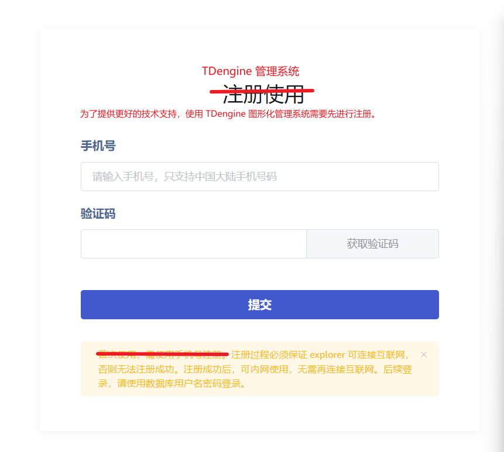
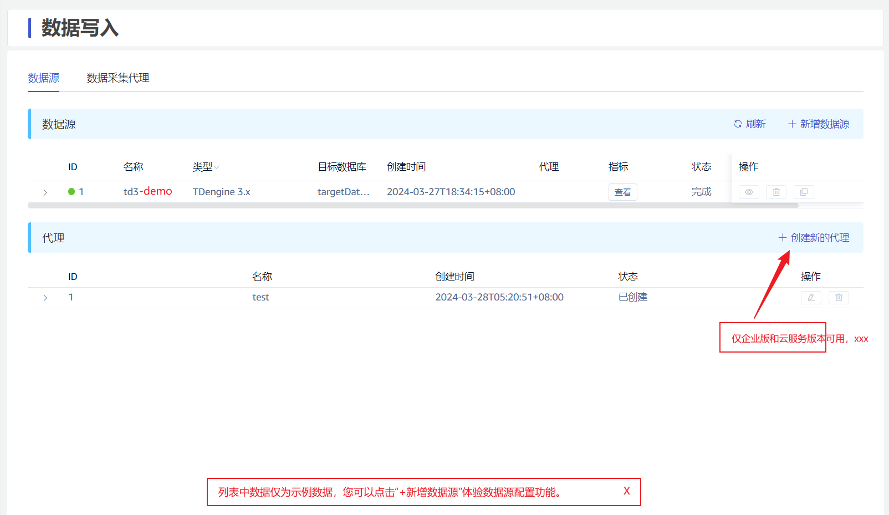
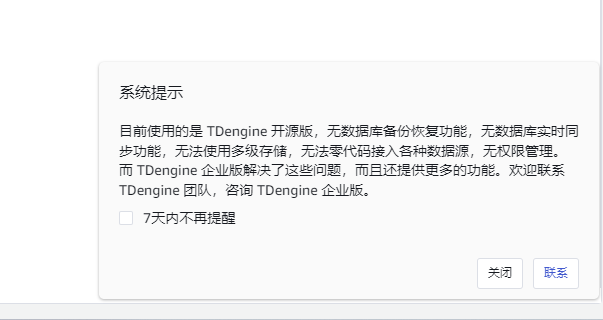
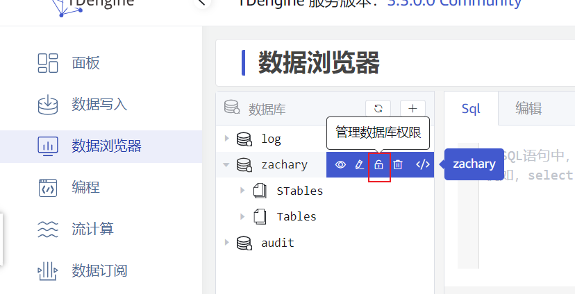
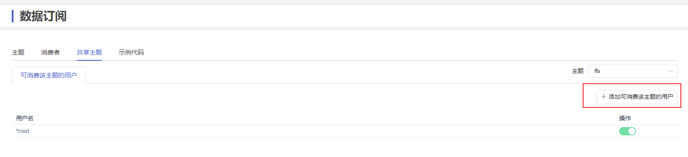
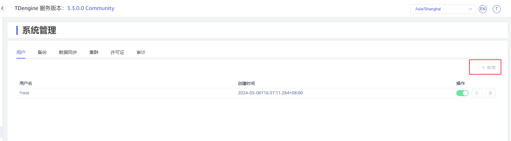
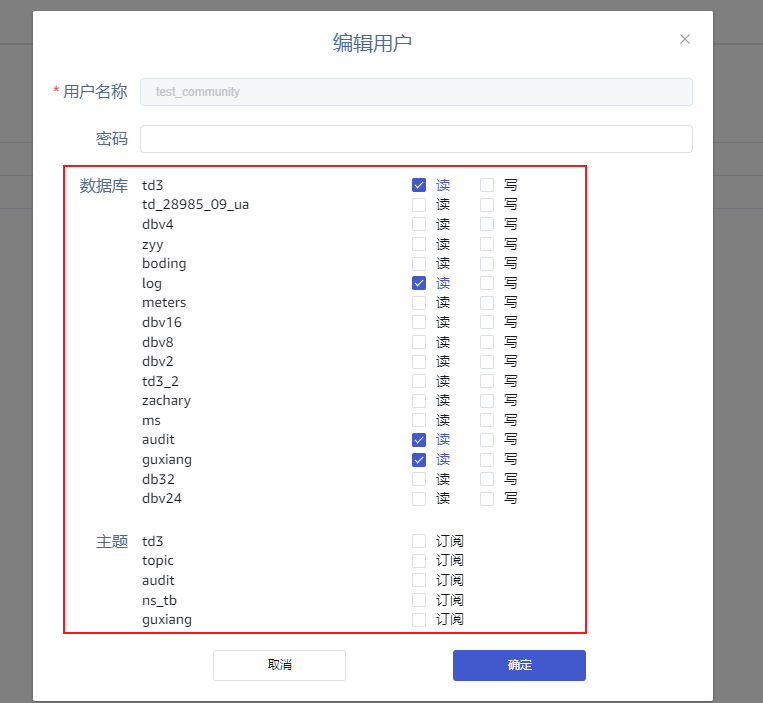

# Taos-explorer 社区版交互优化

## 1. 背景

2024年5月13日上午11点，Jeff 组织顾香、营昭一块梳理了 taos-explorer 社区版。主要对页面上一些提示的文字不够丰富，还有部分按钮被 disable 后，没有对应的悬浮提示文字。

## 2. 优化项

### 2.1 注册页面 done

注册/登录页面给出中英文切换

### 2.2 共性优化项

#### 2.2.1 列表数据页面 done

示例列表数据，统一有一个提示内容：
中文： 当前列表数据仅为示例数据。
英文： The current list data is only sample data

建议效果：

#### 2.2.2 按钮 disable

所有因为社区版版本控制被 disabled 的按钮，悬浮都要加上 tip 提示，提示内容统一提示“仅企业版和云服务可用，了解更多，请访问 TDengine [官网](https://www.taosdata.com/tdengine-enterprise?utm_source=oss+&utm_medium=user&utm_campaign=explorer)”
- 创建数据源页面 done
- 创建新的代理 done
- 添加权限 done
- 添加备份 done
- 添加同步 done

#### 2.2.3 消息提示文字 done

目前使用的是 TDengine 开源版，无数据库备份恢复功能，无数据库实时同步功能，无法使用多级存储，无法零代码接入各种数据源，无权限管理，无视图等诸多高级功能。而 TDengine 企业版解决了这些问题，而且还提供更多的功能。欢迎联系 TDengine 团队，咨询 TDengine 企业版和云服务。 

You are using the community version of TDengine, some functionalities are not available, e.g. database backup and recovery, data replication, multi-level storage, data in for various kinds of data sources, access control, view, etc. TDengine Enterprise Edition provides these and some other functionalities to facilitate your business needs. Please feel free to contact the TDengine team to get access to TDengine Enterprise Edition or Cloud Service. 

### 2.3 遗留的未 disable 操作

1. 数据浏览器中管理权限
超级表和数据库的权限管理入口可以进入，但是进入后的页面，应该disable 掉具体操作。done

1. 共享主题 done

### 2.4 管理-许可证

直接去掉这个页面。done

### 2.5 管理-用户管理 

1. 用户可以增删改；done
2. 修改用户时，权限管理要去掉，下面的部分要disable。done
3. 开源版默认给所有数据库的读写权限。

