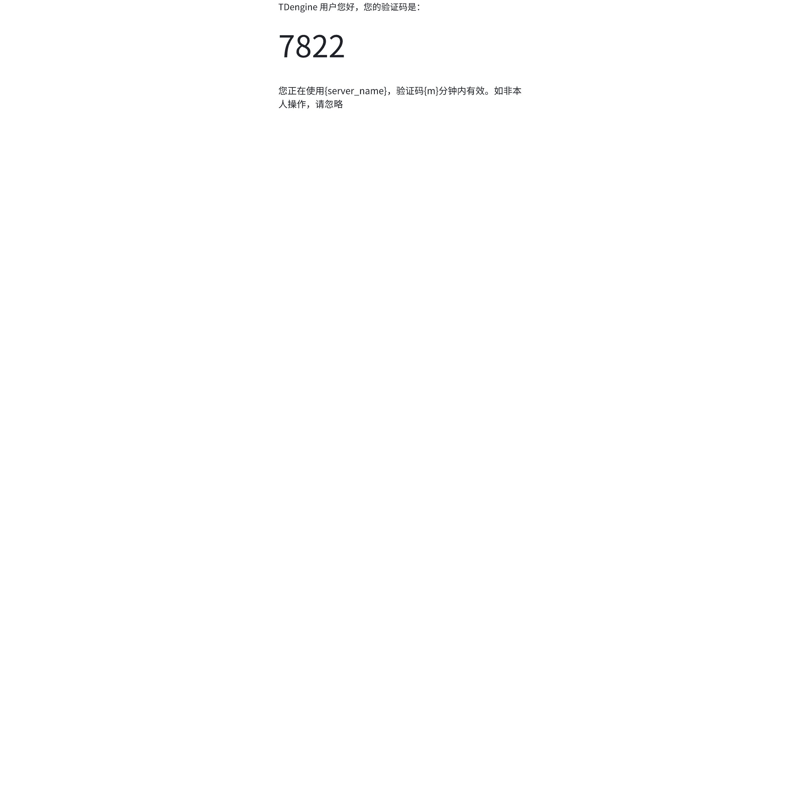

#  taos-explorer 社区版 Api 接口文档

## 1. 注册流程

### 1.1 检查是否有绑定账号

绑定关系是 当前 explorer 连接的 cluster + 手机号；
如果修改了连接的 cluster host，原绑定关系会失效。

| URL | /api/-/isbinding |  |
| --- | --- | --- |
| method | GET |  |
| parameter | 无 |  |
| response | { "code": 0, "data": true } | 已注册 |
|  | { "code": 0, "data": false} | 未注册 |

### 1.2 获取图形验证码

| URL | /api/-/captcha |  |
| --- | --- | --- |
| method | GET |  |
| parameter | phone_email=18600000000&ts=16223882298 |  |
| response | image | 放到图片中的 src 中  |
|  |  |  |

### 1.3 发送验证码

| URL | /api/-/verification-code |  |
| --- | --- | --- |
| method | GET |  |
| parameter | phone_email=18600000000&ts=16223882298&captcha=1234 |  |
| response | {"code": 0, "data": ""} | 发送成功,可以忽略data |

### 1.4 校验验证码

| URL | /api/-/verification-code |  |
| --- | --- | --- |
| method | POST |  |
| parameter | { "phone_email": "18600000000", "verification_code": "7550", "ts": 1622828282 } |  |
| response | {"code": 0, "data": "pass"} | data有三种结果： pass - 校验通过 none - 不存在给当前手机号发送的验证码; 需要重新获取验证码 error - 输入的验证码错误 |

说明：
如果校验通过，则注册成功。

## 2. 云服务接口

### 2.1 接口安全

#### 2.1.1 参数签名

code=7800&duration=3&email=&language=zh&phone=15811112222&nonce=xxxxx&ts=16322
加密串由2部分组成：
1. 业务数据，按照字段名的字母顺序排列。
2. 技术字段追加到业务数据串后面，按顺序加上nonce和ts, nonce和ts 来自于 header 中对应的参数。
签名算法：Sha256
加密后的结果通过 header 参数传递，sign=加密串

#### 2.1.2 防 DDos 攻击

配置在入口网关，限制单 ip 一定时间内的请求次数。

### 2.2 消息模板

#### 2.2.1 短信模板

中文模板
<quote-container>
【TDengine】验证码:{code}，{m}分钟内有效。您正在使用{server_name}，如非本人操作，请忽略。
</quote-container>

英文模板：
<quote-container>
【TDengine】Verification code: {code}, valid within {m} minutes. You are using {servername}. If it is not your own operation, please ignore it.
</quote-container>

参数说明：
code: 一般是4位数字，比如 7800，
m: 有效时长，单位分钟，
server_name: 对应 server_key 配置的 server_name.

#### 2.2.2 邮件模板

### 2.3 Rest api

#### 2.3.1 发送验证码接口

发送手机或邮箱验证码。@李亚强这个接口帮忙实现，给出云服务的URL 这个接口帮忙实现，给出云服务的URL 和 response。

| URL | https://cloud.taosdata.com/openapi/trial/verification-code |  |
| --- | --- | --- |
| method | POST |  |
| header | Server-Key=${server_key},Nonce=${nonce},Time-Stamp=${time},Sign=${sign} | server_key :云服务下发的key 是否区分社区版/企业试用版？ nonce：1000000000已内随机数 time：调用发起时间戳 sign：签名 （参数+技术字段签名，云服务使用同样算法验证签名是否匹配） |
| parameter json | data：{ "phone": "15811112222", "email" : "", "code"： "8700", "duration": 3, "language": "zh" } | phone: 手机号 email: 邮箱 Code: 验证码 Duration: 有效时间，一般用于消息模板中 language： 发送消息使用的语言模板，可选项有zh_CN/en_US |
| response | { "code": 200,"data": null,"msg": "OK"} {"code": 400,"data": null,"msg": "Bad Request"} {"code": 403,"data": null,"msg": "Forbidden"} { "code": 500,"data": null,"msg": "Internal Server Error"} | 200: 发送成功 400: 参数错误 403: 签名校验失败 500: 发送失败 |

#### 2.3.2 云服务上报验证结果接口

上报 验证成功的 手机号/email

| URL | Post https://cloud.taosdata.com/openapi/trial/verification-result |  |
| --- | --- | --- |
| method | POST |  |
| header | Server-Key=${server_key},Nonce=${nonce},Time-Stamp=${time},Sign=${sign} | server_key :云服务下发的key 是否区分社区版/企业试用版？ nonce：1000000000已内随机数 time：调用发起时间戳 sign：签名 （参数+技术字段签名，云服务使用同样算法验证签名是否匹配） |
| parameter json | { "phone": "15811112222", "email" : "", "code"： "8700"， "name": "steven", "taosdVersion": "", "explorerVersion"： "" } | phone: 手机号 email: 邮箱 code: 验证码 name: 姓名 taosdVersion：taosd 版本 explorerVersion：explorer 版本 |
| response | { "code": 200,"data": null,"msg": "OK"} | 200: 发送成功 |

兼容性说明：
为了兼容老版本，需要云服务在实现时兼容没有 name 的情况，没有 name 会接受到 name=null 的情况，那么在拼接签名字符串时，应该不包含该参数。如果是空字符串“”，应该拼接参数到签名字符串中。

#### 2.3.3 taosd 信息上报接口

上报 当前使用的taosd 信息：instanceId 和 taosdVersion, 找到 phone / email 最新注册记录，更新其中的taosdVersion 和 instanceId.

| URL | https://cloud.taosdata.com/openapi/trial/verification-result |  |
| --- | --- | --- |
| method | PUT |  |
| header | Server-Key=${server_key},Nonce=${nonce},Time-Stamp=${time},Sign=${sign} | server_key :云服务下发的key 是否区分社区版/企业试用版？ nonce：1000000000已内随机数 time：调用发起时间戳 sign：签名 （参数+技术字段签名，云服务使用同样算法验证签名是否匹配） |
| parameter json | { "phone": "15811112222", "email" : "", "taosdVersion": "3.3.0.0", "instanceId"： "32883872" } | phone: 手机号 email: 邮箱 taosdVersion: taosd 版本 instanceId: taosd 实例 id |
| response | { "code": 200,"data": null,"msg": "OK"} | 200: 发送成功 |
