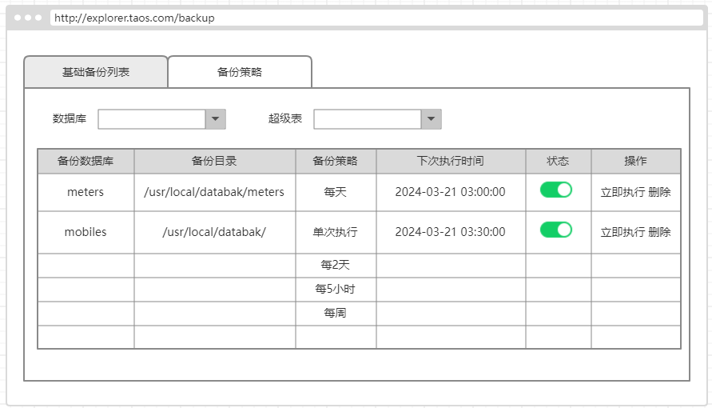
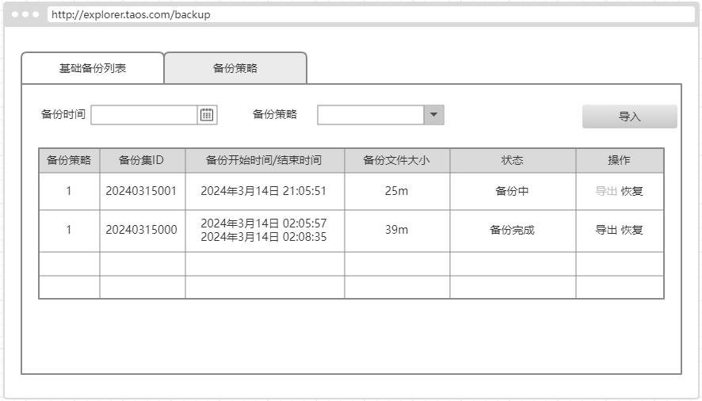

# 数据备份和恢复：优化产品体验（产品范围讨论稿）

## 1. 背景

在试用和测试中发现，数据备份功能在交互和易用性上存在一些问题，另外和云服务、实施的负责人沟通，现在还没有实际使用，希望能够通过系统性优化，达到运维可用的程度。

### 1.1 相关Jira 列表

[【备份恢复】对数据备份功能的改进意见](https://jira.taosdata.com:18080/browse/TD-28371)
[【备份恢复】在创建备份的“目录”输入框，输入特殊字符，点击“确定”按钮没有任何反应](https://jira.taosdata.com:18080/browse/TD-28555)
[【备份恢复】当备份创建以后，但还未生成备份时，点击“数据还原”弹出的提示信息需要优化](https://jira.taosdata.com:18080/browse/TD-28542)
[【备份恢复】启用/禁用备份任务和数据同步任务,需要优化事件机制](https://jira.taosdata.com:18080/browse/TD-28667)
[创建的多个数据备份任务应可以指定相同的目录](https://jira.taosdata.com:18080/browse/TD-28774)

## 2. 变更历史

| 日期 | 版本 | 负责人 | 主要修改内容 |
| --- | --- | --- | --- |
| 2024/03/21 | 0.1 | 周营昭 |  |

## 3. 定义

无。

## 4. 行为说明

### 4.1 备份策略

立即执行：当点击“立即执行”，可立即触发备份任务执行，不影响下次执行时间。如果当前有任务正在执行，则提示用户“备份正在进行中，请勿重复点击”。
校验规则：
1. 备份路径独占性：备份路径只能被一个策略使用，创建备份策略时，如果发现备份目录已经被其他目录占据，则提示错误。
2. 备份文件完整性：同一个备份策略下的备份文件需要有一定的顺序属性，这样恢复或者导出时，可以检查文件的完整性。

#### 4.1.1 删除

删除时，获取当前备份创建的 topic 上的订阅，是否仅有当前备份订阅。如果是，则联动删除 topic。
提示更友好些：

### 4.2 备份记录

备份记录单独一个列表，每次执行备份任务会记录一条备份记录。

#### 4.2.1 备份记录列表

#### 4.2.2 导出备份记录

1. ~~导出当前备份~~
2. 导出当前及历史备份
导出完成后显示备份导出的文件夹，用户可以将文件夹 copy 到另一台 taosX 服务器，进行导入。

#### 4.2.3 导入备份记录

点击“导入”按钮，要求输入备份记录所在目录，并将备份目录中的记录导入当前备份列表中。备份策略为“导入{原策略id}”。

#### 4.2.4 恢复

两种操作选择：
1. ~~仅恢复当前记录。~~
2. 恢复当前及历史记录。
恢复范围：
1. 选择数据库，恢复到数据库上。
2. 选择 stable，仅恢复同名 stable 的数据。
3. 选择 sub table，仅恢复同名 sub table 的数据。
4. 选择普通表 table，恢复同名 table 的数据。
恢复过程监控：
有恢复的日志持续输出，可以查看关键性的 meta 记录和批量插入数量

## 5. 性能

无。

## 6. 兼容性

无。

## 7. 运维

无

## 8. 使用场景

无需说明。

## 9. 约束和限制

无。

## 10. 常见错误和排查

## 11. 可观测性

无变化。

## 12. 安装和卸载

无变化。

## 13. 文档

- **需要**修改企业版文档：需要对此特性添加说明，修改截图等。
- 不需要修改官网文档。

## 14. 参考文档

[关于数据备份/同步功能的优化建议](https://taosdata.feishu.cn/wiki/Jn0sw26Lniw2T0klLi6cvBt7nkf)
