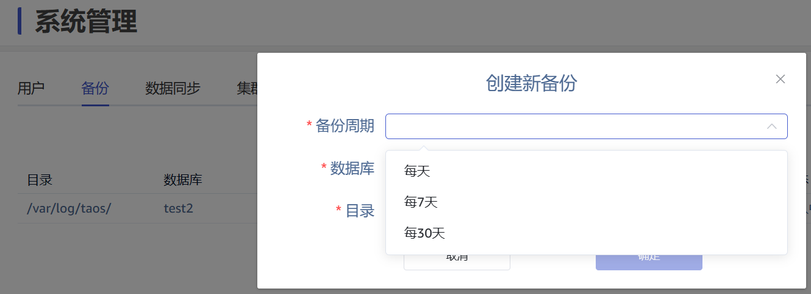
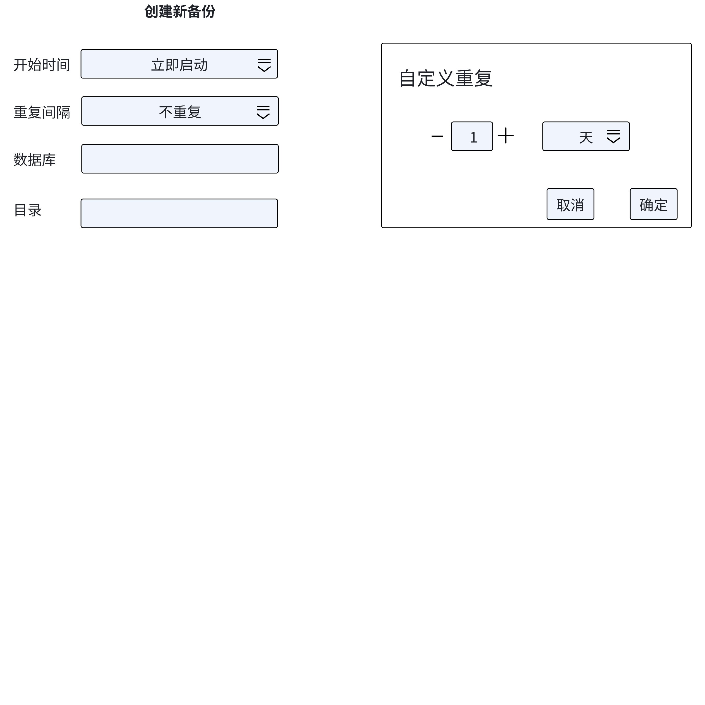
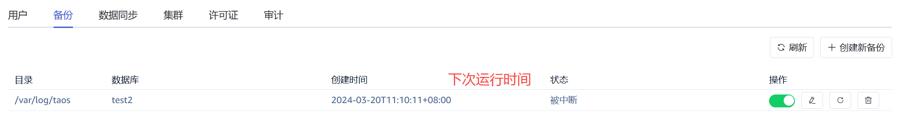

# 数据备份支持定时任务

## 1. 背景

数据备份是 taosX 已经支持的功能，在 taosExplorer 上功能入口如下:

对于备份任务, 触发时机只能选择“每天”、“每 7 天”， “每 30 天”。**无法指定一天中具体的触发时刻**，比如“每天 12:00”。当用户选择 “每天” 的时候，实际上是只能在每天 UTC 时间的 0 点执行。
本次改进的主要目的是提高备份任务调度的灵活性。包括：
1. 支持指定任务开始运行的时间
2. 支持以可视化的方式配置自定义的时间间隔

## 2. 变更历史

| 日期 | 版本 | 负责人 | 主要修改内容 |
| --- | --- | --- | --- |
| 2024/3/19 | 0.1 | 丁博 | 初稿 |
| 2023/3/20 | 0.2 | 丁博 | 删除数据同步相关内容，修改界面设计 |
| 2023/3/20 | 1.0 | Wade | 修改部分行文，性能，约束和限制 |

## 3. 定义

无

## 4. 行为说明

### 4.1 创建备份任务

新增两个与任务调度相关的配置参数。
1. 第一个配置参数，名为 “启动时间”， 默认值为立即启动， 其可选项有：
   - 立即启动
   - 自定义启动时间。使用时间控件选择年月日时分秒，分秒默认为 00:00
2. 第二个配置参数，名为 “重复间隔”，默认值为 “不重复”。其可选项有：
   - 不重复
   - 每天重复
   - 自定义重复，设置时可以选择两个子参数，数量和单位,  单位默认是 “天”， 可选单位有：分钟，小时，天，周；数量没有默认值

### 4.2 查看备份任务

在查看备份任务时，新增 “下次运行时间” 列：

## 5. 性能

数据备份会对 TDengine 数据库引擎造成一定的性能影响。 频率较高时，每次备份的增量数据量较小，影响也较小，但产生影响的频率也高。频率较低时，每次备份的增量数据量较大，影响也较大，但产生影响的频率也低。建议根据业务负载的周期来设置启动时间和备份周期。

## 6. 兼容性

无

## 7. 运维

无

## 8. 使用场景

参见背景说明。

## 9. 约束和限制

备份依赖于数据库的订阅功能，而订阅功能依赖于 WAL （其定义请参考官网文档），所以备份的间隔建议不高于数据库的 WAL Retention Period，否则有可能会导致备份的数据不完整。但在配置参数时 Explorer 和 taosX 并不会强制检查该参数，需要用户自行保证其设置正确。

## 10. 常见错误和排查

无

## 11. 可观测性

taosExplorer 界面有修改，参考行为说明一节。

## 12. 安装和卸载

无

## 13. 文档

需要修改企业版文档。

## 14. 参考文档

无
