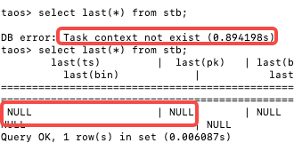
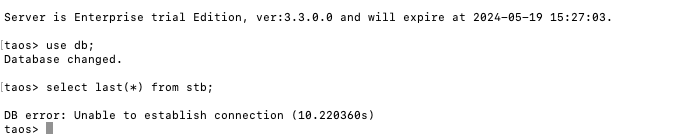

# 3.3.0.0 升级兼容性问题测试

## 1. 缓存清除步骤

1. 停止 taosd
2. 执行命令：
   - 查看缓存文件：`find $DATA_DIR/vnode/vnode[2-5] -type d -name "cache.rdb"`
   - `删除缓存文件：``find $DATA_DIR/vnode/ -type d -name "cache.rdb" -exec rm -rf {} +;`
如果只清除某一个 DB 的缓存，可以在命令中指定 vnode 目录，比如 db 有 4 个 vnode：vnode2, vnode3, vnode4, vnode5，则可以时执行下面命令：
`find $DATA_DIR/vnode/vnode[2-5] -type d -name "cache.rdb" -exec rm -rf {} +;`

## 2. 测试场景一 （模拟升级失败的开源用户）

步骤 ：
1. 3.2.3.0 作为初始版本（cache_model: both)
2. 升级到 2024/5/7 发布的有问题的 3.3.0.0
3. 若数据库的 cachemodel 不是 none，预期启动失败，否则预期启动成功
4. 停止  taosd，手动清除 last 缓存 （要记录一下清除步骤），启动有问题版本，预期启动成功
5. 覆盖安装最新发布的 3.3.0.0 
6. 再次清除 last 缓存
7. 启动 （预期成功）
8. 查询 last （重建缓存）

## 3. 测试场景二（模拟升级失败的企业用户）

步骤：
1. 3.2.3.6 作为初始版本 （cache_model: both)
2. 升级到 2024/5/8 发布的有问题的 3.3.0.1
3. 启动（预期失败）
4. 停止  taosd，清除 last 缓存 （要记录一下清除步骤）
5. 卸载  3.3.0.1
6. 安装最新发布的 3.3.0.0 
7. 再次清除 last 缓存
8. 启动 （预期成功）
9. 查询 last （重建缓存）

## 4. 测试场景三 （正常升级：开源用户）

1. 3.2.3.0 作为初始版本（cache_model: both）
2. 直接升级到 2024/5/9 发布的 3.3.0.0 
3. 看是否一切正常

## 5. 测试场景四 （正常升级：企业用户）

1. 3.2.3.0 作为初始版本（cache_model: both）
2. 直接升级到 2024/5/9 发布的 3.3.0.0 
3. 看是否一切正常

## 6. 测试场五 （企业版 3.1.1.x 的正常升级）

1. 3.1.1.37 作为初始版本 （cache_model: both）
2. 直接升级到 2024/5/9 发布的 3.3.0.0
3. 看是否一切正常

## 7. 测试场六 （企业版 3.2.3.3 的正常升级）

1. 3.2.3.3 作为初始版本 （cache_model: both)，配置3 副本 3 节点 3mnode
2. 升级到 2024/5/8 发布的有问题的 3.3.0.1
3. 启动（预期启动失败或者查询失败）
4. 停止  taosd，清除 last 缓存 （要记录一下清除步骤）
5. 卸载  3.3.0.1
6. 安装最新发布的 3.3.0.0 
7. 再次清除 last 缓存
8. 启动 （预期成功）
9. 查询 last （重建缓存）

## 8. 测试场七 （拿到前两天错误版本的用户）

1. 安装 3.3.0.0 之前的任何一个版本，打开 cachemode 为  both
2. 写入10w 数据，写入完查询 last(*) 并记录
3. 升级至 3.3.0.0 错误的版本
4. 查询 last(*) ， 会 core
5. 保证在这个版本上没有新数据写入
6. 拿到了今天发的正确的 3.3.0.0 版本
7. 升级
8. 启动服务，查询 last(*)
9. 能够正确查询到 last 值与升级前的 last 值一致，无崩溃 

## 9. 测试结果

| 测试场景 | 结果 (Pass/Fail) | Owner |  |
| --- | --- | --- | --- |
| 场景一 | Pass | @陈浩然 | 第一次升级5.7号的没问题，第二次升级5. 8号的也没问题。。。不清楚是 pass 和 failed。。。 |
| 场景二 | Pass | @段宽军 | 遇到意外，第三步启动成功了，但第一次 查询报错：  再查 last 返回 全部是 NULL, 升级前 LAST 都有值 升级到新3.3.0.0 后查询last 写入再查询 last 都正常，没有问题 |
| 场景三 | PASS | @陈浩然 | （带乱序数据） 升级到 5.9的 3.3版本，查询的结果是错的。 taos> select last(*) from test.d1 ; last(ts) | last(current) | last(voltage) | last(phase) | ======================================================================================== NULL | NULL | 268437712 | 0.0000000 | taos> select last(*) from test.meters ; last(ts) | last(current) | last(voltage) | last(phase) | ======================================================================================== 1970-01-01 08:00:00.085 | 0.0000000 | 268437712 | 0.0000000 | |
| 场景四 | Pass | @段宽军 | taosBenchmark 乱序写入后，升级至最新 3.3.0.0 ，查询直接 CORE  REPORT JIRA: [TD-29981](https://jira.taosdata.com:18080/browse/TD-29981) 验证上面问题修复，通过。 |
| 场景五 | Pass | @段宽军 | 使用上午刚出的安装包验证，通过 |
| 场景六 | Pass | @陈浩然 | 没删除 cache 的时候查询有问题， 改成 nonde，删除 cache 以后再改成 both，查询没问题，再次写入数据，更新 last 空数据前的一条，last 查询结果正常。 |
| 场景七 | Pass | @段宽军 | 这个场景用户升级至错误的3.3.0.0 版本，不能有数据写入， Last 值会平滑过程到新版本 |
