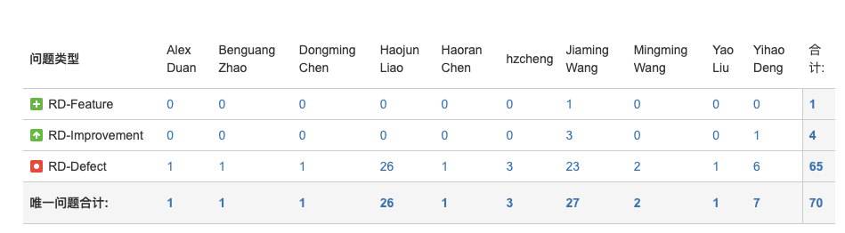
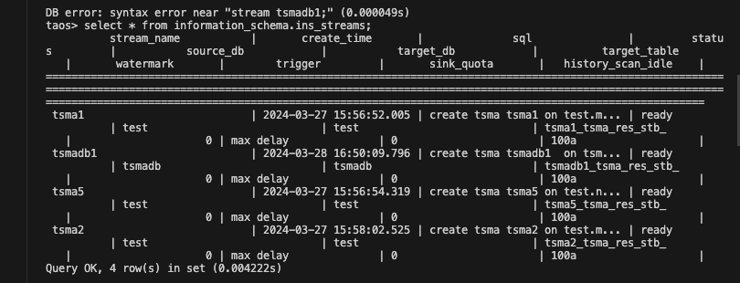
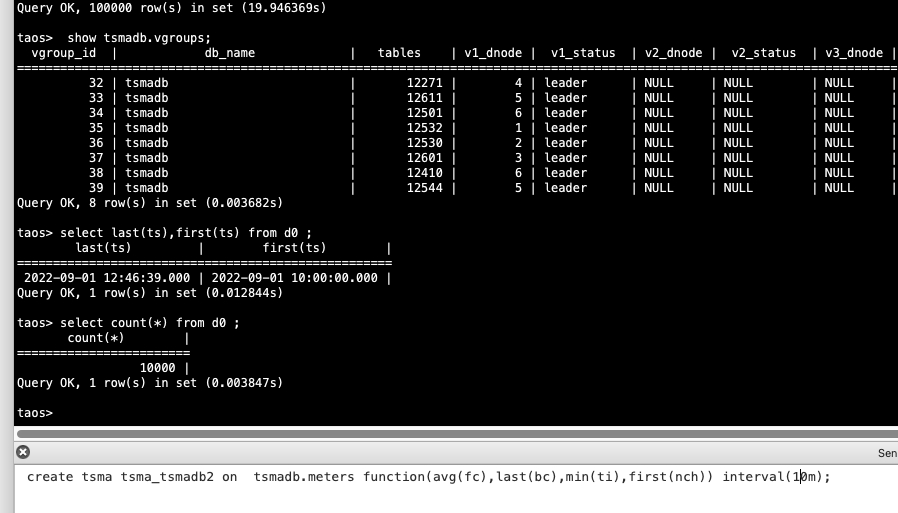
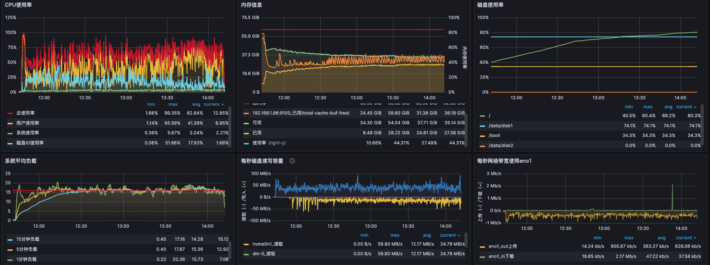
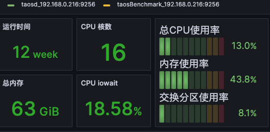
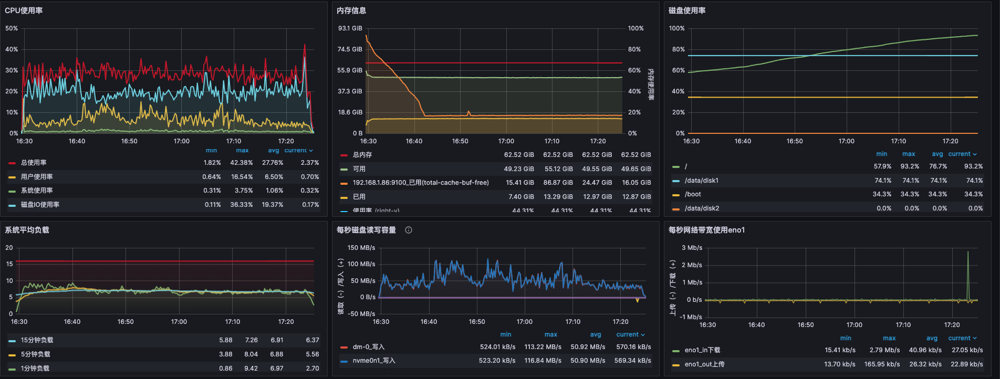
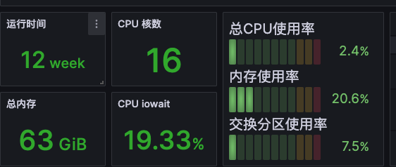
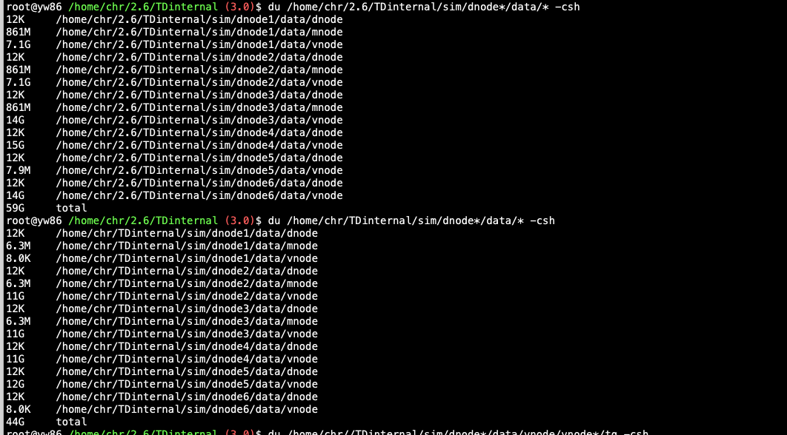

# TDengine TSMA Test Spec

## 一、测试目标

  测试的功能文档和需求文档
参考文档

| 文档 | 链接 |
| --- | --- |
| Function Spec | [TSMA 功能](https://taosdata.feishu.cn/wiki/WpVfwsKjeilOtckp3U2cIaz0nef) |
| 需求说明文档 | [需求说明：TSMA](https://taosdata.feishu.cn/wiki/DTtww59nKi9pRHkyK8ZczMO7nCb) |

  主要目标是TDengine 支持 TSMA 功能，确保使用 TSMA 时查询时延有降低。

## 二、变更历史

| Date | Version | Owner | Memo |
| --- | --- | --- | --- |
| 2024-03-06 | 0.1 | chenhaoran | 创建文档 |
| 2024-03-11 | 0.2 | chenhaoran | 增加运维部分的测试，包含单多副本： redistribute、alter replica、split、compact 增加 tsma 中的基准 interval和递归 interval 与查询 SQL 中 ts时间范围和 interval 关系的组合测试 |
|  |  |  |  |

## 三、测试结论

问题比较多，目前的测试还未完成。测试遇到的问题包括不限于 tsma 的问题，stream 的问题等。这是对应的 jira 链接：[问题导航器 - TAOSDATA NETWORKS JIRA](https://jira.taosdata.com:18080/issues/?filter=23438&jql=status%20!%3D%20CANCELED%20AND%20created%20%3E%3D%202024-03-25%20AND%20created%20%3C%3D%202024-05-10%20AND%20reporter%20%3D%20hrchen%20%20and%20summary%20!~%20tsbs%20%20%20and%20summary%20!~%20%E4%BA%91%E6%9C%8D%E5%8A%A1%20and%20summary%20!~%20cloud%20ORDER%20BY%20created%20DESC&startIndex=50)。


1. 单机功能测试：基础用例通过，没有问题。
2. 集群测试：3 副本还在测试中，变改 3 副本时 taosd 挂掉。
3. 性能测试：子表数目 10w张，tsma 为 3的情况下，stream 计算一直没有稳定，还在持续测试，滚动解决问题中，目前的问题是。
- tsma 在重启dnode 节点以后需要重新 checkpoint，当数据量过大时，启动以后恢复要长时间，需要增量 checkpoint，待开发测试。
- tsma 的窗口过多时，checkpoint 的所需资源过大导致操作系统响应慢，需要增量 checkpoint，待开发测试。

### 

## 四、开发质量报告

结论：本特性的开发质量是一般，

| 统计指标 | 数量 |
| --- | --- |
| 提测被拒次数 |  |
| 基础测试用例不通过 | 5 |
| Bug 总数 | 65 |
| 严重 Bug 总数 | 3 |

## 五、已知问题和限制

这里文档都会更新。

## 六、测试资源及环境

   测试平台：Linux x64
   测试资源：192.168.1.86（尽量使用 adress san版本运行测试用例）

## 七：测试范围及重点

 本测试主要 TSMA 的功能，包含
- 基本功能测试：SQL 中增删改查均无问题
- 正确性测试：tsma 的结果和不带 tsma 的结果一致
- 异常测试：边界和明确不支持的，有错误提提示，包括 tsma 的命名，tsma 的删除，tsma 所在库和表被删除，tsma 对应的表和列的 schema 的修改和删除。
- 性能测试：验证 tsma 建立以后查询结果的提升

## 八、测试数据 (Optional)

### 测试数据表格

| 功能测试 | 测试库 |  |
| --- | --- | --- |
| 数据库 | tsmadb |  |
| 测试表-超级表 | meters |  |
| 表数* 每张子表的rows | 10w*1w |  |
| schema |
| 测试表-普通表 | gentest | gentest |
| 表数* 每张子表的rows | 10000*100000 | 10000*100000 |
| schema |

### 测试 taosBenchmark json

```json
{
    "filetype": "insert",
    "cfgdir": "/etc/taos",
    "host": "yw86",
    "port": 6030,
    "user": "root",
    "password": "taosdata",
    "connection_pool_size": 8,
    "num_of_records_per_req": 20000,
    "thread_count": 8,
    "create_table_thread_count": 10,
    "result_file": "./insert_res_mix.txt",
    "confirm_parameter_prompt": "no",
    "insert_interval": 10000,
    "check_sql": "yes",
    "continue_if_fail": "yes",
    "databases": [
        {
            "dbinfo": {
                "name": "tsmadb",
                "drop": "yes",
                "vgroups": 8,
                "replica": 3,
                "precision": "ms",
                "stt_trigger": 1,
                "minRows": 100,
                "WAL_RETENTION_PERIOD": 10,
                "maxRows": 4096
            },
            "super_tables": [
                {
                    "name": "meters",
                    "child_table_exists": "no",
                    "childtable_count": 100000,
                    "insert_rows": 17520,
                    "childtable_prefix": "d",
                    "insert_mode": "taosc",
                    "insert_interval": 0,
                    "timestamp_step": 60000,
                    "start_timestamp":"2022-09-01 10:00:00",
                    "disorder_ratio": 0,
                    "update_ratio": 0,
                    "delete_ratio": 0,
                    "disorder_fill_interval": 0,
                    "update_fill_interval": 0,
                    "generate_row_rule": 0,
                    "columns": [
                        { "type": "bool",        "name": "bc"},
                        { "type": "float",       "name": "fc",  "max": 1, "min": 0 },
                        { "type": "double",      "name": "dc",  "max": 1, "min": 0 },
                        { "type": "tinyint",     "name": "ti",  "max": 100, "min": 0 },
                        { "type": "smallint",    "name": "si",  "max": 100, "min": 0 },
                        { "type": "int",         "name": "ic",  "max": 100, "min": 0 },
                        { "type": "bigint",      "name": "bi",  "max": 100, "min": 0 },
                        { "type": "utinyint",    "name": "uti", "max": 100, "min": 0 },
                        { "type": "usmallint",   "name": "usi", "max": 100, "min": 0 },
                        { "type": "uint",        "name": "ui",  "max": 100, "min": 0 },
                        { "type": "ubigint",     "name": "ubi", "max": 100, "min": 0 },
                        { "type": "binary",      "name": "bin", "len": 10},
                        { "type": "nchar",       "name": "nch", "len": 10}
                    ],
                    "tags": [
                        {
                            "type": "tinyint",
                            "name": "groupid",
                            "max": 10,
                            "min": 1
                        },
                        {
                            "name": "location",
                            "type": "binary",
                            "len": 16,
                            "values": ["San Francisco", "Los Angles", "San Diego",
                                "San Jose", "Palo Alto", "Campbell", "Mountain View",
                                "Sunnyvale", "Santa Clara", "Cupertino"]
                        }
                    ]
                }
            ]
        }
    ]
}
```

## 九、测试用例

| 大类 | 用例编号 | 用例类型 | 测试场景 | 基础数据 | 测试内容/步骤 | 预期 | 结果 | 备注 |
| --- | --- | --- | --- | --- | --- | --- | --- | --- |
|  |  |  | 创建基础数据环境 |  | 1. 创建tsmadb 库，创建 tsma，写入数据， 1. 使用 tsma 查询 SQL 得到结果 1. 查询 SQL 添加 /*+ skip_tsma() */ ，即不使用 tsma 的情况下，得到查询结果 1. 设置参数querySmaOptimize 0 ，查询 SQL得到查询结果 | 判断使用和不使用的规则：看查询计划 判断何时计算完成：时延，暂时没有这个值。 1. 步骤 234 的结果一致 后续所有的结果对比，都基于这种方式来验证准确性，不需要俩个库做对比。 | 验证没问题 | 备注或报BUG 的JIRA号 |
| 1.1 | 基础用例 | 创建超级表的tsma |  | 1. 新建 tsma1 后查看结果：CREATE TSMA tsma1 ON tsmadb.meters FUNCTION(avg(fc), avg(ic), max(fc), max(ic), min(fc), min(ic), count(*)) INTERVAL(5m); 1. 删除 tsma1后查看结果：DROP TSMA tsma1 1. 创建包含所有支持的函数 tsma_all，查看创建结果: CREATE TSMA tsma_all ON tsmadb.meters FUNCTION(avg(fc), avg(ic), max(fc), max(ic), min(fc), min(ic), count(*), sum(fc), sum(ic), first(fc), first(ic), last(fc), last(ic),spread(fc), spread(ic), stddev(fc), stddev(ic), hyperloglog(fc), hyperloglog(ic) ) INTERVAL(5m); 1. 对比使用 tsma和禁用 tsma 的查询结果 - select avg(fc), avg(ic), max(fc), max(ic), min(fc), min(ic), count(*), sum(fc), sum(ic), first(fc), first(ic), last(fc), last(ic),spread(fc), spread(ic), stddev(fc), stddev(ic), hyperloglog(fc), hyperloglog(ic) from tsmadb.meters interval(10m) - select /*+ skip_tsma() */ avg(fc), avg(ic), max(fc), max(ic), min(fc), min(ic), count(*), sum(fc), sum(ic), first(fc), first(ic), last(fc), last(ic),spread(fc), spread(ic), stddev(fc), stddev(ic), hyperloglog(fc), hyperloglog(ic) from tsmadb.meters interval(10m) | 1. 创建tsma1成功 1. 删除tsma1成功 1. 再次创建 tsma_all成功 1. 对比查询结果，待 tsma_all的计算结果完成后，跟对比库的结果一致。 | 通过 |  |
| 1.2 | 基础用例 | 创建递归的 tsma |  | 1. 新建 tsma_recur_30 : CREATE RECURSIVE TSMA tsma_recur ON tsmadb.tsma_all INTERVAL(30m) 1. 新建 tsma_recur_60 : CREATE RECURSIVE TSMA tsma_recur ON tsmadb.tsma_all INTERVAL(60m) 1. 与对比库一起查询： - select avg(fc), avg(ic), max(fc), max(ic), min(fc), min(ic), count(*), sum(fc), sum(ic), first(fc), first(ic), last(fc), last(ic),spread(fc), spread(ic), stddev(fc), stddev(ic), hyperloglog(fc), hyperloglog(ic) from tsmadb.meters interval(1h) - select /*+ skip_tsma() */ avg(fc), avg(ic), max(fc), max(ic), min(fc), min(ic), count(*), sum(fc), sum(ic), first(fc), first(ic), last(fc), last(ic),spread(fc), spread(ic), stddev(fc), stddev(ic), hyperloglog(fc), hyperloglog(ic) from tsmadb.meters interval(1h) | 1. 创建 tsma_recur_30成功 1. 创建 tsma_recur_60 成功 1. 对比查询结果，待 tsma_recur的计算结果完成后，跟对比库的结果一致。 | 通过 |  |
| 1.3 | 基础用例 | 创建普通表的tsma 属于单独的大类，需要遍历所有的超级表但是不包含 tag的用例 |  | 1. 新建 tsma1 后查看结果：CREATE TSMA tsma1 ON tsmadb.meters FUNCTION(avg(fc), avg(ic), max(fc), max(ic), min(fc), min(ic), count(*)) INTERVAL(5m); 1. 删除 tsma1后查看结果：DROP TSMA tsma1 1. 创建包含所有支持的函数 tsma_all_gen，查看创建结果: CREATE TSMA tsma_all ON tsmadb.meters FUNCTION(avg(fc), avg(ic), max(fc), max(ic), min(fc), min(ic), count(*), sum(fc), sum(ic), first(fc), first(ic), last(fc), last(ic),spread(fc), spread(ic), stddev(fc), stddev(ic), hyperloglog(fc), hyperloglog(ic) ) INTERVAL(5m); 1. 使用统一的 SQL 在俩库查询，对比查询结果 - select avg(fc), avg(ic), max(fc), max(ic), min(fc), min(ic), count(*), sum(fc), sum(ic), first(fc), first(ic), last(fc), last(ic),spread(fc), spread(ic), stddev(fc), stddev(ic), hyperloglog(fc), hyperloglog(ic) from tsmadb.meters interval(10m) - select /*+ skip_tsma() */ avg(fc), avg(ic), max(fc), max(ic), min(fc), min(ic), count(*), sum(fc), sum(ic), first(fc), first(ic), last(fc), last(ic),spread(fc), spread(ic), stddev(fc), stddev(ic), hyperloglog(fc), hyperloglog(ic) from tsmadb.meters interval(10m) | 1. 创建tsma1成功 1. 删除tsma1成功 1. 再次创建 tsma_all_gen成功 1. 对比查询结果，待 tsma_all的计算结果完成后，跟对比库的结果一致。 | 通过 |  |
|  |  | 所有SQL 语法表中的查询 SQL，遍历，不管使用不使用 tsma，基础用例。着重 agg 或者包含interval的函数 |  | 1. 在向阳写过的组合sql 中，增加 tsma 的内容，直接设置全部最大量的tsma，然后执行用例即可。 | 1. sql 执行没有 coredump |  |  |
| 1.4 | 基础用例 | 查看tsma 的信息的三种方式 |  | 1. 查看 tsma_all 的 信息SHOW CREATE TSMA tsmadb.tsma_all ; 1. 查看tsmadb下的所有 tsma： show [tsmadb].tsmas，是否支持 like 1. 查看集群中所有的 tsma 信息：SELECT * FROM information_schema.ins_tsmas; 1. 测试步骤三包含的过滤条件。 | 1. 查询制定 tsma 信息成功（暂时不知道成功的结果是啥） 1. 查询到该数据库的 tsma 信息 1. 查询该节点的所有数据库的 tsma 信息。 | 不通过： 1. 不支持 1. 必须要指定表。 1. 没问题。 |  |
| 1.5 | 基础用例 | 测试tsma 名称重复 |  | 1. 创建同一个库下的同名的 tsma. 1. 创建不同库下的同名 tsma 1. 创建 tsma 和超级表名一致。 1. 创建 tsma 和子表名一致。 1. 创建 tsma 包含关键字 1. ~~删除不同库下同名的 tsma，能正常删除成功~~ | 1. 创建同一个库的同名的 tsma 失败。 1. 创建失败 1. 创建成功 1. 创建成功。 1. 创建失败 | 通过 |  |
|  |  | 测试符合 tsma 的命名规则 |  | 1. 符合表的命名规则，包含 - 最大长度，长度 - 字母数字下划线组成，且不能以数字开头，不区分大小写 - 使用转义符支持特殊字符，比如大写字母 1. 长度的最大最小值 1. 字母数字和下划线组成的名字 1. 使用转义字符的特殊字符 1. 删除特殊字符的 tsma |  | ~~不通过，删除的时候失败~~ 通过 |  |
|  |  | 测试不符合 tsma 的命名规则 |  | 1. 名称长度超过最大值 1. 名称使用特殊字符。 1. 名称使用单个转义符 |  | 通过 |  |
|  |  | 测试 tsma 的SQL 语法规则错误 |  | 1. Create tsma on 不存的超级表 1. Create tsma on 超级表 function() 函数为空 1. Create tsma on 超级表 function("tsma") 函数部分换为字符串、数字、和特殊字符 1. function（count(*)）,function（count(1)）.,function（count(fc)+1），function（count(伪列)） | 均失败 | 通过 |  |
| 1.6 | 基础用例 | 测试Tsma的数量上限 |  | 1. 一个库创建 13 个 tsma，查看报错 1. 一个库创建 10 个，一个库创建 3 个 1. 一个库创建 10 个，一个库创建 2个 | 1. 创建第 13 个时，预期 报错，超过最大数量 1. 创建第 13 个时，预期 报错，超过最大数量 1. 创建成功 | 通过 |  |
| 1.7 | 基础用例 | 测试 tsma 的 interval 的值 |  | 1. interval 测试 最小窗口为 1ms 1. Interval 最大窗口为 1h 1. 创建[1ms,1h]之外的interval 值 1. 必须指定单位，且验证该值的单位是不是符合预期，遍历: a (毫秒), b (纳秒), d (天), h (小时), m (分钟), n (月), s (秒), u (微妙), w (周), y (年)。 1. 带字符串的异常值 interval（”123abc“） 1. interval包含 sliding 和 offset | 1. 创建成功 1. 创建成功 1. 不在范围内的会报错 1. 不在范围内的单位会报错，不指定单位也会报错 1. 创建失败 1. 创建失败 | 通过 |  |
| 1.8 |  | 测试创建递归tsma 的 |  | 1. 递归 tsma 的带 function 参数：CREATE RECURSIVE TSMA tsma_recur ON tsmadb.tsma_all function INTERVAL(30m) 1. 递归 tsma 的interval 小于基准 tsma 的interval 1. 递归 tsma 的interval 是基准 tsma 大于 1 的非整数倍 1. 递归 tsma 的interval 等于基准 tsma 的interval 1. 递归 tsma 的创建不属于该数据库的 tsma。 1. 递归的 tsma 使用相同的 interval。 | 1. 创建失败 1. 创建失败 1. 创建失败 1. 创建失败 1. 创建失败 1. 创建失败 | 通过 6. 现在是成功创建，提了改进。 |  |
|  |  | 测试创建多层递归tsma 的 |  | 1. 多次递归，基准 tsma1 个，递归11个 1. 配置覆盖12 个的 tsma 的查询 SQL 1. 查询 步骤2 的 SQL并记录结果 1. 不经过 tsma 再执行 步骤2 的 SQL ，记录结果， | 1. 创建成功 1. 步骤 3 和 4 的结果一样，步骤 3的时延小 |  |  |
| 1.9 | 基础用例 | 创建tsma 中函数类的错误,支持列表： min max sum first last avg count spread stddev hyperloglog |  | 1. 测试不支持的函数的报错，支持和不支持的函数都存在， - CREATE TSMA tsma2 ON test.meters FUNCTION(avg(fc), abs(fc))/avg(fc), 查询支持的两个函数合并，但是有个tsma不支持的函数(fc) 1. 测试不支持的函数的报错，只有不支持的函数，遍历所有不支持的的函数（abs() 函数替换成文档中不支持的函数列表，需要遍历https://docs.taosdata.com/taos-sql/function/ ），还有 udf函数也不支持 : - CREATE TSMA tsma3 ON test.meters FUNCTION(abs(fc)) 1. 测试创建支持的函数类型，但是列是不支持的数据类型的报错,CREATE TSMA tsma3 ON test.meters FUNCTION(max(bin)) 1. CREATE TSMA tsma2 ON test.meters FUNCTION(avg(fc), 伪列) | 1. 失败，报错信息符合预期 1. 失败，报错信息符合预期 1. 失败，报错信息符合预期 1. 失败 | 通过 |  |
|  |  |  |  |  |  |  |  |
| 1.10 | 基础用例 | 修改 tsma 涉及的表和列所在的 schema信息 |  | 1. ~~修改 tsmadb.meters 中 fc的列类型~~ 1. ~~修改 tsmadb.meters 中 fc的列名~~ 1. 修改 tsmadb.meters 中 fc的值 1. 修改 tsmadb.meters 的 tag 名称 1. 修改 tsmadb.meters 的 tag 值 1. 修改 tsmadb.meters 的 tag 类型 | 1. 修改失败，不支持 1. 修改失败，不支持 1. 更新数据 1. 修改失败，不支持 1. 修改失败，不支持 1. 修改失败，不支持 | 通过 |  |
| 11 | 基础用例 | 删除tsma 所在表或者库的信息 |  | 1. 删除 tsmadb.meters 中 fc 列 1. 删除 tsmadb.meters 中 tag 列 1. 删除 tsmadb 中 tsma 涉及到的一张子表。 1. 删除 tsmadb 中 tsma 所在的超级表 1. 删除 tsmadb 数据库 1. 删除 递归 tsma 的基准 tsma | 1. 删除失败，不支持 1. 删除失败，不支持 1. 可以删除，自动重新计算影响部分数据的 tsma 结果 1. 删除失败，不支持 1. 可以删除 1. 删除失败，不支持 | 通过 报错 ：DB error: Stream must be dropped first (0.002888s) |  |
| 12 | 基础用例 | 基于子表创建 tsma |  | 1. 基于子表创建 tsma | 1. 创建失败 | 通过 |  |
| 13 | 基础用例 | tsma创建4096-3列函数 |  | 1. 创建 tsma 支持的最大函数个数。 1. 创建 tsma 支持的最大函数个数+1。 1. 如果能看的话，查看 tsma 的结果表 | 1. 创建成功，可能还会观察创建以后是否有问题，计算需要多久，待补充， 1. 创建失败 1. 查看结果正确 | 创建失败 |  |
| 14 | 基础用例 | 先写入数据，再创建 tsma测试 |  | 基于该情形测试上述 1.1、1.2、1.3 用例 |  |  |  |
| 15 | 基础用例 | 新建好 tsma ，再写入数据测试。 |  | 基于该情形测试上述 1.1、1.2、1.3 用例 |  |  |  |
|  | 16 | 基础用例 | 新增列的 tsma 测试 |  | 1. 已有的 tsma 的基础上，新增列，并写入数据（测试中，加上写入NULL,'',NONE 的情况。） 1. 查询带新增列的 SQL 1. 删除原始 tsma，新增带该列的 tsma， 1. 等待 tsma计算结束 1. 再次查询带新增列的 SQL，查看结果， | 1. 新增成功 1. 查询不使用 tsma 1. 删除成功以后，查询使用 tsma，步骤 5 的结果和 2 一致，比 2 的时延小 |  |  |
|  |  | 基础用例 | 新增tag的 tsma 测试 |  | 1. 已有的 tsma 的基础上，新增tag，并写入数据（测试中，加上写入NULL 的情况。） 1. 查询带新增tag 的 SQL 1. 删除原始 tsma，新增带该tag的 tsma， 1. 等待 tsma计算结束 1. 再次查询带新增tag的 SQL，查看结果， | 1. 新增成功 1. 查询不使用 tsma 1. 删除成功以后，查询使用 tsma，步骤 5 的结果和 2 一致，比 2 的时延小 |  |  |
|  | 17 | 基础用例 | 删除 tsma后查询 |  | 1. 查询 SQL 使用 tsma，获得结果和查询耗时 1. 删除已经创建的 tsma， 1. 再次使用同样的查询 SQL ，获得结果和查询耗时时。跟步骤 1 对比 | 1. 查询正确 1. 删除成功 1. 跟步骤一的结果一致，但是不使用 tsma，查询时延变大（变多大没预期） |  |  |
|  |  |  | 递归 tsma |  | 多级 tsma，删除粗粒度 intetval 的 tsma，查看是否使用更细粒度的 tsma 多个 tsma，非递归，删除粗粒度 intetval 的 tsma，查看是否使用更细粒度的 tsma |  |  |  |
|  | 18 |  | 乱序数据写入 |  | 1. 已有的超级表存在 tsma 1. 写入乱序的数据，并等待tsma 计算结束 1. 查询使用 tsma 的SQL，查看结果 1. 不使用tsma ，查询相同 SQL，查看结果。 | 1. 写入数据成功。 1. 通过SELECT * FROM information_schema.ins_tsma where tsma=tsma-name 查看计算进度（暂时不知道做成什么样） 1. 对比两次查询结果，结果一致。 |  |  |
|  |  |  | 重复数据写入 |  | 1. 写入重复数据，查看对应的结果。 1. 之前有个专门做 mergestt 测试的用例，看看会不会有问题 。 |  |  |  |
|  | 19 |  | 删除数据 |  | 1. 已有的超级表存在 tsma 1. 删除tsma 关联表中能影响查询结果的数据，并等待tsma 计算结束 1. 查询使用 tsma 的SQL，查看结果 1. 不使用tsma ，查询相同 SQL，查看结果。 | 1. 删除数据成功。 1. 通过SELECT * FROM information_schema.ins_tsma where tsma=tsma-name 查看计算进度（暂时不知道做成什么样） 1. 对比两次查询结果，结果一致。 |  |  |
|  |  |  | NULL数据 |  |  |  |  |  |
|  |  |  | 删除 tsma 关联的流计算 |  | 1. 新建 tsma 1. 创建完成后，删除stream | 1. 创建成功 1. stream 无法删除，报错信息清晰 |  |  |
|  |  |  | 暂停流 |  |  |  |  |  |
|  |  |  |  |  |  |  |  |  |
| 2. 多场景测试（tsma 选择） |  |  | 授权流计算测试 |  | 1. 配置授权的流计算数目 4 1. 设置 tsma 的个数，最大并发超过 4个是否会 |  |  |  |
|  | 1 |  | 带 last 的查询 |  | 1. 建立 tsma，对符合使用 last cache 条件的查询开启 last cache， 1. 对符合使用 last cache 条件的查询，关闭 last cache | 1. 使用 last cache 1. 使用 tsma | 测试通过 使用tsma：(0.010s 使用last：0.005s |  |
|  | 2 |  | 查询的 SQL 函数跟 tsma 函数定义的关系 |  | 1. 测试的查询SQL是 tsma 定义的函数的子集 1. 测试的查询SQL和 tsma 定义的函数有结交集的查询 | 1. 使用 tsma 1. 不使用 tmsa |  |  |
|  | 3 |  | 查询的 SQL 的interval和 tsma 的interval关系 |  | 1. 查询SQL的 interval 的值是 tsma 定义的interval 的整数倍 1. 查询SQL的 interval 的值不是 tsma 定义的interval 的整数倍 | 1. 使用 tsma 1. 不使用 tmsa |  |  |
|  | 4 |  | 查询 SQL 中不同的过滤条件 |  | 1. 查询SQL带 ts 过滤，必须符合tsma查询规则。 1. 查询SQL 的过滤条件为tag 列，必须符合tsma查询规则。 1. 查询SQL带 ts 过滤，不符合tsma查询规则，详细列出来 1. 查询SQL 的过滤条件为tag 列，不符合tsma查询规则，详细列出来。 1. 查询SQL 的过滤条件为非 ts 的 普通列 1. 查询SQL使用 PARTITION GROUY BY 普通列 1. 过滤条件含 tbname 的测试：like 、in、= | 1. 使用 tsma 1. 使用 tsma 1. 不使用 tmsa 1. 不使用 tsma |  |  |
|  |  |  | 查询的 SQL 中过滤 时间范围跟 tsma 的 interval 的关系 |  | tsma 的时间interval 是 2min，查询 SQL 不带 interval。下面是查询 slq 的WHERE范围 1. 查询 SQL 的时间范围是 [0min,4min) 1. 查询 SQL 的时间范围是 (0min,4min) 1. 查询 SQL 的时间范围是 [0min,4min] 1. 查询 SQL 的时间范围是 [0min,4min59s] 1. 查询 SQL 的时间范围是 [0min,1min) | 1. [0-2）,[2-4) 均使用tsma， 1. (0-2) 不使用 tsma ,[2-4) 使用tsma， 1. [0-2）,[2-4) 均使用tsma，4min 的点使用原始数据计算，不清楚目前的影响，可以跟 1 对比时延和结果。 1. [0-2）,[2-4) 均使用tsma，[4,4m59s] 使用原始数据计算， 1. 使用原始数据计算 |  |  |
|  |  |  | 有递归 tsma 查询的 SQL 中过滤 时间范围跟 tsma 的 interval 的关系 |  | tsma 的时间interval 是 2min 和递归 3min，查询 SQL 不带 interval 1. 查询 SQL 的时间范围是 [0min,4min) 1. 查询 SQL 的时间范围是 (0min,2min) 1. 查询 SQL 的时间范围是 (0min,3min) 1. 查询 SQL 的时间范围是 (0min,4min) 1. 查询 SQL 的时间范围是 [0min,4min] 1. 查询 SQL 的时间范围是 [0min,4min59s] 1. 查询 SQL 的时间范围是 [0min,5min) 1. 查询 SQL 的时间范围是 [0min,5min] | 1. [0-3）使用tsma，,[3-4) 使用原始数据计算， 1. no 1. no 1. (0-2) 不使用 tsma ,[2-4) 使用tsma， 1. [0-3）使用tsma3，,[3-4] 使用原始数据计算， 1. [0-3）使用tsma3，[3,4m59s] 使用原始数据计算， 1. [0-3）使用tsma3，[3,5) 使用tsma2 1. [0-3）使用tsma3，[3,5] 使用原始数据计算， |  |  |
|  |  |  | 查询的 SQL 中过滤 时间范围跟 tsma 的 interval 的关系 |  | tsma 的时间interval 是 2min，查询 SQL interval 4min 1. 查询 SQL 的时间范围是 [0min,4min) 1. 查询 SQL 的时间范围是 (0min,4min) 1. 查询 SQL 的时间范围是 [0min,4min] 1. 查询 SQL 的时间范围是 [0min,4min01s] | 1. [0-2）,[2-4) 均使用tsma， 1. (0-2) 不使用 tsma ,[2-4) 使用tsma， 1. [0-2）,[2-4) 均使用tsma，4min 的点使用原始数据计算，不清楚目前的影响，可以跟 1 对比时延和结果。 1. [0-2）,[2-4) 均使用tsma，[4,4m01s] 使用原始数据计算， |  |  |
|  |  |  | 查询的 SQL 中过滤 时间范围跟 tsma 的 interval 的关系 |  | tsma 的时间interval 是 4min，查询 SQL interval 2min 1. 查询 SQL 的时间范围是 [0min,6min) 1. 查询 SQL 的时间范围是 (0min,6min) 1. 查询 SQL 的时间范围是 [0min,6min] 1. 查询 SQL 的时间范围是 [0min,6min01s] | 不使用范围 |  |  |
|  |  |  | 有递归 tsma 查询的 SQL 中过滤 时间范围跟 tsma 的 interval 的关系 |  | tsma 的时间interval 是 1min 和递归 2min，查询 SQL interval 5min 1. 查询 SQL 的时间范围是 [0min,6min) 1. 查询 SQL 的时间范围是 (0min,6min) 1. 查询 SQL 的时间范围是 [0min,6min] 1. 查询 SQL 的时间范围是 [0min,6min01s] | · |  |  |
|  |  |  | INTERVAL， OFFSET， SLIDING |  | 待补充 |  |  |  |
|  | 5 |  | 订阅使用 tsma |  | 库订阅（使用 tsma），超级表订阅 和 查询订阅都不用 | 验证 taosx ，使用订阅，看看 tsma 在同步到另外一个库里是否有问题。 |  |  |
|  | 6 |  | 流计算使用 tsma |  | 不使用tsma，验证没问题即可。 |  |  |  |
|  |  |  | taosBenchmark 支持 tsma |  |  |  |  |  |
|  |  |  |  |  |  |  |  |  |
| 3. 配置参数测试 | 1 | 基础用例 | `maxTsmaNum` |  | 1. 测试 tsma 个数最大值和默认值的配置 （0-12，默认值 是 8） 1. 验证超过边界值的 -1 和 20 1. 测试异常值，比如字符串 'abc' '1s' '1.1' | 1. 超过边界值无法创建。 1. 边界值正常创建 1. 验证默认值是 8 | 通过 |  |
|  |  | 基础用例 | `maxTsmaCalcDelay` （这个参数没懂，需要后续补充） |  | 1. 测试边界值，单位 s（600-86400）。 1. 验证不在边界范围内的：大于 86400 和小于 600 1. 配置带单位的，比如配置 600s 或者 600m 1. 测试异常值，比如字符串 'abc' |  |  |  |
|  | 3 | 基础用例 | `querySmaOptimize` |  | 1. 配置文件增加参数时，使用 tsma 1. 客户端修改`alter local`值 | 1. 查看使用tsma 1. 修改以后，可以使用 tmsa ，去掉以后，不使用 tmsa | 通过 |  |
|  | 4 | 基础用例 | hint `/*+ skip_tsma() */` |  | 1. SQL 加入和不加入该参数，验证是否从 tsma 查询数据 |  | 通过 |  |
|  |  |  |  |  |  |  |  |  |
| 4. 集群类测试 | 1 |  | 超级表有tsma 时支持 redistribute（单副本） |  | 1. 创建单节点。 1. 创建 db（单副本）和超级表，写入数据使用 3 个 dnode，创建 tsma 在该超级表， 1. 执行查询 SQL，记录 tsma 结果 1. 增加节点数为 3 1. Redistribute db 到其他节点 1. redistribute 成功以后，再次执行步骤 3 的记录 tsma结果 1. 再次 redistribute，过程中重启 dnode 节点 1. 等待 dnode 节点恢复后，等待redistribute成功 1. redistribute成功以后，查看 tsma 结果 | 1. 步骤 3 的 tsma 结果正确。 1. 步骤 5 的redistribute 成功 1. 步骤 6 的 tsma 结果和步骤 3d 结果一致。（ redistribute 以后会重新计算） 1. 步骤 9 的的 tsma 结果和步骤 3d 结果一致 | 这一部分会涉及到 flush database db 的时候数据全部消失，等待解决。 redistribute v 12 dnode 5; |  |
|  |  |  | 超级表有tsma 时支持 redistribute（多副本） |  | 1. 创建 三副本六节点。 1. 创建 db和超级表，写入数据使用 3 个 dnode，创建 tsma 在该超级表， 1. 执行查询 SQL，记录 tsma 结果 1. Redistribute db 到其他节点 1. redistribute 成功以后，再次执行步骤 3 的记录 tsma结果 1. 再次 redistribute，过程中重启 dnode 节点 1. redistribute成功以后，查看 tsma 结果 |  |  |  |
|  |  |  | 超级表有tsma 时支持 alter replica 3 |  | 1. 创建单节点。 1. 创建 db（单副本）和超级表，写入数据使用 3 个 dnode，创建 tsma 在该超级表， 1. 执行查询 SQL，记录 tsma 结果 1. 增加节点数为 3 1. alter database db replica 3 1. alter 成功以后，再次执行步骤 3 的记录 tsma结果 1. 重启全部节点 1. 等待 dnode 节点恢复后，查看 tsma 结果 1. Flush database ，查看 tsma 结果 |  |  |  |
|  |  |  | 超级表有tsma 时支持 alter replica 1 |  | 1. 创建六节点集群。 1. 创建 db（3 副本）和超级表，写入数据使用 3 个 dnode，创建 tsma 在该超级表， 1. 执行查询 SQL，记录 tsma 结果 1. alter database db replica 1 1. alter 成功以后，再次执行步骤 3 的记录 tsma结果 1. 重启全部节点 1. 等待 dnode 节点恢复后，查看 tsma 结果 1. Flush database ，查看 tsma 结果 |  |  |  |
|  |  |  | 超级表有tsma 时支持 compact（单副本） |  | 1. 创建单副本单节点。 1. 创建 db（单副本）和超级表，写入数据使用 3 个 dnode，创建 tsma 在该超级表， 写入数据有乱序 1. 执行查询 SQL，记录 tsma 结果 1. 增加节点数为 3 1. 重启全部节点 1. compact 成功以后，再次执行步骤 3 的记录 tsma结果 1. 重启全部节点 1. 等待 dnode 节点恢复后，查看 tsma 结果 1. Flush database ，查看 tsma 结果 | 1. 步骤 3 的 tsma 结果正确。 1. 步骤 5 的redistribute 成功 1. 步骤 6 的 tsma 结果和步骤 3d 结果一致。（不清楚 redistribute 以后是否要重新计算） 1. 步骤 7 的的 tsma 结果和步骤 3d 结果一致 |  |  |
|  |  |  | 超级表有tsma 时支持 compact（多副本） |  | 1. 创建单节点。 1. 创建 db（3副本）和超级表，写入数据使用 3 个 dnode，创建 tsma 在该超级表，写入数据有乱序 1. 执行查询 SQL，记录 tsma 结果 1. 增加节点数为 3 1. compact 成功以后，再次执行步骤 3 的记录 tsma结果 1. 重启全部节点 1. 等待 dnode 节点恢复后，查看 tsma 结果 1. Flush database ，查看 tsma 结果 |  |  |  |
|  |  |  | 超级表有tsma 时支持 split |  | 暂不支持 |  |  |  |
|  |  |  |  |  |  |  |  |  |
| 5. 基本性能测试 | 1 |  | 大规模的设备基数创建了 tsma情况下，对写入速度的影响 |  | 1. 使用 taosBenchmark 创建数据库，一个超级表包含10w 张子表，创建完库和超级以后，直接创建 1 个 tsma，每张子表写入 1w 条数据，记录写入速度，资源消耗情况，包含硬盘\cpu\io\memory 1. 重复步骤1，但是不创建 tsma，记录写入速度，资源消耗情况，包含硬盘\cpu\io\memory | 1. 写入速度差距不大，不影响写入速度，性能降低不能超过10% | 写入性能 10% 不够 |  |
|  |  |  |  |  |  |  |  |  |
|  |  |  | 大规模的设备基数创建了 tsma情况下，对写入速度的影响 |  | 1. 使用 taosBenchmark 创建数据库，一个超级表包含10w 张子表，创建完库和超级以后，直接创建 3 个 tsma，每张子表写入 1w 条数据，记录写入速度，资源消耗情况，包含硬盘\cpu\io\memory 1. 重复步骤1，但是不创建 tsma，记录写入速度，资源消耗情况，包含硬盘\cpu\io\memory | 1. 写入速度差距不大，不影响写入速度，性能降低不能超过10% |  |  |
|  | 2 |  | 大规模的设备基数创建了 tsma情况下，查询 count\max\min等函数的性能提升 |  | 1. 创建两张超级表各10w 张子表，每张子表写入 1w 条数据， 1. 其中一个创建 tsma，tsma 基于超级表创建，对有 tsma 的超级表查询对应各种函数的（tsma 包含的），查看时延 1. 对不含 tsma 的超级表查询相同 SQL，查看 时延 | 1. tsma 的查询时延远小于正常的查询时延（具体优化多少不清楚） |  |  |
|  | 3 |  |  |  |  |  |  |  |
|  |  |  | 乱序数据写入，然后对比查询结果。compact 以后，再对比查询结果 |  |  |  |  |  |
|  |  |  |  |  |  |  |  |  |
| 稳定性测试 |  |  | 高并发大压力下，tsma 的数量最大的情况下的稳定性测试， |  | 1. 创建达到最大个数tsma数量12。 1. 大流量写入数据，查看写入性能是否下降 |  |  |  |
|  |  |  |  |  |  |  |  |  |
|  |  |  |  |  |  |  |  |  |
|  |  |  |  |  |  |  |  |  |
|  |  |  |  |  |  |  |  |  |
|  |  |  |  |  |  |  |  |  |
|  |  |  |  |  |  |  |  |  |
|  |  |  |  |  |  |  |  |  |
|  |  |  |  |  |  |  |  |  |
|  |  |  |  |  |  |  |  |  |
| 兼容性测试 |  |  | 测试旧版本升降级带 tsma 的版本（应该不涉及） |  | 1. 带流量升级 1. 带流量降级（不确定支持） |  |  |  |
|  |  |  |  |  |  |  |  |  |

## 十、问题(Optional)

这里用于记录需要讨论的问题：
- 暂无

## 十一、Jira

此feature相关的所有Jira, 标题中应包含统一的标签: tsma

## 十二、测试计划 (Optional)

2024.03 -- 2024.04，其中3月为主。

## 十三、测试备忘 (Optional)

这里用于记录测试过程中发现的，与产品行为相关的一些重要信息。

### 3.1 0328

  taosBenchmark -d tsmadb -t 100000 -n 10000   -y
1. 创建tsma 的时间长
taos> CREATE TSMA tsmadb1  ON tsmadb.meters FUNCTION(avg(current),avg(voltage)) INTERVAL(5m);
Create OK, 0 row(s) affected (149.569583s)
1. 使用和不使用 tsma 的结果差异
- 未计算完成
taos> select avg(current),avg(voltage)  from tsmadb.meters;
       avg(current)        |       avg(voltage)        |
========================================================
         0.057377503131813 |         8.999573143999999 |
Query OK, 1 row(s) in set (166.866451s)
- 计算完成
taos> select avg(current),avg(voltage)  from tsmadb.meters;
       avg(current)        |       avg(voltage)        |
========================================================
         0.057377503131817 |         8.999573143999999 |
Query OK, 1 row(s) in set (3.666014s)
- 不使用 tsma
taos> select   /*+ skip_tsma()*/ avg(current),avg(voltage)  from tsmadb.meters;
       avg(current)        |       avg(voltage)        |
========================================================
         0.057377503131814 |         8.999573143999999 |
Query OK, 1 row(s) in set (84.258521s)
1. tsma 不能重名，因为 tsma 会创建一个同名的stream，虽然 tsma 区分 db，但是stream 不区分db，由于stream 不能重名，所以 tsma 也不能
2. stream 信息有问题， select * from information_schema.ins_streams\G; 写入的是 tsma 的 sql，需要知道 stream 的 sql，不然不能写到这里。


1. 查询 tsma 使用多层嵌套tsma
Table Scan on tsma1_recur_tsma_res_stb_
taos> select count(voltage) ,avg(current) from tsmadb.meters;
    count(voltage)     |       avg(current)        |
====================================================
             819050000 |         0.057372544897467 |
Query OK, 1 row(s) in set (3.952143s)

taos> select  /*+ skip_tsma()*/ count(voltage) ,avg(current) from tsmadb.meters;
      count(voltage)     |       avg(current)        |
====================================================
            1000000000 |         0.057367200937772 |
Query OK, 1 row(s) in set (400.675828s)

 Table Scan on tsma2_recur_tsma_res_stb_

taos> select count(voltage) ,avg(current) from tsmadb.meters;
    count(voltage)     |       avg(current)        |
====================================================
             819050000 |         0.057372544897467 |
Query OK, 1 row(s) in set (4.490183s) 
发现这个时延差异还挺大：(4.682515s) (4.490183s)(2.689151s) (3.070168s) (3.615543s) (3.893913s)

### 性能测试-0416：查询性能提升

10w 子表*1w 数据，只插入了 6.17 亿条数据。（中间中断过
taos>  create tsma tsma_tsmadb2 on  tsmadb.meters function(avg(fc),last(bc),min(ti),first(nch)) interval(1m);
Create OK, 0 row(s) affected (25.611203s)


这样的话 2.5h 的数据量，每个 vnode总共18w（2.5*60*12000 ）个窗口
select * from information_schema.ins_stream_tasks;
14 min 以后计算完成。
explain verbose true select avg(fc),last(bc),min(ti),first(nch) from tsmadb.meters \G;
查询 sql
| 查询 sql（不使用 tsma 时， sql select 后面加入： /*+ skip_tsma()*/  ） | 使用 tsma | 不使用 tsma |
| --- | --- | --- |
| tsma:
create tsma tsma_tsmadb2 on  tsmadb.meters function(avg(fc),last(bc),min(ti),first(nch)) interval(1m); |  |  |
| select avg(fc),last(bc),min(ti),first(nch) from tsmadb.meters; | 2.5 | 41.4 |
| select avg(fc),last(bc),min(ti),first(nch) from tsmadb.meters interval(10m) sliding(2m) ; | 4.3 | 57.6 |
| tsma:
create tsma tsma_dbnew_4 on  dbnew.stb0  function(hyperloglog(ts),hyperloglog(c1),hyperloglog(c0),hyperloglog(c3),hyperloglog(c4),hyperloglog(c5)) interval(5m);
 create tsma tsma_dbnew on  dbnew.stb0 function(avg(c0),last(c3),min(c1),first(c5),max(c2),count(c5),spread(ts),stddev(c2),hyperloglog(c1)) interval(1m); |  |  |
| tsma:
create tsma tsma_hyp on  tsmadb.meters  function(hyperloglog(ts),hyperloglog(bc),hyperloglog(fc),hyperloglog(dc),hyperloglog(ti),hyperloglog(uti),hyperloglog(ubi),hyperloglog(bin)) interval(1m); |  |  |
| select hyperloglog(ts),hyperloglog(bc),hyperloglog(fc),hyperloglog(dc),hyperloglog(ti),hyperloglog(uti),hyperloglog(ubi),hyperloglog(bin)   from tsmadb.meters  ; |  |  |
| select   /*+ skip_tsma()*/  hyperloglog(ts),hyperloglog(bc),hyperloglog(fc),hyperloglog(dc),hyperloglog(ti),hyperloglog(uti),hyperloglog(ubi),hyperloglog(bin)   from tsmadb.meters  ; |  |  |

taos> select avg(fc),last(bc),min(ti),first(nch) from tsmadb.meters ;
          avg(fc)          | last(bc) | min(ti) |           first(nch)           |
==================================================================================
         0.504053399983613 | true     |       0 | EAamT0dplR                     |
Query OK, 1 row(s) in set (2.510875s)

taos> select  /*+ skip_tsma()*/ avg(fc),last(bc),min(ti),first(nch) from tsmadb.meters ;
          avg(fc)          | last(bc) | min(ti) |           first(nch)           |
==================================================================================
         0.504053399985616 | true     |       0 | EAamT0dplR                     |
Query OK, 1 row(s) in set (41.433155s)
 select  /*+ skip_tsma()*/  avg(fc),last(bc),min(ti),first(nch) from tsmadb.meters interval(10m) sliding(2m) ;

### 性能测试-0418：

单节点测试 
写入数据L
 taosBenchmark -f  /home/chr/2.6/TDinternal/community/tests/army/community/query/tsma/com_alltypedata_tsma.json
10w 子表*1000 records/table
创建 tsma：
taos> create tsma tsma_tsmadb2 on tsmadb.meters function(avg(fc),last(bc),min(ti),first(nch)) interval(1m);
Create OK, 0 row(s) affected (4.900105s)

taos> create tsma allfunc_tsma on  tsmadb.meters function(count(ts),max(ubi),last(bin),avg(ic),spread(ts),stddev(bi)) interval(1m);
Create OK, 0 row(s) affected (6.046616s)

taos> create recursive tsma allfunc_tsma_10 on  tsmadb.allfunc_tsma interval(10m);
Create OK, 0 row(s) affected (0.580730s)

taos> create recursive tsma allfunc_tsma_20 on  tsmadb.allfunc_tsma interval(20m);
Create OK, 0 row(s) affected (0.587283s)

taos> create RECURSIVE tsma allfunc_tsma_30 on tsmadb.allfunc_tsma interval(30m);
Create OK, 0 row(s) affected (5.590357s)

 tsma创建：
create tsma tsma_tsmadb2 on tsmadb.meters function(avg(fc),last(bc),min(ti),first(nch)) interval(1m);
create tsma allfunc_tsma on  tsmadb.meters function(count(ts),max(ubi),last(bin),avg(ic),spread(ts),stddev(bi)) interval(1m);
create recursive tsma allfunc_tsma_10 on  tsmadb.allfunc_tsma interval(10m);
create recursive tsma allfunc_tsma_20 on  tsmadb.allfunc_tsma interval(20m);
create recursive tsma allfunc_tsma_30 on tsmadb.allfunc_tsma interval(30m);
create tsma tsma_tsmadb1 on tsmadb.meters function(avg(fc),last(bc),min(ti),first(nch),last(bin),max(uti),count(ui),spread(ts),stddev(dc),hyperloglog(bi)) interval(1m);
create tsma tsma_hyp on  tsmadb.meters  function(hyperloglog(ts),hyperloglog(bin)) interval(1m);

### 性能测试04-26：写入性能：

taosBenchmark -f  /home/chr/2.6/TDinternal/community/tests/army/community/query/tsma/com_alltypedata_tsma.json
10w 子表*10000 records/table
tsma如上面 
|  | tsma | 正常写入 | 下降比例 |  |
| --- | --- | --- | --- | --- |
| 写入速度（rows/s） | 114266.59 | 303649.06 | 1-B2/C2 |  |
| 写入时间(s) | 8751 | 3219 | 1-C3/B3 |  |
| 磁盘空间（GB） | 59 | 44 | C4/B4 | （这里增加的磁盘应该是 mnode/tq信息/stream增加的 |
| cpu 平均利用率（百分比） | 13 | 2 | B5/C5 |  |
| 内存使用率（百分比） | 43.8 | 20.6 | B6/C6 |  |

 边写入数据边创建 tsma，创建了 6 个 tsma（去掉tsma_hyp）。 从 11 点43 分到 14 点 11 分
[04/26 14:11:08.993623] SUCC: Spent 8877.196303 (real 8751.464511) seconds to insert rows: 1000000000 with 8 thread(s) into tsmadb 112648.18 (real 114266.59) records/second
[04/26 14:11:08.993661] SUCC: insert delay, min: 94.4410ms, avg: 700.1172ms, p90: 919.7670ms, p95: 2840.1970ms, p99: 10892.4650ms, max: 29368.0050ms





 写入数据不创建 tsma  从 [04/26 16:29:20.752917] 到 [04/26 17:24:19.874127] 
[04/26 17:24:19.874127] SUCC: Spent 3293.275463 (real 3219.794940) seconds to insert rows: 1000000000 with 8 thread(s) into tsmadb 303649.06 (real 310578.78) records/second
[04/26 17:24:19.874140] SUCC: insert delay, min: 17.3490ms, avg: 257.5836ms, p90: 585.3700ms, p95: 1706.6740ms, p99: 4347.7760ms, max: 12843.8980ms
[04/26 17:24:19.874149] INFO: free resource and exit ...




带 tsma 的路径：/home/chr/2.6/TDinternal/sim/dnode*/data/* 
不带 tsma 的路径：/home/chr/TDinternal/sim/dnode*/data/


### 性能测试04-28：写入性能：

创建 tsma 的写入：
create tsma tsma_tsmadb1 on tsmadb.meters function(avg(fc),last(bc),min(ti),first(nch),last(bin),max(uti),count(ui),spread(ts),stddev(dc)) interval(1m);
2024/04/28-21:43-2024/04/29-02:42
[04/29 02:42:24.874972] SUCC: Spent 17841.184840 (real 17778.603374) seconds to insert rows: 2743298803 with 8 thread(s) into tsmadb 153762.14 (real 154303.39) records/second
[04/29 02:42:24.874988] SUCC: insert delay, min: 8.4070ms, avg: 576.0701ms, p90: 153.4310ms, p95: 2293.9130ms, p99: 14501.5420ms, max: 117829.5090ms

|  | tsma | 正常写入 | 下降比例 |
| --- | --- | --- | --- |
| 写入速度（rows/s） | 154303.39 |  | 1-B2/C2 |
| 写入时间(s) |  |  |  |
| 磁盘空间（GB） | 171 |  | C4/B4 |
| 剩余的tq（G） | 从 30G 降到18G |  |  |
| 保存的 wal |  |  |  |
| 磁盘空间（GB）（一天的窗口过期+wal 1h 过期） | 150 |  |  |
| cpu 平均利用率（百分比） | 40 |  | B8/C8 |
| 内存使用率（百分比） | 39 |  | B9/C9 |

| 查询 sql（不使用 tsma 时， sql select 后面加入： /*+ skip_tsma()*/  ） | 使用 tsma | 不使用 tsma | 时延减小比例 |
| --- | --- | --- | --- |
| tsma:
create tsma tsma_tsmadb1 on tsmadb.meters function(avg(fc),last(bc),min(ti),first(nch),last(bin),max(uti),count(ui),spread(ts),stddev(dc),hyperloglog(bi)) interval(1m); |  |  |  |
| select avg(fc),last(bc),min(ti),first(nch),last(bin),max(uti),count(ui),spread(ts),stddev(dc) from tsmadb.meters; | 11.58 | 375.82 | C3/B3 |
| select avg(fc),last(bc),min(ti),first(nch),last(bin),max(uti),count(ui),spread(ts),stddev(dc),tbname from tsmadb.meters partition by tbname; | 12.32 | 413.87 | C4/B4 |
| select avg(fc),last(bc),min(ti),first(nch),last(bin),max(uti),count(ui),spread(ts),stddev(dc) from tsmadb.meters interval(10m) sliding(2m) ; | 25.49 | 504.95 | C5/B5 |
| select  location,avg(fc),last(bc),min(ti),first(nch),last(bin),max(uti),count(ui),spread(ts),stddev(dc) from tsmadb.meters   partition by location ; | 12.75 | 362.79 | C6/B6 |
| select  location,avg(fc),last(bc),min(ti),first(nch),last(bin),max(uti),count(ui),spread(ts),stddev(dc) from tsmadb.meters   partition by location  interval(10m) sliding(2m) ; | 23.58 | 487.71 | C7/B7 |

### 性能测试05-06：写入性能：

taosBenchmark 跟 taosd分开，性能只关注 taosd。
还是使用之前的 json 文件。
正常写入：[05/06 19:16:44.211488----20:04:34.335704]
tsma 写入：
第一次 [05/06 21:21:15.369724----22:04:32.680401
第二次 [05/06 23:18:53.092894]  [05/07 00:16:26.242329] 
tsma-1 代表一个 tsma：
create tsma tsma_tsmadb1 on tsmadb.meters function(avg(fc),last(bc),min(ti),first(nch),last(bin),max(uti),count(ui),spread(ts),stddev(dc)) interval(1m);
tsma-2 代表三个 tsma：
create tsma tsma_tsmadb1 on tsmadb.meters function(avg(fc),last(bc),min(ti),first(nch),last(bin),max(uti),count(ui),spread(ts),stddev(dc)) interval(1m);
create recursive tsma allfunc_tsma_10 on  tsmadb.tsma_tsmadb1 interval(10m);
create recursive tsma allfunc_tsma_20 on  tsmadb.tsma_tsmadb1 interval(60m);
[05/07 21:42:48.668475] 

|  | tsma-1（第一次） | tsma-1（第二次） | tsma-2 | tsma-2 | 正常写入 | 下降比例（第一次 | 下降比例（第二次 |  |
| --- | --- | --- | --- | --- | --- | --- | --- | --- |
| 写入速度（rows/s） | 410057.24 | 303751.41 | 237242.49 | 141659.99 | 368140.58 | 1-B2/F2 | 1-C2/F2 | 1-D2/F2 |
| 写入时间(s) | 2438.68 | 3292.16 | 4215.09 | 7059.15 | 2716.35 |  |  |  |
| 磁盘空间（GB） | 169 | 170 | 145 | 107 | 162 | F4/B4 | F4/C4 | F4/D4 |
| 包含的 wal （GB） | 118 | 118 | 91 | 53 | 118 |  |  |  |
| 包含的 tq（GB） | 5.4 | 5.5 | 6.3 | 6.4 |  |  |  |  |
| 包含的 tsdb(GB) | B4-B6-B7 | C4-C6-C7 | D4-D6-D7 | E4-E6-E7 | F4-F6-F7 |  |  |  |
| cpu 平均利用率（百分比） | 50 | 43 | 39 | 36 | 23 | B9/F9 | C9/F9 |  |
| 内存占用（GB） | 16 | 17 | 11.5 | 12 | 12 | B10/F10 | C10/F10 |  |
| io写入速度（MB/s） | 76.88 | 58 | 49 | 31 | 57.24 | B11/F11 | C11/F11 |  |

| 查询 sql（不使用 tsma 时， sql select 后面加入： /*+ skip_tsma()*/  ） | 使用 tsma | 不使用 tsma | 时延减小比例 |
| --- | --- | --- | --- |
| tsma:
create tsma tsma_tsmadb1 on tsmadb.meters function(avg(fc),last(bc),min(ti),first(nch),last(bin),max(uti),count(ui),spread(ts),stddev(dc)) interval(1m);
create recursive tsma allfunc_tsma_10 on  tsmadb.tsma_tsmadb1 interval(10m);
create recursive tsma allfunc_tsma_20 on  tsmadb.tsma_tsmadb1 interval(60m); |  |  |  |
| select avg(fc),last(bc),min(ti),first(nch),last(bin),max(uti),count(ui),spread(ts),stddev(dc) from tsmadb.meters; | 0.22 | 72.27 | C3/B3 |
| select avg(fc),last(bc),min(ti),first(nch),last(bin),max(uti),count(ui),spread(ts),stddev(dc),tbname from tsmadb.meters partition by tbname; |  |  | C4/B4 |
| select avg(fc),last(bc),min(ti),first(nch),last(bin),max(uti),count(ui),spread(ts),stddev(dc) from tsmadb.meters interval(10m) sliding(2m) ; |  |  | C5/B5 |
| select  location,avg(fc),last(bc),min(ti),first(nch),last(bin),max(uti),count(ui),spread(ts),stddev(dc) from tsmadb.meters   partition by location ; |  |  | C6/B6 |
| select  location,avg(fc),last(bc),min(ti),first(nch),last(bin),max(uti),count(ui),spread(ts),stddev(dc) from tsmadb.meters   partition by location  interval(10m) sliding(2m) ; |  |  | C7/B7 |

### 

## 十四、参考文档 (Optional)

套上json
