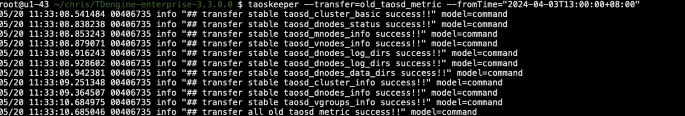

# TDengine 监控功能数据迁移工具 Test Spec

## 1. 测试目标

- 旧版本的监控数据通过迁移工具可转存到新的存储格式对应的系统表
- 旧版本数据可通过迁移工具的删除功能删除成功，新的监控功能运作正常

## 2. 变更历史

| Date | Version | Owner | Memo |
| --- | --- | --- | --- |
| 2024.4.17 | 1.0.0 | @翟坤 | 梳理测试场景 |
|  |  |  |  |

## 3. 测试结论

 测试通过

## 4. 开发质量报告

结论：本特性/优化的开发质量是一般

| 统计指标 | 数量 |
| --- | --- |
| 提测被拒次数 （测试阻塞，无法进行） | 0 |
| 基础测试用例不通过 | 0 |
| Bug 总数 | 2 |
| 严重 Bug 总数 | 0 |

## 5. 已知问题和限制

- 暂无

## 6. 测试资源及环境

   测试平台：Linux x64
   测试资源：192.168.0.215

## 7. 测试范围及重点

 复合主键的改动对db的影响范围较大，经讨论要对现有主要功能全部进行覆盖性测试，具体的测试范围见第九章节的任务分工

## 8. 测试用例

旧插件下载地址：https://github.com/taosdata/grafanaplugin/releases/tag/v3.4.7
grafana地址：
http://192.168.1.98:3001/?orgId=1
http://192.168.0.215:3000/
grafana旧数据验证方案：
- 部署两套grafana，分别安装新旧插件，在数据迁移后，对旧数据对应的时间区间，进行页面数据对比验证

| 测试类型 | 测试场景 | 用例No. | 测试用例名称 | 数据准备 | 测试步骤 | 测试结果 | automated | 备注 |
| --- | --- | --- | --- | --- | --- | --- | --- | --- |
| 数据迁移 | 1 | 升级db后迁移旧数据 | 部署旧版TDengine(3.2.0.0)，启动监控功能，造一些监控数据 | 1. 更新TDengine版本到最新3.0分支对应版本 1. 不停db服务调用迁移工具（taoskeeper）进行数据迁移 1. 重复数据迁移操作（幂等性测试） 1. 观察检测功能是否正常运行 1. 在granfa中比较旧数据是否正确展示 | pass |  |  |
| 数据删除 | 2 | 工具进行旧数据删除操作 | 部署旧版TDengine，启动监控功能，造一些监控数据 | 1. db版本升级完成后，删除旧数据 1. 观察检测功能是否正常运行 1. 在granfa中比较新旧数据是否正确展示 1. 旧表被删除，新表被保留 |  |  |  |

旧log表
```sql
taos> show stables;
                                             stable_name                                              |
=======================================================================================================
 taosadapter_restful_http_request_fail                                                                |
 adapter_requests                                                                                     |
 log_dir                                                                                              |
 keeper_monitor                                                                                       |
 dnodes_info                                                                                          |
 data_dir                                                                                             |
 taosadapter_system_mem_percent                                                                       |
 log_summary                                                                                          |
 m_info                                                                                               |
 vnodes_role                                                                                          |
 cluster_info                                                                                         |
 taosadapter_restful_http_request_total                                                               |
 temp_dir                                                                                             |
 grants_info                                                                                          |
 taosadapter_system_cpu_percent                                                                       |
 vgroups_info                                                                                         |
 d_info                                                                                               |
 taosadapter_restful_http_request_in_flight                                                           |
 taosadapter_restful_http_request_summary_milliseconds                                                |
Query OK, 19 row(s) in set (0.003171s)
```

新log表
```sql
 taosd_cluster_info                             
 taosd_dnodes_status                            
 taosd_vnodes_info                             
 taosd_sql_req                                    
 taosd_dnodes_info                               
 adapter_requests                               
 keeper_monitor                             
 taosd_vgroups_info                              
 taos_sql_req                                 
 taos_slow_sql                                     
 taosd_cluster_basic                                  
 taosd_dnodes_data_dirs                          
 taosd_dnodes_log_dirs                            
 taosd_mnodes_info
```

## 9. 性能测试

测试环境 ： 192.168.1.43
CPU：40C
MEM：256G

3.2.2.0版本log库中100W行数据，通过迁移工具迁移到新库表，耗时约2秒



## 10. 问题(Optional)

这里用于记录需要讨论的问题：
- 旧版插件监控系统升级到最新版本后，disk used面板中数据因为关键字level没有用`符号（``）括起来，查询不到数据，但监控系统升级后理论上旧插件也无法使用，所以该问题不需要修复

## 11. Jira

此feature相关的所有Jira关联到需求Jira [支持创建复合主键表的语法](https://jira.taosdata.com:18080/browse/TS-4476), 标题中应包含统一的标签: monitor


## 12. 参考文档 (Optional)

- JIRA: 
  TD-26529

- 设计文档：[TDengine 监测](https://taosdata.feishu.cn/wiki/B1W1wfUu8iSefQktLI3cRfeHntd) 第10章
