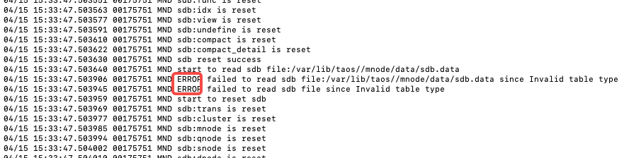

# 可配置存储压缩-Test Spec

## 1. 测试目标

目前 TDengine 存储压缩算法是固定的，无法选择更换压缩算法。为了增加此处的灵活性，能够让用户根据自己时序数据特点，选择最适合的压缩算法，对现有代码进行改进，把存储框架改造成可配置方式。
该文档对此改进功能进行全面测试，需求文档：
[可配置存储压缩-Funtion Spec](https://taosdata.feishu.cn/wiki/St4WwSX5Ei3VfMk3yMUcv2DMnMh)

## 2. 变更历史

| Date | Version | Owner | Memo |
| --- | --- | --- | --- |
| 2024-03-15 | 0.1 | 段宽军 | 初搞 |
|  |  |  |  |

## 3. 测试范围

测试范围如下：
- 可配置压缩功能的正确性
- 存储数据的正确性
- 数据兼容性及环境兼容性测试
- 性能不下降及新增算法性能测试

## 4. 测试结论

测试完成，功能都符合预期。
性能以 V3.2.2.0 版本做为对比版本， 写入性能提升 1%，应为测量误差，可忽略
查询有 10% 下降
样本数据在 ZSTD下 压缩率非常好

## 5. 开发质量报告

结论：本特性/优化的开发质量是（优）

| 统计指标 | 数量 |
| --- | --- |
| 提测被拒次数 | 0 |
| 基础测试用例不通过 | 0 |
| Bug 总数 | 5 |
| 严重 Bug 总数 | 0 |

## 6. 已知问题和限制

无

## 7. 测试环境

- OS: Windows, Linux, macOS，ARM 平台
- 以 Linux 平台为主测平台，其它平台只要基础 CI CASE 通过即为测试通过，不单独手工测试

## 8. 测试数据 (Optional)

测试数据普通字段必须能覆盖所有字段类型，因为本次改进不涉及 TAG ，所以 TAG 数据类型无需全覆盖
- 测试数据量

| 名称 | CI 中数量 | 压力测试数量 |
| --- | --- | --- |
| 数据库 | 1 个 | 2 |
| 超级表 | 1 个 | 10 个 |
| 子表数 | 50 个 | 100000 个 |
| 子表行数 | 10000 行 | 1000000 行 |
| 子表字段 | 17 个 | 170 个 |

- 测试 17 种数据类型（JSON 数据类型只用于 TAG 中，无需测试）

| # | **类型** | **Bytes** | **说明** |
| --- | --- | --- | --- |
| 1 | TIMESTAMP | 8 | 时间戳。缺省精度毫秒，可支持微秒和纳秒，详细说明见上节。 |
| 2 | INT | 4 | 整型，范围 [-2^31, 2^31-1] |
| 3 | INT UNSIGNED | 4 | 无符号整数，[0, 2^32-1] |
| 4 | BIGINT | 8 | 长整型，范围 [-2^63, 2^63-1] |
| 5 | BIGINT UNSIGNED | 8 | 长整型，范围 [0, 2^64-1] |
| 6 | FLOAT | 4 | 浮点型，有效位数 6-7，范围 [-3.4E38, 3.4E38] |
| 7 | DOUBLE | 8 | 双精度浮点型，有效位数 15-16，范围 [-1.7E308, 1.7E308] |
| 8 | BINARY | 自定义 | 记录单字节字符串，建议只用于处理 ASCII 可见字符，中文等多字节字符需使用 NCHAR |
| 9 | SMALLINT | 2 | 短整型， 范围 [-32768, 32767] |
| 10 | SMALLINT UNSIGNED | 2 | 无符号短整型，范围 [0, 65535] |
| 11 | TINYINT | 1 | 单字节整型，范围 [-128, 127] |
| 12 | TINYINT UNSIGNED | 1 | 无符号单字节整型，范围 [0, 255] |
| 13 | BOOL | 1 | 布尔型， |
| 14 | NCHAR | 自定义 | 记录包含多字节字符在内的字符串，如中文字符。每个 NCHAR 字符占用 4 字节的存储空间。字符串两端使用单引号引用，字符串内的单引号需用转义字符 `\'`。NCHAR 使用时须指定字符串大小，类型为 NCHAR(10) 的列表示此列的字符串最多存储 10 个 NCHAR 字符。如果用户字符串长度超出声明长度，将会报错。 |
| 15 | VARCHAR | 自定义 | BINARY 类型的别名 |
| 16 | GEOMETRY | 自定义 | 几何类型 |
| 17 | VARBINARY | 自定义 | 可变长的二进制数据 |

## 9. 测试用例

### 9.1 SQL 功能

| 序号 | 分类 | 测试项 | 预期结果 | 测试结果 | 备注 |
| --- | --- | --- | --- | --- | --- |
| 1 | 17 种数据类型，ENOCDE 参数传允许的编码类型 | Success | pass |  |
| 2 | 17 种数据类型，ENOCDE 参数传任意字符串 | Failed | pass |  |
| 3 | 17 种数据类型，COMPRESS 参数传允许的加密算法 | Success | pass |  |
| 4 | 17 种数据类型，COMPRESS 参数传任意字符串 | Failed | pass |  |
| 5 | 17 种数据类型，Level 参数传允许的三个参数 [high, middle ,low] | Success | pass |  |
| 6 | 17 种数据类型，Level 参数传任意字符串 | Failed | pass |  |
| 7 | 默认值行为测试 17 种数据类型，只指定 ENCODE, 不指定 COMPRESS 及 LEVEL, 预期是 COMPRESS 和 LEVEL 都使用默认值 | Success | pass | 通过 describe 确认默认值 |
| 8 | 默认值行为测试 17 种数据类型，只指定COMPRESS, 不指定 ENCODE 及 LEVEL, 预期是 ENCODE 和 LEVEL 都使用默认值 | Success | pass | 通过 describe 确认默认值 |
| 9 | 默认值行为测试 17 种数据类型，只指定 LEVEL, 不指定 ENCODE 及 COMPRESS, 预期是ENCODE 和 COMPRESS 都使用默认值 | Success | pass | 通过 describe 确认默认值 |
| 10 | 默认值行为测试 三个参数都不指定，预期是都使用默认值 | Success | pass | 通过 describe 确认默认值 ENCODE 默认值是每个数据类似唯一的编码算法 COMPRESS 默认值是原来的LZ4 压缩算法 LEVEL 默认值是 high |
| 11 | 上步中建表成功后，使用查看列压缩方式确认所指定的列压缩的正确性 | Success | pass |  |
| 12 | 查看 tag 列压缩方式 | Disabled | pass |  |
| 13 | 更改 Encode 参数为合法值 | Success | pass | ENCODE参数 此版本中每种数据类型只对应一种编码，所以在默认编码方式与 disabled 两者之间切换 |
| 14 | 更改 Encode 参数为非法值 | Failed | pass |  |
| 15 | 更改 Compress 参数为合法值 | Success | pass |  |
| 16 | 以上步骤 alter 成功的项，使用 describe 验证修改结果的正确性 | Success | pass |  |
| 17 | 更改 Compress 参数为非法值 | Failed | pass |  |
| 18 | 数据名参数输入不存的库名 | Failed | pass |  |
| 19 | 表名参数输入不存在的表名 | Failed | pass |  |

说明：
ENCODE 允许的编码类型值及默认值
COMPRESS 允许的加密类型
参考 [可配置存储压缩-Function Spec](https://taosdata.feishu.cn/wiki/St4WwSX5Ei3VfMk3yMUcv2DMnMh)中 3.3 节的 “3 各个数据类型的默认压缩算法列表和适用范围” 对应的表格数据

### 9.2 正确性

正确性验证是本次改进验证中非常重要的一项，压缩及解压一旦出现问题，都是非常严重的问题
- 正确性验证场景
超级表 17 种数据类型都建立相应字段
ENCODE 设置两个值  {具体值，关闭}
COMPRESSION 六个值 {z4、zlib、zstd、tsz、xz、disabled}
组合出的验证场景为 12 种，如下：

| 序号 | 分类 | 测试项 | 测试方向 | 测试结果 |
| --- | --- | --- | --- | --- |
| 1 | COMPRESS - LZ4 | Success | pass |
| 2 | COMPRESS - ZLIB | Success | pass |
| 3 | COMPRESS - ZSTD | Success | pass |
| 4 | COMPRESS - TSZ | Success | pass |
| 5 | COMPRESS - SZ | Success | pass |
| 6 | COMPRESS - DISABLED | Success | pass |
| 7 | LEVEL - HIGH | Success | pass |
| 8 | LEVEL - MEDIUM | Success | pass |
| 9 | LEVEL - LOW | Success | pass |

- 写入数据场景
写入顺序和加密解密没太大关系，因为加密解决是以块为单位进行压缩解压的，在写入顺序的下方，为了防止这块儿有未考虑到的地方，还是做下以下几种情况都存在的验证
Compact 操作 （重点）
Flush databse. 

| 序号 | 写入顺序 |
| --- | --- |
| 1 | 顺序 |
| 2 | 乱序 |
| 3 | 更新 |
| 4 | 删除 |
|  |  |

- 正确性验证方法
在写入数据时，各列数据会以 TS 时间列的依据截取最后几位数字填充各字段值，这样便可以程序自动验证数据的正确性，数据库参数如下：
TS 列值转化为其它字段值规则如下：

| # | **类型** | **Bytes** | **根据 TS 列转化规则** | 正确性验证结果 |
| --- | --- | --- | --- | --- |
| 1 | TIMESTAMP | 8 | 完全复制 | pass |
| 2 | INT | 4 | pass |
| 3 | INT UNSIGNED | 4 | pass |
| 4 | BIGINT | 8 | pass |
| 5 | BIGINT UNSIGNED | 8 | pass |
| 6 | FLOAT | 4 | pass |
| 7 | DOUBLE | 8 | pass |
| 8 | BINARY | 32 | 完全复制 | pass |
| 9 | SMALLINT | 2 | TS % 10000 | pass |
| 10 | SMALLINT UNSIGNED | 2 | TS % 10000 | pass |
| 11 | TINYINT | 1 | TS % 100 | pass |
| 12 | TINYINT UNSIGNED | 1 | TS % 100 | pass |
| 13 | BOOL | 1 | TS % 2 | pass |
| 14 | NCHAR | 自定义 | 完全复制 | pass |
| 15 | VARCHAR | 自定义 | 完全复制 | pass |
| 16 | GEOMETRY | 自定义 | POINT(TS % 100, TS % 1000) | pass |
| 17 | VARBINARY | 自定义 | 完全复制 | pass |

写入数据规模按照上面章节中指定的 CI 规模及大压力测试规模两种级别来验证

### 9.3 兼容性

本次改进需要满足向下兼容性，即新的程序必须兼容原来版本的数据格式。因为 3.0 自发布到目前还没有做过在压缩存储方面的结构性改动，所以只需要找两代表性的版本验证兼容性即可
- 验证版本：
1. 3.1 分支最新版本     3.1.1.3
2. Main 分支最新版本  3.2.2.0 
- 验证方式
借用上节正确性验证方法，把写入环节替换为从老版本写 入，写入完成后升级至新版本，然后再验证正确性。
-  升级后场景验证

| 序号 | 场景 | 预期 | 验证结果 |
| --- | --- | --- | --- |
| 1 | 存在超级表/普通表， 有子表，无数据 | 写入查询数据正常 | pass |
| 2 | 存在超级表，无子表，无数据 | 写入查询数据正常 | pass |
| 3 | 存在超级表，有子表，但没有数据 | 写入查询数据正常 | pass |
| 4 | 存在超级表/普通表，且已经写入数据 | 原来数据都有，再写入查询数据正常 | pass |
| 5 | 新创建超级表/普通表 | 写入查询数据正常 | pass |
| 6 | 原来有 TSZ 压缩数据 | 原来数据都有，再写入查询数据正常 | pass |

- 全环境兼容性
因为存储压缩在底层，流及订阅功能在上层，所以预期是没有任何的影响，但测试更注重测试的全面性，所以还是有必要验证一下流及订阅的兼容性，在原来的版本创建流及订阅，升级至当前可配置存储加密的版本，看之前的流及订阅是否还都在，功能是否还正常。

| 项目 | 升级前 | 升级后 | 验证结果 |
| --- | --- | --- | --- |
| 流的数量 | 2 | 2 | pass |
| 订阅 | 1 | 1 | pass |
| 流的结果表 | 2 | 2 | pass |
| 流写入功能 | 正常 | 正常 | pass |
| 订阅消费功能 | 正常 | 正常 | pass |

- 升级后回退的兼容性：
旧版本升级至当前可配置存储压缩的版本后
这次压缩不但修改了时序数据存储格式，而且还修改了 meta 存储结构，所以只要这两者任何一个发生变化，都无法回退

| 序号 | 升级后操作项 | 预期是否可回退 | 验证结果 | 备注 |
| --- | --- | --- | --- | --- |
| 1 | 无任何操作 | 可回退 | 不可回退 |  报以上错误，已经对 MNODE 做了格式转化 |
| 2 | 仅有查询 | 可回退 | 不可回退 | 上第 1 项一样，升级上来 MNODE 就发生了变化，不可回退 |
| 3 | 仅有写入 | 不可回退 | 不可回退 |  |
| 4 | 新建超级表，没有子表 | 不可回退 | 不可回退 |  |
| 5 | 新建超级表，建有子表，没写数据 | 不可回退 | 不可回退 |  |
| 6 | 新建普通表，没写数据 | 不可回退 | 不可回退 |  |
| 7 | 新建超级表，新建子表，有数据写入 | 不可回退 | 不可回退 |  |
| 8 | 新建普通表，有写入数据 | 不可回退 | 不可回退 |  |
| 9 | 有流新建，没有写入数据 | 可回退 | 不可回退 |  |
| 10 | 有订阅新建，没有写入数据 | 可回退 | 不可回退 |  |

实际测试结果，只要升级到 3.3.0.0， 启动了 3.3.0.0 服务再退出，MNODE 中的数据已经变化，就不可再回退了。

### 9.4 性能

- 性能测试方法
1. 创建数据库，目标数据库配置不保留WAL
2. 创建超级表，配置指定要测试的压缩算法
3. taosBenchmark 从 CSV导入方式导入测试数据集，记录写入时间
4. 记录 DATA 文件大小
5. Flush database 数据全部落盘
6. taosBenchmark 配置 select * from stb 无差别拉取所有数据，记录查询时间
7. 更换压缩算法，记录不同的压缩算法下的写入及查询时间
在 ENCODE 为默认值的情况下，测试 COMPRESS 的各指标

| 序号 | 压缩算法 | 写入速度 （5次平均） | 查询速度 （5次平均） | 压缩后大小 （5次平均） | 压缩率 5次平均） | 提升幅度 |
| --- | --- | --- | --- | --- | --- | --- |
|  | V3.2.2.0 LZ4 | 820 秒 | 182 秒 | 11.8 G | 33.4% |  |
| 1 | LZ4(默认) | 809 秒 | 207 秒 | 11.4 G | 33.4% |  |
| 2 | XZ | 1023 秒 | 200 秒 | 1.7 G | 4.03% |  |
| 3 | ZSTD | 392 秒 | 202 秒 | 1.5 G | 4.69% | 感觉这个是最佳算法 |
| 4 | ZLIB | 1070 秒 | 200 秒 | 8.2 G | 25% |  |

## 10. 问题(Optional)

无

## 11. Jira

<!-- Unsupported block type: 999 -->

## 12. 测试计划 (Optional)

测试开始时间： 2024-04-15  结束时间： 2024-04-26

## 13. 测试备忘 (Optional)

无

## 14. 参考文档 (Optional)

无
