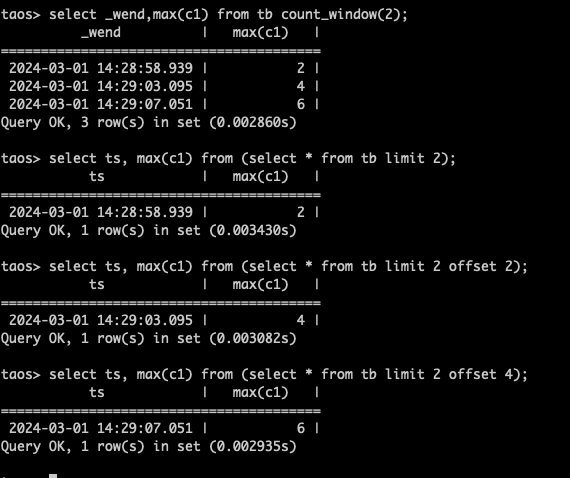
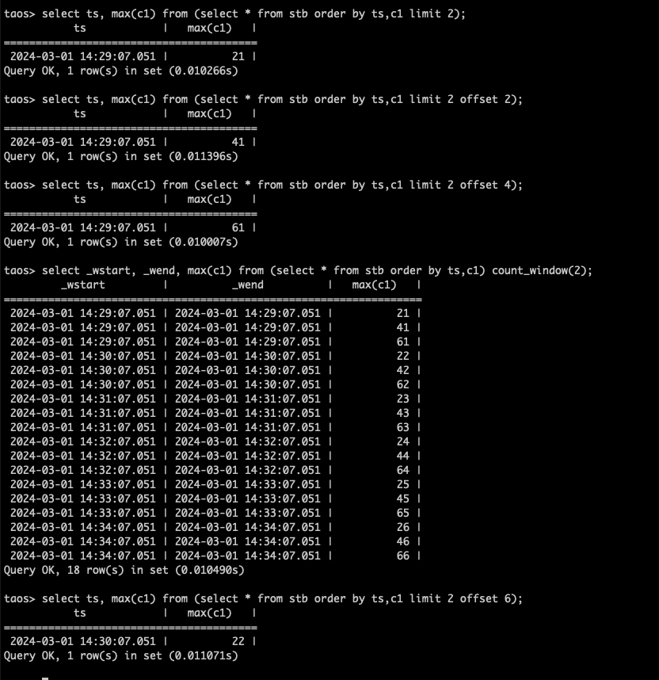
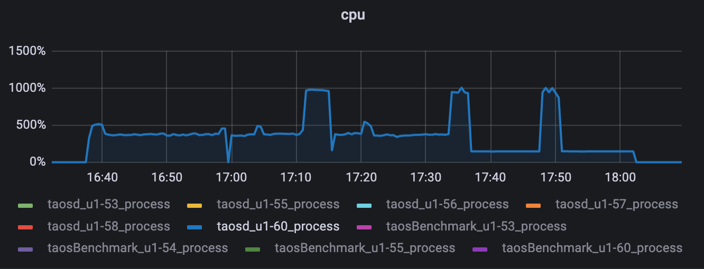
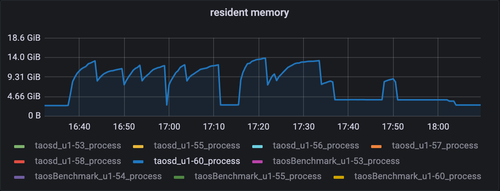
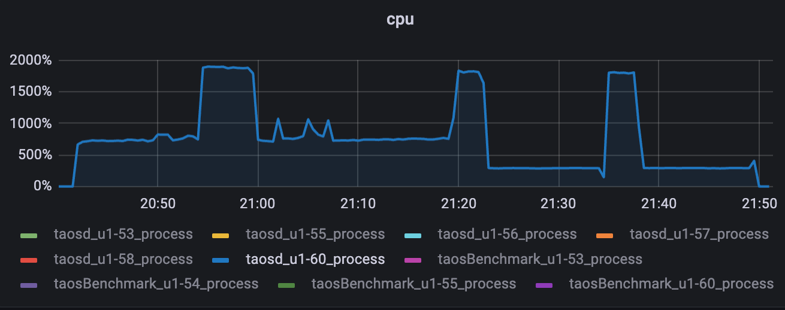
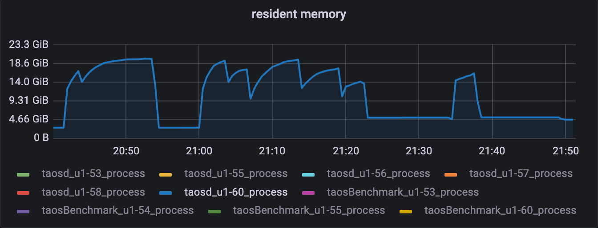

# 批查询 count_window Test Spec

## 1. 测试目标

参考 [批查询 count window](https://taosdata.feishu.cn/wiki/T6mLwjOJBiHFKIk86EOck833nSg) 文档，对其所支持的测试点及约束设计测试用例。

## 2. 变更历史

| Date | Version | Owner | Memo |
| --- | --- | --- | --- |
| 2024-03-01 | 0.1 | @贾靖斌 | New |
| 2024-03-07 | 0.2 | @贾靖斌 | In-comments 和 Meeting Review 增加如下修改： 1. 廖博建议用向阳查询现有的数据集，不合适的再构造； 1. 覆盖函数 first/last 对结果的判断有不稳定因素，编写脚本时看情况调整； 1. Having 增加不同的 partition 用例； 1. 增加 order by 伪列/聚合函数用例； 1. 多加一些嵌套查询的用例； 1. 增加 count_window 和其他 window 及分组搭配使用的异常用例； |
| 2024-03-23 | 0.3 | @贾靖斌 | 1. 稳定性数据量级由 100 亿修改为 10 亿； 1. 为节省自动化用例运行时间，A、B、C 数据集修改为 5 子表 * 10 rows |

## 3. 测试范围

本次测试会将 [批查询 count window](https://taosdata.feishu.cn/wiki/T6mLwjOJBiHFKIk86EOck833nSg) 文档其所涵盖的测试点
- 功能
  - 窗口大小测试（比如一个窗口 2 条数据/5 条数据等）
  - 窗口触发测试（比如第 3 条数据写入后触发第 2 个窗口）
  - 窗口聚合计算（比如求和、最大值、平均值等）
  - 窗口边界（当数据量正好等于窗口大小时，能否正确触发，<数据量%窗口值> != 0 时，最后一个窗口的表现，窗口值设置为小于/大于边界时是否报错）
  - 滑动窗口（测试 sliding）
  - 更新（窗口数据被更新后校验结果正确性）
  - 乱序（窗口数据被乱序写入后校验结果正确性）
  - count_window删除（窗口数据被删除后校验结果正确性）
  - 支持不同的分区（partition by tbname/column/tag/expression）
  - 过滤（where）
  - 伪列（_WSTART/_WEND/_WDURATION/_QSTART/_QEND）
  - Having
  - Union
  - 嵌套（子查询可以返回有序数据、无序数据、分组数据）
  - Order by（order by 聚合函数、伪列等）
- 性能
  - 同等规模数据量和同等 window 数量，对比 count_window 和 interval 的性能，无partition by tbname 时，interval有预聚合，预期会比count_window快，带partition by tbname预期一样。
- 稳定性
  - 十亿级别数据量高并发 count_window 查询

## 4. 测试结论

1. 功能、性能、稳定性测试均已通过，该 Feature 开发质量较高，0 bug；
2. 性能方面和 interval 对比，同等数据量和窗口数量，查询时间优于 interval，因逻辑上比 interval 简单，符合预期；对于超级表，多张子表时间线聚合，查询时间上 count_window 快了 142%，对于测试对象为子表或普通表这种仅一张表的场景，查询时间上 count_window 快了 94%，详细数据和资源占用情况可以参考 8.3 章节；
3. 稳定性仅在 10 亿规模数据量下测试单线程和双线程并发情况，如不使用 /*+ para_tables_sort() */，会写大量外存可能导致磁盘空间不足（单线程查询近 200G 空间不够），虽然查询中断后磁盘能释放掉，但也无法得到查询结果（该现象目前是产品行为，非 count_window 独有）；本报告基于使用 /*+ para_tables_sort() */ 的模式来测试稳定性，这种场景下会使用较多的内存，如服务器内存资源不足也可能产生 OOM；

## 5. 已知问题和限制

目前仅参考 [批查询 count window](https://taosdata.feishu.cn/wiki/T6mLwjOJBiHFKIk86EOck833nSg) 文档中的约束场景

## 6. 测试环境

- OS：Ubuntu 20.04.2 LTS
- Env：

| **硬件环境** | **IP** | 用途 | **CPU** | **内存** | **硬盘** |
| --- | --- | --- | --- | --- | --- |
| 192.168.1.53 | taosBenchmark |
| 192.168.1.55 | taosd |
| 192.168.1.56 | taosd |
| 192.168.1.57 | taosd |

## 7. 测试数据

**schema：**

|  |
|  |
| tinyint | smallint | int | bigint | utinyint | usmallint | uint | ubigint |
| float | double | varchar(256) | nchar(256) | varbinary(256) | geometry(256) | bool |  |

**数据集：**

| **Name** | **TableCount** | **RowCount** | **Type** | **Describe** |
| --- | --- | --- | --- | --- |
| **A** | 5 | 10 | 固定数据，行 value 无重复，每张表 ts 无重复 | 功能 |
| **B** | 5 | 10 | 固定数据，行 value 有重复，每张表 ts 无重复 | 功能 |
| **C** | 5 | 10 | 固定数据，每张表 ts 重复 | 功能 |
| **D** | 10000 | 1000000 | 随机 | 稳定性 |
| **E** | 1 | 100000000 | 随机 | 性能 |
| **F** | 10000 | 10000 | 随机 | 性能 |

**覆盖函数:**

| min | max | sum | first | last | avg | apercentile | count |
| --- | --- | --- | --- | --- | --- | --- | --- |
| spread | stddev | hyperloglog | timediff | timezone | to_iso8601 | to_unixtimestamp |  |

## 8. 测试用例

### 8.1 功能

**测试脚本：**
taostest --setup=common_insert.yaml --case=****.py --keep
| No. | 是否是基础场景 | 测试场景组合（1级） | 测试场景组合（n级） | 测试步骤 | 期望结果 | 实际结果 |
| --- | --- | --- | --- | --- | --- | --- |
| 1 | 是 | 无重复时间戳 | + no partition | 1.写入固定数据集 A；
2.select ... from [stb/ctb/tb] count_window([2/6]);
3.校验查询结果； | 结果校验正确 | PASS |
| 2 | 是 |  | + partition by tbname | 1.写入固定数据集 A；
2.select ... from [stb/ctb/tb] partition by tbname count_window([2/6]);
3.校验查询结果； | 结果校验正确 | PASS |
| 3 |  |  | + partition by column（column无重复） | 1.写入固定数据集 A；
2.select ... from [stb/ctb/tb] partition by column count_window([2/6]);
3.校验查询结果； | 结果校验正确 | PASS |
| 4 |  |  | + partition by column（column有重复） | 1.写入固定数据集 B；
2.select ... from [stb/ctb/tb] partition by column count_window([2/6]);
3.校验查询结果； | 结果校验正确 | PASS |
| 5 |  |  | + partition by tag | 1.写入固定数据集 A；
2.select ... from [stb/ctb/tb] partition by tag count_window([2/6]);
3.校验查询结果； |  | PASS |
| 6 |  |  | + partition by expression | 1.写入固定数据集 A；
2.select ... from [stb/ctb/tb] partition by expression count_window([2/6]);
3.校验查询结果； | 结果校验正确 | PASS |
| 7 |  |  | + delete | 1.写入固定数据集 A；
2.select ... from [stb/ctb/tb] partition by expression count_window([2/6]);
3.删除某个窗口的数据；
3.校验查询结果； | 结果校验正确 | PASS |
| 8 |  |  | + update | 1.写入固定数据集 A；
2.select ... from [stb/ctb/tb] partition by expression count_window([2/6]);
3.更新某个窗口的数据；
3.校验查询结果； | 结果校验正确 | PASS |
| 9 |  |  | + disorder | 1.写入固定数据集 A；
2.select ... from [stb/ctb/tb] partition by expression count_window([2/6]);
3.数据乱序写入到某个窗口；
3.校验查询结果； | 结果校验正确 | PASS |
| 10 | 是 |  | + 最终窗口数量和count_window相同 | 以上 case 均已覆盖 | 结果校验正确 | PASS |
| 11 | 是 |  | + 最终窗口数量和count_window不同 | 以上 case 均已覆盖 | 结果校验正确 | PASS |
| 12 | 是 |  | + 过滤 | 1.写入固定数据集 A；
2.select ... from [stb/ctb/tb] where ... count_window([2/6]);
3.校验查询结果； | 结果校验正确 | PASS |
| 13 |  |  | + having | 1.写入固定数据集 A；
2.select ... from [stb/ctb/tb] partition by tbname count_window([2/6]) having condition;
3.select ... from [stb/ctb/tb] partition by column count_window([2/6]) having condition;
4.select ... from [stb/ctb/tb] partition by tag count_window([2/6]) having condition;
5.select ... from [stb/ctb/tb] partition by tag+column count_window([2/6]) having condition;
6.校验查询结果； | 结果校验正确 | PASS |
| 14 |  |  | + union | 1.写入固定数据集 A；
2.select ... from [stb/ctb/tb] count_window(2) union (select ... from [stb/ctb/tb] count_window(3)) order by ts;
3.校验查询结果； | 结果校验正确 | PASS |
| 15 |  |  | + 伪列 | 1.写入固定数据集 A；
2.select _wstart, _wend, _wduration, _qstart, _qend....... from [stb/ctb/tb] count_window([2/6]);
3.校验查询结果； | 结果校验正确 | PASS |
| 16 | 是 |  | + sliding | 1.写入固定数据集 A；
2.select ... from [stb/ctb/tb] count_window([2/6], sliding_val);
3.更新/删除/乱序
4.校验查询结果； | 结果校验正确 | PASS |
| 17 |  |  | + order by | 1.写入固定数据集 A；
2.select _wstart, _wend, _wduration, _qstart, _qend....... from [stb/ctb/tb] count_window([2/6]) order by min(c1);
3.select _wstart, _wend, _wduration, _qstart, _qend....... from [stb/ctb/tb] count_window([2/6]) order by _wstart;
4.校验查询结果； |  | PASS |
| 18 | 是 | 有重复时间戳 | + no partition | 1.写入固定数据集 C；
2.select ... from (select * from [stb] order by ts,tbname) count_window([2/6]);
3.校验查询结果； | 结果校验正确 | PASS |
| 19 | 是 |  | + partition by tbname | 1.写入固定数据集 C；
2.select ... from (select * from [stb] order by ts,tbname) partition by tbname count_window([2/6]);
3.校验查询结果； | 结果校验正确 | PASS |
| 20 |  |  | + partition by column（column无重复） | 1.写入固定数据集 C；
2.select ... from (select * from [stb] order by ts,tbname) partition by column count_window([2/6]);
3.校验查询结果； | 结果校验正确 | PASS |
| 21 |  |  | + partition by tag | 1.写入固定数据集 C；
2.select ... from (select * from [stb] order by ts,tbname) partition by tag count_window([2/6]);
3.校验查询结果； | 结果校验正确 | PASS |
| 22 |  |  | + partition by expression | 1.写入固定数据集 C；
2.select ... from (select * from [stb] order by ts,tbname) partition by expression count_window([2/6]);
3.校验查询结果； | 结果校验正确 | PASS |
| 23 |  |  | + delete | 1.写入固定数据集 C；
2.select ... from (select * from [stb] order by ts,tbname) partition by expression count_window([2/6]);
3.删除某个窗口的数据；
3.校验查询结果； | 结果校验正确 | PASS |
| 24 |  |  | + update | 1.写入固定数据集 C；
2.select ... from (select * from [stb] order by ts,tbname) partition by expression count_window([2/6]);
3.更新某个窗口的数据；
3.校验查询结果； | 结果校验正确 | PASS |
| 25 |  |  | + disorder | 1.写入固定数据集 C；
2.select ... from (select * from [stb] order by ts,tbname) partition by expression count_window([2/6]);
3.数据乱序写入到某个窗口；
3.校验查询结果； | 结果校验正确 | PASS |
| 26 |  |  | + 最终窗口数量和count_window相同 | 以上 case 均已覆盖 | 结果校验正确 | PASS |
| 27 |  |  | + 最终窗口数量和count_window不同 | 以上 case 均已覆盖 | 结果校验正确 | PASS |
| 28 |  |  | + 过滤 | 1.写入固定数据集 C；
2.select ... from (select * from [stb] order by ts,tbname) where ... count_window([2/6]);
3.校验查询结果； | 结果校验正确 | PASS |
| 29 |  |  | + having | 1.写入固定数据集 C；
2.select ... from (select * from [stb] order by ts,tbname) partition by column count_window([2/6]) having condition;
3.校验查询结果； | 结果校验正确 | PASS |
| 30 |  |  | + union | 1.写入固定数据集 C；
2.select ... from (select * from [stb] order by ts,tbname) count_window(2) \
union \
(select ... from (select * from [stb] order by ts,tbname) count_window(3)) order by ts;
3.校验查询结果； | 结果校验正确 | PASS |
| 31 |  |  | + 伪列 | 1.写入固定数据集 C；
2.select ... from (select * from [stb] order by ts,tbname) count_window([2/6]);
3.校验查询结果； | 结果校验正确 | PASS |
| 32 |  |  | + sliding | 1.写入固定数据集 C；
2.select ... from (select * from [stb] order by ts,tbname) count_window([2/6], sliding_val);
3.更新/删除/乱序
4.校验查询结果； | 结果校验正确 | PASS |
| 33 |  |  | + 嵌套 | 子查询返回有序数据 | 结果校验正确 | PASS |
| 34 |  |  |  | 子查询返回无序数据 | 结果不稳定 | PASS |
| 35 |  |  |  | 子查询返回分组数据 | 结果校验正确 | PASS |
| 36 |  | abnormal | count_val < 2 | 报错 | 结果校验正确 | PASS |
| 37 |  |  | count_val > INT32_MAX | 报错 | 结果校验正确 | PASS |
| 38 |  |  | sliding_val < 1 | 报错 | 结果校验正确 | PASS |
| 39 |  |  | sliding_val > count_val | 报错 | 结果校验正确 | PASS |
| 40 |  |  | 子查询不包含时间戳列时 | 报错 | 结果校验正确 | PASS |
| 41 |  |  | count window 和其他窗口混用 | 1.写入固定数据集 A；
2.select ... from count_window([2/6]) interval(2s);
3.select ... from count_window([2/6]) session(*);
4.select ... from count_window([2/6]) state_window(*); | 结果校验正确 | PASS |
| 42 |  |  | count window 跟 group by 混用 | 1.写入固定数据集 A；
2.select ... from count_window([2/6]) group by ..; | 结果校验正确 | PASS |

**正确性校验：**
通过 native 查询 limit + offset 得出每个 count_window 的结果，然后将结果合并排序后和 count_window 的查询结果对比

### 8.2 稳定性

<callout emoji="bulb" background-color="light-orange" border-color="light-orange">
10 亿数据查询时使用 /*+ para_tables_sort() */，否则会遇见 [TD-29216](https://jira.taosdata.com:18080/browse/TD-29216) 中的磁盘因持续写外存排序被写爆的情况，同时测试了 state_window 和 session_window 以及 select * from stb order by ts 的情况，也会如此，目前仅 interval 不会有类似情况。
</callout>

**测试脚本：**

> ⚠ 嵌入文件，需在飞书中查看 (token: SStQbkRbWotRNfxZL1ScF6fhnpd)

> ⚠ 嵌入文件，需在飞书中查看 (token: Ijjgb9S8HoKrxkxgZLKcmYzWnTd)

**测试策略：**
写入数据集 D，选取一部分功能测试中的 sql（查询语句参考 query.json），进行压测，为了观察单 SQL 的资源使用情况，压测应包含每条 SQL 的单线程执行，同时包含多线程的高并发压测，确保无卡死/crash/OOM 等现象。

| **查询线程** | **CPU** | **内存** |
| --- | --- | --- |
| **1** |  |  |
| **2** |  |  |

### 8.3 性能

<callout emoji="bulb" background-color="light-orange" border-color="light-orange">
性能仅使用 1 亿数据规模，10 亿数据量时写外存会占用大量磁盘空间，需使用 /*+ para_tables_sort() */
</callout>

**测试脚本：**

| **数据集** | **说明** | **窗口数量** | **脚本** |
| --- | --- | --- | --- |
| **E** | 单子表查询，不涉及外存排序 | 10000 | > ⚠ 嵌入文件，需在飞书中查看 (token: Sq90bHJXJoNZQoxF0k5cIlYSn8e) |
| **F** | 超级表聚合查询，需配置 | 10000 | > ⚠ 嵌入文件，需在飞书中查看 (token: CfKWbhUf1oticHxkD5acUY3Jnhh) |

**测试策略：**
- 超级表+子表，同等规模数据量和同等 window 数量，对比 count_window 和 interval 的性能
**语句：**
**超级表：**
select _wstart, _wend,min(c1) m,max(c2),sum(c3),first(c4),last(c5),avg(c7),count(c8),spread(c1),stddev(c2),a
percentile(c6, 50) from test.stb interval(1s);
select _wstart, _wend,min(c1) m,max(c2),sum(c3),first(c4),last(c5),avg(c7),count(c8),spread(c1),stddev(c2),a
percentile(c6, 50) from test.stb count_window(10000);
**子表：**
select _wstart, _wend,min(c1) m,max(c2),sum(c3),first(c4),last(c5),avg(c7),count(c8),spread(c1),stddev(c2),apercentile(c6, 50) from test.ctb0_0 interval(10000s);
select _wstart, _wend,min(c1) m,max(c2),sum(c3),first(c4),last(c5),avg(c7),count(c8),spread(c1),stddev(c2),apercentile(c6, 50) from test.ctb0_0 count_window(10000);

|  | **vgroups** | **window** | **查询时间** | **CPU(%)(avg)** | **MEM(M)** |
| --- | --- | --- | --- | --- | --- |
| Interval | 211s | 1000% | 92 |
| count_window | 87s | 339% | 317 |
| Interval | 206s | 100 | 12 |
| count_window | 106s | 100 | 3 |

## 9. Jira

| **Jira** | **描述** | **状态** | **备注** |
| --- | --- | --- | --- |
| [TD-29216](https://jira.taosdata.com:18080/browse/TD-29216) | [count_window 大数据量查询，发现不断写外存导致磁盘占满](https://jira.taosdata.com:18080/browse/TD-29216) | Done | state_window、session 和 select * from stb order by ts 均有该情况，非 count_window 独有，不作为问题进行修复，调整参数继续测试 |

## 10. 参考文档 

-  [批查询 count window](https://taosdata.feishu.cn/wiki/T6mLwjOJBiHFKIk86EOck833nSg)
