# 数据压缩测试

## 测试目标

- WebSocket 写入和查询数据压缩率和耗时对比
- Restful 查询数据压缩率和耗时对比

## 变更历史

| Date | Version | Owner | Memo |
| --- | --- | --- | --- |
| 2024.02.23 | 0.1 | @谭雪峰 |  |
|  |  |  |  |

## 测试范围

- 验证开启压缩后插入、查询、schemaless 和 tmq 的基本功能正常
- 对比开启和不开启压缩的请求延时，网络资源消耗等数据，可以作为后续客户配置参考。

## 测试结论

1. 压缩率与 CPU 资源（压缩率**越低越好**，耗时比**越低越好**）

|  |
| --- |
| 协程 | 1 | 8 | 1 | 8 | 1 | 8 |
| 压缩率(压缩流量/不压缩流量) | 39.53% | 39.57% | 14.98% | 15.1% | 5.2% | 5.2% |
| 耗时比(压缩耗时/不压缩耗时) | 138.58% | 235.36% | 116.44% | 104.74% | 144.73% | 110.71% |

1. 内存
是否启用压缩对内存几乎无影响，开启压缩后耗时大约会增大 4% - 135%，带宽会降低 60% - 95%
1. 耗时
从下表看，启用压缩会增加耗时

|  |
|  |
| 测试项 | 耗时(ms) | 测试项 | 耗时(ms) |
| WS 查询 1 协程不压缩 | 3500 | Restful 查询 1 协程不压缩 | 3469.75 |
| WS 查询 1 协程压缩 | 4075.5 | Restful 查询 1 协程压缩 | 5022 |
| WS 查询 8 协程不压缩 | 17891.5 | Restful 查询 8 协程不压缩 | 20011 |
| WS 查询 8 协程压缩 | 18739 | Restful 查询 8 协程压缩 | 22154.75 |
| WS 写入 1 协程不压缩 | 7926.25 |  |  |
| WS 写入 1 协程压缩 | 10984.25 |  |  |
| WS 写入 8 协程不压缩 | 14244.5 |  |  |
| WS 写入 8 协程缩 | 33526.25 |  |  |

## 已知问题和限制

- Restful 只有在服务端返回数据时压缩，插入请求返回数据很小不具有测试压缩意义

## 测试环境

- OS: Linux
- 抓包工具：tcpdump
- 数据包分析工具：wireshark
- 内存分析工具：process-exporter prometheus grafana

## 测试数据

- 写入测试数据所用schema
  ```sql
  CREATE database power
  USE power
  CREATE STABLE power.meters (ts TIMESTAMP, current FLOAT, voltage INT, phase FLOAT) TAGS (groupId INT, location BINARY(24))
  CREATE table power.d1001 USING power.meters TAGS(2,'California.SanFrancisco') 
  ```

  随机生成一条向 powe.d1001 插入数据长度接近 1M 的 sql 语句作为每次插入测试的 sql
- 查询使用 taosBenchmark 默认参数准备的数据 `taosBenchmark -y`
  ```go
               field              |          type          |   length    |        note        |
  =============================================================================================
   ts                             | TIMESTAMP              |           8 |                    |
   current                        | FLOAT                  |           4 |                    |
   voltage                        | INT                    |           4 |                    |
   phase                          | FLOAT                  |           4 |                    |
   groupid                        | INT                    |           4 | TAG                |
   location                       | VARCHAR                |          24 | TAG                |
  ```

## 测试用例

### 功能

| **测试场景** | **验证结果** |
| --- | --- |
| Restful 插入 | 通过 |
| Restful 查询 | 通过 |
| WebSocket 查询 | 通过 |
| WebSocket 插入 | 通过 |
| WebSocket stmt | 通过 |
| Websocket tmq | 通过 |
| WebSocket schemaless | 通过 |

### 性能

#### 验证方法

- 写入性能测试用接近 1M 的 SQL 循环写入 200 次
- 查询性能测试使用 taosBenchmark 默认参数写入后进行 WebSocket 和 Restful 查询，查询使用sql统一为：
  `Select * from test.meters limit 3000000`

##### WebSocket 插入测试

每次插入 SQL 长度接近 1M,循环 200 次
下图从左到右分别为 1 协程不压缩，1 协程压缩，8 协程不压缩，8 协程压缩内存趋势图
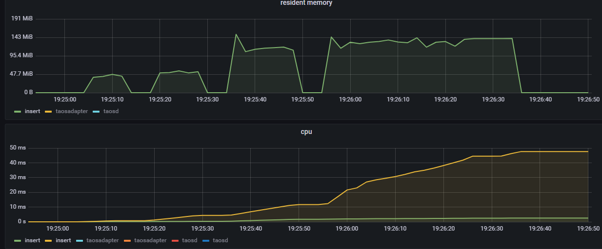

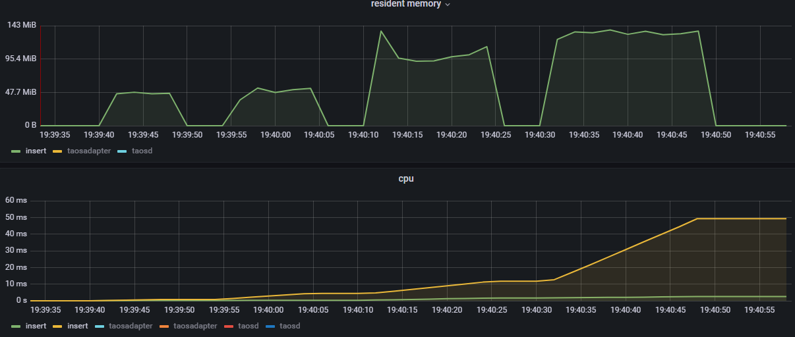

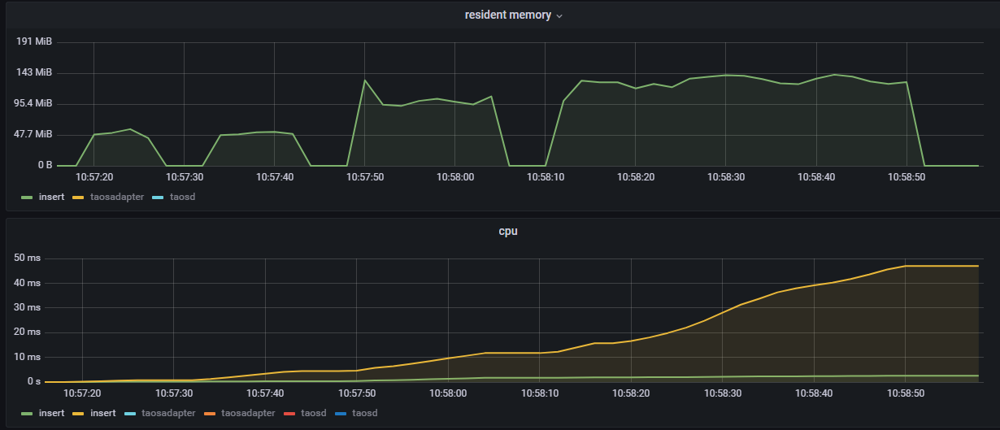

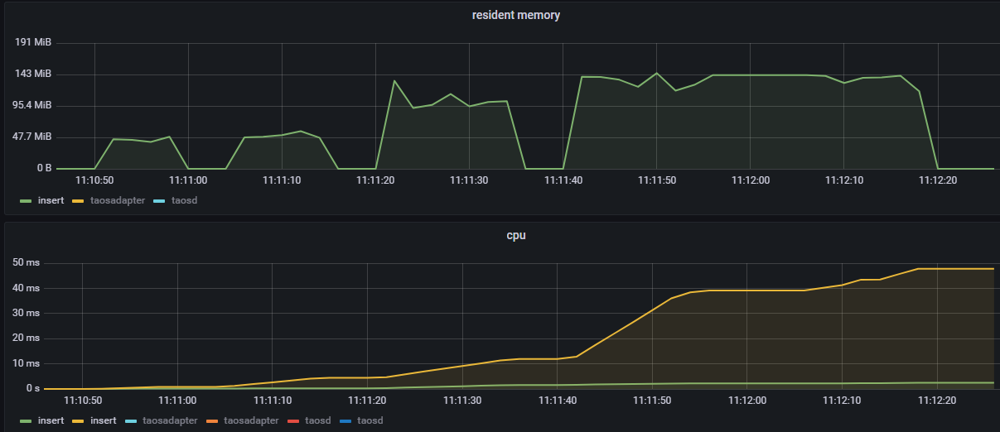

###### 1 协程不压缩

| c->s 流量 | s->c 流量 | max(ms) | p99(ms) | p95(ms) | 最高内存M |
| --- | --- | --- | --- | --- | --- |
| 210M | 147K | 7873 | 7873 | 7873 | 47 |
| 210M | 148K | 7769 | 7769 | 7769 | 47.9 |
| 210M | 145K | 8339 | 8339 | 8339 | 56.6 |
| 210M | 145K | 7724 | 7724 | 7724 | 48.5 |

###### 1 协程压缩

| c->s 总流量 | s->c 总流量 | max(ms) | p99(ms) | p95(ms) | 最高内存(M) |
| --- | --- | --- | --- | --- | --- |
| 83M | 66K | 10886 | 10886 | 10886 | 56 |
| 83M | 66K | 11255 | 11255 | 11255 | 53.9 |
| 83M | 66K | 10906 | 10906 | 10906 | 52.5 |
| 83M | 67K | 10890 | 10890 | 10890 | 57.1 |

###### 8 协程不压缩

| c->s 流量 | s->c 流量 | max(ms) | p99(ms) | p95(ms) | 最高内存(M) |
| --- | --- | --- | --- | --- | --- |
| 1678M | 1162K | 14014 | 14014 | 14014 | 151 |
| 1677M | 1168K | 14023 | 14023 | 14023 | 135 |
| 1680M | 1154K | 14973 | 14973 | 14973 | 132 |
| 1679M | 1165K | 13968 | 13968 | 13968 | 133 |

###### 8 协程压缩

| c->s 流量 | s->c 流量 | max(ms) | p99(ms) | p95(ms) | 最高内存(M) |
| --- | --- | --- | --- | --- | --- |
| 664M | 690K | 39309 | 39309 | 39309 | 144 |
| 664M | 510K | 16602 | 16602 | 16602 | 134 |
| 664M | 801K | 39983 | 39983 | 39983 | 141 |
| 664M | 581K | 38211 | 38211 | 38211 | 145 |

##### Websocket 读取测试

下图从左到右分别为 1 协程不压缩，1 协程压缩，8 协程不压缩，8 协程压缩内存趋势图
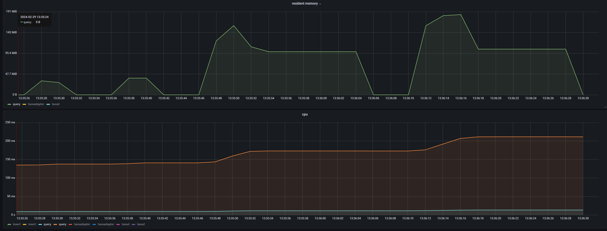

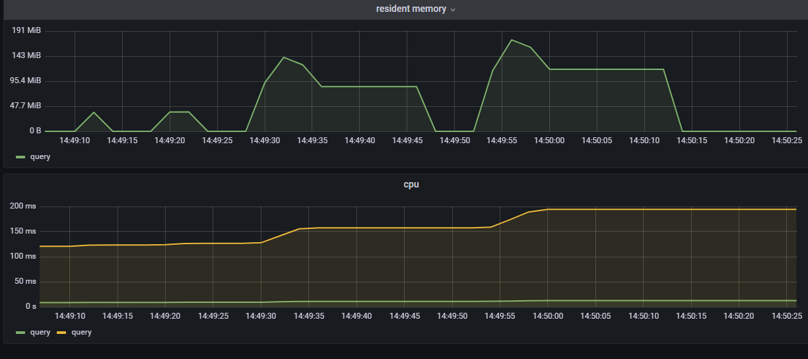

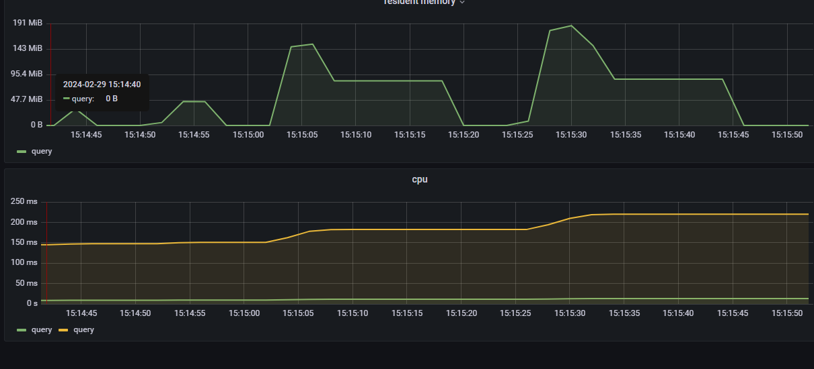

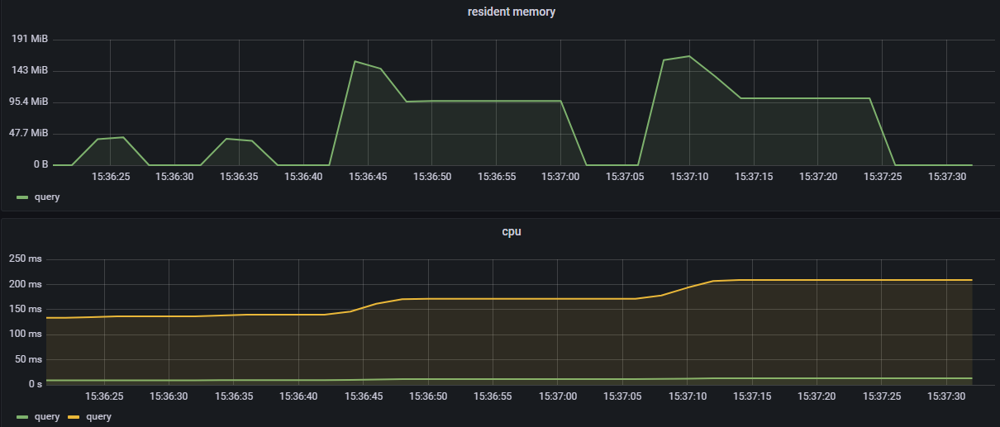

###### 1 协程不压缩

| c->s 流量 | s->c 流量 | max(ms) | p99(ms) | p95(ms) | 最高内存(M) |
| --- | --- | --- | --- | --- | --- |
| 289K | 153M | 3515 | 3515 | 3515 | 32 |
| 288K | 152M | 3502 | 3502 | 3502 | 36.1 |
| 288K | 153M | 3497 | 3497 | 3497 | 31.2 |
| 288K | 153M | 3486 | 3486 | 3486 | 42.3 |

###### 1 协程压缩

| c->s 流量 | s->c 流量 | max(ms) | p99(ms) | p95(ms) | 最高内存(M) |
| --- | --- | --- | --- | --- | --- |
| 439K | 22M | 4081 | 4081 | 4081 | 38 |
| 439K | 23M | 4056 | 4056 | 4056 | 38 |
| 438K | 22M | 4067 | 4067 | 4067 | 44.8 |
| 439K | 23M | 4098 | 4098 | 4098 | 40.1 |

###### 8 协程不压缩

| c->s 流量 | s->c 流量 | max(ms) | p99(ms) | p95(ms) | 最高内存(M) |
| --- | --- | --- | --- | --- | --- |
| 2383K | 1224M | 17893 | 17893 | 17893 | 159 |
| 2322K | 1224M | 17875 | 17875 | 17875 | 141 |
| 2313K | 1223M | 17907 | 17907 | 17907 | 152 |
| 2322K | 1223M | 17891 | 17891 | 17891 | 158 |

###### 8 协程压缩

| c->s 流量 | s->c 流量 | max(ms) | p99(ms) | p95(ms) | 最高内存(M) |
| --- | --- | --- | --- | --- | --- |
| 3514K | 181M | 18777 | 18777 | 18777 | 184 |
| 3515K | 182M | 18737 | 18737 | 18737 | 174 |
| 3515K | 180M | 18676 | 18676 | 18676 | 187 |
| 3515K | 184M | 18766 | 18766 | 18766 | 166 |

##### Restful 读取测试

下图从左到右分别为 1 协程不压缩，1 协程压缩，8 协程不压缩，8 协程压缩内存趋势图
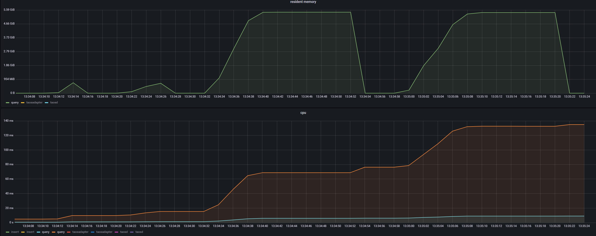

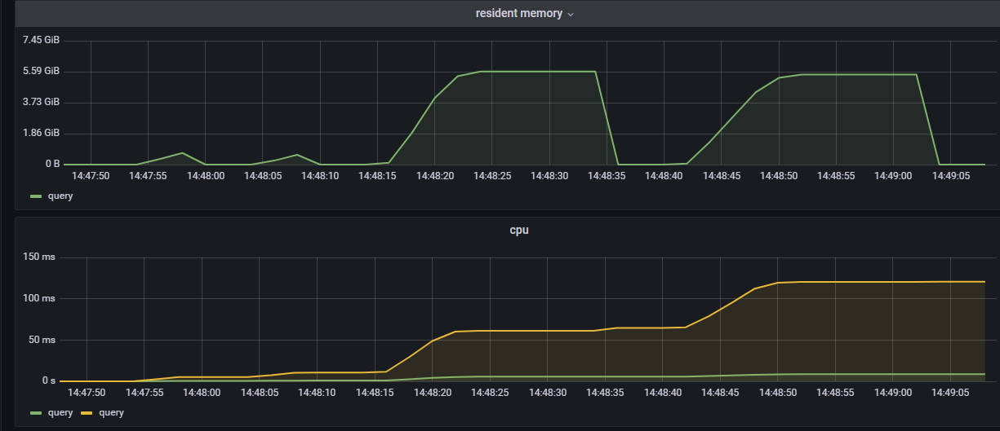

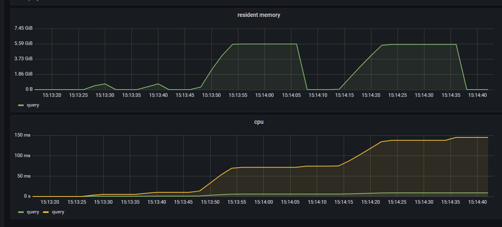

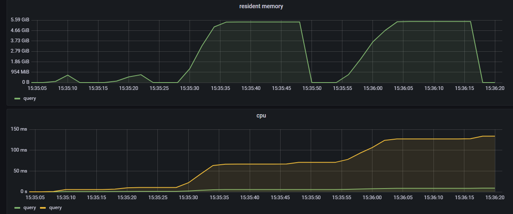

###### 1 协程不压缩

| c->s 流量 | s->c 流量 | max(ms) | p99(ms) | p95(ms) | 最高内存(M) |
| --- | --- | --- | --- | --- | --- |
| 1M | 229M | 3475 | 3475 | 3475 | 720 |
| 1M | 230M | 3461 | 3461 | 3461 | 716 |
| 1M | 230M | 3442 | 3442 | 3442 | 716 |
| 1M | 229M | 3501 | 3501 | 3501 | 681 |

###### 1 协程压缩

| c->s 流量 | s->c 流量 | max(ms) | p99(ms) | p95(ms) | 最高内存(M) |
| --- | --- | --- | --- | --- | --- |
| 108K | 12M | 5079 | 5079 | 5079 | 680 |
| 108K | 12M | 5026 | 5026 | 5026 | 604 |
| 108K | 12M | 4978 | 4978 | 4978 | 720 |
| 108K | 12M | 5005 | 5005 | 5005 | 720 |

###### 8 协程不压缩

| c->s 流量 | s->c 流量 | max(ms) | p99(ms) | p95(ms) | 最高内存(M) |
| --- | --- | --- | --- | --- | --- |
| 3380K | 2080M | 20372 | 20372 | 20372 | 5570 |
| 3468K | 1772M | 19633 | 19633 | 19633 | 5734 |
| 3436K | 1747M | 20112 | 20112 | 20112 | 5693 |
| 3686K | 1787M | 19927 | 19927 | 19927 | 5550 |

###### 8 协程压缩

| c->s 流量 | s->c 流量 | max(ms) | p99(ms) | p95(ms) | 最高内存(M) |
| --- | --- | --- | --- | --- | --- |
| 865K | 96M | 21968 | 21968 | 21968 | 5540 |
| 858K | 96M | 21997 | 21997 | 21997 | 5550 |
| 944K | 96M | 22465 | 22465 | 22465 | 5642 |
| 857K | 96M | 22189 | 22189 | 22189 | 5601 |

## Jira

TD-27498

## 参考文档

- [WebSocket 支持传输压缩功能](https://taosdata.feishu.cn/wiki/VQrnwPSthiLsh3kBM2fcpFOFnWh)
