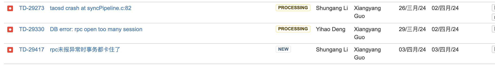

# 双副本高风险会议（4-2）

**会议时间**：2024-4-2
**会议地点**： STABLE
**会议参加人**： 顺纲，向阳，洪泽，段宽军
**会议目的**：  此功能测试完成进入高风险状态，召集开发测试商讨解决方案
**会议决议**：
1. 原 4-3 号为向阳定的基本功能测完，这个时间点后他重点转向测复合主键查询功能，故测试完成时间商定至 4-17号，再进行两周的大流量及各种异常测试。
2. 目前发现 12 个问题剩三个未解决，1 个怡豪的洪泽催下，另两个顺纲的已在抓紧解决中
3. 4-3 号基本功能测试完成无风险，向阳负责把全量中的基本功能 CASE 抽出缩小数据量放到 CI 中
    
阻塞测试进行大流量压力测试的问题， 共三个，需尽快解决：

