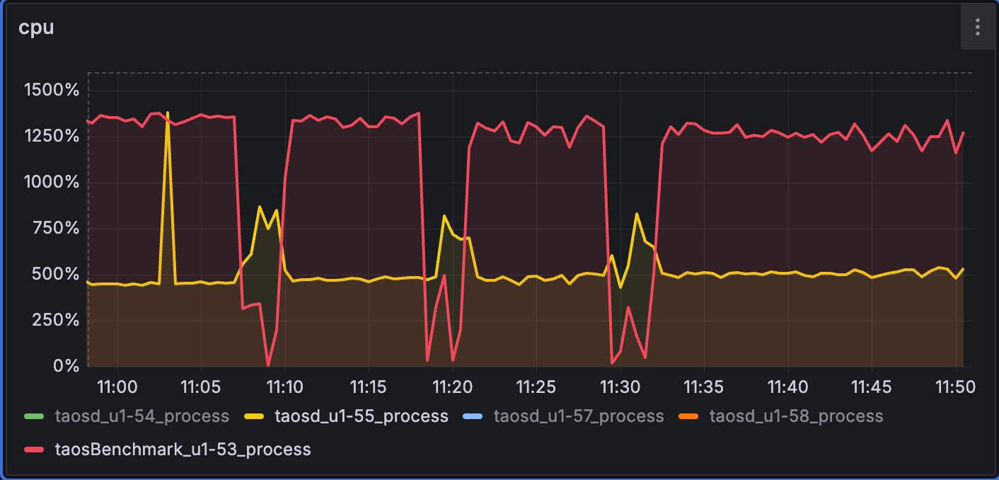
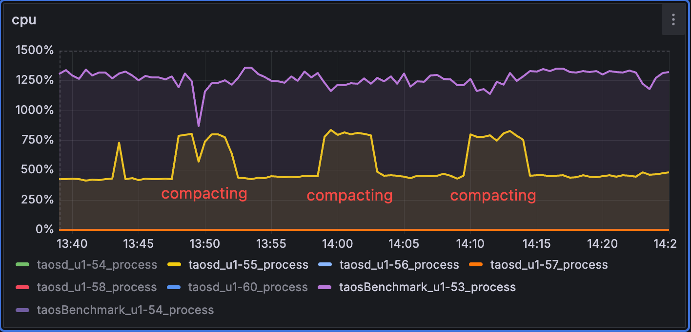
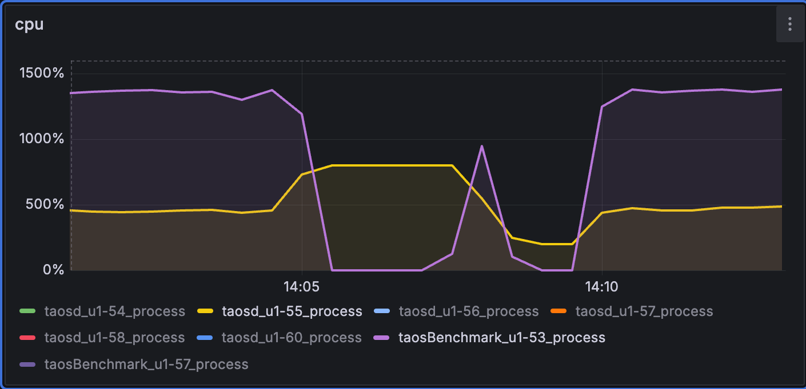
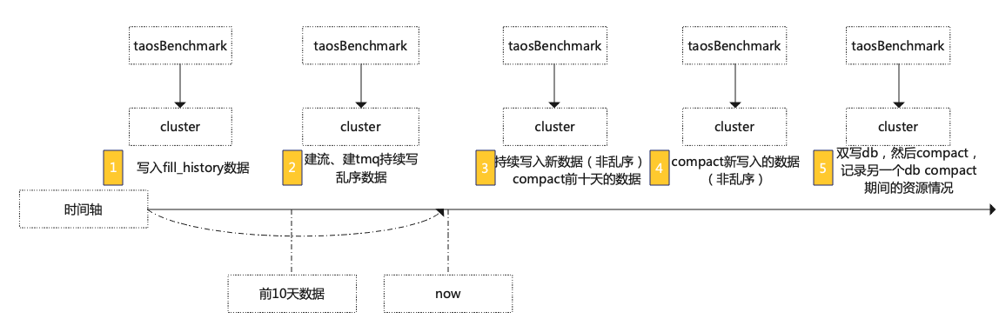
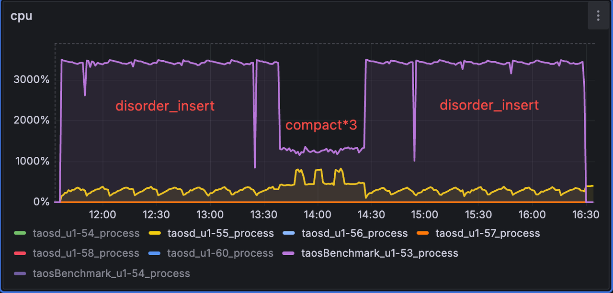
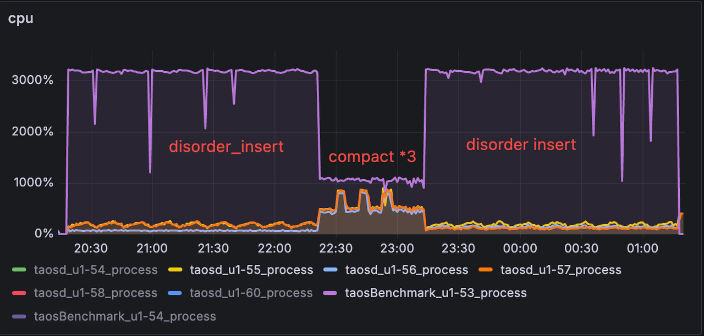
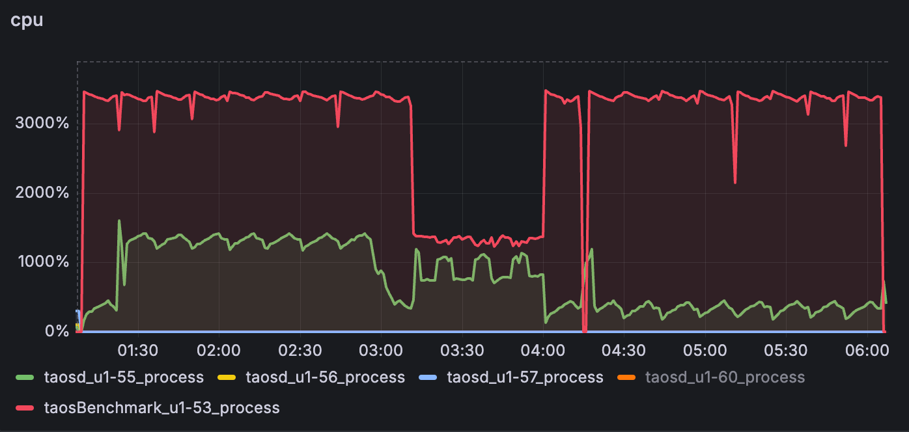
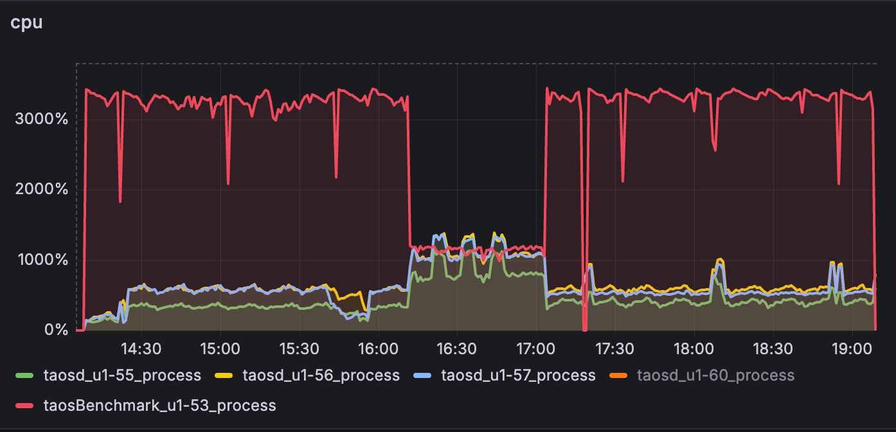

# Compact 优化 stt_trigger=1 时降低对写入的影响 Test Spec

## 1. 测试目标

在 stt_trigger = 1 时，测试 compact 对写入的影响；（[TS-4723](https://jira.taosdata.com:18080/browse/TS-4723)）

## 2. 变更历史

| Date | Version | Owner | Memo |
| --- | --- | --- | --- |
| 2024-05-28 | 0.1 | @贾靖斌 | New |
|  |  |  |  |

## 3. 测试范围

- stt_trigger = 1 时，持续写入，compact 未在写入的文件组；
- stt_trigger = 1 时，持续写入，compact 正在写入的文件组；
- 分别在单副本和三副本测试稳定性，看本次修复是否会对其它功能产生影响；
  - Compact 基础功能回归
  - 内存资源验证
  - 磁盘资源验证
  - 查询性能验证
  - Keep 删除过期数据验证
  - Compact 时有 stream 在运行
  - Compact 时有 tmq 在运行
  - Compact 可观测性/可维护性验证
  - stt_trigger > 1 各场景回归

## 4. 测试结论

1. 如果 compact 未在写入的文件组，优化效果明显，对写入的影响大幅下降，达到预期；
2. 如果 compact 正在写入的文件组，没有优化效果；
3. 本次测试全面覆盖了 3.0 和 3.1 版本分支，涉及流计算和订阅功能的测试均基于 3.0 分支执行，在 3.1 分支遇到流计算崩溃的问题（[TD-30438](https://jira.taosdata.com:18080/browse/TD-30438)），若要解决此问题，需要对通讯协议进行修改，会引起兼容性问题；

## 5. 测试数据

1. 持续写入，compact 未在写入的文件组，对比优化前后的效果：

|  | **Compact 过程图** | **结论** |
| --- | --- | --- |
| **优化前** |  |
| **优化后** |  |

1. 持续写入，compact 正在写入的文件组，优化前后效果应相同，即均会被阻塞：

| **Compact 过程图** | **结论** |
| --- | --- |
|  | compact 正在写入的文件组，可以清晰的看出：compact 后一段时间，taosBenchmark CPU 利用率几乎降为 0 ，那么此时可以理解为对写入阻塞较为严重，这块并没在优化范围内，是符合预期的，这里只是为了测试是否会引发其它问题 |

已知问题和限制
compact 正在写入的文件组依然对写入阻塞依然会很大

## 6. 测试环境

- OS：Ubuntu 20.04.2 LTS
- Env：

| **硬件环境** | **IP** | 用途 | **CPU** | **内存** | **硬盘** |
| --- | --- | --- | --- | --- | --- |
| 192.168.1.53 | taosBenchmark |
| 192.168.1.55 | taosd |
| 192.168.1.56 | taosd |
| 192.168.1.57 | taosd |

```shell
软件版本：
enterprise version: 3.1.1.0 compatible_version: 3.0.0.0
gitinfo: be1b063aa25e1c41f3957ca2fd4878e9fea4ba8a
gitinfoOfInternal: 2a184377b2df81d84ac2a582654d17fc962451c8
buildInfo: Built Linux-x64 at 2024-06-05 13:48:48 +0800
```

## 7. 测试 Schema 及 SQL

**schema：**

|  | **type** | **count** |
| --- | --- | --- |
| **tag** | int | 1 |
| int | 2 |
| bigint | 1 |

**建流 SQL：**
create stream if not exists test_stream trigger max_delay 1s ignore update 0 ignore expired 0 fill_history 1 into compact_disk_usage_test.output_streamtb as select _wstart,max(c0),min(c1) from stream_test.stb where c1>0 partition by tbname interval(1s) sliding(1s)
**订阅 SQL：**
create topic if not exists tp_name as select ts, log(c0), ceil(pow(c0,3)) from stream_test.stb where c0 % 7 >= 0

## 8. 测试用例

**测试脚本：**
taostest --setup=cluster/compact_test.yaml --case=cluster/compact_test.py --keep
taostest --setup=cluster/compact_test_rep3.yaml --case=cluster/compact_test.py --keep


### 8.1 功能


| **序号** | **测试点** | **测试步骤** | **期望结果** | **实际结果** |
| --- | --- | --- | --- | --- |
| 1 | 基础功能验证 | 1. 写入 20 亿数据（含乱序更新删除）； 1. 查询结果； 1. compact database； 1. 查询结果； | 第 2 步和第 4 步结果相同 | 通过 |
| 2 | compact内存资源消耗 | 1. 写入 20 亿数据（含乱序更新删除）； 1. compact database； 1. 观察 compact 过程中的内存增长； | compact 过程中内存不会大幅增长 | 通过 |
| 3 | compact磁盘资源验证 | 1. 写入 20 亿数据（含乱序更新删除）； 1. 记录磁盘占用； 1. compact database； 1. 记录磁盘占用； | compact 后磁盘占用空间降低 | 通过 |
| 4 | compact查询性能验证 | 1. 写入 20 亿数据（含乱序更新删除）； 1. count(*) 查询； 1. compact database； 1. count(*) 查询； | compact 后查询性能大幅提升 | 通过 |
| 5 | compact阻塞写入验证 | 1. stt_trigger 设置为 1，duration 设置为 1 d，写入前 10 天的数据进行 compact； 1. 继续写入后 10 天的数据，compact的数据为前 10 天的文件组； 1. 观察 taosBenchmark 写入速度和 cpu 资源变化； 1. 继续写入后 10 天的数据，compact的数据后 10 天的文件组； 1. 观察 taosBenchmark 写入速度和 cpu 资源变化； | 步骤 3 中阻塞较小，步骤 5 阻塞严重 | 通过 |
| 6 | compact阻塞查询验证 | 1. 写入 20 亿数据（含乱序更新删除）后进行compact； 1. compact 过程中进行查询； | 查询可以正常执行 | 通过 |
| 7 | compact 支持 stream | 1. 建流，含 fill_history，然后进行写入； 1. 写入一定量数据后进行 compact； | compact 可以支持 stream | 通过 |
| 8 | compact 支持 tmq | 1. 建tmq，然后进行写入并启动消费； 1. 写入一定量数据后进行compact； | compact 可以支持 tmq | 通过 |
| 9 | Keep 删除过期数据后进行 compact | 1. duration 设置为 1d，keep 设置为 11d，写入前 10 天的数据，然后将 keep 改为 5d； 1. 修改 keep 参数后进行 compact，继续写入后 10 天的数据，compact 的数据为前 10 天的文件组； | compact 可以正常结束 | 通过 |
| 10 | 可观测性/可维护性验证 | 覆盖[[Test Report] compact可观测/可维护特性测试](https://taosdata.feishu.cn/wiki/O92ZwxZQfiXjXQkfJJocr2qlnmb)所有用例 | 所有用例通过测试 | 通过 |
| 11 | stt_trigger > 1场景回归 | 覆盖以上所有场景 | 所有用例通过测试 | 通过 |


### 8.2 稳定性


| **分支** | **副本数** | **整体 CPU 资源图** |
| --- | --- | --- |
| 1 |  |
| 3 |  |
| 1 |  |
| 3 |  |

## 9. Jira

| **Jira** | **描述** | **状态** | **备注** |
| --- | --- | --- | --- |
| [TS-4723](https://jira.taosdata.com:18080/browse/TS-4723) | [[中石化]优化stt_trigger=1情况下的compact](https%3A%2F%2Fjira.taosdata.com%3A18080%2Fbrowse%2FTS-4723) | Verifying |  |
| [TD-30317](https://jira.taosdata.com:18080/browse/TD-30317) | [taosd crashed at tsdbCommit2.c:708](https://jira.taosdata.com:18080/browse/TD-30317) | Done |  |
| [TD-30265](https://jira.taosdata.com:18080/browse/TD-30265) | [kill compact 卡死，taos 连接报错rpc open too many session](https://jira.taosdata.com:18080/browse/TD-30265) | Done |  |
| [TD-30438](https://jira.taosdata.com:18080/browse/TD-30438) | [taosd crashed at streamCheckpoint.c:284](https://jira.taosdata.com:18080/browse/TD-30438) | PENDING | 3.1 分支存在流 crash 情况，廖博反馈该问题需要修改通讯协议才行，那样会导致版本兼容性问题，因此本报告中 compact（含流）的测试都是在 3.0 分支进行的 |
