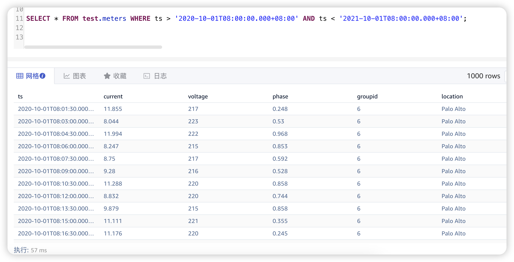
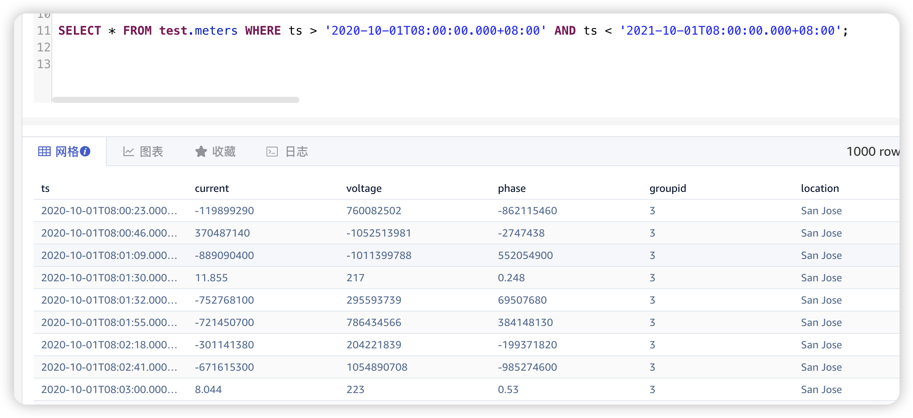
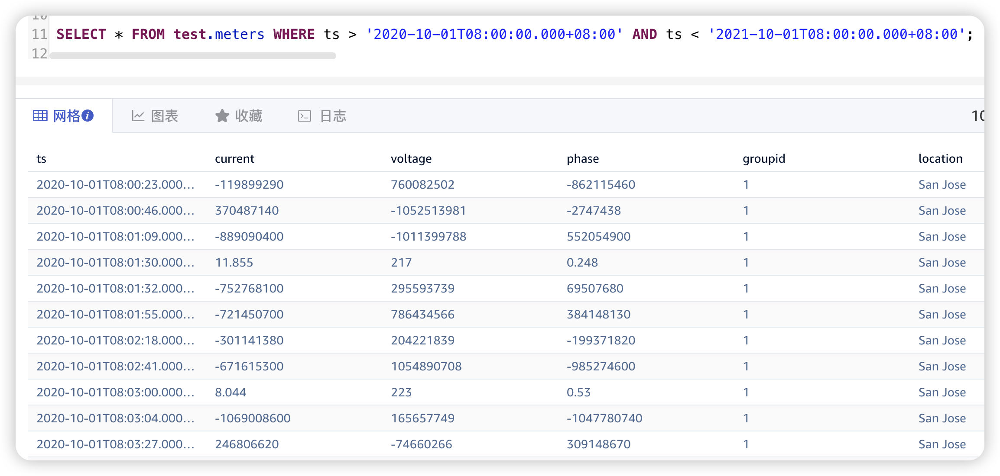
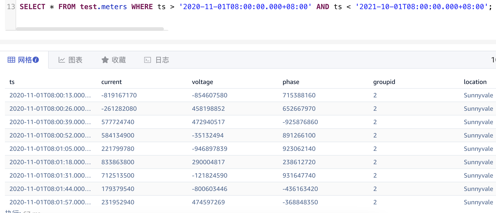
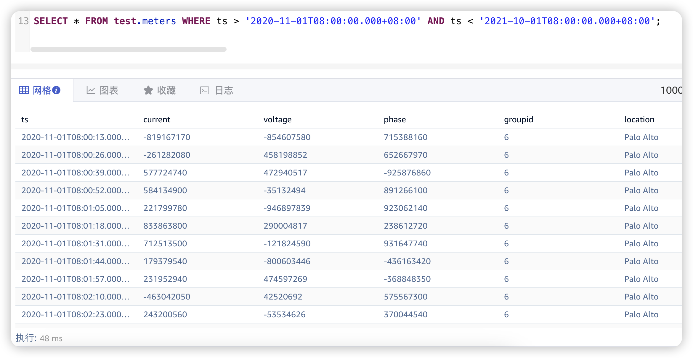
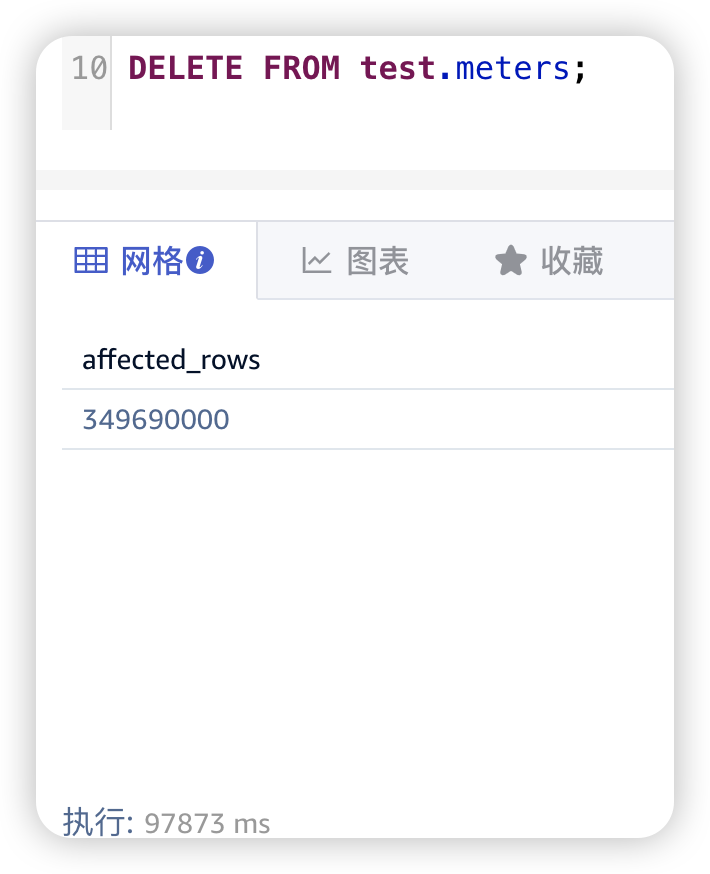
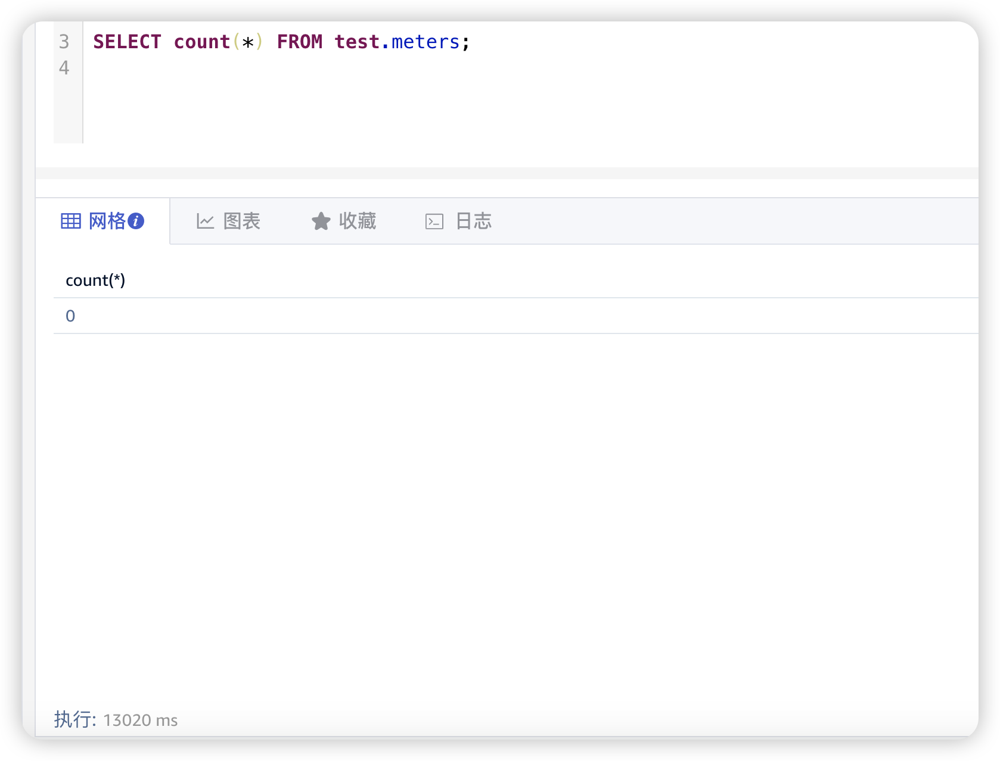

# TD-29622 跨多个文件组写入测试报告

## 1. 测试目标

测试在一次写入多个文件组时数据库是否会有 crash 或数据异常等问题

## 2. 变更历史 

| Date | Version | Owner | Memo |
| --- | --- | --- | --- |
| 2024/06/11 | 0.1 | Astro |  |
| 2024/06/11 | 0.2 | Astro | 根据模板对文档进行重构 |

## 3. 测试结论

1. 跨多文件组写入/覆盖写入/删除，数据库数据均未出现异常
2. taosBenchmark 在已创建好的数据库中进行插入时，在第二次及后续的插入过程中插入的数据不再符合 json 文件配置的值范围

## 4. 已知问题和限制

无

## 5. 测试资源及环境

测试平台：本机 Docker 环境测试， x86_64 环境
测试资源：CPU * 8， RAM 8G，Disk 60GB
测试版本：开源版本 3.3.0.3

## 6. 测试范围及方法

### 6.1 测试方法：

1. 在 TDengine 中提前使用 `DURATION 60m MINROWS 10` 参数创建 `test` 库
2. 使用 taosBenchmark 进行批量写入和覆盖写入，执行 FLUSH DATABASE 操作
3. 使用 DELETE 语句进行批量删除，执行 FLUSH DATABASE 操作

### 6.2 测试范围：

1. INSERT 语句批量写入
2. INSERT 语句覆盖写入
3. DELETE 语句批量删除

## 7. 测试数据

taosBenchmark 自动生成

## 8. 测试用例

### 8.1 批量插入测试

1. 目标：验证数据库批量插入，flush database 后是否异常
2. 测试步骤描述：
3. 建表语句
```sql {wrap}
-- DURATION 60m MINROWS 10
CREATE DATABASE `test` DURATION 60m BUFFER 256 CACHESIZE 1 CACHEMODEL 'none' COMP 2 WAL_FSYNC_PERIOD 3000 MAXROWS 200 MINROWS 10 STT_TRIGGER 1 KEEP 1000d,5256000m,5256000m PAGES 256 PAGESIZE 4 PRECISION 'ms' REPLICA 1 WAL_LEVEL 1 VGROUPS 7 SINGLE_STABLE 0 TABLE_PREFIX 0 TABLE_SUFFIX 0 TSDB_PAGESIZE 4 WAL_RETENTION_PERIOD 3600 WAL_RETENTION_SIZE 0 KEEP_TIME_OFFSET 0 ENCRYPT_ALGORITHM 'none' S3_CHUNKSIZE 262144 S3_KEEPLOCAL 5256000m S3_COMPACT 0;
```

1. taosBenchmaark 配置文件 "timestamp_step": 90000,
```json {wrap}
{
    "filetype": "insert",
    "cfgdir": "/etc/taos",
    "host": "127.0.0.1",
    "port": 6030,
    "user": "root",
    "password": "taosdata",
    "connection_pool_size": 8,
    "thread_count": 4,
    "create_table_thread_count": 4,
    "result_file": "./insert_res.txt",
    "confirm_parameter_prompt": "no",
    "num_of_records_per_req": 10000,
    "prepared_rand": 10000,
    "chinese": "no",
    "escape_character": "yes",
    "continue_if_fail": "no",
    "databases": [
        {
            "dbinfo": {
                "name": "test",
                "drop": "no",
                "vgroups": 4,
                "precision": "ms"
            },
            "super_tables": [
                {
                    "name": "meters",
                    "child_table_exists": "no",
                    "childtable_count": 10000,
                    "childtable_prefix": "d",
                    "auto_create_table": "yes",
                    "batch_create_tbl_num": 5,
                    "data_source": "rand",
                    "insert_mode": "taosc",
                    "non_stop_mode": "no",
                    "line_protocol": "line",
                    "insert_rows": 10000,
                    "childtable_limit": 0,
                    "childtable_offset": 0,
                    "interlace_rows": 0,
                    "insert_interval": 0,
                    "partial_col_num": 0,
                    "timestamp_step": 90000,
                    "start_timestamp": "2020-10-01 00:00:00.000",
                    "sample_format": "csv",
                    "sample_file": "./sample.csv",
                    "use_sample_ts": "no",
                    "tags_file": "",
                    "columns": [
                        {"type": "FLOAT", "name": "current", "count": 1, "max": 12, "min": 8 },
                        { "type": "INT", "name": "voltage", "max": 225, "min": 215 },
                        { "type": "FLOAT", "name": "phase", "max": 1, "min": 0 }
                    ],
                    "tags": [
                        {"type": "TINYINT", "name": "groupid", "max": 10, "min": 1},
                        {"type": "BINARY",  "name": "location", "len": 16,
                            "values": ["San Francisco", "Los Angles", "San Diego",
                                "San Jose", "Palo Alto", "Campbell", "Mountain View",
                                "Sunnyvale", "Santa Clara", "Cupertino"]
                        }
                    ]
                }
            ]
        }
    ]
}
```

#### 8.1.1 Flush database 前

##### 8.1.1.1 表概况

```sql {wrap}
taos> show table distributed test.meters\G;
*************************** 1.row ***************************
_block_dist: Total_Blocks=[2415000] Total_Size=[1094007.78 KiB] Average_size=[0.45 KiB] Compression_Ratio=[57.98 %]
*************************** 2.row ***************************
_block_dist: Block_Rows=[96600000] MinRows=[40] MaxRows=[40] AvgRows=[40]
*************************** 3.row ***************************
_block_dist: Inmem_Rows=[3400000] Stt_Rows=[0]
*************************** 4.row ***************************
_block_dist: Total_Tables=[10000] Total_Filesets=[1757] Total_Vgroups=[7]
*************************** 5.row ***************************
_block_dist: --------------------------------------------------------------------------------
*************************** 6.row ***************************
_block_dist: 0020 |
*************************** 7.row ***************************
_block_dist: 0030 |
*************************** 8.row ***************************
_block_dist: 0040 |
*************************** 9.row ***************************
_block_dist: 0050 |||||||||||||||||||||||||||||||||||||||||||||||||||||||||||||||||||||||||||||||||  2415000 (100.00%)
*************************** 10.row ***************************
_block_dist: 0060 |
*************************** 11.row ***************************
_block_dist: 0070 |
*************************** 12.row ***************************
_block_dist: 0080 |
*************************** 13.row ***************************
_block_dist: 0090 |
*************************** 14.row ***************************
_block_dist: 0100 |
*************************** 15.row ***************************
_block_dist: 0110 |
*************************** 16.row ***************************
_block_dist: 0120 |
*************************** 17.row ***************************
_block_dist: 0130 |
*************************** 18.row ***************************
_block_dist: 0140 |
*************************** 19.row ***************************
_block_dist: 0150 |
*************************** 20.row ***************************
_block_dist: 0160 |
*************************** 21.row ***************************
_block_dist: 0170 |
*************************** 22.row ***************************
_block_dist: 0180 |
*************************** 23.row ***************************
_block_dist: 0190 |
*************************** 24.row ***************************
_block_dist: 0200 |
*************************** 25.row ***************************
_block_dist: 0210 |
```

##### 8.1.1.2 SQL 测试

1. 记录总数
```sql {wrap}
SELECT count(*) from test.meters;
```

结果
```sql {wrap}
count(*)
100000000
```

1. 第一条记录
```sql {wrap}
SELECT first(*) FROM test.meters;
```

结果
```plaintext {wrap}
2020-10-01T08:00:00.000+08:00 11.437 223 0.502
```

1. 最后一条记录
```sql {wrap}
SELECT last(*) FROM test.meters;
```

结果
```sql {wrap}
2020-10-11T17:58:30.000+08:00 8.887 217 0.618
```

#### 8.1.2 Flush database 后

##### 8.1.2.1 表概况

```sql {wrap}
taos> show table distributed test.meters\G;
*************************** 1.row ***************************
_block_dist: Total_Blocks=[2500000] Total_Size=[1132520.75 KiB] Average_size=[0.45 KiB] Compression_Ratio=[57.99 %]
*************************** 2.row ***************************
_block_dist: Block_Rows=[100000000] MinRows=[40] MaxRows=[40] AvgRows=[40]
*************************** 3.row ***************************
_block_dist: Inmem_Rows=[0] Stt_Rows=[0]
*************************** 4.row ***************************
_block_dist: Total_Tables=[10000] Total_Filesets=[1757] Total_Vgroups=[7]
*************************** 5.row ***************************
_block_dist: --------------------------------------------------------------------------------
*************************** 6.row ***************************
_block_dist: 0020 |
*************************** 7.row ***************************
_block_dist: 0030 |
*************************** 8.row ***************************
_block_dist: 0040 |
*************************** 9.row ***************************
_block_dist: 0050 |||||||||||||||||||||||||||||||||||||||||||||||||||||||||||||||||||||||||||||||||  2500000 (100.00%)
*************************** 10.row ***************************
_block_dist: 0060 |
*************************** 11.row ***************************
_block_dist: 0070 |
*************************** 12.row ***************************
_block_dist: 0080 |
*************************** 13.row ***************************
_block_dist: 0090 |
*************************** 14.row ***************************
_block_dist: 0100 |
*************************** 15.row ***************************
_block_dist: 0110 |
*************************** 16.row ***************************
_block_dist: 0120 |
*************************** 17.row ***************************
_block_dist: 0130 |
*************************** 18.row ***************************
_block_dist: 0140 |
*************************** 19.row ***************************
_block_dist: 0150 |
*************************** 20.row ***************************
_block_dist: 0160 |
*************************** 21.row ***************************
_block_dist: 0170 |
*************************** 22.row ***************************
_block_dist: 0180 |
*************************** 23.row ***************************
_block_dist: 0190 |
*************************** 24.row ***************************
_block_dist: 0200 |
*************************** 25.row ***************************
_block_dist: 0210 |
```

##### 8.1.2.2 Sql 测试

1. 总数
```sql {wrap}
SELECT count(*) from test.meters;
```

结果
```sql {wrap}
count(*)
100000000
```

1. 第一条记录
```sql {wrap}
SELECT first(*) FROM test.meters;
```

结果
```plaintext {wrap}
2020-10-01T08:00:00.000+08:00 11.437 223 0.502
```

1. 最后一条记录
```sql {wrap}
SELECT last(*) FROM test.meters;
```

结果
```plaintext {wrap}
2020-10-11T17:58:30.000+08:00 8.887 217 0.618
```

1. 查询所有数据


##### 8.1.2.3 结果分析：插入操作完成后，数据查询未出现异常

### 8.2 覆盖插入测试 

1. 目标：验证数据库批量覆盖插入，flush database 后是否异常
2. 测试步骤描述：

#### 8.2.1 时间戳间隔改为 23s，开始时间戳不变

```json {wrap}
{
    "filetype": "insert",
    "cfgdir": "/etc/taos",
    "host": "127.0.0.1",
    "port": 6030,
    "user": "root",
    "password": "taosdata",
    "connection_pool_size": 8,
    "thread_count": 4,
    "create_table_thread_count": 4,
    "result_file": "./insert_res.txt",
    "confirm_parameter_prompt": "no",
    "num_of_records_per_req": 10000,
    "prepared_rand": 10000,
    "chinese": "no",
    "escape_character": "yes",
    "continue_if_fail": "no",
    "databases": [
        {
            "dbinfo": {
                "name": "test",
                "drop": "no",
                "vgroups": 4,
                "precision": "ms"
            },
            "super_tables": [
                {
                    "name": "meters",
                    "child_table_exists": "no",
                    "childtable_count": 10000,
                    "childtable_prefix": "d",
                    "auto_create_table": "yes",
                    "batch_create_tbl_num": 5,
                    "data_source": "rand",
                    "insert_mode": "taosc",
                    "non_stop_mode": "no",
                    "line_protocol": "line",
                    "insert_rows": 10000,
                    "childtable_limit": 0,
                    "childtable_offset": 0,
                    "interlace_rows": 0,
                    "insert_interval": 0,
                    "partial_col_num": 0,
                    "timestamp_step": 23000,
                    "start_timestamp": "2020-10-01 00:00:00.000",
                    "sample_format": "csv",
                    "sample_file": "./sample.csv",
                    "use_sample_ts": "no",
                    "tags_file": "",
                    "columns": [
                        {"type": "FLOAT", "name": "current", "count": 1, "max": 12, "min": 8 },
                        { "type": "INT", "name": "voltage", "max": 225, "min": 215 },
                        { "type": "FLOAT", "name": "phase", "max": 1, "min": 0 }
                    ],
                    "tags": [
                        {"type": "TINYINT", "name": "groupid", "max": 10, "min": 1},
                        {"type": "BINARY",  "name": "location", "len": 16,
                            "values": ["San Francisco", "Los Angles", "San Diego",
                                "San Jose", "Palo Alto", "Campbell", "Mountain View",
                                "Sunnyvale", "Santa Clara", "Cupertino"]
                        }
                    ]
                }
            ]
        }
    ]
}
```

##### 8.2.1.1 Flush database 前

###### 8.2.1.1.1 表概况

```sql {wrap}
taos> show table distributed test.meters\G;
*************************** 1.row ***************************
_block_dist: Total_Blocks=[2500000] Total_Size=[2468566.40 KiB] Average_size=[0.99 KiB] Compression_Ratio=[64.64 %]
*************************** 2.row ***************************
_block_dist: Block_Rows=[195518080] MinRows=[40] MaxRows=[196] AvgRows=[78]
*************************** 3.row ***************************
_block_dist: Inmem_Rows=[3400000] Stt_Rows=[0]
*************************** 4.row ***************************
_block_dist: Total_Tables=[10000] Total_Filesets=[1757] Total_Vgroups=[7]
*************************** 5.row ***************************
_block_dist: --------------------------------------------------------------------------------
*************************** 6.row ***************************
_block_dist: 0020 |
*************************** 7.row ***************************
_block_dist: 0030 |
*************************** 8.row ***************************
_block_dist: 0040 |
*************************** 9.row ***************************
_block_dist: 0050 |||||||||||||||||||||||||||||||||||||||||||||||||||||||||||||  1881760 (75.27%)
*************************** 10.row ***************************
_block_dist: 0060 |
*************************** 11.row ***************************
_block_dist: 0070 |
*************************** 12.row ***************************
_block_dist: 0080 |
*************************** 13.row ***************************
_block_dist: 0090 |
*************************** 14.row ***************************
_block_dist: 0100 |
*************************** 15.row ***************************
_block_dist: 0110 |
*************************** 16.row ***************************
_block_dist: 0120 |
*************************** 17.row ***************************
_block_dist: 0130 |
*************************** 18.row ***************************
_block_dist: 0140 |
*************************** 19.row ***************************
_block_dist: 0150 |
*************************** 20.row ***************************
_block_dist: 0160 |
*************************** 21.row ***************************
_block_dist: 0170 |
*************************** 22.row ***************************
_block_dist: 0180 |  9660 (0.39%)
*************************** 23.row ***************************
_block_dist: 0190 |
*************************** 24.row ***************************
_block_dist: 0200 ||||||||||||||||||||  608580 (24.34%)
*************************** 25.row ***************************
_block_dist: 0210 |
```

###### 8.2.1.1.2 SQL测试

1. 总数
```sql {wrap}
SELECT count(*) from test.meters;
```

结果
```plaintext {wrap}
198880000
```

1. 第一条记录
```sql {wrap}
SELECT FIRST(*) FROM test.meters;
```

结果（出现异常数据， 生成的数据没有遵循json文件中的最大最小值）
| 2020-10-01T08:00:00.000+08:00 | -1036136700 | -971972263 | -46289744 |
| --- | --- | --- | --- |

```json {wrap}
{
    "columns": [
        {"type": "FLOAT", "name": "current", "count": 1, "max": 12, "min": 8 },
        { "type": "INT", "name": "voltage", "max": 225, "min": 215 },
        { "type": "FLOAT", "name": "phase", "max": 1, "min": 0 }
    ]
}
```

1. 最后一条记录
```sql {wrap}
SELECT LAST(*) FROM test.meters;
```

结果
| 2020-10-11T17:58:30.000+08:00 | 8.887 | 217 | 0.618 |
| --- | --- | --- | --- |

1. 筛选部分数据
从图中看，第一次生成的值是正常的，第二次生成的值是随机的，没有遵循 json 配置文件中最大/最小值的限制



##### 8.2.1.2 Flush database 后

###### 8.2.1.2.1 表概况

```sql {wrap}
taos> show table distributed test.meters\G;
*************************** 1.row ***************************
_block_dist: Total_Blocks=[2500000] Total_Size=[2515591.32 KiB] Average_size=[1.01 KiB] Compression_Ratio=[64.76 %]
*************************** 2.row ***************************
_block_dist: Block_Rows=[198880000] MinRows=[40] MaxRows=[196] AvgRows=[79]
*************************** 3.row ***************************
_block_dist: Inmem_Rows=[0] Stt_Rows=[0]
*************************** 4.row ***************************
_block_dist: Total_Tables=[10000] Total_Filesets=[1757] Total_Vgroups=[7]
*************************** 5.row ***************************
_block_dist: --------------------------------------------------------------------------------
*************************** 6.row ***************************
_block_dist: 0020 |
*************************** 7.row ***************************
_block_dist: 0030 |
*************************** 8.row ***************************
_block_dist: 0040 |
*************************** 9.row ***************************
_block_dist: 0050 ||||||||||||||||||||||||||||||||||||||||||||||||||||||||||||  1860000 (74.40%)
*************************** 10.row ***************************
_block_dist: 0060 |
*************************** 11.row ***************************
_block_dist: 0070 |
*************************** 12.row ***************************
_block_dist: 0080 |
*************************** 13.row ***************************
_block_dist: 0090 |
*************************** 14.row ***************************
_block_dist: 0100 |
*************************** 15.row ***************************
_block_dist: 0110 |
*************************** 16.row ***************************
_block_dist: 0120 |
*************************** 17.row ***************************
_block_dist: 0130 |
*************************** 18.row ***************************
_block_dist: 0140 |
*************************** 19.row ***************************
_block_dist: 0150 |
*************************** 20.row ***************************
_block_dist: 0160 |
*************************** 21.row ***************************
_block_dist: 0170 |
*************************** 22.row ***************************
_block_dist: 0180 |  10000 (0.40%)
*************************** 23.row ***************************
_block_dist: 0190 |
*************************** 24.row ***************************
_block_dist: 0200 |||||||||||||||||||||  630000 (25.20%)
*************************** 25.row ***************************
_block_dist: 0210 |
```

###### 8.2.1.2.2 SQL测试

1. 总数
```sql {wrap}
SELECT count(*) from test.meters;
```

结果
```plaintext {wrap}
198880000
```

1. 第一条记录
```sql {wrap}
SELECT FIRST(*) FROM test.meters;
```

结果
| 2020-10-01T08:00:00.000+08:00 | -1036136700 | -971972263 | -46289744 |
| --- | --- | --- | --- |

1. 最后一条记录
```sql {wrap}
SELECT LAST(*) FROM test.meters;
```

结果
| 2020-10-11T17:58:30.000+08:00 | 8.887 | 217 | 0.618 |
| --- | --- | --- | --- |

1. 筛选所有数据


###### 8.2.1.2.3 结果分析：插入操作完成后，数据查询未出现异常

#### 8.2.2 时间戳间隔改为 13s，起始时间戳不变

###### 8.2.2.0.1 表概况

```json {wrap}
{
    "filetype": "insert",
    "cfgdir": "/etc/taos",
    "host": "127.0.0.1",
    "port": 6030,
    "user": "root",
    "password": "taosdata",
    "connection_pool_size": 8,
    "thread_count": 4,
    "create_table_thread_count": 4,
    "result_file": "./insert_res.txt",
    "confirm_parameter_prompt": "no",
    "num_of_records_per_req": 10000,
    "prepared_rand": 10000,
    "chinese": "no",
    "escape_character": "yes",
    "continue_if_fail": "no",
    "databases": [
        {
            "dbinfo": {
                "name": "test",
                "drop": "no",
                "vgroups": 4,
                "precision": "ms"
            },
            "super_tables": [
                {
                    "name": "meters",
                    "child_table_exists": "no",
                    "childtable_count": 10000,
                    "childtable_prefix": "d",
                    "auto_create_table": "yes",
                    "batch_create_tbl_num": 5,
                    "data_source": "rand",
                    "insert_mode": "taosc",
                    "non_stop_mode": "no",
                    "line_protocol": "line",
                    "insert_rows": 10000,
                    "childtable_limit": 0,
                    "childtable_offset": 0,
                    "interlace_rows": 0,
                    "insert_interval": 0,
                    "partial_col_num": 0,
                    "timestamp_step": 13000,
                    "start_timestamp": "2020-10-01 00:00:00.000",
                    "sample_format": "csv",
                    "sample_file": "./sample.csv",
                    "use_sample_ts": "no",
                    "tags_file": "",
                    "columns": [
                        {"type": "FLOAT", "name": "current", "count": 1, "max": 12, "min": 8 },
                        { "type": "INT", "name": "voltage", "max": 225, "min": 215 },
                        { "type": "FLOAT", "name": "phase", "max": 1, "min": 0 }
                    ],
                    "tags": [
                        {"type": "TINYINT", "name": "groupid", "max": 10, "min": 1},
                        {"type": "BINARY",  "name": "location", "len": 16,
                            "values": ["San Francisco", "Los Angles", "San Diego",
                                "San Jose", "Palo Alto", "Campbell", "Mountain View",
                                "Sunnyvale", "Santa Clara", "Cupertino"]
                        }
                    ]
                }
            ]
        }
    ]
}
```

###### 8.2.2.0.2 SQL测试

1. 总数
```sql {wrap}
SELECT count(*) from test.meters;
```

结果
```plaintext {wrap}
293460000
```

1. 第一条记录
```sql {wrap}
SELECT FIRST(*) FROM test.meters;
```

结果
| 2020-10-01T08:00:00.000+08:00 | 506369630 | 629250559 | -414842080 |
| --- | --- | --- | --- |

1. 最后一条记录
```sql {wrap}
SELECT LAST(*) FROM test.meters;
```

结果
| 2020-10-11T17:58:30.000+08:00 | 8.887 | 217 | 0.618 |
| --- | --- | --- | --- |

###### 8.2.2.0.3 结果分析：插入操作完成后，数据查询未出现异常

#### 8.2.3 时间戳间隔 13s，起始时间戳 2020-11-01T08:00:00.000+08:00 （和已插入的数据不重叠）

##### 8.2.3.1 Flush database 前

```sql {wrap}
taos> show table distributed test.meters\G;
*************************** 1.row ***************************
_block_dist: Total_Blocks=[3933355] Total_Size=[5203889.26 KiB] Average_size=[1.32 KiB] Compression_Ratio=[68.35 %]
*************************** 2.row ***************************
_block_dist: Block_Rows=[389810000] MinRows=[23] MaxRows=[200] AvgRows=[99]
*************************** 3.row ***************************
_block_dist: Inmem_Rows=[3650000] Stt_Rows=[0]
*************************** 4.row ***************************
_block_dist: Total_Tables=[10000] Total_Filesets=[2016] Total_Vgroups=[7]
*************************** 5.row ***************************
_block_dist: --------------------------------------------------------------------------------
*************************** 6.row ***************************
_block_dist: 0020 |
*************************** 7.row ***************************
_block_dist: 0030 |  10000 (0.25%)
*************************** 8.row ***************************
_block_dist: 0040 |  9635 (0.24%)
*************************** 9.row ***************************
_block_dist: 0050 ||||||||||||||||||||||||||||||||||||||  1860000 (47.29%)
*************************** 10.row ***************************
_block_dist: 0060 ||||||||  360000 (9.15%)
*************************** 11.row ***************************
_block_dist: 0070 |
*************************** 12.row ***************************
_block_dist: 0080 |
*************************** 13.row ***************************
_block_dist: 0090 |
*************************** 14.row ***************************
_block_dist: 0100 |
*************************** 15.row ***************************
_block_dist: 0110 |
*************************** 16.row ***************************
_block_dist: 0120 |
*************************** 17.row ***************************
_block_dist: 0130 |
*************************** 18.row ***************************
_block_dist: 0140 |||||||||||||||  693720 (17.64%)
*************************** 19.row ***************************
_block_dist: 0150 |
*************************** 20.row ***************************
_block_dist: 0160 |
*************************** 21.row ***************************
_block_dist: 0170 |
*************************** 22.row ***************************
_block_dist: 0180 |  10000 (0.25%)
*************************** 23.row ***************************
_block_dist: 0190 |
*************************** 24.row ***************************
_block_dist: 0200 ||||||  260000 (6.61%)
*************************** 25.row ***************************
_block_dist: 0210 |||||||||||||||  730000 (18.56%)
```

###### 8.2.3.1.1 表概况

```json {wrap}
{
    "filetype": "insert",
    "cfgdir": "/etc/taos",
    "host": "127.0.0.1",
    "port": 6030,
    "user": "root",
    "password": "taosdata",
    "connection_pool_size": 8,
    "thread_count": 4,
    "create_table_thread_count": 4,
    "result_file": "./insert_res.txt",
    "confirm_parameter_prompt": "no",
    "num_of_records_per_req": 10000,
    "prepared_rand": 10000,
    "chinese": "no",
    "escape_character": "yes",
    "continue_if_fail": "no",
    "databases": [
        {
            "dbinfo": {
                "name": "test",
                "drop": "no",
                "vgroups": 4,
                "precision": "ms"
            },
            "super_tables": [
                {
                    "name": "meters",
                    "child_table_exists": "no",
                    "childtable_count": 10000,
                    "childtable_prefix": "d",
                    "auto_create_table": "yes",
                    "batch_create_tbl_num": 5,
                    "data_source": "rand",
                    "insert_mode": "taosc",
                    "non_stop_mode": "no",
                    "line_protocol": "line",
                    "insert_rows": 10000,
                    "childtable_limit": 0,
                    "childtable_offset": 0,
                    "interlace_rows": 0,
                    "insert_interval": 0,
                    "partial_col_num": 0,
                    "timestamp_step": 13000,
                    "start_timestamp": "2020-11-01 00:00:00.000",
                    "sample_format": "csv",
                    "sample_file": "./sample.csv",
                    "use_sample_ts": "no",
                    "tags_file": "",
                    "columns": [
                        {"type": "FLOAT", "name": "current", "count": 1, "max": 12, "min": 8 },
                        { "type": "INT", "name": "voltage", "max": 225, "min": 215 },
                        { "type": "FLOAT", "name": "phase", "max": 1, "min": 0 }
                    ],
                    "tags": [
                        {"type": "TINYINT", "name": "groupid", "max": 10, "min": 1},
                        {"type": "BINARY",  "name": "location", "len": 16,
                            "values": ["San Francisco", "Los Angles", "San Diego",
                                "San Jose", "Palo Alto", "Campbell", "Mountain View",
                                "Sunnyvale", "Santa Clara", "Cupertino"]
                        }
                    ]
                }
            ]
        }
    ]
}
```

###### 8.2.3.1.2 SQL测试

1. 总数
```sql {wrap}
SELECT count(*) from test.meters;
```

结果
```plaintext {wrap}
393460000
```

1. 第一条记录
```sql {wrap}
SELECT FIRST(*) FROM test.meters;
```

结果
| 2020-10-01T08:00:00.000+08:00 | 506369630 | 629250559 | -414842080 |
| --- | --- | --- | --- |

1. 最后一条记录
```sql {wrap}
SELECT LAST(*) FROM test.meters;
```

结果
| 2020-11-02T20:06:27.000+08:00 | 887117100 | 895005162 | 6099668 |
| --- | --- | --- | --- |

1. 查询本次插入的数据


##### 8.2.3.2 Flush database 后

###### 8.2.3.2.1 表概况

```sql {wrap}
taos> show table distributed test.meters\G;
*************************** 1.row ***************************
_block_dist: Total_Blocks=[3960000] Total_Size=[5249653.98 KiB] Average_size=[1.33 KiB] Compression_Ratio=[68.31 %]
*************************** 2.row ***************************
_block_dist: Block_Rows=[393460000] MinRows=[23] MaxRows=[200] AvgRows=[99]
*************************** 3.row ***************************
_block_dist: Inmem_Rows=[0] Stt_Rows=[0]
*************************** 4.row ***************************
_block_dist: Total_Tables=[10000] Total_Filesets=[2016] Total_Vgroups=[7]
*************************** 5.row ***************************
_block_dist: --------------------------------------------------------------------------------
*************************** 6.row ***************************
_block_dist: 0020 |
*************************** 7.row ***************************
_block_dist: 0030 |  10000 (0.25%)
*************************** 8.row ***************************
_block_dist: 0040 |  10000 (0.25%)
*************************** 9.row ***************************
_block_dist: 0050 ||||||||||||||||||||||||||||||||||||||  1860000 (46.97%)
*************************** 10.row ***************************
_block_dist: 0060 ||||||||  360000 (9.09%)
*************************** 11.row ***************************
_block_dist: 0070 |
*************************** 12.row ***************************
_block_dist: 0080 |
*************************** 13.row ***************************
_block_dist: 0090 |
*************************** 14.row ***************************
_block_dist: 0100 |
*************************** 15.row ***************************
_block_dist: 0110 |
*************************** 16.row ***************************
_block_dist: 0120 |
*************************** 17.row ***************************
_block_dist: 0130 |
*************************** 18.row ***************************
_block_dist: 0140 |||||||||||||||  720000 (18.18%)
*************************** 19.row ***************************
_block_dist: 0150 |
*************************** 20.row ***************************
_block_dist: 0160 |
*************************** 21.row ***************************
_block_dist: 0170 |
*************************** 22.row ***************************
_block_dist: 0180 |  10000 (0.25%)
*************************** 23.row ***************************
_block_dist: 0190 |
*************************** 24.row ***************************
_block_dist: 0200 ||||||  260000 (6.57%)
*************************** 25.row ***************************
_block_dist: 0210 |||||||||||||||  730000 (18.43%)
```

###### 8.2.3.2.2 SQL测试

1. 第一条数据
```sql {wrap}
SELECT FIRST(*) FROM test.meters;
```

结果
| 2020-10-01T08:00:00.000+08:00 | 506369630 | 629250559 | -414842080 |
| --- | --- | --- | --- |

1. 最后一条数据
```sql {wrap}
SELECT LAST(*) FROM test.meters;
```

结果
| 2020-11-02T20:06:27.000+08:00 | 887117100 | 895005162 | 6099668 |
| --- | --- | --- | --- |

1. 查询所有数据


###### 8.2.3.2.3 结果分析：插入操作完成后，数据查询未出现异常

### 8.3 删除测试

1. 目标：验证数据库批量删除，flush database 后是否异常
2. 测试步骤描述：

#### 8.3.1 删除部分数据

```sql {wrap}
DELETE FROM test.meters WHERE ts > '2020-10-03T08:00:00.000+08:00' AND ts < '2020-10-05T08:00:00.000+08:00';
```

删除的行数
| 43770000 |
| --- |

1. 总数
```sql {wrap}
SELECT count(*) FROM test.meters;
```

结果
| 349690000 |
| --- |

1. 查询已删除的数据
```sql {wrap}
SELECT count(*) FROM test.meters WHERE ts > '2020-10-03T08:00:00.000+08:00' AND ts < '2020-10-05T08:00:00.000+08:00';
```

结果
| 0 |
| --- |

1. 查询未删除的数据总数
```sql {wrap}
SELECT count(*) FROM test.meters WHERE ts <= '2020-10-03T08:00:00.000+08:00' OR ts >= '2020-10-05T08:00:00.000+08:00';
```

结果
| 349690000 |
| --- |

##### 8.3.1.1 结果分析：删除操作完成后，数据查询未出现异常

#### 8.3.2 删除全部数据



##### 8.3.2.1 表概况

```sql {wrap}
taos> show table distributed test.meters\G;
*************************** 1.row ***************************
_block_dist: Total_Blocks=[3960000] Total_Size=[5249653.98 KiB] Average_size=[1.33 KiB] Compression_Ratio=[68.31 %]
*************************** 2.row ***************************
_block_dist: Block_Rows=[393460000] MinRows=[23] MaxRows=[200] AvgRows=[99]
*************************** 3.row ***************************
_block_dist: Inmem_Rows=[0] Stt_Rows=[0]
*************************** 4.row ***************************
_block_dist: Total_Tables=[10000] Total_Filesets=[2016] Total_Vgroups=[7]
*************************** 5.row ***************************
_block_dist: --------------------------------------------------------------------------------
*************************** 6.row ***************************
_block_dist: 0020 |
*************************** 7.row ***************************
_block_dist: 0030 |  10000 (0.25%)
*************************** 8.row ***************************
_block_dist: 0040 |  10000 (0.25%)
*************************** 9.row ***************************
_block_dist: 0050 ||||||||||||||||||||||||||||||||||||||  1860000 (46.97%)
*************************** 10.row ***************************
_block_dist: 0060 ||||||||  360000 (9.09%)
*************************** 11.row ***************************
_block_dist: 0070 |
*************************** 12.row ***************************
_block_dist: 0080 |
*************************** 13.row ***************************
_block_dist: 0090 |
*************************** 14.row ***************************
_block_dist: 0100 |
*************************** 15.row ***************************
_block_dist: 0110 |
*************************** 16.row ***************************
_block_dist: 0120 |
*************************** 17.row ***************************
_block_dist: 0130 |
*************************** 18.row ***************************
_block_dist: 0140 |||||||||||||||  720000 (18.18%)
*************************** 19.row ***************************
_block_dist: 0150 |
*************************** 20.row ***************************
_block_dist: 0160 |
*************************** 21.row ***************************
_block_dist: 0170 |
*************************** 22.row ***************************
_block_dist: 0180 |  10000 (0.25%)
*************************** 23.row ***************************
_block_dist: 0190 |
*************************** 24.row ***************************
_block_dist: 0200 ||||||  260000 (6.57%)
*************************** 25.row ***************************
_block_dist: 0210 |||||||||||||||  730000 (18.43%)
Query OK, 25 row(s) in set (0.749467s)

taos> show table distributed test.meters\G;
*************************** 1.row ***************************
_block_dist: Total_Blocks=[3960000] Total_Size=[5249653.98 KiB] Average_size=[1.33 KiB] Compression_Ratio=[68.31 %]
*************************** 2.row ***************************
_block_dist: Block_Rows=[393460000] MinRows=[23] MaxRows=[200] AvgRows=[99]
*************************** 3.row ***************************
_block_dist: Inmem_Rows=[0] Stt_Rows=[0]
*************************** 4.row ***************************
_block_dist: Total_Tables=[10000] Total_Filesets=[2016] Total_Vgroups=[7]
*************************** 5.row ***************************
_block_dist: --------------------------------------------------------------------------------
*************************** 6.row ***************************
_block_dist: 0020 |
*************************** 7.row ***************************
_block_dist: 0030 |  10000 (0.25%)
*************************** 8.row ***************************
_block_dist: 0040 |  10000 (0.25%)
*************************** 9.row ***************************
_block_dist: 0050 ||||||||||||||||||||||||||||||||||||||  1860000 (46.97%)
*************************** 10.row ***************************
_block_dist: 0060 ||||||||  360000 (9.09%)
*************************** 11.row ***************************
_block_dist: 0070 |
*************************** 12.row ***************************
_block_dist: 0080 |
*************************** 13.row ***************************
_block_dist: 0090 |
*************************** 14.row ***************************
_block_dist: 0100 |
*************************** 15.row ***************************
_block_dist: 0110 |
*************************** 16.row ***************************
_block_dist: 0120 |
*************************** 17.row ***************************
_block_dist: 0130 |
*************************** 18.row ***************************
_block_dist: 0140 |||||||||||||||  720000 (18.18%)
*************************** 19.row ***************************
_block_dist: 0150 |
*************************** 20.row ***************************
_block_dist: 0160 |
*************************** 21.row ***************************
_block_dist: 0170 |
*************************** 22.row ***************************
_block_dist: 0180 |  10000 (0.25%)
*************************** 23.row ***************************
_block_dist: 0190 |
*************************** 24.row ***************************
_block_dist: 0200 ||||||  260000 (6.57%)
*************************** 25.row ***************************
_block_dist: 0210 |||||||||||||||  730000 (18.43%)
```

总数


##### 8.3.2.2 结果分析：删除操作完成后，数据查询未出现异常

## 9. 问题

1. taosBenchmark 在进行插入测试时，第一次插入的数据都正常，后续再执行插入操作，生成的数据不符合 json 配置文件中指定的值范围
2. 数据全部删除后，count(*) 依然要耗费大量时间才能查询出结果

## 10. 参考文档

Jira 链接：[TD-29622](https://jira.taosdata.com:18080/browse/TD-29622)
