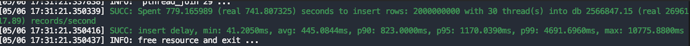
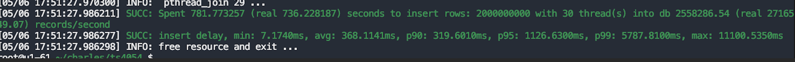
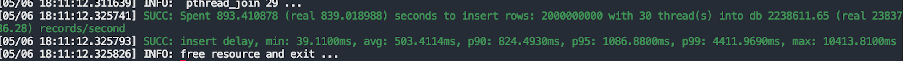
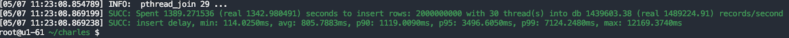
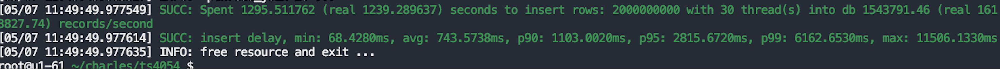

# 优化变长字符串数据写入性能 Test Spec

## 1. 测试目标

测试需求文档：[需求报告：变长字符串性能提升](https://taosdata.feishu.cn/wiki/V5MxwDFbpiz0oHkTs16cDUGCnfC)
本次测试主要验证以下方面：
1. 随着Schema中VARCHAR 数据类型定义长度增加，数据写入速度是否下降，资源占用率是否平稳
2. 优化NCHAR类型数据写入后，对比优化前后相同Schema定义，固定长度的NCHAR字符串写入速度是否有提升

## 2. 变更历史

| Date | Version | Owner | Memo |
| --- | --- | --- | --- |
| 2024-05-07 | 1.0 | Charles |  |

## 3. 测试结论

经测试，Schema中VARCHAR 数据类型定义长度增加，数据写入速度及资源占用相同；优化后，NCHAR数据类型写入速度有小幅提升（约6%）

## 4. 开发质量报告

结论：本特性/优化的开发质量是 优（优，良，一般，差，很差）

| 统计指标 | 数量 |
| --- | --- |
| 提测被拒次数 （测试阻塞，无法进行） | 0 |
| 基础测试用例不通过 | 0 |
| Bug 总数 | 0 |
| 严重 Bug 总数 | 0 |

## 5. 已知问题和限制

无

## 6. 测试资源及环境

192.168.1.35(taosd)：
CPU: Intel(R) Xeon(R) CPU E5-2630 v2 @ 2.60GHz （2）24核
Mem: DDR3  32 GB * 2
Disk: 2792GB
192.168.1.61（客户端）：
CPU: Intel(R) Xeon(R) CPU E5-2650 v3 @ 2.30GHz （2）40核
Mem：DDR4 16GB * 16
Disk:  893GB

## 7. 测试范围及重点

本次测试主要对需求中提到的场景进行复测及性能数据对比；对NCHAR数据类型写入性能对比

## 8. 测试数据 

写入数据均为10000子表，每个子表200000条数据

## 9. 测试用例

| 测试用例No. | 测试用例描述 | 测试用例结果 | 备注 |
| --- | --- | --- | --- |
| 1 | 测试版本：3.0分之最新代码 测试步骤： 1. Schema定义VARCHAR数据类型列，长度分别为8和32k，列值为“taosdata” 1. 使用taosBenchmark写入数据 1. 比较写入数据耗时及写入过程中的资源占用 | 长度为8写入时间：  长度为32k写入时间：  数据写入时间和资源占用基本相同 |  |
| 2 | 测试版本：3.0分之最新代码 测试步骤： 1. 场景一：Schema定义VARCHAR数据类型列，长度为32k，列值为“taosdata”；场景二：Schema定义NCHAR数据类型，长度为8k，列值为“你好” 1. 使用taosBenchmark写入数据 1. 比较写入数据耗时及写入过程中的资源占用 | 场景一写入时间：  场景二写入时间：  场景二较场景一写入时间稍长，资源占用略高 | 经多次测试观察平均值，时间消耗差距约60秒内，资源消耗基本相同 |
| 3 | 测试版本：V3.2.3.0 vs 3.0分支最新代码 测试步骤： 1. Schema定义NCHAR数据类型，长度为8k，列值为“taosdata” 1. 使用taosBenchmark写入数据 1. 比较两个版本写入数据耗时 | V3.2.3.0：  3.0分之最新代码：  3.0分之最新代码较V3.2.3.0版本略有提升 |  |

## 10. 问题

无

## 11. 测试计划 

2024-05-06 - 2024-05-07

## 12. 测试备忘 

无

## 13. 参考文档

[[测试需求] 变长字符串性能](https://taosdata.feishu.cn/wiki/TkmswFTFsivvd4kJ6kIc2QwJned)
[[Test Report] TS-4054 变长字符串性能](https://taosdata.feishu.cn/wiki/SIXiwSVdqiu8mgkf3k8cNElsn5b)
[需求报告：变长字符串性能提升](https://taosdata.feishu.cn/wiki/V5MxwDFbpiz0oHkTs16cDUGCnfC)
