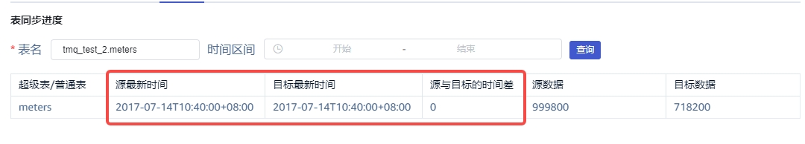

# TD3 到 TD3 的配置和可观测性优化 Test spec

## 1. 测试目标

- 验证TD3 到 TD3 的新增配置项和可观测性的功能

## 2. 变更历史

| Date | Version | Owner | Memo |
| --- | --- | --- | --- |
| 2024.03.14 | 0.1 | 聂敏慧 | Initial Draft |
|  |  |  |  |

## 3. 测试范围

本需求的覆盖范围：
- 验证 TDengine 3 数据源在 explorer 上新增的参数，包括订阅组ID，客户端ID，同步已落盘数据，同步删表操作，同步删数据操作
- 验证 TDengine 3 数据源同步进度选项卡，包括表同步进度和 vgroup 消费进度
- 验证 TDinsight 中 TDengine 3 数据源的同步进度面板
- 测试在 Explorer 和 TDinsight 中进行

## 4. 测试结论

- TDengine 3 数据源任务新增参数，包括订阅组ID，客户端ID，同步已落盘数据，同步删表操作，同步删数据操作，验证通过
- TDengine 3 数据源同步进度选项卡，表同步进度和 vgroup 消费进度存在遗留问题，见第6节
- TDinsight 中 TDengine 3 数据源的同步进度面板验证通过

## 5. 开发质量报告

结论：本优化的开发质量是 良

| 统计指标 | 数量 |
| --- | --- |
| 提测被拒次数 | 0 |
| 基础测试用例不通过 | 0 |
| Bug 总数 | 15 |
| 严重 Bug 总数 | 0 |

## 6. 已知问题和限制

- 如果创建 topic 时带有 with meta, 删除列的操作（Alter）操作，都会从源端会同步到目标端。
- 只有订阅 WAL 的数据，才能查看 vgroup 的消费进度。订阅TSDB 的数据，vgroup 的消费进度查询不到
- 表同步进度中，源/目标最新时间显示的源/目标超级表最近一条数据的时间，可能出现数据源和目标时间差为0，但是数据没有同步完成的情况

- vgroup 消息进度显示的需要重构：

TD-29505

TD-29507

目前存在以下问题：
1. 显示的进度不准确
2. vgroup消费进度，没有清除上次运行的查询结果
3. 两个任务配置成相同的groupid和client id，消费同一个topic，先创建的任务能够消费到数据， 但vgroup消费信息查询显示为空
4. topic 不带with meta，查询vgroup信息为空
- 表同步进度： 
目前存在以下问题
 
TD-29507

两个任务配置成相同的groupid和client id，消费同一个topic，后创建的任务没有消费到数据，但在查询表消费进度的时候报错：[0x2662] 

TD-29925

- 在同步过程中目标库被删除无提示信息：

TD-29559

## 7. 测试环境

- OS: Windows, Linux
- Browser: Chrome

## 8. 测试数据 (Optional)

- 功能测试数据：
db 2个 vgroup, 1个超级表，1w个子表， 50列(int)， tag 1列(double)
topic：子查询topic, 超级表topic（with Meta， 不使用with meta），数据库topic(with meta, 不使用with meta)

## 9. 测试用例

### 9.1 功能

在提测时，开发应保证 basic 类型的用例全部通过。
|  | Description | Expected Results | Result | Jira | Automated | Memo |
| --- | --- | --- | --- | --- | --- | --- |
|  | [basic] 创建TDengine 3 数据源任务，除必填项外，其他配置项使用默认值 | 任务能成功执行，正常同步数据到目标库 | Pass |  |  |  |
|  | 订阅组ID和客户端ID的验证 | 两个任务使用相同的group id和相同client id，两个任务共同消费topic，先创建的任务能够消费到数据 | Pass |  |  |  |
|  |  | 两个任务使用相同的group id和不同的client id，两个任务共同消费topic，先创建的任务能够消费到数据 | Pass |  |  |  |
|  |  | 两个任务配置不同的group id或者该配置项填空, 两个任务分别消费topic | Pass |  |  |  |
|  | 同步已落盘数据的验证 | 开启，同步TSDB和WAL的数据 | Pass |  |  |  |
|  |  | 关闭，只同步WAL的数据 | Pass |  |  |  |
|  | 同步删表操作的验证 | 使用了with meta，开启，源端删除表会同步到目标端 | Pass |  |  |  |
|  |  | 使用了with meta，关闭，源端删除表不会同步到目标端 | Pass |  |  |  |
|  |  | 不使用with meta，开启或关闭此配置项，不会同步删除操作到目标端 | Pass |  |  |  |
|  | 同步删表数据操作的验证 | 使用了with meta，开启，源端删除表数据会同步到目标端 | Pass |  |  |  |
|  |  | 使用了with meta，关闭，源端删除表数据不会同步到目标端 | Pass |  |  |  |
|  |  | 不使用with meta，开启或关闭此配置项，不会同步删除操作到目标端 | Pass |  |  |  |
|  | 同步进度的页面的验证 | 输入超级表名或者子表名，能查询表同步进度 | Pass |  |  |  |
|  |  | 输入超级表名或者子表名，选择时间区间，能查询该时间区间内表同步进度 | Pass |  |  |  |
|  |  | 输入不存在的超级表名或子表名，有提示信息 | Pass |  |  |  |
|  |  | 点刷新按钮，可更新vgroup消费进度 | Fail |  |  |  |
|  |  | 筛选topic 或者 vgroup, 点击刷新，只更新选择的topic/vgroup的消费进度 | Fail |  |  |  |
|  |  | 取消筛选，点击刷新，更新所有vgroup消费进度 | Fail |  |  |  |
|  | 写入失败异常日志的验证，在日志中记录失败的错误信息 | 修改源库表schema，导致同步失败
不是用with meta参数
源库超级表A同步一段时间后，删除超级建表A，然后重建超级表A某一列类型，目标库A还是原来的结构
taosx会报错退出 | Pass |  |  | 04/12 18:03:27.204311 [runner:1539] [task_job_run{task.id=3 job.id=b360e5c4-85ac-4b31-923f-6fea6f2e3d45}] task error: [0] writing data message error: write table with raw block failed: Write raw block into target error after 0x0118 fix: [0x0118] Internal error: `Invalid parameters`: Internal error: `Invalid parameters`, block: Table view with 1 rows, 2 columns, table name "d0"
+-------------------------------+-----+
\| ts                            \| c0  \|
+===============================+=====+
\| 2024-04-12T18:00:15.759+08:00 \| abc \|
+-------------------------------+-----+ |
|  |  | 目标库被删除，导致同步失败 | Fail | [TD-29559](https://jira.taosdata.com:18080/browse/TD-29559) |  |  |
|  |  | 网络异常，导致同步失败 |  |  |  |  |
|  |  | 目标库精度和源库不一致，导致同步失败
ms-> ns
ns -> ms | Pass |  |  |  |
|  |  | taosd/taosadpter异常退出，导致同步失败 | Pass |  |  |  |
|  |  | 磁盘空间不足 | Pass |  |  |  |
|  | TDinsight 面板验证 | 面板上能显示每个任务的vgroup的消费进度 |  |  |  |  |
|  | 性能测试 | 见9.4 |  |  |  |  |

### 9.2 可用性

- UI 是否美观
- 交互是否合理
- 是否存在错别字
- 格式化显示时间

### 9.3 可靠性

无。

### 9.4 性能

- 性能测试数据：
topic：使用 with meta;
1个超级表，50 列 double+1tag double类型，10w个子表，写入1亿条数据
- 测试场景：
2个vgroup,  8个vgroup，32个vgroup，每隔1s, 60s, 120s 查询的性能

### 9.5 安全性

无。

### 9.6 兼容性

测试用例包括但不局限于：
- 升级安装后，老版本（上一个版本）下创建的 TDengine 3 的任务，应该能正常启动执行并查询同步进度。

### 9.7 本地化

测试用例包括但不局限于：
- 点击切换语言按钮后，UI上的所有元素是否按照选择的语言，正确展示

## 10. 问题(Optional)

## 11. Jira

此feature相关的所有Jira, 标题中应包含统一的标签: [taosx tmq], epic：taosx1.6.0
<!-- Unsupported block type: 999 -->

## 12. 测试计划 (Optional)

## 13. 测试备忘 (Optional)

## 14. 参考文档 (Optional)

- [TD3 到 TD3 的配置和可观测性优化](https://taosdata.feishu.cn/wiki/Pqq8wGSMBiKc6xkc6fpcmghznAd)
