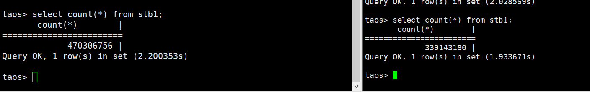

# TDengine 双活 Test Spec

## 1. 测试目标

- TDengine 双活系统的数据同步能够通过 taosx replica 正常地启动、停止
- 在双活系统中，taosX 能够正常地同步数据和 schema 变更
- 当有异常发生时，JDBC driver 能够完成主备切换

## 2. 变更历史

| Date | Version | Owner | Memo |
| --- | --- | --- | --- |
| 03/19/2024 | 0.1 | @王旭 | 初稿 |
| 05/06/2024 | 1.0 | @王旭 | 完善测试报告，补充测试结论。 |

## 3. 测试范围

这里用于描述本需求的覆盖范围：
- 双活系统的运维子命令 taosX replica 的功能
- taosX 在双活场景下的数据、schema 同步功能（数据同步不会成环）
- JDBC Driver 在主备切换场景下的功能

## 4. 测试结论

测试通过。
在构成双活系统的 A, B 两个服务器上，分别执行 taosx replica start 命令，即可开启双向的数据同步；当数据被 taosx replica 创建的任务从 A 同步至 B 时，metadata 中会新增了 source 字段，标记来源为 taosX; 位于 B 上的 taosX 在消费数据时，会使用新增的参数 msg.consume.excluded = 1, 使用这个参数后，消费数据时，会忽略 source 为 taosX 的数据，通过以上机制，可避免数据同步成环；
除了 start 以外，taosx replica 还提供了 stop/restart/status/remove/diff 等命令，可用来控制 replica 任务；
应用层要使用 TDengine 的双活特性时，必须使用 JDBC driver 的 websocket 连接，初始化连接时，必填的参数包括：
- TSDBDriver.PROPERTY_KEY_ENABLE_AUTO_RECONNECT
- TSDBDriver.PROPERTY_KEY_SLAVE_CLUSTER_HOST
- TSDBDriver.PROPERTY_KEY_SLAVE_CLUSTER_PORT
需要注意的是 PROPERTY_KEY_ENABLE_AUTO_RECONNECT 属性必须为 true, slave 配置才会生效，该属性的默认值为 false.

## 5. 开发质量报告

结论：本特性的开发质量是优。
Bug 数量相对于这个 feature 的复杂度来说比较少，而且开发解决了测试中发现的所有问题，无遗留问题，解决问题的效率也比较高。

| 统计指标 | 数量 | 备注 |
| --- | --- | --- |
| 提测被拒次数 | 0 |  |
| 基础测试用例不通过 | 0 |  |
| Bug 总数 | 10 |  |
| 严重 Bug 总数 | 2 | TD-28711 TD-29598 |

## 6. 已知问题和限制

- 目前仅 JDBC driver 的 WebSocket 连接支持双活功能
- 在 TDengine 双活场景下，无法使用 JDBC driver 的数据订阅接口，如果配置了备节点信息，在创建 TaosConsumer 的对象时，就会抛出 SQLException 异常
- 不建议应用程序使用参数绑定的写入和查询方式

## 7. 测试环境

Linux x64
性能测试环境：taosx部署在TDengineA节点上

| 组件 | IP | CPU | MEM |
| --- | --- | --- | --- |
| TDengine A | 192.168.1.62 | 40C | 256G |
| TDengine B | 192.168.1.69 | 40C | 256G |

## 8. 测试数据 (Optional)

这个功能的测试对测试数据没有特殊要求，测试基础数据是使用以下 taosBenchmark 命令生成的：
```bash {wrap}
taosBenchmark --database=mytest --time-step=1000 -t 100 -n 100 -y -Q
```

## 9. 测试用例

### 9.1 功能

有背景色的用例为基础用例，开发同学在提测时，请保证基础用例全部通过，并填写状态。
| 类型 |  | 用例描述 | 期望行为 | 基础用例状态 | 测试状态 | Memo |
| --- | --- | --- | --- | --- | --- | --- |
| 运维命令 | taosx replica start | start 时，使用正确的 -f/-t 参数，原生连接 | 双活系统可以正常启动 |  | Pass |  |
|  |  | start 时，使用正确的 -f/-t 参数，WebSocket 连接 |  |  | Pass |  |
|  |  | start 时，指定数据库 | 指定数据库的双活备份可以正常启动，并返回 replica id |  | Pass |  |
|  |  | start 时，不指定数据库 | 默认在两个系统之间同步除 2 个系统库以及 audit, log 库以外的 DB |  | Pass |  |
|  |  | start 时，可以通过 -i 参数，在原任务上添加一个或多个新的 DB | 能够为新添加的 DB 创建 replica |  | Pass |  |
|  |  | start 时，使用错误的 -f/-t 参数 | 返回错误提示 |  | Pass | Unable to establish connection |
|  |  | start 时，指定错误的数据库 | 返回错误提示 |  | Pass | Database `abc` not exists |
|  |  | start 时，使用错误的 -i 参数 | 返回错误提示 |  | Pass | Database `abc` not exists |
|  |  | 使用相同的 -f/-t 参数，新增一个 DB 再次执行 start 命令 | 返回相同的 replica id
能够创建新增 DB 的 replica |  | Pass |  |
|  |  | start 时，源或/和目标的 taosX 未正常启动 | 会自动启动 taosx |  | Pass |  |
|  |  | start 时，源或/和目标的 TDengine 未正常启动 | 有错误提示 |  | Pass | Error: start replica task 16 failed: `{"code":65535,"message":"[0x000B] Internal error: `Unable to establish connection`: Internal error: `Unable to establish connection`"}` |
|  |  | 两个 TDengine 不都是 3.3.0.0 | 有错误提示 |  | Pass | 当源或目的是老版本的 TDengine 时，均会返回以下错误信息：
Error: Error occurred while creating a new object: [0x011E] Internal error: `Version not compatible` |
|  | taosx replica status | 无参数 | 返回全部 replica id 的信息 |  | Pass |  |
|  |  | 指定一个 replica id | 返回指定 replica id 的信息 |  | Pass |  |
|  |  | 用空格分隔的方式，指定多个 replica id | 返回指定的多个 replica id 的信息 |  | Pass |  |
|  |  | 指定一个错误的 replica id | 返回错误提示 |  | Pass | Error: no replicas endpoint found |
|  |  | 指定多个 replica id 时，分隔符错误 | 返回错误提示 |  | Pass | Error: no replicas endpoint found |
|  | taosx replica stop | 仅指定 id 参数 | 停止指定 id 下所有 DB 的任务 |  | Pass |  |
|  |  | 指定 id 和一个或多个 DB | 停止指定 id 下指定 DB 的任务 |  |  |  |
|  |  | 不使用任何参数 | 返回错误提示 |  | Pass |  |
|  |  | 使用错误的 id 和/或 DB 参数 | 返回错误提示 |  |  |  |
|  | taosx replica restart | 仅指定 id 参数 | 重启指定 id 下所有 DB 的任务 |  | Pass |  |
|  |  | 指定 id 和一个或多个 DB |  |  |  |  |
|  |  | 不使用任何参数 | 返回 usage |  | Pass |  |
|  |  | 使用错误的 id 和/或 DB 参数 |  |  | Pass | Error: no replicas endpoint found, |
|  | taosx replica diff | 仅指定 id 参数 | 能够显示指定 id 下所有 DB 的 diff 信息，且各字段的数据展示正确 |  | Pass |  |
|  |  | 指定 id 和一个或多个 DB |  |  | Pass |  |
|  |  | 不使用任何参数 | 返回 usage |  |  |  |
|  |  | 使用错误的 id 参数 |  |  | Pass | no replicas found by id aaa |
|  |  | 使用错误的 DB 参数 | 返回空列表 |  | Pass |  |
|  | taosx replica remove | 仅指定 id 参数 | 能够移除该任务，通过 status 查看结果 |  | Pass |  |
|  |  | 移除一个运行状态的任务 | 返回错误提示，需要先 stop |  | Pass | [TD-29558](https://jira.taosdata.com:18080/browse/TD-29558) |
| replica 功能测试 | 数据同步 | 启动双活系统后，观察数据同步的结果 | 双向数据正常同步，且从机器 A 同步至机器 B 的数据，不会从 B 同步回 A |  | Pass |  |
|  | schema 同步 | 在机器 A 创建超级表 |  |  | Pass |  |
|  |  | 在机器 A 向超级表写入数据 |  |  | Pass |  |
|  |  | 在机器 A 删除超级表数据 |  |  | Pass | delete from meters; |
|  |  | 在机器 A 删除超级表 |  |  | Pass |  |
|  |  | 在机器 A 修改超级表 |  |  | Pass | 添加删除列 |
|  |  | 在机器 A 创建子表 |  |  | Pass |  |
|  |  | 在机器 A 向子表写入数据 |  |  | Pass |  |
|  |  | 在机器 A 删除子表 |  |  | Pass |  |
|  |  | 在机器 A 删除子表数据 |  |  | Pass | delete from d0; |
|  |  | 在机器 A 创建普通表 |  |  | Pass |  |
|  |  | 在机器 A 向普通表写入数据 |  |  | Pass |  |
|  |  | 在机器 A 向修改普通表 |  |  | Pass |  |
|  |  | 在机器 A 删除普通表数据 |  |  | Pass |  |
|  |  | 在机器 A 删除普通表 |  |  | Pass |  |
| JDBC driver | WebSocket 连接 | 主节点连接信息正确
备节点连接信息未设置 | 可以正常连接主节点 | Pass | Pass |  |
|  |  | 主节点连接信息正确
备节点连接信息正确 | 可以正常连接主节点
与备节点的连接会在测试成功后断开 |  | Pass |  |
|  |  | 主节点连接信息正确
备节点连接信息错误 | 无法正常连接
接口抛出异常 SQLException
不会重试备节点 |  | Pass | 异常中的错误消息：ERROR (0x231d): can't create connection with server |
|  |  | 主节点连接信息错误
备节点连接信息正确 | 无法正常连接
接口抛出异常 SQLException
不会尝试连接备节点 |  | Pass |  |
|  | 非 WebSocket 连接
(Native, REST) | 主节点连接信息正确
备节点连接信息正确 | 可以正常连接主节点
忽略备节点 |  | Pass |  |
|  | 主备切换 | 设置：
重连间隔为 3 秒
重试次数为 3 次
连接建立后：
停止主节点的 taosAdapter | 客户端每隔 3 秒重试一次，重试 3 次后，切换至备节点
日志中应有以上过程的日志，以便测试时确认 | Pass | Pass |  |
|  |  | 设置：
重连间隔为 10 秒
重试次数为 3 次
连接建立后：
短暂停止主节点的taosAdapter
再启动主节点的 taosAdapter | 客户端重试后，可以与主节点建立连接，不会触发主备切换 |  | Pass |  |
|  |  | 设置：
重连间隔为 3 秒
重试次数为 3 次
连接建立后：
先停止备节点的 taosAdapter
再停止主节点的 taosAdapter | 尝试重连主节点 3 次，
尝试连接备节点 3 次，
均失败，抛出 SQLException 异常 |  | Pass | 异常中的错误消息：ERROR (0x2305): Websocket Not Connected Exception |
|  |  | 设置：
重连间隔为 10 秒
重试次数为 3 次
连接建立后：
先停止备节点的 taosAdapter
再停止主节点的 taosAdapter
当尝试重连备节点后，
启动备节点的 taosAdapter | 尝试重连主节点 3 次，失败
备节点第一次连接失败
重试后连接成功 |  | Pass |  |
|  |  | PROPERTY_KEY_ENABLE_AUTO_RECONNECT 为 true | 与主节点的连接断开后，会尝试重连，如果重连失败，可以切换至备节点； |  | Pass |  |
|  |  | PROPERTY_KEY_ENABLE_AUTO_RECONNECT 为 false | 与主节点的连接断开后，即使配置了备节点，也不会重连，返回以下错误：java.sql.SQLException: ERROR (0x2301): Websocket Not Connected Exception |  | Pass |  |
|  |  | 慢查询进行过程中，主节点down了，触发主备切换 | 当前进行中的查询会超时异常(TimeoutException)，在应用层重试后，可以成功 |  | Pass |  |
|  | 数据订阅 | 创建 TaosConsumer 对象时，
指定 slaveClusterHost 参数 | new TaosConsumer() 时会抛出 SQLException | Pass | Pass | Consumer ERROR (0x2374): slaveClusterHost is not supported in consumer param |
| 综合用例 |  | 启动双活系统，对主节点持续写入数据，客户端与主节点连接，进行 CRUD 操作，触发主备切换 | 在主备切换过程中，API 的调用会抛出 timeout 异常，主备切换完成后，API 正常调用 |  | Pass |  |

### 9.2 异常参数启动

表格中的时间为以无效的参数启动后，多长时间命令行会返回错误：

|  | 无效的 FQDN | 无效的 Port | 有效的非 taosd Port | 有效的非 taosd Port && port == 6041 |
| --- | --- | --- | --- | --- |
| Native | 28s | 21s | 21s | 不会返回 |
| websocket | 3s | 0s | 0s | / |

Native 报错：
```java {wrap}
Error: Error occurred while creating a new object: [0x000B] Internal error: `Unable to establish connection`

Caused by:
    0: [0x000B] Internal error: `Unable to establish connection`
    1: Internal error: `Unable to establish connection`
```

Websocket 报错：
```java {wrap}
* replicating database: `mytest`
Error: Database `mytest` not exists in http://192.168.1.11:6041
taosx replica start -f http://192.168.1.11:6041 -t http://192.168.2.19:6041
```

### 9.3 可用性

n/a

### 9.4 可靠性

在双活系统中，如果应用与主节点的连接断开，就会自动触发重连，当重连失败后，可自动实现主备切换，增强了系统的可靠性。

### 9.5 性能

由于采用的是 active-standby 模式，双活系统与单台服务器的性能一致。
（1）Schema: 10列 int型，100万子表，共计10亿条，interlace=1写入方式
通过count(*) 查询超级表的方式，查看当主节点（1.62）写入4.7亿条时，备节点（1.69）写入条数大约3.4亿，换算同步效率约为**72%**


（2）中核20w子表场景：20w interlace=1 @ 1hz  &  500 interlace=100 @ 1000hz

### 9.6 安全性

n/a

### 9.7 兼容性

组成双活系统的两台服务器的版本必须为 3.3.0.0+

### 9.8 本地化

n/a

## 10. 问题(Optional)

无

## 11. Jira

此feature相关的所有Jira, 标题中应包含统一的标签: active-standby
<!-- Unsupported block type: 999 -->

## 12. 测试计划 (Optional)

JDBC driver: 03/26 - 04/01
taosx replica: 04/08 - 04/17

## 13. 测试备忘 (Optional)

- 连接时的重试配置，在建立连接时是不生效的，也就是说，在建立连接节点，尝试连接主、备节点时，不会重试
- 使用 TAOS-RS 时，batchfetch = true, 则开启 WebSocket
- 为了增强可观测性，JDBC driver 的日志中，应打印主备切换过程的日志，但不能包含连接时使用的用户名、密码等信息；以下是正常的主备切换过程：
```bash {wrap}
loop 3
timestamp = 2018-10-03 14:38:05.5
timestamp = 2018-10-03 14:38:16.6
timestamp = 2018-10-03 14:38:05.0
17:33:32.910 [WebSocketConnectReadThread-15] ERROR com.taosdata.jdbc.ws.WSClient -- disconnect uri: ws://192.168.2.11:6041/ws,  code : 1006 , reason: , remote: true
loop 4
17:33:42.515 [WebSocketConnectReadThread-23] DEBUG com.taosdata.jdbc.ws.WSClient -- disconnect uri: ws://192.168.2.11:6041/ws,  code : -1 , reason: Connection refused (Connection refused), remote: false
17:33:45.528 [WebSocketConnectReadThread-24] DEBUG com.taosdata.jdbc.ws.WSClient -- disconnect uri: ws://192.168.2.11:6041/ws,  code : -1 , reason: Connection refused (Connection refused), remote: false
17:33:48.548 [WebSocketConnectReadThread-25] DEBUG com.taosdata.jdbc.ws.WSClient -- disconnect uri: ws://192.168.2.11:6041/ws,  code : -1 , reason: Connection refused (Connection refused), remote: false
17:33:51.556 [main] DEBUG com.taosdata.jdbc.ws.Transport -- reconnect failed to ws://192.168.2.11:6041/ws
17:33:51.596 [main] DEBUG com.taosdata.jdbc.ws.Transport -- reconnect success to ws://192.168.2.19:6041/ws
timestamp = 2018-10-03 14:38:05.5
timestamp = 2018-10-03 14:38:16.6
timestamp = 2018-10-03 14:38:05.0
```

- 以下客户端与主节点断开连接后，触发重试，并再次与主节点连接，未主备切换的过程：
```bash {wrap}
loop 1
timestamp = 2018-10-03 14:38:05.0
timestamp = 2018-10-03 14:38:15.0
timestamp = 2018-10-03 14:38:16.8
18:31:44.843 [WebSocketConnectReadThread-15] ERROR com.taosdata.jdbc.ws.WSClient -- disconnect uri: ws://192.168.2.11:6041/ws,  code : 1006 , reason: , remote: true
loop 2
18:31:48.831 [WebSocketConnectReadThread-23] DEBUG com.taosdata.jdbc.ws.WSClient -- disconnect uri: ws://192.168.2.11:6041/ws,  code : -1 , reason: Connection refused (Connection refused), remote: false
18:31:58.847 [WebSocketConnectReadThread-24] DEBUG com.taosdata.jdbc.ws.WSClient -- disconnect uri: ws://192.168.2.11:6041/ws,  code : -1 , reason: Connection refused (Connection refused), remote: false
18:32:08.887 [main] DEBUG com.taosdata.jdbc.ws.Transport -- reconnect success to ws://192.168.2.11:6041/ws
timestamp = 2018-10-03 14:38:05.0
timestamp = 2018-10-03 14:38:15.0
timestamp = 2018-10-03 14:38:16.8
```

- 以下是主节点发生异常，先尝试重连主节点，重连失败后，再尝试重连备节点，但也失败的过程：
```bash {wrap}
loop 2
timestamp = 2018-10-03 14:38:05.5
timestamp = 2018-10-03 14:38:16.6
timestamp = 2018-10-03 14:38:05.0
18:49:07.828 [WebSocketConnectReadThread-15] ERROR com.taosdata.jdbc.ws.WSClient -- disconnect uri: ws://192.168.2.11:6041/ws,  code : 1006 , reason: , remote: true
loop 3
18:49:12.262 [WebSocketConnectReadThread-23] DEBUG com.taosdata.jdbc.ws.WSClient -- disconnect uri: ws://192.168.2.11:6041/ws,  code : -1 , reason: Connection refused (Connection refused), remote: false
18:49:15.280 [WebSocketConnectReadThread-24] DEBUG com.taosdata.jdbc.ws.WSClient -- disconnect uri: ws://192.168.2.11:6041/ws,  code : -1 , reason: Connection refused (Connection refused), remote: false
18:49:18.289 [WebSocketConnectReadThread-25] DEBUG com.taosdata.jdbc.ws.WSClient -- disconnect uri: ws://192.168.2.11:6041/ws,  code : -1 , reason: Connection refused (Connection refused), remote: false
18:49:21.293 [main] DEBUG com.taosdata.jdbc.ws.Transport -- reconnect failed to ws://192.168.2.11:6041/ws
18:49:21.302 [WebSocketConnectReadThread-26] DEBUG com.taosdata.jdbc.ws.WSClient -- disconnect uri: ws://192.168.2.19:6041/ws,  code : -1 , reason: Connection refused (Connection refused), remote: false
18:49:24.315 [WebSocketConnectReadThread-27] DEBUG com.taosdata.jdbc.ws.WSClient -- disconnect uri: ws://192.168.2.19:6041/ws,  code : -1 , reason: Connection refused (Connection refused), remote: false
18:49:27.327 [WebSocketConnectReadThread-28] DEBUG com.taosdata.jdbc.ws.WSClient -- disconnect uri: ws://192.168.2.19:6041/ws,  code : -1 , reason: Connection refused (Connection refused), remote: false
18:49:30.333 [main] DEBUG com.taosdata.jdbc.ws.Transport -- reconnect failed to ws://192.168.2.19:6041/ws
Connection failed: java.sql.SQLException: ERROR (0x2305): Websocket Not Connected Exception
```

- 以下是主节点异常后，触发主备切换，备节点第一次没有连接成功，经重试以后，成功连接备节点的场景：
```bash {wrap}
loop 2
timestamp = 2018-10-03 14:38:05.0
timestamp = 2018-10-03 14:38:15.0
timestamp = 2018-10-03 14:38:16.8
19:42:56.117 [WebSocketConnectReadThread-15] ERROR com.taosdata.jdbc.ws.WSClient -- disconnect uri: ws://192.168.2.11:6041/ws,  code : 1006 , reason: , remote: true
loop 3
19:42:59.102 [WebSocketConnectReadThread-23] DEBUG com.taosdata.jdbc.ws.WSClient -- disconnect uri: ws://192.168.2.11:6041/ws,  code : -1 , reason: Connection refused (Connection refused), remote: false
19:43:09.116 [WebSocketConnectReadThread-24] DEBUG com.taosdata.jdbc.ws.WSClient -- disconnect uri: ws://192.168.2.11:6041/ws,  code : -1 , reason: Connection refused (Connection refused), remote: false
19:43:19.137 [WebSocketConnectReadThread-25] DEBUG com.taosdata.jdbc.ws.WSClient -- disconnect uri: ws://192.168.2.11:6041/ws,  code : -1 , reason: Connection refused (Connection refused), remote: false
19:43:29.143 [main] DEBUG com.taosdata.jdbc.ws.Transport -- reconnect failed to ws://192.168.2.11:6041/ws
19:43:29.150 [WebSocketConnectReadThread-26] DEBUG com.taosdata.jdbc.ws.WSClient -- disconnect uri: ws://192.168.2.19:6041/ws,  code : -1 , reason: Connection refused (Connection refused), remote: false
19:43:39.213 [main] DEBUG com.taosdata.jdbc.ws.Transport -- reconnect success to ws://192.168.2.19:6041/ws
timestamp = 2018-10-03 14:38:05.0
timestamp = 2018-10-03 14:38:15.0
timestamp = 2018-10-03 14:38:16.8
```

## 14. 参考文档 (Optional)

- [TDengine 双活 ](https://taosdata.feishu.cn/wiki/E9NmwBfIbiTA5bkq8kScFX0yn8c)
