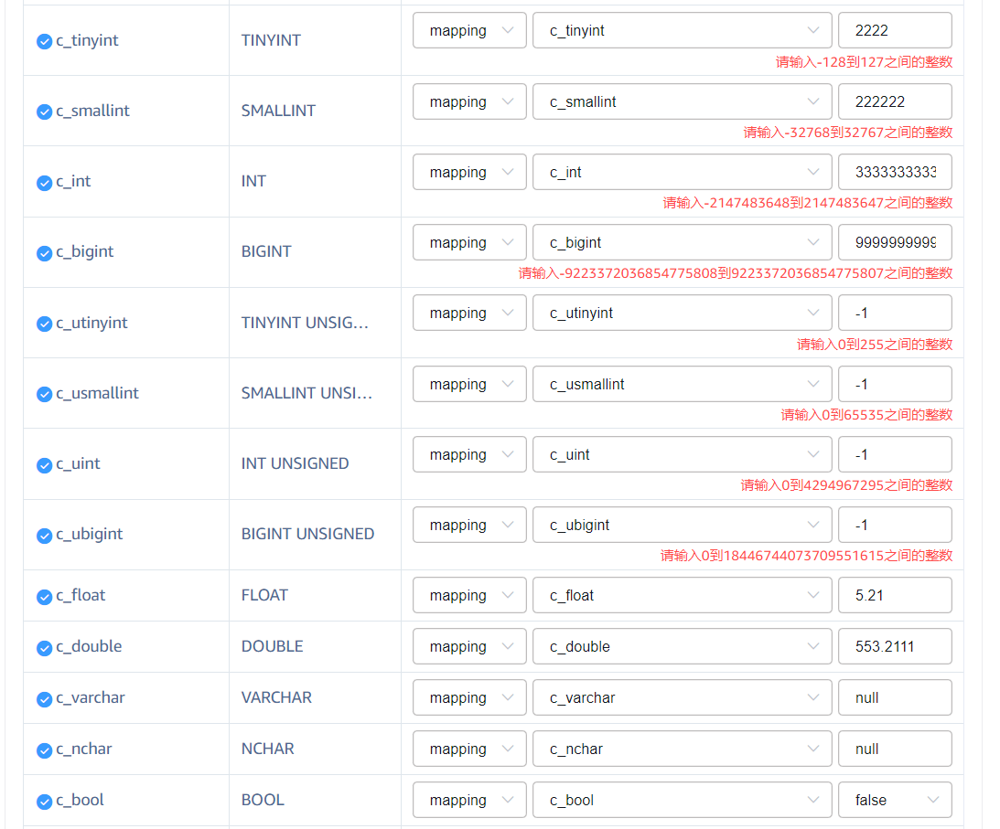
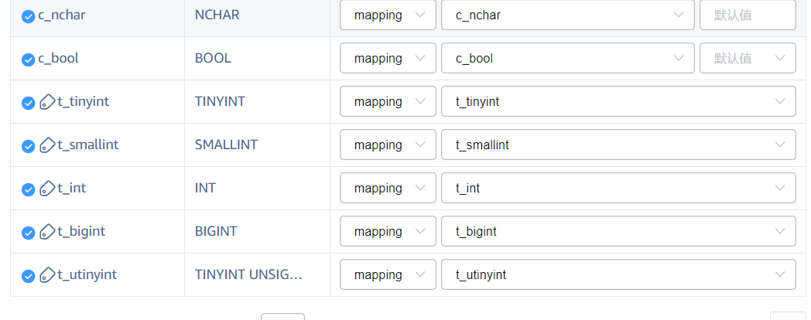

# Transformer 支持配置 mapping 默认值 Test Spec

## 1. 测试目标

- 验证映射类型为 mapping 时，explorer 提供指定列的默认值，在消息中不含该列时，将默认值作为 value 值写入 TDengine 指定列

## 2. 变更历史

| Date | Version | Owner | Memo |
| --- | --- | --- | --- |
| 2024.03.21 | 1.0 | @贾晨阳 |  |

## 3. 测试范围

- 验证映射类型为 mapping 时，explorer 提供指定列的默认值，并在消息中不含该列时，将默认值作为 value 值写入 TDengine
- 验证指定列类型默认值写入 TDengine 的正确性
- 验证 UI 界面对异常操作的防错处理

## 4. 变更历史

无。

## 5. 测试结论

以mqtt任务为测试输入，分别在含 agent 和不含 agent 情况下对 mapping 默认值进行了验证。
以下为验证结果：
1. 配置了默认值的mapping字段，在消息不含该字段时会写入默认值到 TDengine，符合预期；
2. 配置了默认值的mapping字段，在消息含该字段且字段内容合法时会正常写入到 TDengine，符合预期；
3. 配置了默认值的mapping字段，在消息含该字段但字段内容不合法（超边界、精度不一致）时会写入null值到TDengine，与原有行为一致；
4. 未配置默认值的mapping字段，在消息中不含该字段时会写入 null 值到 TDengine，与原有行为一致；
遗留问题：见第 7 章节

## 6. 开发质量报告

结论：良

| 统计指标 | 数量 |
| --- | --- |
| 提测被拒次数 | 0 |
| 基础测试用例不通过 | 0 |
| Bug 总数 | 2 + 1 improvement |
| 严重 Bug 总数 | 0 |

## 7. 已知问题和限制

1. 当前不支持 json 格式(tag列）的mapping
  TD-29342


## 8. 测试环境

- OS: Windows, Linux
- Browser: Chrome
- taosx、taos-explorer 运行环境：192.168.2.10
- 本次测试使用的数据源为MQTT，MQTT数据源配置：192.168.1.42:1883 ，topic = tp1::0

## 9. 测试数据 (Optional)

MQTT消息样例：
```json
{
  "time":1686108545761,
  "c_tinyint": 5,
  "c_smallint": 123,
  "c_int": 100,
  "c_bigint": 66663,
  "c_utinyint": 9,
  "c_usmallint": 100,
  "c_uint": 100,
  "c_ubigint": 66663,
  "c_float": 111.55,
  "c_double": 154.188,
  "c_varchar": "China",
  "c_nchar": "涛思数据",
  "c_bool": True,
  "c_time": 1686108545761,
  "t_tinyint": 5,
  "t_smallint": 123,
  "t_int": 100,
  "t_bigint": 66663,
  "t_utinyint": 9,
  "t_usmallint": 100,
  "t_uint": 100,
  "t_ubigint": 66663,
  "t_float": 111.55,
  "t_double": 154.188,
  "t_varchar": "China",
  "t_nchar": "涛思数据",
  "t_bool": True,
  "t_time": 1686108545761
}

```

在 TDengine 中提前创建超级表：
```sql
taos> describe stb_test;
             field              |          type          |   length    |        note        |
=============================================================================================
 ts                             | TIMESTAMP              |           8 |                    |
 c_tint                         | TINYINT                |           1 |                    |
 c_sint                         | SMALLINT               |           2 |                    |
 c_int                          | INT                    |           4 |                    |
 c_bint                         | BIGINT                 |           8 |                    |
 c_utint                        | TINYINT UNSIGNED       |           1 |                    |
 c_usint                        | SMALLINT UNSIGNED      |           2 |                    |
 c_uint                         | INT UNSIGNED           |           4 |                    |
 c_ubint                        | BIGINT UNSIGNED        |           8 |                    |
 c_float                        | FLOAT                  |           4 |                    |
 c_double                       | DOUBLE                 |           8 |                    |
 c_bool                         | BOOL                   |           1 |                    |
 c_varchar                      | VARCHAR                |          64 |                    |
 c_nchar                        | NCHAR                  |          64 |                    |
 c_ts                           | TIMESTAMP              |           8 |                    |
 t_tint                         | TINYINT                |           1 | TAG                |
 t_sint                         | SMALLINT               |           2 | TAG                |
 t_int                          | INT                    |           4 | TAG                |
 t_bint                         | BIGINT                 |           8 | TAG                |
 t_utint                        | TINYINT UNSIGNED       |           1 | TAG                |
 t_usint                        | SMALLINT UNSIGNED      |           2 | TAG                |
 t_uint                         | INT UNSIGNED           |           4 | TAG                |
 t_ubint                        | BIGINT UNSIGNED        |           8 | TAG                |
 t_float                        | FLOAT                  |           4 | TAG                |
 t_double                       | DOUBLE                 |           8 | TAG                |
 t_bool                         | BOOL                   |           1 | TAG                |
 t_varchar                      | VARCHAR                |          64 | TAG                |
 t_nchar                        | NCHAR                  |          64 | TAG                |
 t_ts                           | TIMESTAMP              |           8 | TAG                |
Query OK, 29 row(s) in set (0.001550s)

```

## 10. 测试用例

### 10.1 功能

在提测时，开发应保证 basic 类型的用例全部通过。
|  | Description | Expected Results | result for developer | Result | Jira | Automated | Memo |
| --- | --- | --- | --- | --- | --- | --- | --- |
| basic | 1.基础数据类型（int，float，varchar）配置默认值后，创建MQTT任务。
2.通过broker发送消息，消息中不含配置默认值的字段的数据 | 写入TDengine的数据中，配置默认值的mapping列的值均与配置的默认值一致 | Pass | Pass |  |  |  |
|  | 1.全数据类型覆盖，配置有效默认值，创建MQTT任务。
1. 通过broker发送消息，消息中不含配置默认值的字段数据 | 写入TDengine的数据中，配置默认值的mapping列的值均与配置的默认值一致 |  | Pass |  |  |  |
|  | 1.全数据类型覆盖，配置有效默认值，创建MQTT任务。
1. 通过broker发送消息，消息中含配置默认值的字段数据 | 写入TDengine的数据中，配置默认值的mapping列的值为消息中实际传入的值 |  | Pass |  |  |  |
|  | 1.全数据类型覆盖，配置有效默认值，创建MQTT任务。
1. 通过broker发送消息，消息中不含配置默认值的字段数据 | 写入TDengine的数据中，配置默认值的mapping列的值均与配置的默认值一致 |  | Pass |  |  |  |
|  | 1.全数据类型覆盖，配置有效默认值，创建MQTT任务。
1. 通过broker发送消息，消息中字段数据在默认值边界外 | 消息写入成功，字符串类型会自动增大长度，数字类型的处理均为写入null值 |  | Pass |  |  | 当前实现中，在消息字段中数值超限的前提下，无论transformer是否有默认值，数字类型的字段最终都会写入null值，该行为符合设计预期 |
|  | 1.全数据类型覆盖，配置默认值不满足数据类型要求（超出类型数据边界、输入不合法字符等）。 | 前端校验报错，配置不成功 |  | Pass |  |  |  |
|  | 1.全数据类型覆盖，第一次创建MQTT任务时不配置默认值。
2.通过broker发送消息，消息中不含对应列的字段 | 对应列写入TDengine中的值为Null（这是原有行为，本次应兼容） |  | Pass |  |  |  |
|  | 1.全数据类型覆盖，第一次创建MQTT任务时配置默认值为NULL。
2.通过broker发送消息，消息中不含对应列的字段 | 对应列写入TDengine中的值为NULL |  | Pass |  |  |  |

### 10.2 可用性

以下是针对 UI 界面的一些测试项，有部分为个人理解上的易用性测试：
1. 输入框输入的值不合法时，标红报错并给出取值范围 √


1. 主键时间戳和tag列不支持配置mapping下的默认值，在该模式下没有相应输入框 √


### 10.3 可靠性

这里用于描述稳定性测试相关的内容。

### 10.4 性能

无

### 10.5 安全性

无

### 10.6 兼容性

无

### 10.7 本地化

无

## 11. 问题(Optional)

1. 在 TDengine 中定义了一个 int 型的列，同时在 transformer 中指定的默认值，但是 mqtt 消息中该字段的值超出了 int 的范围，此时的行为应该是什么？统一写入null值
1. 
  TD-29376

1. UI相关优化：
  TD-29351

## 12. Jira

## 13. 测试计划 (Optional)

见 [3.3.0.0 开发计划追踪](https://taosdata.feishu.cn/wiki/U4KbwxWBii31aJkNRuYcL43RnAh)

## 14. 测试备忘 (Note)

1. 当 transformer 中的列包含了复合主键时怎么处理？暂不考虑

## 15. 参考文档 (Optional)

这里用于添加对该需求测试有帮助的文档链接：
- [Transformer：支持配置 mapping 默认值](https://taosdata.feishu.cn/wiki/SgUMwbP65iiKVMkurZ8cxbhUnhc)
