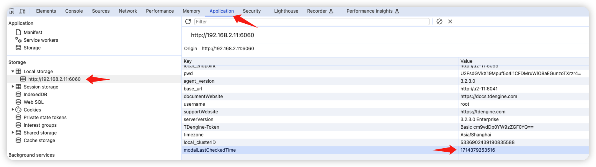

# taosExplorer 社区版 Test Spec

## 1. 测试目标

在 TDengine 社区版版中，首次引入了 taosExplorer 组件，通过该组件：
1. 我们可以收集社区用户的信息，包括手机号、邮箱等信息
2. 用户可以通过 taosExplorer 使用 TDengine 的基本功能

## 2. 变更历史

| Date | Version | Owner | Memo |
| --- | --- | --- | --- |
| 2024.04.11 | 0.1 | 王旭 | initial draft |
| 2024.05.06 | 0.2 | 王旭 | 完善报告，补充测试结论 |

## 3. 测试范围

- 可通过注册功能可收集用户信息
- 可通过系统提示引导用户使用企业版
- 可对社区版不支持的功能进行限制
- 可使用社区版提供的功能
- 可在以下平台 Linux x64/arm64, macOS 完成安装、卸载，以及服务的启动、停止

## 4. 测试结论

测试通过，在安装完成后，按照安装包的提示，启动 taosExplorer 组件，然后在浏览器输入 http://<ip>:6060/ 即可访问社区版的 Explorer.
第一次访问时，需要进行用户信息的注册。如果浏览器语言设置为中文，则会提示使用手机号注册；如果浏览器的语言设置为英文，则会提示使用邮箱注册。注册过程中，需要安装的服务器能够访问 Internet. 会要求用户输入图片验证码和短信、邮箱验证码。用户的注册信息，会写入云服务提供的 MySQL 数据库中，以备市场部使用。
用户完成注册后，即可使用 TDengine 默认的用户名和密码登录 (root/taosdata)，并使用 TDengine 的基本功能。数据写入、备份、数据同步等功能是由 taosX 提供的，在社区版 Explorer 上无法使用。
此外，社区版 Explorer 每隔 7 天，在登录时还会弹出系统提示，提示用户了解企业版的功能，用户点击系统提示中的“联系”按钮，可跳转至官网的企业版咨询页面。

## 5. 开发质量报告

结论：本特性的开发质量是一般，主要问题有：
1. 有些细节在 FS 中没有体现出来，是在测试中发现并确认的，例如：系统提示的检查方式，与云服务的通信机制等，可以在 FS 附录中，补充必要的实现细节，以便我们在测试时了解；
2. 在设计阶段，遗漏了对注册用户信息的保存 (td_community_user 表)，这个也是在测试阶段发现问题后补充的，以后应尽量在设计阶段，把问题考虑全面；
3. 几个主要的功能，例如注册、系统提示等，在测试中均有问题，需要加强自测和与云服务的联调；
4. 这个功能涉及到和云服务接口的联调、以及安装包的改动，这种涉及外部依赖的功能，要引起重视，要加强与外部的沟通，划分好边界。

| 统计指标 | 数量 | 备注 |
| --- | --- | --- |
| 提测被拒次数 | 1 | 提测时，由于 API URL 错误，导致注册页面无法展示 |
| 基础测试用例不通过 | 2 | 注册 系统提示 |
| Bug 总数 | 15 |  |
| 严重 Bug 总数 | 4 |  |

## 6. 已知问题和限制

- 数据订阅、流计算等页面，UI 上提供的链接仍为联机的企业版文档，目前已无效，以后将链接至官网文档；工具页面提供的客户端下载链接仍为企业版客户端下载链接，需要替换为社区版客户。详见：
  TD-29905

- 在数据浏览器中无法删除 DB, 详见：
  TD-29909

## 7. 测试环境

- OS: Windows, Linux, macOS
- Browser: Chrome

## 8. 测试数据 (Optional)

n/a

## 9. 测试用例

### 9.1 功能

提测时，请保证用背景色标注的用例全部通过。
| Type | Description | Steps | Exptectation | Result | Memo |
| --- | --- | --- | --- | --- | --- |
| 用户注册 | 安装后首次登录 Explorer 需要注册 |  | 展示注册使用页面 | Pass |  |
|  | 注册后再次登录无需注册 |  | 展示登录页面 | Pass |  |
|  | 可使用手机号注册 |  | 能够完成注册 | Pass | 测试时，可通过删除已注册的标记文件来反复注册 |
|  | 可使用邮箱注册 |  | 能够完成注册 | Pass |  |
|  | 使用正确的验证码可以完成注册 |  |  | Pass |  |
|  | 使用过期的验证码无法完成注册 |  |  | Pass |  |
|  | 注册时输入错误的验证码无法完成注册 |  | 不能完成注册
提示验证码错误 | Pass |  |
|  | 在无法访问互联网的环境中注册 |  | 页面上应有错误提示 | Pass | [TD-29744](https://jira.taosdata.com:18080/browse/TD-29744) |
| 系统消息 | 首次登录可以弹出系统提示按钮 |  |  | Pass |  |
|  | 直接关闭系统提示，则每次登录均会有系统提示 |  |  | Pass |  |
|  | 勾选“7天内不再提醒” |  | 7天后再登录才会提醒 | Pass | [TD-29743](https://jira.taosdata.com:18080/browse/TD-29743) |
|  | 可点击系统消息中的联系按钮 |  | 跳转至官网的联系页面 |  |  |
| 数据写入 | 可进入任务创建页面
鼠标悬浮在连通性检查按钮上时出现 tooltip 提示，点击 tooltip 中的 URL 可跳转至官网文档 |  |  | Pass | [TD-29770](https://jira.taosdata.com:18080/browse/TD-29770) |
| 系统管理 | 无法创建用户 |  |  | Pass |  |
|  | 无法创建备份 |  |  | Pass |  |
|  | 无法创建数据同步 |  |  | Pass |  |
|  | 无法点击激活 |  | 激活按钮置灰 | Pass |  |
|  | 无法使用审计功能 |  | 导出按钮置灰 | Pass |  |
| 社区版功能 | 可正常使用社区版提供的功能 |  |  | Pass |  |
| 安装包测试 | 安装完成后，Explorer 可正常使用 |  | Explorer 能够正常安装并启动
/etc/taos/explorer.toml 文件中，应包含线上环境的 cloud_open_api 配置 | Pass |  |
|  | 卸载时，如果选择删除配置和数据，应将注册标记文件移除：/etc/taos/explorer-register.cfg |  |  | Pass |  |
|  | Linux x64 安装包的基本功能，包括安装和卸载等 |  |  | Pass |  |
|  | Linux arm64 安装包的基本功能 |  |  | Pass |  |
|  | macOS 安装包的基本功能 |  |  | Pass |  |

### 9.2 可用性

测试用例包括但不局限于：
- UI是否美观？
- 交互是否合理？
- 字体、字号是否合适？
- 是否存在错别字？
以上检查均通过。

### 9.3 可靠性

 n/a

### 9.4 性能

n/a

### 9.5 安全性

n/a

### 9.6 兼容性

老版本的安装包中，不包含 taosExplorer 组件；
但如果使用新版本的安装包完成安装后，修改 explorer.toml 中 taosAdapter 的配置为老版本的地址，也是可以使用的。

### 9.7 本地化

- 注册、登录页面，根据浏览器的语言设置进行中英文的显示；
- 中文环境下，使用手机号注册；英文环境下，使用邮箱注册。

## 10. 问题(Optional)

无

## 11. Jira

此feature相关的所有Jira, 标题中应包含统一的标签: explorer-community
<!-- Unsupported block type: 999 -->

## 12. 测试计划 (Optional)

## 13. 测试备忘 (Optional)

- build 时需要添加以下环境变量：
```rust {wrap}
export VUE_APP_COMMUNITY=community

yarn
yarn build:bin
```

- explorer.toml 中新增了配置项，默认情况下不需要配置，Explorer 会根据浏览器的语言设置，调用国内、海外的 API; 测试中可以通过以下配置，将 URL 配置为预生产环境：
```bash {wrap}
cloud_open_api = "https://pre.ali.cloud.taosdata.com/openapi"
```

- 注册时调用的接口为：/verification-code
- 是否注册过的标识记录在以下文件中：/etc/taos/explorer-register.cfg, 前端根据 /api/-/isbinding 接口的返回中，data 字段的值来展示登录还是注册，data 为 true 时，展示登录：
```bash {wrap}
{"code":0,"data":true,"msg":null}
```

- 登录时才会触发系统提示，下次提示的时间记录在浏览器的 local storage 中：


- 用户的注册信息，可以在以下 DB 可以查看：
  - region:
    - 国内：阿里云
    - 海外：AWS
  - DB: mgmt2
  - Table: td_community_user
- Update 20240520
  - 注册时新增了姓名字段
  - 在 MySQL 数据库的 td_community_user 表中，新增了 name 和 instance_id 字段 (cluster id)
  - explorer 新增了 /taosd-info 接口：td_community_user 表中的 taosd_version 和 instance_id 这两个字段，需要登录后才能获取，之前 taosd_version 有问题，本次更新做了修复；注册后，首次登录，会调用新增的 /taosd-info 接口，写入以上两个字段的信息

## 14. 参考文档 (Optional)

- [taos-explorer 社区版](https://taosdata.feishu.cn/wiki/DItswBcHciHfpPkJJIXcjbw5n0D)
