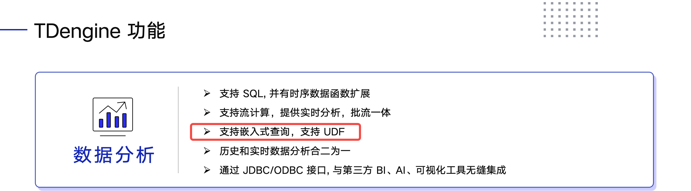
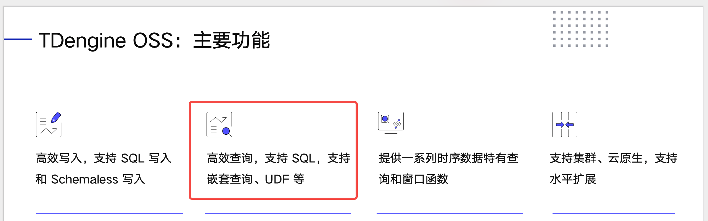
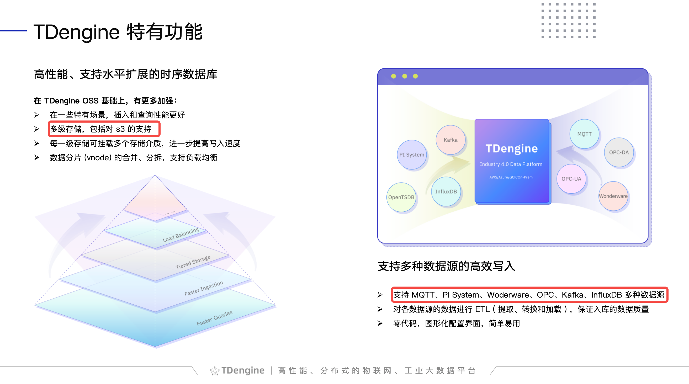

# 3.3.0.0 PPT 修改

在 20240312 PPT 基础上修改

### 1. 第 20 页

“支持嵌入式查询，支持 UDF” 修改为“支持嵌套查询、关联查询，支持 UDF”

### 2. 第 31 页

“高效查询，支持 SQL，支持嵌套查询、UDF”等修改为“高效查询，支持 SQL，支持嵌套查询、关联查询、UDF”

### 3. 第 34 页

“多级存储，包括对 s3 的支持”修改为大写“多级存储，包括对 S3 的支持”
“支持 MQTT、PI System、Woderware、OPC、Kafka、InfluxDB 多种数据源”修改为“支持 MQTT、PI System、Wonderware、OPC、Kafka、InfluxDB、MySQL、PostgreSQL、Oracle、SQL Server 多种数据源”
