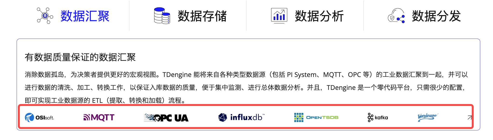
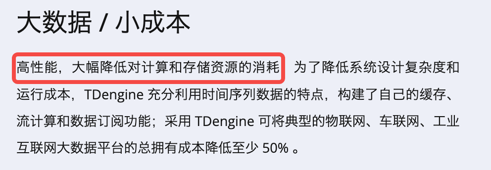
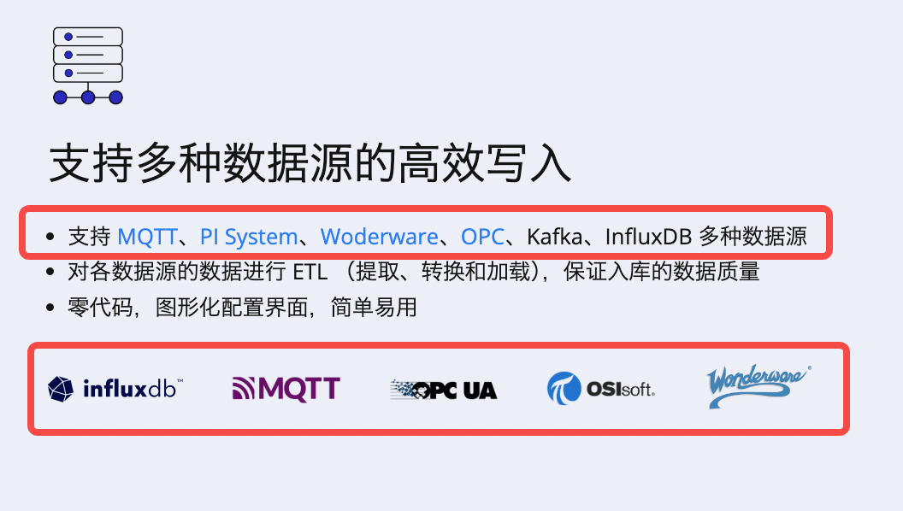
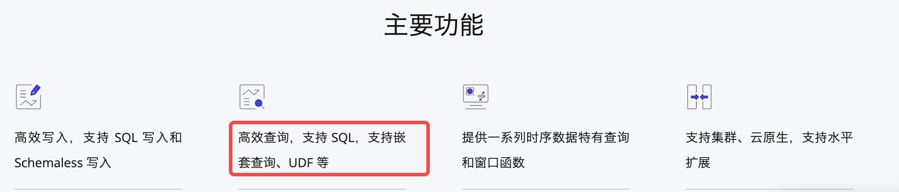

# 3.3.0.0 官网修改

### 1. 第一项

增加：MySQL、PostgreSQL、Oracle、SQL Server 

### 2. 第二项

“高性能，大幅降低对计算和存储资源的消耗” -> “高性能，提供多种压缩算法，大幅降低对计算和存储资源的消耗”

### 3. 第三项

“支持 [MQTT](https://www.taosdata.com/mqtt)、[PI System](https://www.taosdata.com/tdengine-pi-connector)、[Woderware](https://www.taosdata.com/aveva-historian-connector)、[OPC](https://www.taosdata.com/plc-opc-tdengine)、Kafka、InfluxDB 多种数据源” -> “支持 [MQTT](https://www.taosdata.com/mqtt)、[PI System](https://www.taosdata.com/tdengine-pi-connector)、[Woderware](https://www.taosdata.com/aveva-historian-connector)、[OPC](https://www.taosdata.com/plc-opc-tdengine)、Kafka、InfluxDB MySQL、PostgreSQL、Oracle、SQL Server 等多种数据源 ”
增加一些数据源的 Logo

### 4. 第四项

“高效查询，支持 SQL，支持嵌套查询、UDF 等” -> “高效查询，支持 SQL，支持嵌套查询、关联查询、UDF 等”

