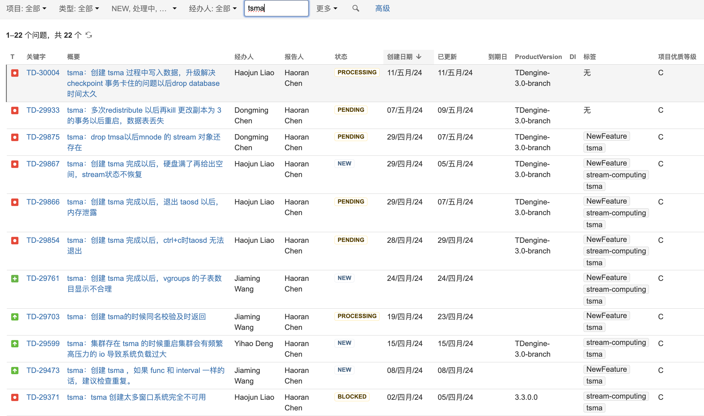

# 3.3.0.0 版本状态（0512）

## 1. 功能完成情况

| 序号 | 功能项 | 验收结论 | 遗留问题 |
| --- | --- | --- | --- |
| 1 | 时序数据 Join | 已完成 | - |
| 2 | 复合主键 | 已完成 | 1. TD-29813 1. TD-29819 1. TD-29745 1. TD-29964 1. TD-29980 |
| 3 | TDengine 双活 | 已完成 | - |
| 4 | TDengine 双副本 | 已完成 | - |
| 5 | TSMA | 已完成 | 遗留问题在 Pending 和 Block 状态较多，和流计算密切相关，可以在 jira 中搜索 tsma 按创建时间排序查看  |
| 6 | 存储压缩增强 | 已完成 | TD-29791 TD-29724 |
| 7 | S3 | 已完成 | - |
| 8 | Count Window | 已完成 | - |
| 9 | 数据库加密 | 已完成 | TD-29772 |
| 10 | 普通列和标签列写入行为统一 | 已完成 | - |
| 11 | VARCHAR 性能优化 | 已完成 | - |
| 12 | 区分企业版和社区版的日志 | 已完成 | - |
| 13 | Oracle 时序数据 -> 3.0 | 延期 | 04.24 产品会议已经说明 |
| 14 | MySQL -> 3.0 | 已完成 |
| 15 | PostgreSql -> 3.0 | 已完成 |
| 16 | 数据备份：支持定时任务 | 延期 | 04.24 产品会议没有说明 |
| 17 | Explorer 开源版 | 已完成 | - |
| 18 | taos shell 加上开源版提示 | 已完成 | - |
| 19 | TD3->TD3 的优化 （新增，中石化） | 已完成 | 1. TD-29505 1. TD-29507 1. TD-29925 1. TD-29559 |
| 20 | OPC CSV 配置合法性校验 （新增，梅州卷烟） | 已完成 | - |
| 21 | OPC：动态更新点位和查看点位 （新增，梅州卷烟） | 延期 | 04.24 产品会议已经说明 |
| 22 | TD2-TD3 的高级配置 （新增，内部） | 已完成 | - |
| 23 | taosX 内存优化 | 已完成 | - |
| 24 | Transformer （新增，极氪汽车） | 已完成 | TD-29342 TD-29351 |
| 25 | Explorer 建表增强 （增加复合主键后） | 未完成 | 04.24 产品会议没有说明 |
| 26 | 数据复制与同步 （增加复合主键后） | 已完成 | - |
| 27 | Pi Transformer - 云服务 | 未验证 | - |
| 28 | Kafka 支持 SSL/SASL 安全配置 （新增） | 已完成 | - |
| 27 | Node.js 支持连接池 | 已完成 | - |

## 2. 发版后的非研发发现问题

TS-4762

TS-4769

TD-30005

TD-30010

TD-30013
