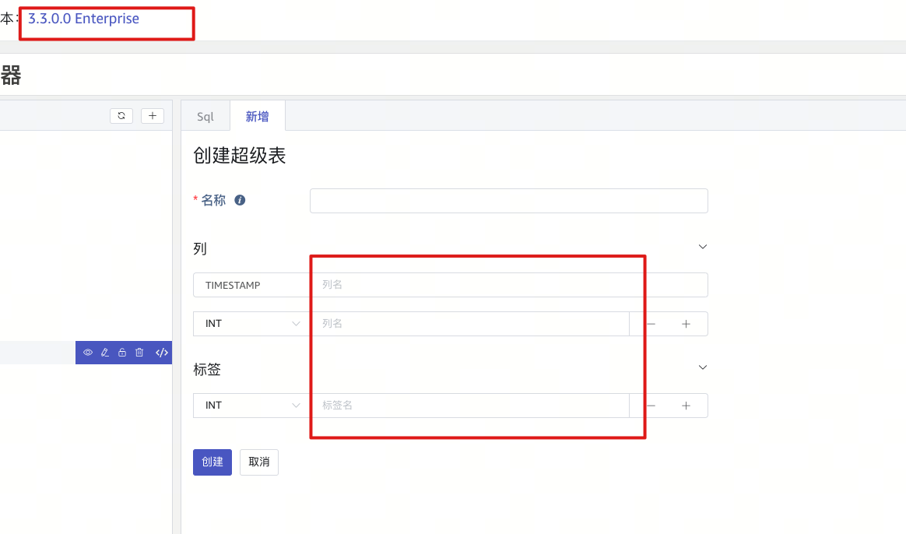

# 3.3.0.0 版本验收

| 序号 | 功能项 | 说明 | 负责人 | 验收日期 | 验收结论 （通过/不通过/待改进） | 验收文档链接 | 备注 / 参考资料 |
| --- | --- | --- | --- | --- | --- | --- | --- |
| 1 | 时序数据 Join |  | 成强 | 2024/5/11 | 通过 | [Join测试验证](https://taosdata.feishu.cn/wiki/OY2kwUaWJiNFT3knoZ4cqQJmnmg) |  |
| 2 | 复合主键 |  | 董延琼 | 2024/5/11 | 通过 | [复合主键](https://taosdata.feishu.cn/wiki/CCJMw9XJxiJOsfk7sISclFkRnLb) | 可创建、写入、查询 [复合主键](https://taosdata.feishu.cn/wiki/OLQjwCpQhiRFE3kS8Uvc3sornRb) |
| 3 | TDengine 双活 |  | 李珲 | 2024/5/15 | 不通过 | [TDengine 双活](https://taosdata.feishu.cn/wiki/Id08wgbpRi60EHkLY6rcGlvan8e) | Wade: 这个功能的spec 中限定的范围就是只限于 websocket 连接，验收文档中列举了三种场景，但没有写明结果，native/Restful 不支持是结果 |
| 4 | TDengine 双副本 |  | 吕泽 | 2024/5/11 | 希望补充文档 | [双副本测试验证](https://taosdata.feishu.cn/wiki/MbD4wHwVwi0YArkB3gIcFClEn2c) | 1. 企业版文档缺乏supportvnodes设置说明，希望提供3节点最佳实践配置说明，写明每个dnode的参数如何设置，对应不同结果如何。 1. 缺乏从2节点单副本环境升级到3节点2副本的说明，客户提供第三台机器无磁盘空间,不能存储数据（即将交付酒泉项目真实场景） |
| 5 | TSMA |  | 李珲 | 2024/5/11 | 通过 | [TSMA功能验证](https://taosdata.feishu.cn/wiki/ONRpwVi6giZ9ASkWLgucLqoQngh) |  |
| 6 | 存储压缩增强 | 与第 2 项一起验收 | 董延琼 | 2024/5/16 | 通过 |  | 文档齐全，涉及内容太多，无法完整进行功能测试 |
| 7 | S3 |  | 董延琼 | 2024/5/13 | 不通过 | [S3功能验证](https://taosdata.feishu.cn/wiki/R1GnwvHT7igFmikrCXEcv4SCnyf) TD-30020 | 验证不通过，阿里云对象存储不兼容。 腾讯云基础功能验证通过。 华为云基础功能验证通过。 AWS 未验证。 |
| 8 | Count Window |  | 成强 | 2024/5/11 | 通过 | [Count Window测试验证](https://taosdata.feishu.cn/wiki/BOn9wcQvfiDmUGkD10ocq1GAnwc) |  |
| 9 | 数据库加密 | 建议：售前 | 成强 | 2024/5/13 | 通过 | [数据库加密测试](https://taosdata.feishu.cn/wiki/HRXqwfmawiXQxhkFVEVc9t06nHh) |  |
| 10 | 普通列和标签列写入行为统一 | 报告人：董洪奎 | 成强 | 2024/5/13 | 通过 | [普通列和标签列写入行为统一测试](https://taosdata.feishu.cn/wiki/OS8PwEEXpiy5gzkAegKcx1TynCc) | 参考资料： [普通列和标签列数据写入行为统一](https://taosdata.feishu.cn/wiki/SBrSwz47LiHmvYk773WcOt3Onqd) [普通列和标签列数据写入行为统一 Test Spec](https://taosdata.feishu.cn/wiki/H653wh9WeiKXvxkOMBTcEMbenqg) |
| 11 | VARCHAR 性能优化 |  | -- |  | -- |  |  |
| 12 | 区分企业版和社区版的日志 | 报告人：李珲 | 李珲 | 2024/5/11 | 通过 |  |  |
| 13 | Oracle 时序数据 -> 3.0 |  | 董延琼 | 2024/5/11 | 功能没有发布 |  | 研发确认本版本没有发布该功能 |
| 14 | MySQL -> 3.0 |  | 吕泽 | 2024/5/12 | 不通过 | [mysql-td写入验证](https://taosdata.feishu.cn/wiki/SnU8ww2pRi0JeqkoBYHcwB5Lnxh) | 无法获取数据，无法继续测试验证 |
| 15 | PostgreSql -> 3.0 |  | 成强 | 2024/5/17 | 通过 | [pgsql-TD写入验证](https://taosdata.feishu.cn/wiki/TL9ewZZFmiJ5IpkiqBzcBiP4nKf) | 参照评论继续测试通过。 |
| 16 | 数据备份：支持定时任务 | 建议：交付 | 董延琼 | 2024/5/11 | 功能没有发布 |  | 研发确认本版本没有发布该功能 |
| 17 | Explorer 开源版 | 建议：市场 | -- |  | -- |  |  |
| 18 | taos shell 加上开源版提示 | 建议：市场 | -- |  | -- |  |  |
| 19 | TD3->TD3 的优化（新增，中石化） | 建议：交付 | 吕泽 | 2024/5/11 | 待改进 | [TD3-TD3taosx优化测试](https://taosdata.feishu.cn/wiki/J8AnwXm45iGEyIkJ22rcDeCSnwf) | 文档里提到的增加同步检查已经添加； 但是发现建表同步太慢： TD-30005 |
| 20 | OPC CSV 配置合法性校验（新增，梅州卷烟） | 建议：交付 | 成强 | 2024/5/15 | 部分通过 | [CSV配置合法性校验](https://taosdata.feishu.cn/wiki/H4Xqwkf1Mithylkg3BucjC8ln3e) | stable：必填，ts_col/received_ts_col：必填 这两个必填项，为空没有检查出来 |
| 21 | OPC：动态更新点位和查看点位 （新增，梅州卷烟） | 建议：交付 | 成强 |  | -- |  | 无验证条件 |
| 22 | TD2-TD3 的高级配置（新增，内部） | 建议：交付 | 董延琼 | 2024/5/11 | 通过 |  | 符合文档描述。 |
| 23 | taosX 内存优化 | 建议：交付 | 吕泽 | 2024/5/11 | 通过 |  | 不是新功能，是性能增强。 |
| 24 | Transformer （新增，极氪汽车） | 报告人：董延琼 | 董延琼 | 2024/5/14 | 通过 | [数据导入默认值功能验证](https://taosdata.feishu.cn/wiki/CfiZwAOHSifSUPkP9cqcEjLmnNc) | 符合文档描述。 TD-30057 |
| 25 | Explorer 建表增强（新增，内部） | 与第 6 项一起验收 | 董延琼 | 2024/5/16 | 功能没有发布 |  | 研发确认本版本没有发布该功能 [Explorer 建表：支持复合主键和压缩增强](https://taosdata.feishu.cn/wiki/GePgw73JliRI4qklV7Vc32EMnBf)  3.3.0.0没有这个功能，无法测试 |
| 26 | 数据复制与同步（新增，内部） | 与第 2/6 项一起验收 | 董延琼 |  | 通过 | 复合主键支持数据同步。 | [数据复制与同步支持 复合主键 + 压缩增强](https://taosdata.feishu.cn/wiki/ZmNiwQwGdiN3Lsk1AZ8cNngInlb) |
| 27 | Node.js 支持连接池 | 报告人：肖波 | 董延琼 | 2024/5/11 | 通过 |  | 执行示例代码无异常 |

<!-- Unsupported block type: 999 -->
