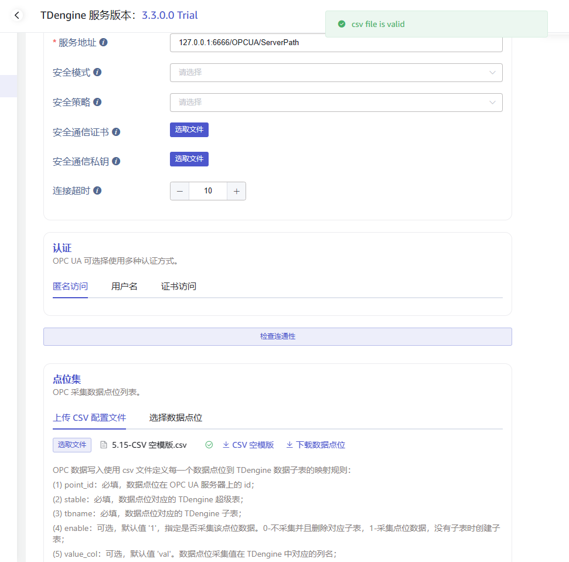
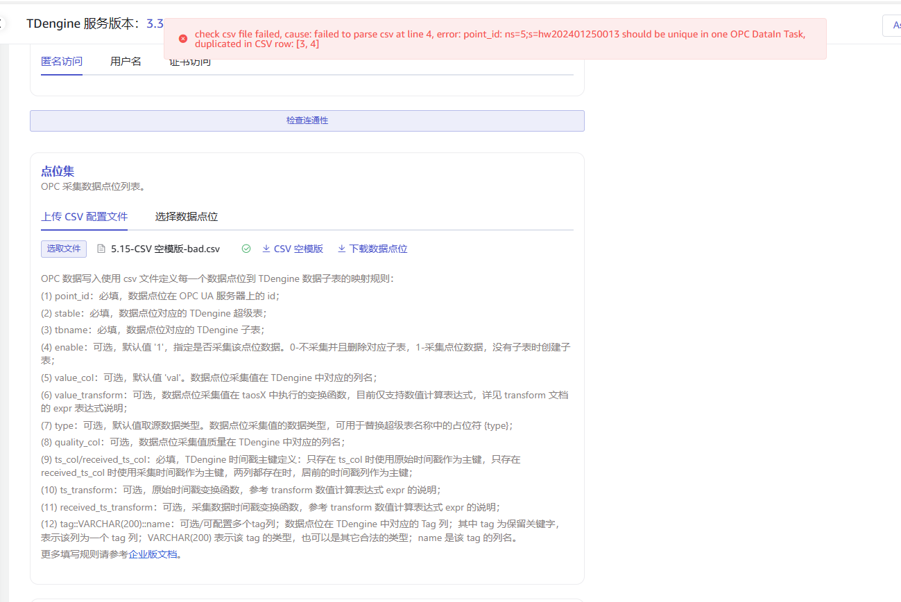
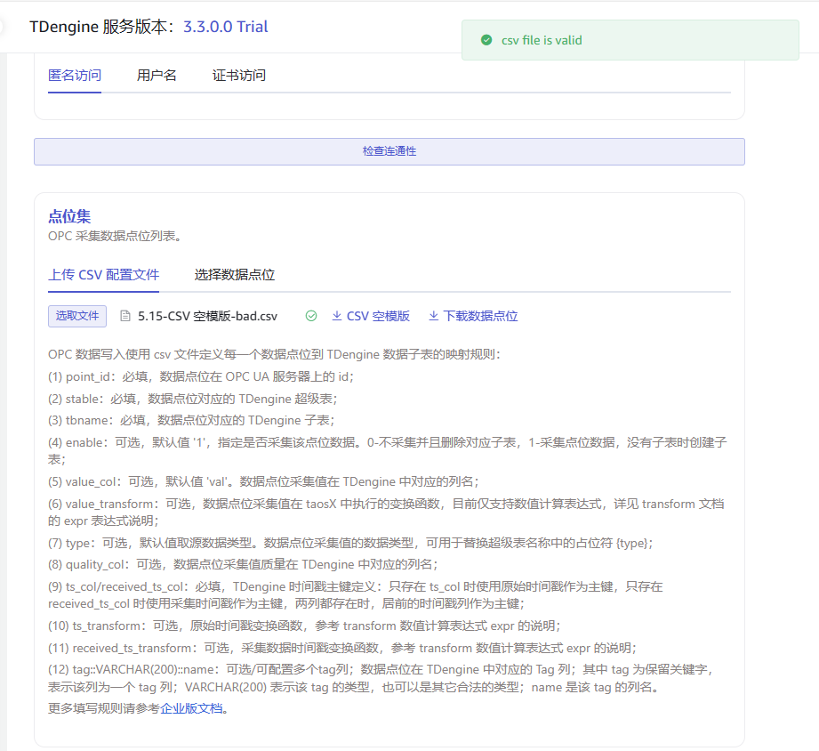
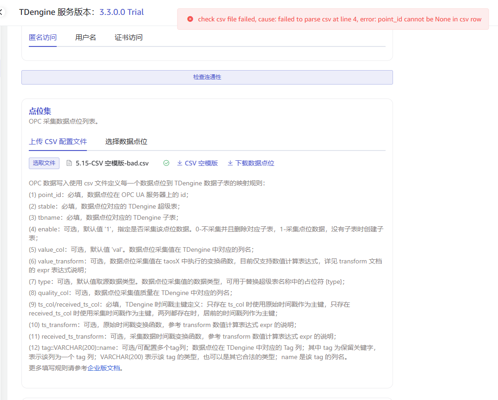
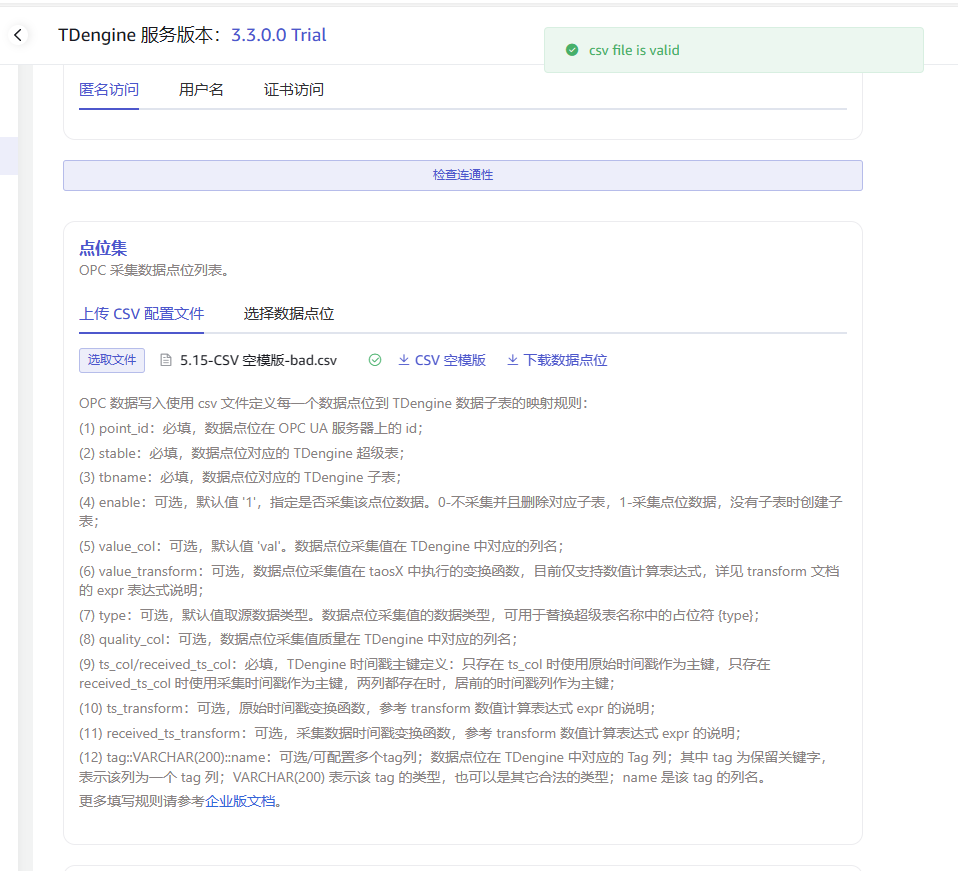
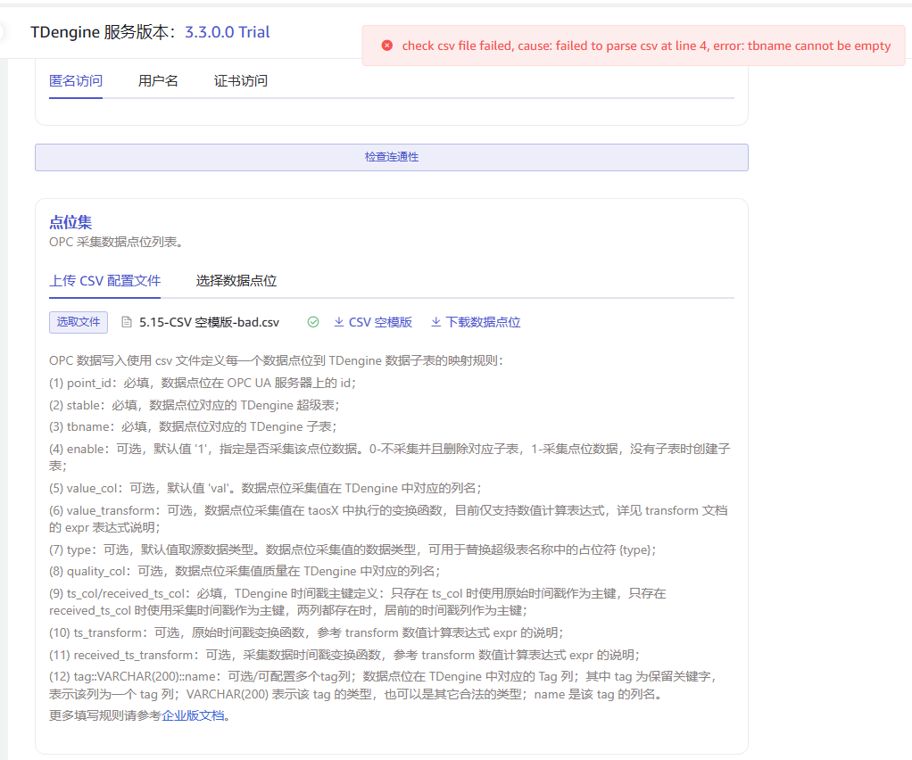
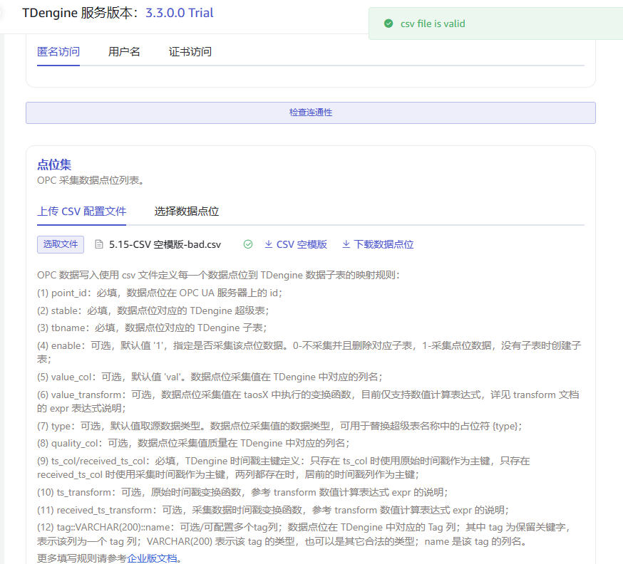

# CSV配置合法性校验

复制CSV模板中最后一行，校验不通过
| 3 | ns=5;s=hw202401250013 | 1 | opc_{type} | t_{ns}_{id} | val |  |  | quality | ts | rts | ts - 6 * 1000 | rts - 6 * 1000 | current |
| --- | --- | --- | --- | --- | --- | --- | --- | --- | --- | --- | --- | --- | --- |

更改新增一行的point_id为不重复，正常

删除第4行point_id，校验通过

第4行stable为空，校验通过 【不符合预期】

第4行table为空，校验不通过 

第4行ts_col/received_ts_col为空，校验通过   【不符合预期】

