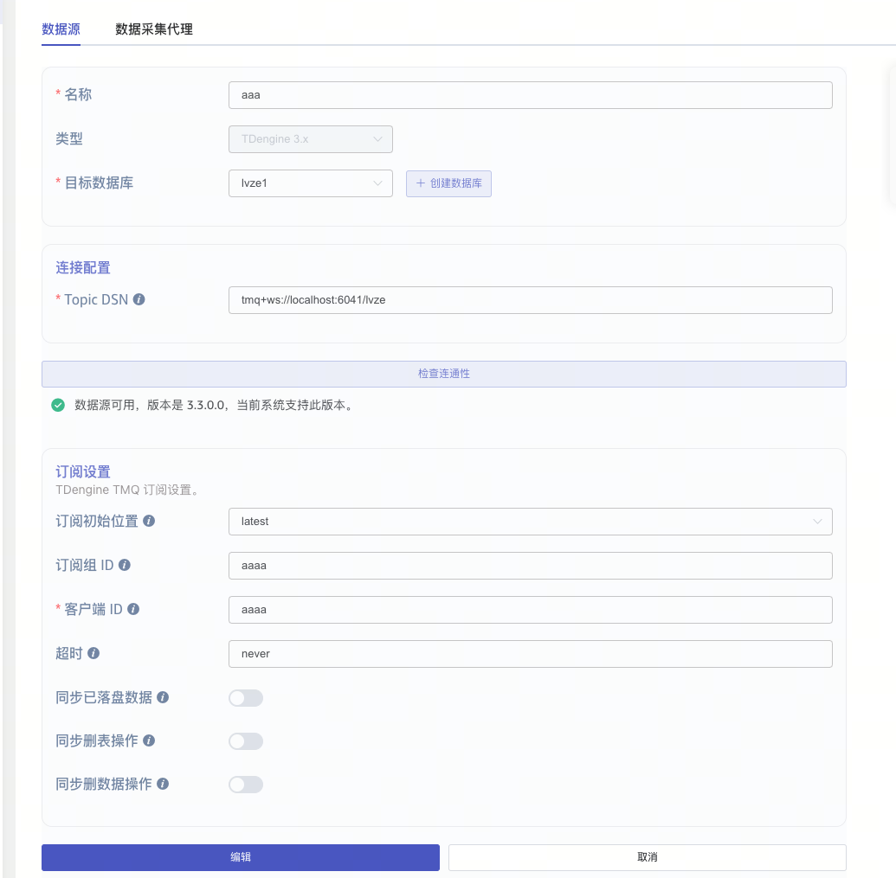
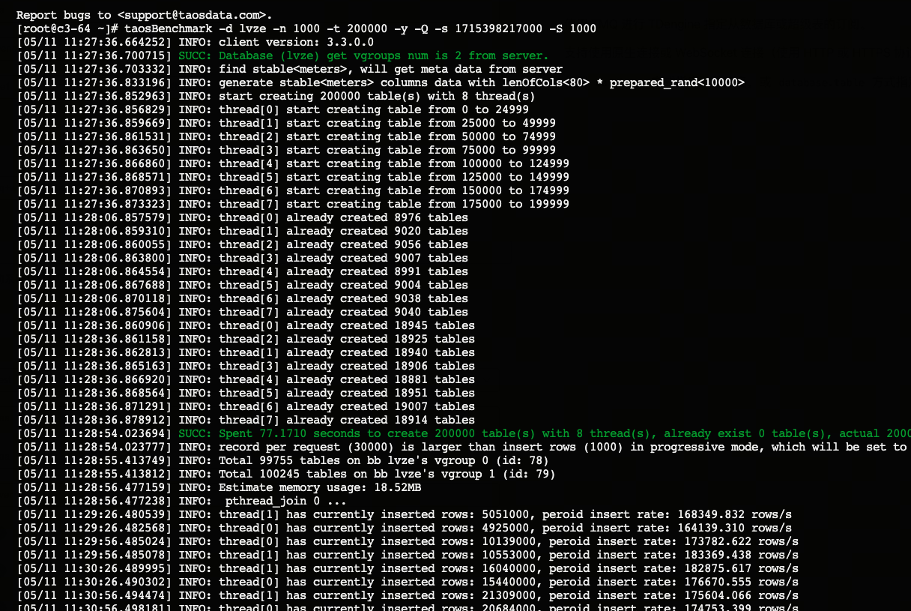
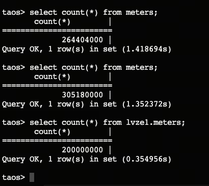
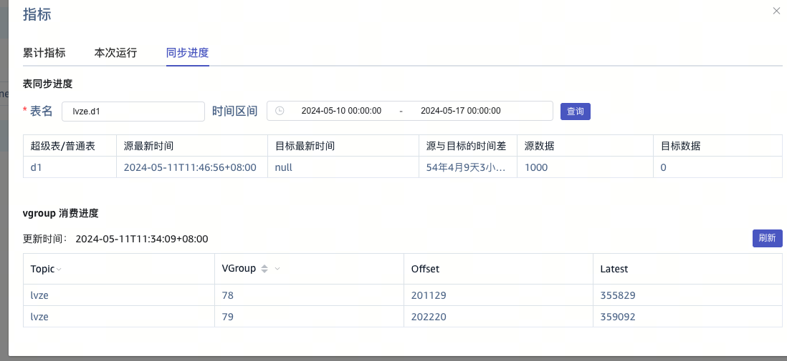
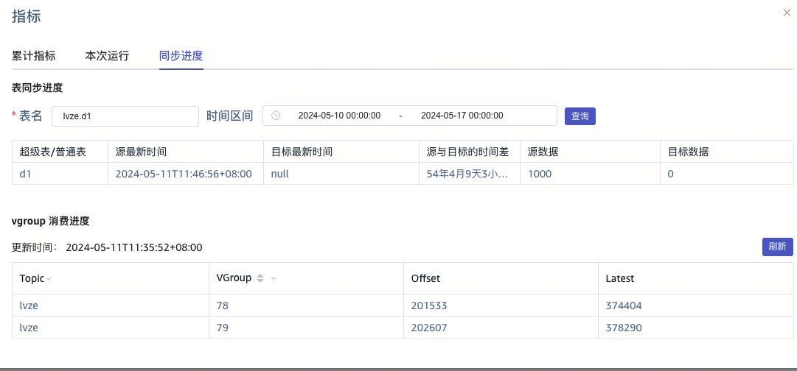
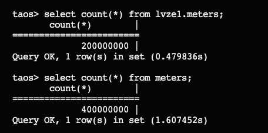
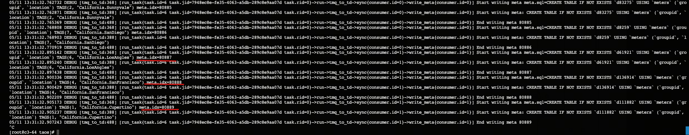

# TD3-TD3 taosx 优化测试

## 1. 问题描述

建立tmq同步任务：
问题：本地3节点里的一个lvze库同步到lvze1库
2个库本身都已经存在200000000条数据。新开始从5.11号时间戳开始往lvze写入数据，但是没有同步到lvze1。

lvze1库的表一条都没有增加

offset在变化，但是表里没有数据

源库已经写完，目标库没有变化

任务是从11:46分差不多开始跑的，我看taosx日志有个编号，是递增的，估计有个是表示20万表个数吧，现在才到8万，估计还要好久，最终可能建表需要4h。@张玮绚

## 2. 问题定位 （By @贾晨阳 )

看了一下taosx的日志，发现任务流程还在write meta data，也就是尝试建子表；和@吕泽 确认，他使用taosBenchmark命令行模式进行批量写入，应该是taosBenchmark内部在尝试通过create table if not exists 的方式创建子表，这种操作被记录到了wal中，taosx订阅的topic是带with meta的，所以会消费这些建表语句；目前看任务流程没问题，但是建表的速度特别慢，而且目标端原本也存在这些子表，导致从表现上看没有数据同步。
同步meta数据慢的问题已经在 ，已经提高优先级。
TD-29464

cc：@张玮绚 @霍琳贺 @王明明
