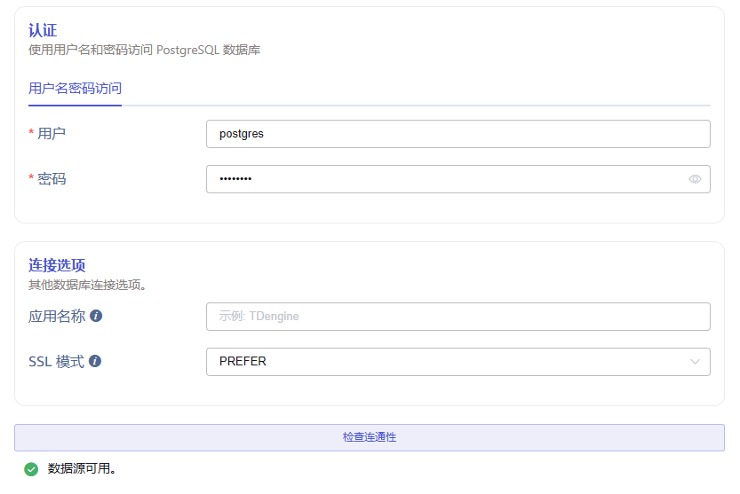
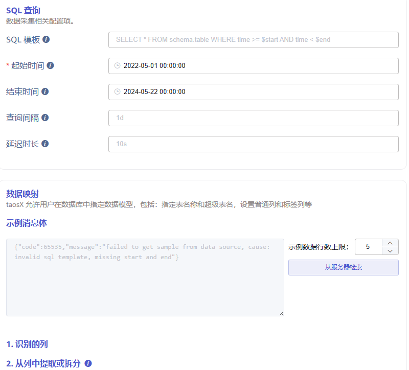
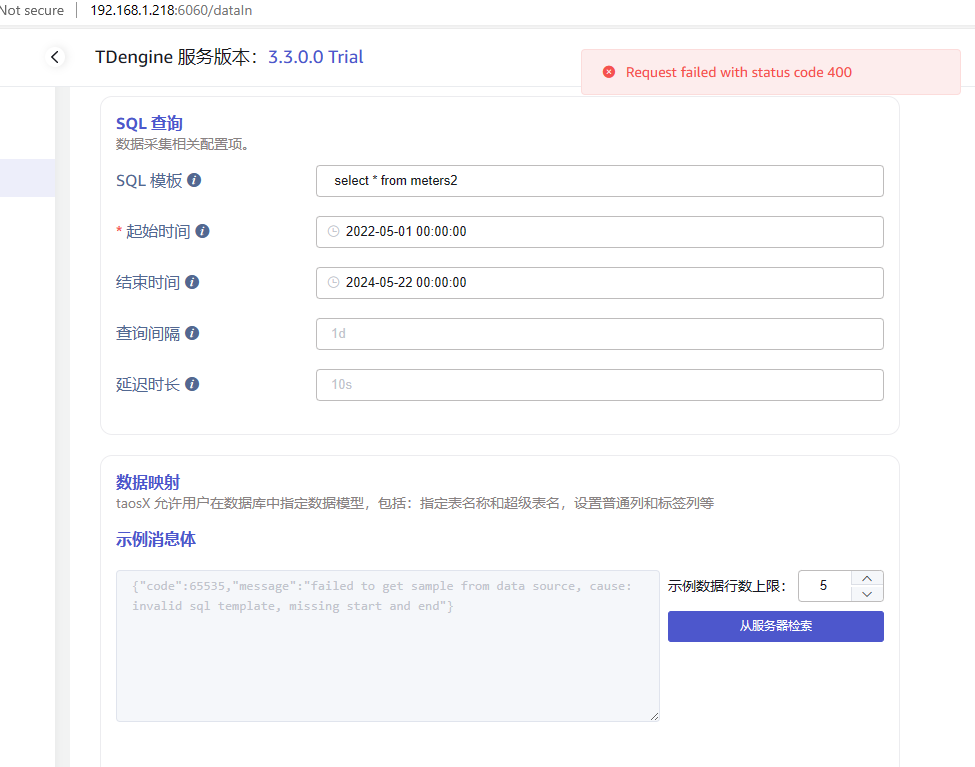
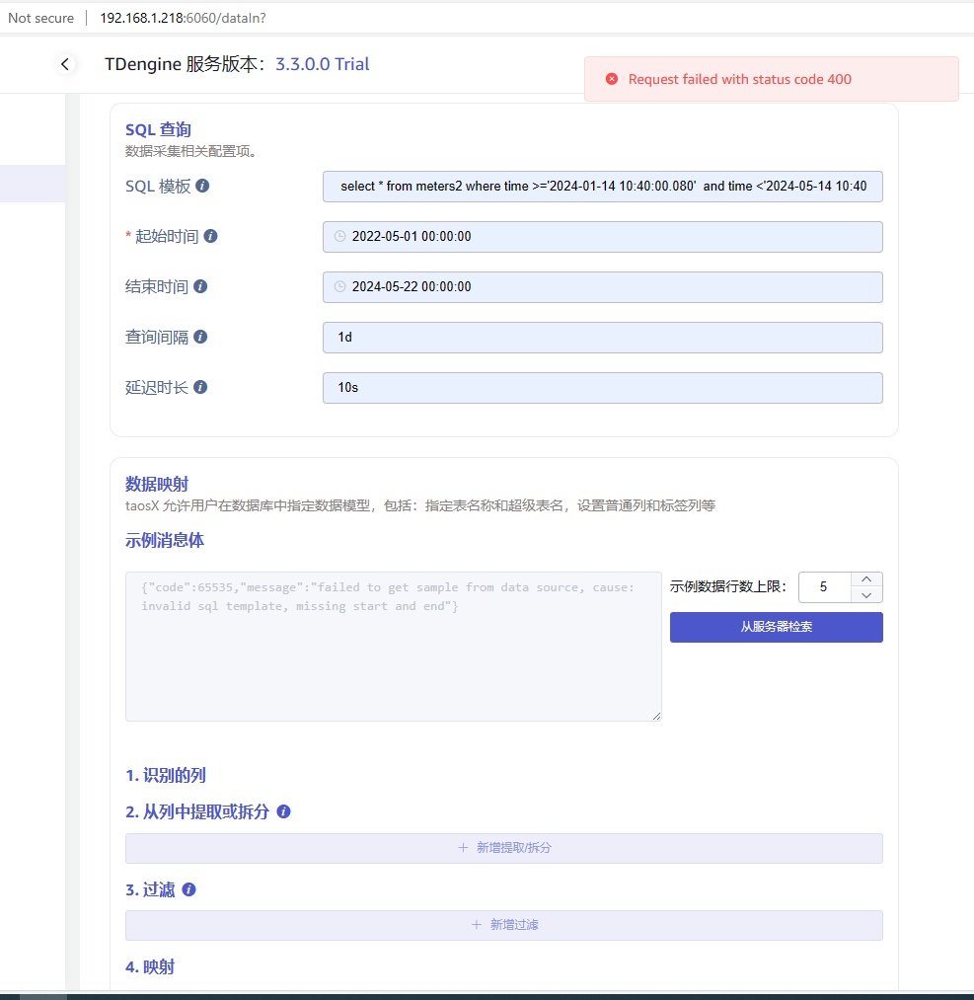
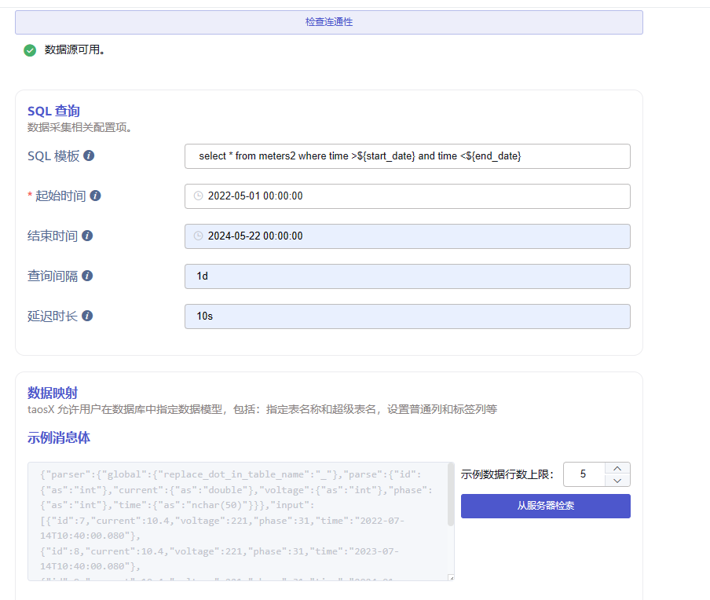
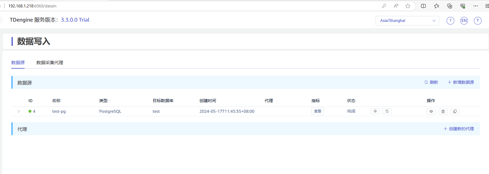
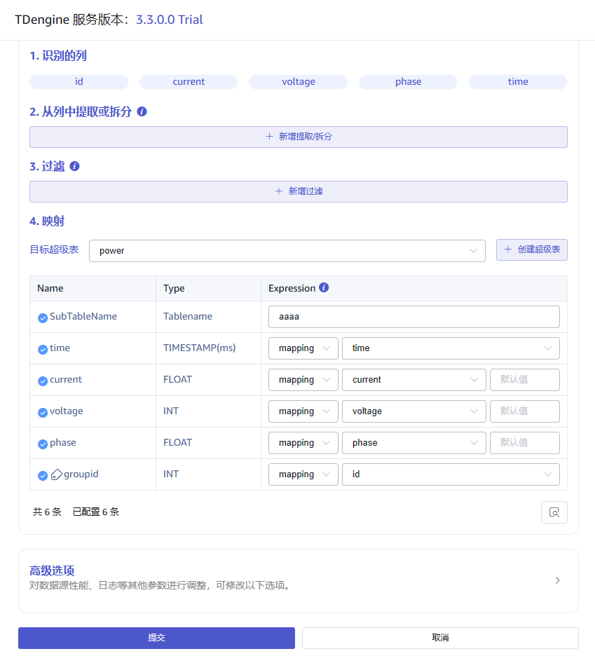
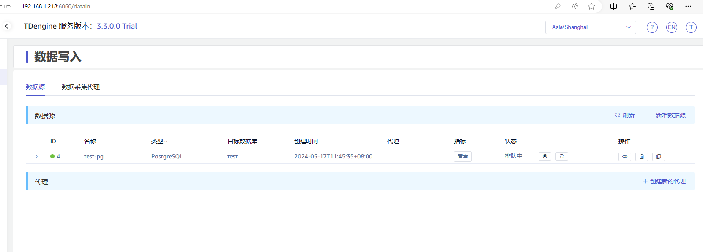
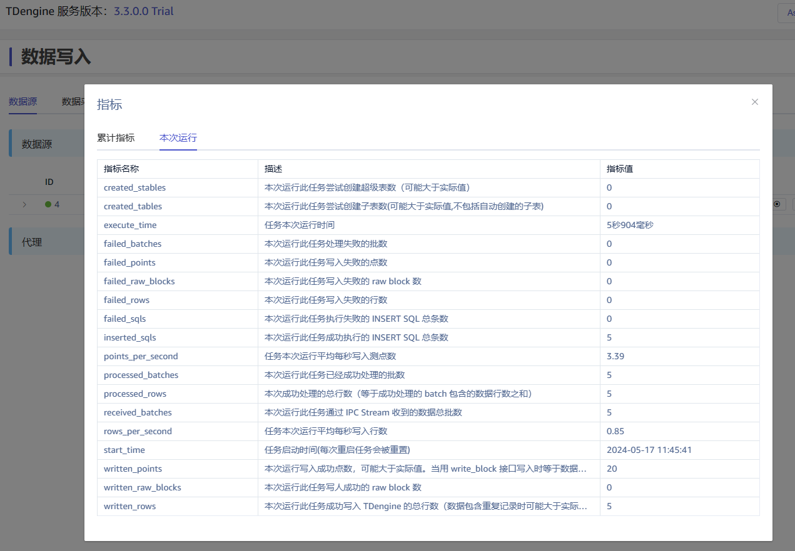
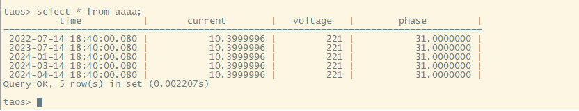

# pgsql-TD写入验证

1. Postgres 建库建表插入数据完成
2. 连通性测试通过
3. 【从服务器检索数据报错。Request failed with status 400】 已通过
4. 参照评论测试成功。
```sql
##########################
PostgreSQL

su - postgres
psql
\c testdb

CREATE TABLE meters2 (
    id SERIAL PRIMARY KEY,
    current float,
    voltage INTEGER,
    phase float,
time timestamp
);

INSERT INTO meters2 (current, voltage, phase,time) VALUES (10.4, 221,31.2,'2017-07-14 10:40:00.080');
INSERT INTO meters2 (current, voltage, phase,time) VALUES (10.4, 221,31.2,'2018-07-14 10:40:00.080');
INSERT INTO meters2 (current, voltage, phase,time) VALUES (10.4, 221,31.2,'2019-07-14 10:40:00.080');
INSERT INTO meters2 (current, voltage, phase,time) VALUES (10.4, 221,31.2,'2020-07-14 10:40:00.080');
INSERT INTO meters2 (current, voltage, phase,time) VALUES (10.4, 221,31.2,'2021-07-14 10:40:00.080');
INSERT INTO meters2 (current, voltage, phase,time) VALUES (10.4, 221,31.2,'2022-07-14 10:40:00.080');
INSERT INTO meters2 (current, voltage, phase,time) VALUES (10.4, 221,31.2,'2023-07-14 10:40:00.080');
INSERT INTO meters2 (current, voltage, phase,time) VALUES (10.4, 221,31.2,'2024-01-14 10:40:00.080');
INSERT INTO meters2 (current, voltage, phase,time) VALUES (10.4, 221,31.2,'2024-03-14 10:40:00.080');
INSERT INTO meters2 (current, voltage, phase,time) VALUES (10.4, 221,31.2,'2024-04-14 10:40:00.080');

testdb=# select * from meters2;
 id | current | voltage | phase |          time          
----+---------+---------+-------+------------------------
  1 |    10.4 |     221 |    31 | 2017-07-14 10:40:00.08
  2 |    10.4 |     221 |    31 | 2017-07-14 10:40:00.08
  3 |    10.4 |     221 |    31 | 2018-07-14 10:40:00.08
  4 |    10.4 |     221 |    31 | 2019-07-14 10:40:00.08
  5 |    10.4 |     221 |    31 | 2020-07-14 10:40:00.08
  6 |    10.4 |     221 |    31 | 2021-07-14 10:40:00.08
  7 |    10.4 |     221 |    31 | 2022-07-14 10:40:00.08
  8 |    10.4 |     221 |    31 | 2023-07-14 10:40:00.08
  9 |    10.4 |     221 |    31 | 2024-01-14 10:40:00.08
 10 |    10.4 |     221 |    31 | 2024-03-14 10:40:00.08
 11 |    10.4 |     221 |    31 | 2024-04-14 10:40:00.08
(11 rows)

testdb=# select * from meters2 where time >='2024-01-14 10:40:00.080'  and time <'2024-05-14 10:40:00.080';
 id | current | voltage | phase |          time          
----+---------+---------+-------+------------------------
  9 |    10.4 |     221 |    31 | 2024-01-14 10:40:00.08
 10 |    10.4 |     221 |    31 | 2024-03-14 10:40:00.08
 11 |    10.4 |     221 |    31 | 2024-04-14 10:40:00.08
(3 rows)
```












2024-5-17 ------参照评论补充测试













