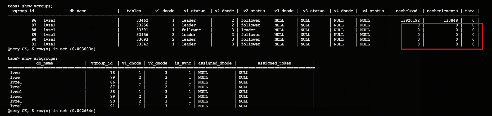
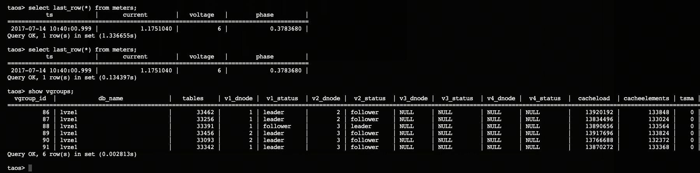
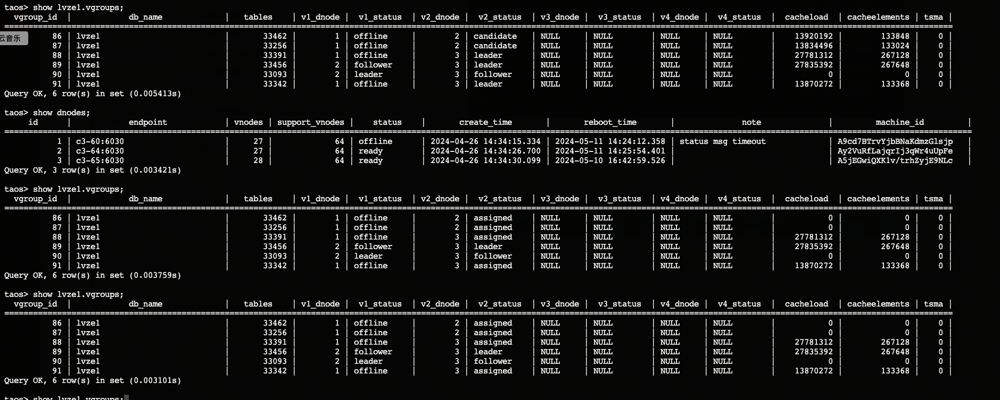
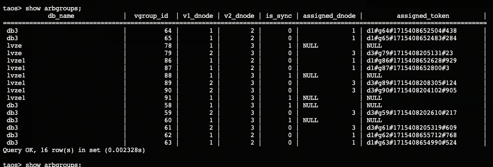
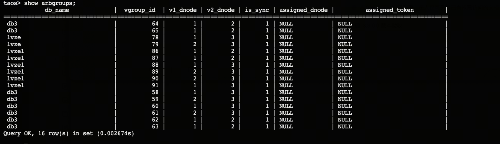

# 双副本测试验证

### 1. 测试双副本数据库

```sql {wrap}
taos> CREATE DATABASE lvze REPLICA 2;
Create OK, 0 row(s) affected (7.351475s)

taos> show databases;
              name              |
=================================
 information_schema             |
 performance_schema             |
 lvze                           |
 log                            |
 test                           |
 db2                            |
 db3                            |
 db1                            |
 audit                          |
Query OK, 9 row(s) in set (0.003695s)

taos> use lvze;
Database changed.

taos> show vgroups;
  vgroup_id  |            db_name             |   tables    | v1_dnode |  v1_status  | v2_dnode |  v2_status  | v3_dnode |  v3_status  | v4_dnode |  v4_status  |  cacheload  | cacheelements | tsma |
======================================================================================================================================================================================================
          66 | lvze                           |           0 |        1 | follower    |        3 | leader      | NULL     | NULL        | NULL     | NULL        |           0 |             0 |    0 |
          67 | lvze                           |           0 |        2 | leader      |        3 | follower    | NULL     | NULL        | NULL     | NULL        |           0 |             0 |    0 |
Query OK, 2 row(s) in set (0.008125s)

taos> show arbgroups;
            db_name             |  vgroup_id  | v1_dnode | v2_dnode | is_sync | assigned_dnode |         assigned_token         |
=================================================================================================================================
 lvze                           |          66 |        1 |        3 |       1 | NULL           | NULL                           |
 lvze                           |          67 |        2 |        3 |       1 | NULL           | NULL                           |
Query OK, 2 row(s) in set (0.004016s)

taos> show arbgroups;
            db_name             |  vgroup_id  | v1_dnode | v2_dnode | is_sync | assigned_dnode |         assigned_token         |
=================================================================================================================================
 lvze                           |          66 |        1 |        3 |       1 | NULL           | NULL                           |
 lvze                           |          67 |        2 |        3 |       1 | NULL           | NULL                           |
Query OK, 2 row(s) in set (0.003913s)

taos> DROP DATABASE lvze;
Drop OK, 0 row(s) affected (0.563647s)

taos> show databases;
              name              |
=================================
 information_schema             |
 performance_schema             |
 log                            |
 test                           |
 db2                            |
 db3                            |
 db1                            |
 audit                          |
Query OK, 8 row(s) in set (0.007483s)

taos> 
```

### 2. 写入数据测试

```sql {wrap}
[root@c3-64 ~]# taosBenchmark -d lvze -n 1000 -t 200000 -y -Q
[05/11 09:41:07.486285] INFO: client version: 3.3.0.0
[05/11 09:41:07.532445] SUCC: Database (lvze) get vgroups num is 2 from server.
[05/11 09:41:07.540100] INFO: stable meters does not exist, will create one
[05/11 09:41:07.540175] INFO: create stable: <CREATE TABLE IF NOT EXISTS lvze.meters (ts TIMESTAMP,current float,voltage int,phase float) TAGS (groupid int,location binary(24))>
[05/11 09:41:07.652475] INFO: generate stable<meters> columns data with lenOfCols<80> * prepared_rand<10000>
[05/11 09:41:07.664627] INFO: start creating 200000 table(s) with 8 thread(s)
[05/11 09:41:07.667830] INFO: thread[0] start creating table from 0 to 24999
[05/11 09:41:07.671209] INFO: thread[1] start creating table from 25000 to 49999
[05/11 09:41:07.677899] INFO: thread[2] start creating table from 50000 to 74999
[05/11 09:41:07.682687] INFO: thread[3] start creating table from 75000 to 99999
[05/11 09:41:07.697792] INFO: thread[4] start creating table from 100000 to 124999
[05/11 09:41:07.699121] INFO: thread[5] start creating table from 125000 to 149999
[05/11 09:41:07.702739] INFO: thread[6] start creating table from 150000 to 174999
[05/11 09:41:07.703557] INFO: thread[7] start creating table from 175000 to 199999
[05/11 09:41:37.667009] INFO: thread[0] already created 2056 tables
[05/11 09:41:37.682265] INFO: thread[1] already created 2078 tables
[05/11 09:41:37.687428] INFO: thread[3] already created 2083 tables
[05/11 09:41:37.688918] INFO: thread[2] already created 2076 tables
[05/11 09:41:37.695225] INFO: thread[4] already created 2052 tables
[05/11 09:41:37.705361] INFO: thread[5] already created 2080 tables
[05/11 09:41:37.707221] INFO: thread[7] already created 2094 tables
[05/11 09:41:37.716221] INFO: thread[6] already created 2065 tables
[05/11 09:42:07.671637] INFO: thread[0] already created 4210 tables
[05/11 09:42:07.686643] INFO: thread[1] already created 4214 tables
[05/11 09:42:07.693242] INFO: thread[3] already created 4200 tables
[05/11 09:42:07.693726] INFO: thread[2] already created 4252 tables
[05/11 09:42:07.708655] INFO: thread[4] already created 4199 tables
[05/11 09:42:07.710971] INFO: thread[5] already created 4206 tables
[05/11 09:42:07.713146] INFO: thread[7] already created 4206 tables
[05/11 09:42:07.727617] INFO: thread[6] already created 4191 tables
[05/11 09:42:37.676583] INFO: thread[0] already created 6457 tables
[05/11 09:42:37.705917] INFO: thread[1] already created 6455 tables
[05/11 09:42:37.707390] INFO: thread[3] already created 6428 tables
[05/11 09:42:37.714203] INFO: thread[4] already created 6452 tables
[05/11 09:42:37.715464] INFO: thread[2] already created 6480 tables
[05/11 09:42:37.717675] INFO: thread[5] already created 6433 tables
[05/11 09:42:37.723934] INFO: thread[7] already created 6458 tables
[05/11 09:42:37.753685] INFO: thread[6] already created 6401 tables
[05/11 09:43:07.681189] INFO: thread[0] already created 11462 tables
[05/11 09:43:07.709192] INFO: thread[3] already created 11491 tables
[05/11 09:43:07.710484] INFO: thread[1] already created 11479 tables
[05/11 09:43:07.724731] INFO: thread[4] already created 11455 tables
[05/11 09:43:07.726848] INFO: thread[7] already created 11497 tables
[05/11 09:43:07.730658] INFO: thread[2] already created 11514 tables
[05/11 09:43:07.735531] INFO: thread[5] already created 11524 tables
[05/11 09:43:07.757491] INFO: thread[6] already created 11387 tables
[05/11 09:43:37.683815] INFO: thread[0] already created 15669 tables
[05/11 09:43:37.714786] INFO: thread[1] already created 15702 tables
[05/11 09:43:37.717485] INFO: thread[3] already created 15783 tables
[05/11 09:43:37.726189] INFO: thread[4] already created 15659 tables
[05/11 09:43:37.730930] INFO: thread[7] already created 15673 tables
[05/11 09:43:37.736487] INFO: thread[2] already created 15728 tables
[05/11 09:43:37.736528] INFO: thread[5] already created 15793 tables
[05/11 09:43:37.758448] INFO: thread[6] already created 15642 tables
[05/11 09:44:07.707080] INFO: thread[0] already created 19762 tables
[05/11 09:44:07.715268] INFO: thread[1] already created 19764 tables
[05/11 09:44:07.720276] INFO: thread[3] already created 19904 tables
[05/11 09:44:07.728203] INFO: thread[4] already created 19782 tables
[05/11 09:44:07.734818] INFO: thread[7] already created 19791 tables
[05/11 09:44:07.738486] INFO: thread[2] already created 19842 tables
[05/11 09:44:07.739100] INFO: thread[5] already created 19849 tables
[05/11 09:44:07.759081] INFO: thread[6] already created 19766 tables
[05/11 09:44:37.708076] INFO: thread[0] already created 23767 tables
[05/11 09:44:37.723597] INFO: thread[1] already created 23722 tables
[05/11 09:44:37.732371] INFO: thread[3] already created 23888 tables
[05/11 09:44:37.739529] INFO: thread[4] already created 23764 tables
[05/11 09:44:37.740952] INFO: thread[7] already created 23810 tables
[05/11 09:44:37.744748] INFO: thread[2] already created 23801 tables
[05/11 09:44:37.747151] INFO: thread[5] already created 23834 tables
[05/11 09:44:37.764771] INFO: thread[6] already created 23721 tables
[05/11 09:44:47.483887] SUCC: Spent 219.8190 seconds to create 200000 table(s) with 8 thread(s), already exist 0 table(s), actual 200000 table(s) pre created, 0 table(s) will be auto created
[05/11 09:44:47.483951] INFO: record per request (30000) is larger than insert rows (1000) in progressive mode, which will be set to 1000
[05/11 09:44:49.257220] INFO: Total 99755 tables on bb lvze's vgroup 0 (id: 78)
[05/11 09:44:49.257286] INFO: Total 100245 tables on bb lvze's vgroup 1 (id: 79)
[05/11 09:44:50.689236] INFO: Estimate memory usage: 18.52MB
[05/11 09:44:50.689366] INFO:  pthread_join 0 ...
[05/11 09:45:20.692853] INFO: thread[1] has currently inserted rows: 4801000, peroid insert rate: 160017.332 rows/s 
[05/11 09:45:20.697777] INFO: thread[0] has currently inserted rows: 4260000, peroid insert rate: 141962.143 rows/s 
[05/11 09:45:50.695044] INFO: thread[1] has currently inserted rows: 10593000, peroid insert rate: 193047.362 rows/s 
[05/11 09:45:50.701131] INFO: thread[0] has currently inserted rows: 8922000, peroid insert rate: 155379.283 rows/s 
[05/11 09:46:20.697484] INFO: thread[1] has currently inserted rows: 16311000, peroid insert rate: 190587.294 rows/s 
[05/11 09:46:20.702392] INFO: thread[0] has currently inserted rows: 13837000, peroid insert rate: 163827.872 rows/s 
[05/11 09:46:50.698881] INFO: thread[1] has currently inserted rows: 21771000, peroid insert rate: 181993.934 rows/s 
[05/11 09:46:50.706895] INFO: thread[0] has currently inserted rows: 18226000, peroid insert rate: 146280.496 rows/s 
[05/11 09:47:20.699141] INFO: thread[1] has currently inserted rows: 27350000, peroid insert rate: 185960.468 rows/s 
[05/11 09:47:20.709922] INFO: thread[0] has currently inserted rows: 22836000, peroid insert rate: 153651.302 rows/s 
[05/11 09:47:50.700365] INFO: thread[1] has currently inserted rows: 33553000, peroid insert rate: 206759.775 rows/s 
[05/11 09:47:50.710072] INFO: thread[0] has currently inserted rows: 27834000, peroid insert rate: 166594.447 rows/s 
[05/11 09:48:20.707354] INFO: thread[1] has currently inserted rows: 38996000, peroid insert rate: 181391.009 rows/s 
[05/11 09:48:20.716193] INFO: thread[0] has currently inserted rows: 32459000, peroid insert rate: 154135.839 rows/s 
[05/11 09:48:50.710631] INFO: thread[1] has currently inserted rows: 45093000, peroid insert rate: 203213.012 rows/s 
[05/11 09:48:50.718900] INFO: thread[0] has currently inserted rows: 37681000, peroid insert rate: 174055.063 rows/s 
[05/11 09:49:20.714033] INFO: thread[1] has currently inserted rows: 50185000, peroid insert rate: 169710.705 rows/s 
[05/11 09:49:20.721222] INFO: thread[0] has currently inserted rows: 41969000, peroid insert rate: 142919.041 rows/s 
[05/11 09:49:50.725805] INFO: thread[0] has currently inserted rows: 46154000, peroid insert rate: 139481.402 rows/s 
[05/11 09:49:50.727261] INFO: thread[1] has currently inserted rows: 54908000, peroid insert rate: 157365.142 rows/s 
[05/11 09:50:20.729154] INFO: thread[0] has currently inserted rows: 50732000, peroid insert rate: 152579.656 rows/s 
[05/11 09:50:20.732158] INFO: thread[1] has currently inserted rows: 60526000, peroid insert rate: 187235.461 rows/s 

[05/11 09:50:50.733572] INFO: thread[0] has currently inserted rows: 55672000, peroid insert rate: 164644.714 rows/s 
[05/11 09:50:50.737015] INFO: thread[1] has currently inserted rows: 66247000, peroid insert rate: 190668.222 rows/s 
[05/11 09:51:20.735500] INFO: thread[0] has currently inserted rows: 60788000, peroid insert rate: 170521.965 rows/s 
[05/11 09:51:20.743686] INFO: thread[1] has currently inserted rows: 71819000, peroid insert rate: 185696.194 rows/s 
[05/11 09:51:50.737085] INFO: thread[0] has currently inserted rows: 65852000, peroid insert rate: 168788.747 rows/s 
[05/11 09:51:50.745610] INFO: thread[1] has currently inserted rows: 77345000, peroid insert rate: 184187.721 rows/s 
[05/11 09:52:20.742214] INFO: thread[0] has currently inserted rows: 70476000, peroid insert rate: 154107.649 rows/s 
[05/11 09:52:21.117284] INFO: thread[1] has currently inserted rows: 82873000, peroid insert rate: 182009.746 rows/s 

[05/11 09:52:50.748115] INFO: thread[0] has currently inserted rows: 74958000, peroid insert rate: 149370.126 rows/s 
[05/11 09:52:51.190684] INFO: thread[1] has currently inserted rows: 88098000, peroid insert rate: 173743.890 rows/s 
[05/11 09:53:20.848616] INFO: thread[0] has currently inserted rows: 76488000, peroid insert rate: 50830.565 rows/s 
[05/11 09:53:21.242073] INFO: thread[1] has currently inserted rows: 89879000, peroid insert rate: 59263.942 rows/s 
[05/11 09:53:50.859565] INFO: thread[0] has currently inserted rows: 77107000, peroid insert rate: 20625.771 rows/s 
[05/11 09:53:51.274240] INFO: thread[1] has currently inserted rows: 90914000, peroid insert rate: 34463.239 rows/s 
[05/11 09:54:20.860151] INFO: thread[0] has currently inserted rows: 78741000, peroid insert rate: 54464.851 rows/s 
[05/11 09:54:21.284538] INFO: thread[1] has currently inserted rows: 91953000, peroid insert rate: 34621.793 rows/s 
[05/11 09:54:50.866789] INFO: thread[0] has currently inserted rows: 83249000, peroid insert rate: 150236.619 rows/s 
[05/11 09:54:51.296998] INFO: thread[1] has currently inserted rows: 95738000, peroid insert rate: 126116.220 rows/s 
[05/11 09:55:20.920429] INFO: thread[0] has currently inserted rows: 84145000, peroid insert rate: 29813.003 rows/s 
[05/11 09:55:21.302916] INFO: thread[1] has currently inserted rows: 97050000, peroid insert rate: 43724.588 rows/s 
[05/11 09:55:50.927334] INFO: thread[0] has currently inserted rows: 85284000, peroid insert rate: 37957.810 rows/s 
[05/11 09:55:51.311899] INFO: thread[1] has currently inserted rows: 98599000, peroid insert rate: 51617.848 rows/s 
[05/11 09:56:01.198597] SUCC: thread[1] progressive mode, completed total inserted rows: 100245000, 159851.05 records/second
[05/11 09:56:20.931410] INFO: thread[0] has currently inserted rows: 90246000, peroid insert rate: 165377.950 rows/s 
[05/11 09:56:50.932807] INFO: thread[0] has currently inserted rows: 96149000, peroid insert rate: 196760.108 rows/s 
[05/11 09:57:11.873551] SUCC: thread[0] progressive mode, completed total inserted rows: 99755000, 143047.44 records/second
[05/11 09:57:11.873708] INFO:  pthread_join 1 ...
[05/11 09:57:11.946251] SUCC: Spent 741.184373 (real 662.235557) seconds to insert rows: 200000000 with 2 thread(s) into lvze 269838.39 (real 302007.34) records/second
[05/11 09:57:11.946315] SUCC: insert delay, min: 1.8340ms, avg: 6.6224ms, p90: 8.4770ms, p95: 11.7060ms, p99: 47.5040ms, max: 2098.2140ms
[05/11 09:57:11.946348] INFO: free resource and exit ...
[root@c3-64 ~]# 

taos> alter database lvze cachemodel 'both' cachesize 50;
Query OK, 0 row(s) affected (0.018237s)

taos> show vgroups;
  vgroup_id  |            db_name             |   tables    | v1_dnode |  v1_status  | v2_dnode |  v2_status  | v3_dnode |  v3_status  | v4_dnode |  v4_status  |  cacheload  | cacheelements | tsma |
======================================================================================================================================================================================================
          78 | lvze                           |       99755 |        1 | follower    |        3 | leader      | NULL     | NULL        | NULL     | NULL        |      402688 |          3872 |    0 |
          79 | lvze                           |      100245 |        2 | leader      |        3 | follower    | NULL     | NULL        | NULL     | NULL        |      444288 |          4272 |    0 |
Query OK, 2 row(s) in set (0.012706s)

taos> select last(*) from meters;
           ts            |       current        |   voltage   |        phase         |
======================================================================================
 2017-07-14 10:40:00.999 |            1.1751040 |           8 |            0.3583680 |
Query OK, 1 row(s) in set (86.770293s)

taos> select last(*) from meters;
           ts            |       current        |   voltage   |        phase         |
======================================================================================
 2017-07-14 10:40:00.999 |            1.1751040 |           8 |            0.3583680 |
Query OK, 1 row(s) in set (0.316876s)

taos> select last(*) from meters;
           ts            |       current        |   voltage   |        phase         |
======================================================================================
 2017-07-14 10:40:00.999 |            1.1751040 |           8 |            0.3583680 |
Query OK, 1 row(s) in set (0.316876s)

taos> select last_row(*) from meters;

           ts            |       current        |   voltage   |        phase         |
======================================================================================
 2017-07-14 10:40:00.999 |            1.1751040 |           8 |            0.3583680 |
Query OK, 1 row(s) in set (69.835299s)


taos> select last_row(*) from meters;
           ts            |       current        |   voltage   |        phase         |
======================================================================================
 2017-07-14 10:40:00.999 |            1.1751040 |           8 |            0.3583680 |
Query OK, 1 row(s) in set (2.371055s)

taos> show vgroups;
  vgroup_id  |            db_name             |   tables    | v1_dnode |  v1_status  | v2_dnode |  v2_status  | v3_dnode |  v3_status  | v4_dnode |  v4_status  |  cacheload  | cacheelements | tsma |
======================================================================================================================================================================================================
          78 | lvze                           |       99755 |        1 | follower    |        3 | leader      | NULL     | NULL        | NULL     | NULL        |    52428792 |        504123 |    0 |
          79 | lvze                           |      100245 |        2 | leader      |        3 | follower    | NULL     | NULL        | NULL     | NULL        |    52428792 |        504123 |    0 |
Query OK, 2 row(s) in set (0.006791s)

taos> select count(*) from meters;
       count(*)        |
========================
             200000000 |
Query OK, 1 row(s) in set (1.192609s)

taos> select last_row(*) from meters;
           ts            |       current        |   voltage   |        phase         |
======================================================================================
 2017-07-14 10:40:00.999 |            1.1751040 |           8 |            0.3583680 |
Query OK, 1 row(s) in set (3.013685s)
taos> alter database lvze cachemodel 'both' cachesize 200;
Query OK, 0 row(s) affected (0.048155s)
taos> select count(*) from meters group by tbname;
       count(*)        |
========================
                  1000 |
 Notice: The result shows only the first 100 rows.
         You can use the `LIMIT` clause to get fewer result to show.
           Or use '>>' to redirect the whole set of the result to a specified file.

         You can use Ctrl+C to stop the underway fetching.

Query OK, 200000 row(s) in set (46.377206s)

taos> select last_row(*) from meters;
           ts            |       current        |   voltage   |        phase         |
======================================================================================
 2017-07-14 10:40:00.999 |            1.1751040 |           8 |            0.3583680 |
Query OK, 1 row(s) in set (1.304955s)

。。。。
Query OK, 200000 row(s) in set (43.312310s)
taos> select count(*) from meters group by tbname;
```

### 3. 测试单副本变更为双副本

```sql {wrap}
taos> CREATE DATABASE lvze1 BUFFER 256 CACHESIZE 200 CACHEMODEL 'both' COMP 2 DURATION 14400m WAL_FSYNC_PERIOD 3000 MAXROWS 4096 MINROWS 100 STT_TRIGGER 2 KEEP 5256000m,5256000m,5256000m PAGES 256 PAGESIZE 4 PR
ECISION 'ms' REPLICA 1 WAL_LEVEL 1 VGROUPS 6 ;
Create OK, 0 row(s) affected (0.326054s)

taos> show vgroups;
  vgroup_id  |            db_name             |   tables    | v1_dnode |  v1_status  | v2_dnode |  v2_status  | v3_dnode |  v3_status  | v4_dnode |  v4_status  |  cacheload  | cacheelements | tsma |
======================================================================================================================================================================================================
          86 | lvze1                          |           0 |        1 | leader      | NULL     | NULL        | NULL     | NULL        | NULL     | NULL        |           0 |             0 |    0 |
          87 | lvze1                          |           0 |        2 | leader      | NULL     | NULL        | NULL     | NULL        | NULL     | NULL        |           0 |             0 |    0 |
          88 | lvze1                          |           0 |        3 | leader      | NULL     | NULL        | NULL     | NULL        | NULL     | NULL        |           0 |             0 |    0 |
          89 | lvze1                          |           0 |        3 | leader      | NULL     | NULL        | NULL     | NULL        | NULL     | NULL        |           0 |             0 |    0 |
          90 | lvze1                          |           0 |        2 | leader      | NULL     | NULL        | NULL     | NULL        | NULL     | NULL        |           0 |             0 |    0 |
          91 | lvze1                          |           0 |        1 | leader      | NULL     | NULL        | NULL     | NULL        | NULL     | NULL        |           0 |             0 |    0 |
Query OK, 6 row(s) in set (0.003130s)

taos> show arbgroups;
            db_name             |  vgroup_id  | v1_dnode | v2_dnode | is_sync | assigned_dnode |         assigned_token         |
=================================================================================================================================
 lvze                           |          78 |        1 |        3 |       1 | NULL           | NULL                           |
 lvze                           |          79 |        2 |        3 |       1 | NULL           | NULL                           |
Query OK, 2 row(s) in set (0.002851s)

      79 | lvze                           |      100245 |        2 | leader      |        3 | follower    | NULL     | NULL        | NULL     | NULL        |    83403840 |        801960 |    0 |
Query OK, 2 row(s) in set (0.003641s)

taos> show vgroups;
  vgroup_id  |            db_name             |   tables    | v1_dnode |  v1_status  | v2_dnode |  v2_status  | v3_dnode |  v3_status  | v4_dnode |  v4_status  |  cacheload  | cacheelements | tsma |
======================================================================================================================================================================================================
          78 | lvze                           |       99755 |        1 | follower    |        3 | leader      | NULL     | NULL        | NULL     | NULL        |    82996160 |        798040 |    0 |
          79 | lvze                           |      100245 |        2 | leader      |        3 | follower    | NULL     | NULL        | NULL     | NULL        |    83403840 |        801960 |    0 |
Query OK, 2 row(s) in set (0.003471s)

taos> show vgroups;
  vgroup_id  |            db_name             |   tables    | v1_dnode |  v1_status  | v2_dnode |  v2_status  | v3_dnode |  v3_status  | v4_dnode |  v4_status  |  cacheload  | cacheelements | tsma |
======================================================================================================================================================================================================
          78 | lvze                           |       99755 |        1 | follower    |        3 | leader      | NULL     | NULL        | NULL     | NULL        |    82996160 |        798040 |    0 |
          79 | lvze                           |      100245 |        2 | leader      |        3 | follower    | NULL     | NULL        | NULL     | NULL        |    83403840 |        801960 |    0 |
Query OK, 2 row(s) in set (0.005498s)

taos> show vgroups;
  vgroup_id  |            db_name             |   tables    | v1_dnode |  v1_status  | v2_dnode |  v2_status  | v3_dnode |  v3_status  | v4_dnode |  v4_status  |  cacheload  | cacheelements | tsma |
======================================================================================================================================================================================================
          78 | lvze                           |       99755 |        1 | follower    |        3 | leader      | NULL     | NULL        | NULL     | NULL        |    82996160 |        798040 |    0 |
          79 | lvze                           |      100245 |        2 | leader      |        3 | follower    | NULL     | NULL        | NULL     | NULL        |    83403840 |        801960 |    0 |
Query OK, 2 row(s) in set (0.003917s)

taos> show vgroups;
  vgroup_id  |            db_name             |   tables    | v1_dnode |  v1_status  | v2_dnode |  v2_status  | v3_dnode |  v3_status  | v4_dnode |  v4_status  |  cacheload  | cacheelements | tsma |
======================================================================================================================================================================================================
          78 | lvze                           |       99755 |        1 | follower    |        3 | leader      | NULL     | NULL        | NULL     | NULL        |    82996160 |        798040 |    0 |
          79 | lvze                           |      100245 |        2 | leader      |        3 | follower    | NULL     | NULL        | NULL     | NULL        |    83403840 |        801960 |    0 |
Query OK, 2 row(s) in set (0.009356s)


[root@c3-64 ~]# taosBenchmark -d lvze1 -n 1000 -t 200000 -y -Q
[05/11 10:17:12.564367] INFO: client version: 3.3.0.0
[05/11 10:17:12.605687] SUCC: Database (lvze1) get vgroups num is 6 from server.
[05/11 10:17:12.609764] INFO: stable meters does not exist, will create one
[05/11 10:17:12.609830] INFO: create stable: <CREATE TABLE IF NOT EXISTS lvze1.meters (ts TIMESTAMP,current float,voltage int,phase float) TAGS (groupid int,location binary(24))>
[05/11 10:17:12.759136] INFO: generate stable<meters> columns data with lenOfCols<80> * prepared_rand<10000>
[05/11 10:17:12.781741] INFO: start creating 200000 table(s) with 8 thread(s)
[05/11 10:17:12.784409] INFO: thread[0] start creating table from 0 to 24999
[05/11 10:17:12.787440] INFO: thread[1] start creating table from 25000 to 49999
[05/11 10:17:12.789941] INFO: thread[2] start creating table from 50000 to 74999
[05/11 10:17:12.791914] INFO: thread[3] start creating table from 75000 to 99999
[05/11 10:17:12.794311] INFO: thread[4] start creating table from 100000 to 124999
[05/11 10:17:12.797346] INFO: thread[5] start creating table from 125000 to 149999
[05/11 10:17:12.797383] INFO: thread[6] start creating table from 150000 to 174999
[05/11 10:17:12.799743] INFO: thread[7] start creating table from 175000 to 199999
[05/11 10:17:42.785582] INFO: thread[0] already created 19308 tables
[05/11 10:17:42.789031] INFO: thread[2] already created 19206 tables
[05/11 10:17:42.790337] INFO: thread[3] already created 19259 tables
[05/11 10:17:42.794740] INFO: thread[5] already created 19187 tables
[05/11 10:17:42.798864] INFO: thread[6] already created 19251 tables
[05/11 10:17:42.798898] INFO: thread[4] already created 19287 tables
[05/11 10:17:42.799606] INFO: thread[1] already created 19145 tables
[05/11 10:17:42.799840] INFO: thread[7] already created 19174 tables
[05/11 10:17:51.297692] SUCC: Spent 38.5160 seconds to create 200000 table(s) with 8 thread(s), already exist 0 table(s), actual 200000 table(s) pre created, 0 table(s) will be auto created
[05/11 10:17:51.297760] INFO: record per request (30000) is larger than insert rows (1000) in progressive mode, which will be set to 1000
[05/11 10:17:52.530927] INFO: Total 33462 tables on bb lvze1's vgroup 0 (id: 86)
[05/11 10:17:52.531010] INFO: Total 33256 tables on bb lvze1's vgroup 1 (id: 87)
[05/11 10:17:52.531108] INFO: Total 33391 tables on bb lvze1's vgroup 2 (id: 88)
[05/11 10:17:52.531210] INFO: Total 33456 tables on bb lvze1's vgroup 3 (id: 89)
[05/11 10:17:52.531305] INFO: Total 33093 tables on bb lvze1's vgroup 4 (id: 90)
[05/11 10:17:52.531397] INFO: Total 33342 tables on bb lvze1's vgroup 5 (id: 91)
[05/11 10:17:53.470088] INFO: Estimate memory usage: 22.54MB
[05/11 10:17:53.470275] INFO:  pthread_join 0 ...
[05/11 10:18:23.471198] INFO: thread[5] has currently inserted rows: 7605000, peroid insert rate: 253491.550 rows/s 
[05/11 10:18:23.471240] INFO: thread[2] has currently inserted rows: 7439000, peroid insert rate: 247958.401 rows/s 
[05/11 10:18:23.472631] INFO: thread[0] has currently inserted rows: 7437000, peroid insert rate: 247883.474 rows/s 
[05/11 10:18:23.473033] INFO: thread[4] has currently inserted rows: 7582000, peroid insert rate: 252708.063 rows/s 
[05/11 10:18:23.473447] INFO: thread[1] has currently inserted rows: 7703000, peroid insert rate: 256740.993 rows/s 
[05/11 10:18:23.473525] INFO: thread[3] has currently inserted rows: 7646000, peroid insert rate: 254841.183 rows/s 
[05/11 10:18:53.472821] INFO: thread[2] has currently inserted rows: 15038000, peroid insert rate: 253291.557 rows/s 
[05/11 10:18:53.474404] INFO: thread[4] has currently inserted rows: 15324000, peroid insert rate: 258058.065 rows/s 
[05/11 10:18:53.474729] INFO: thread[1] has currently inserted rows: 15283000, peroid insert rate: 252658.245 rows/s 
[05/11 10:18:53.474975] INFO: thread[3] has currently inserted rows: 15202000, peroid insert rate: 251858.271 rows/s 
[05/11 10:18:53.475587] INFO: thread[5] has currently inserted rows: 15124000, peroid insert rate: 250599.920 rows/s 
[05/11 10:18:53.477989] INFO: thread[0] has currently inserted rows: 14967000, peroid insert rate: 250958.174 rows/s 
[05/11 10:19:23.473890] INFO: thread[2] has currently inserted rows: 23132000, peroid insert rate: 269791.007 rows/s 
[05/11 10:19:23.476425] INFO: thread[4] has currently inserted rows: 23923000, peroid insert rate: 286614.226 rows/s 
[05/11 10:19:23.476577] INFO: thread[3] has currently inserted rows: 23353000, peroid insert rate: 271681.888 rows/s 
[05/11 10:19:23.478994] INFO: thread[1] has currently inserted rows: 23485000, peroid insert rate: 273363.552 rows/s 
[05/11 10:19:23.479073] INFO: thread[0] has currently inserted rows: 23145000, peroid insert rate: 272581.828 rows/s 
[05/11 10:19:23.480676] INFO: thread[5] has currently inserted rows: 22918000, peroid insert rate: 259756.707 rows/s 
[05/11 10:19:53.474051] INFO: thread[2] has currently inserted rows: 30798000, peroid insert rate: 255524.816 rows/s 
[05/11 10:19:53.480289] INFO: thread[3] has currently inserted rows: 31202000, peroid insert rate: 261598.454 rows/s 
[05/11 10:19:53.480829] INFO: thread[4] has currently inserted rows: 32135000, peroid insert rate: 273696.840 rows/s 
[05/11 10:19:53.481229] INFO: thread[1] has currently inserted rows: 31526000, peroid insert rate: 268006.533 rows/s 
[05/11 10:19:53.482634] INFO: thread[0] has currently inserted rows: 30996000, peroid insert rate: 261673.833 rows/s 
[05/11 10:19:53.483614] INFO: thread[5] has currently inserted rows: 30654000, peroid insert rate: 257840.883 rows/s 
[05/11 10:19:57.432376] SUCC: thread[4] progressive mode, completed total inserted rows: 33093000, 296960.12 records/second
[05/11 10:20:00.623656] SUCC: thread[1] progressive mode, completed total inserted rows: 33256000, 290285.46 records/second
[05/11 10:20:02.425555] SUCC: thread[3] progressive mode, completed total inserted rows: 33456000, 288751.37 records/second
[05/11 10:20:03.294200] SUCC: thread[0] progressive mode, completed total inserted rows: 33462000, 286665.71 records/second
[05/11 10:20:03.294400] INFO:  pthread_join 1 ...
[05/11 10:20:03.294436] INFO:  pthread_join 2 ...
[05/11 10:20:03.577525] SUCC: thread[2] progressive mode, completed total inserted rows: 33391000, 285179.72 records/second
[05/11 10:20:03.577758] INFO:  pthread_join 3 ...
[05/11 10:20:03.577780] INFO:  pthread_join 4 ...
[05/11 10:20:03.577796] INFO:  pthread_join 5 ...
[05/11 10:20:04.411696] SUCC: thread[5] progressive mode, completed total inserted rows: 33342000, 282993.49 records/second
[05/11 10:20:04.468719] SUCC: Spent 130.941680 (real 115.583586) seconds to insert rows: 200000000 with 6 thread(s) into lvze1 1527397.54 (real 1730349.50) records/second
[05/11 10:20:04.468780] SUCC: insert delay, min: 1.4810ms, avg: 3.4675ms, p90: 4.5440ms, p95: 5.3280ms, p99: 7.6000ms, max: 1451.8060ms
[05/11 10:20:04.468816] INFO: free resource and exit ...

taos> alter database lvze1 replica 2;
Query OK, 0 row(s) affected (0.009621s)
taos> show vgroups;
  vgroup_id  |            db_name             |   tables    | v1_dnode |  v1_status  | v2_dnode |  v2_status  | v3_dnode |  v3_status  | v4_dnode |  v4_status  |  cacheload  | cacheelements | tsma |
======================================================================================================================================================================================================
          86 | lvze1                          |       33462 |        1 | leader      |        2 | learner     | NULL     | NULL        | NULL     | NULL        |           0 |             0 |    0 |
          87 | lvze1                          |       33256 |        2 | leader      | NULL     | NULL        | NULL     | NULL        | NULL     | NULL        |    27668992 |        266048 |    0 |
          88 | lvze1                          |       33391 |        3 | leader      | NULL     | NULL        | NULL     | NULL        | NULL     | NULL        |    27781312 |        267128 |    0 |
          89 | lvze1                          |       33456 |        3 | leader      | NULL     | NULL        | NULL     | NULL        | NULL     | NULL        |    27835392 |        267648 |    0 |
          90 | lvze1                          |       33093 |        2 | leader      | NULL     | NULL        | NULL     | NULL        | NULL     | NULL        |    27533376 |        264744 |    0 |
          91 | lvze1                          |       33342 |        1 | leader      | NULL     | NULL        | NULL     | NULL        | NULL     | NULL        |    27740544 |        266736 |    0 |
Query OK, 6 row(s) in set (0.003514s)

taos> show arbgroups;
            db_name             |  vgroup_id  | v1_dnode | v2_dnode | is_sync | assigned_dnode |         assigned_token         |
=================================================================================================================================
 lvze                           |          78 |        1 |        3 |       1 | NULL           | NULL                           |
 lvze                           |          79 |        2 |        3 |       1 | NULL           | NULL                           |
Query OK, 2 row(s) in set (0.002802s)

taos> 
#每个vgroup大约需要1-2分钟能改为2副本，修改中show arbgroups暂时看不到，最终完成才能看到
taos> show transactions\G;
*************************** 1.row ***************************
              id: 4800
     create_time: 2024-05-11 10:20:57.509
           stage: redoAction
            oper: alter-db
              db: lvze1
          stable: 
    failed_times: 0
  last_exec_time: 2024-05-11 10:23:20.858
last_action_info: action:21 code:0x532(Vnode didn't catch up its leader) msgType:dnode-alter-vnode-type numOfEps:1 inUse:0 ep:0-c3-64:6030 
Query OK, 1 row(s) in set (0.003377s)
taos> show transactions\G;
*************************** 1.row ***************************
              id: 4800
     create_time: 2024-05-11 10:20:57.509
           stage: redoAction
            oper: alter-db
              db: lvze1
          stable: 
    failed_times: 0
  last_exec_time: 2024-05-11 10:23:51.223
last_action_info: action:23 code:0x111(Action in progress) msgType:alter-confirm numOfEps:2 inUse:1 ep:0-c3-64:6030 ep:1-c3-65:6030 
Query OK, 1 row(s) in set (0.002544s)

taos> show vgroups;
  vgroup_id  |            db_name             |   tables    | v1_dnode |  v1_status  | v2_dnode |  v2_status  | v3_dnode |  v3_status  | v4_dnode |  v4_status  |  cacheload  | cacheelements | tsma |
======================================================================================================================================================================================================
          86 | lvze1                          |       33462 |        1 | leader      |        2 | follower    | NULL     | NULL        | NULL     | NULL        |    13920192 |        133848 |    0 |
          87 | lvze1                          |       33256 |        2 | follower    |        1 | leader      | NULL     | NULL        | NULL     | NULL        |           0 |             0 |    0 |
          88 | lvze1                          |       33391 |        3 | leader      |        1 | follower    | NULL     | NULL        | NULL     | NULL        |           0 |             0 |    0 |
          89 | lvze1                          |       33456 |        3 | leader      |        2 | learner     | NULL     | NULL        | NULL     | NULL        |           0 |             0 |    0 |
          90 | lvze1                          |       33093 |        2 | leader      | NULL     | NULL        | NULL     | NULL        | NULL     | NULL        |    27533376 |        264744 |    0 |
          91 | lvze1                          |       33342 |        1 | leader      | NULL     | NULL        | NULL     | NULL        | NULL     | NULL        |    27740544 |        266736 |    0 |
Query OK, 6 row(s) in set (0.003142s)
```





### 4. 重启一个节点测试







