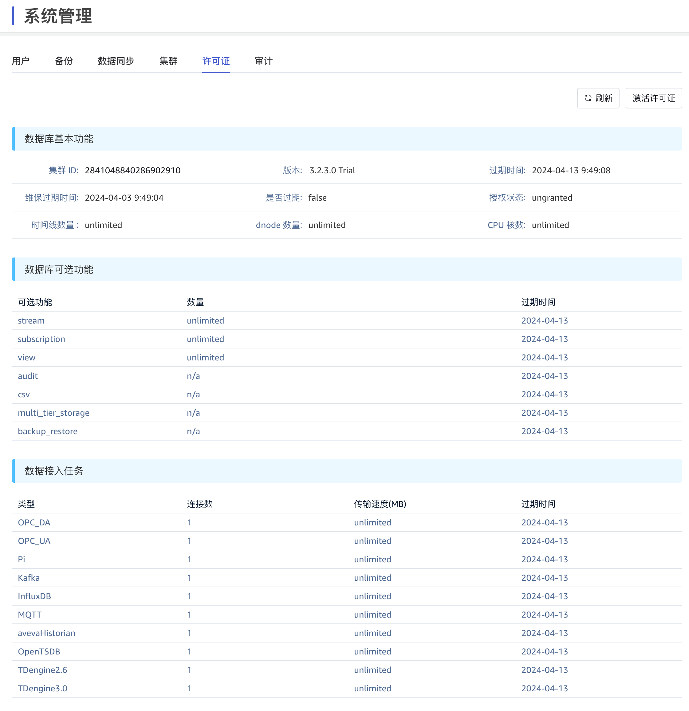

# 需求说明：TDengine 行业版

## 1. 引言

### 1.1 相关文档资料

| 连接 |
| --- |
| [TDengine 简版（第一次讨论）](https://taosdata.feishu.cn/wiki/FVHews73AiPmNZkpK4HchbB3nZe) |
| [TDengine 简版（第二次讨论）](https://taosdata.feishu.cn/wiki/L9Iqw9Njdib7TEkZ3MScFWOhnke) |
| [TDengine 行业版（第三次讨论）](https://taosdata.feishu.cn/wiki/UAeAw4GL1iBxhQkhISBcK2XInff) |

### 1.2 优先级要求

1. 2024 年 5 月份开展
2. 由于开发量不大，且相对独立，应在 4 月底发布的 3.3.0.0 版本中实施，不能等到 6 月底发布的 3.3.1.0 版本

### 1.3 版本要求

企业版支持，社区版不支持

## 2. 需求目标

为了覆盖更多客户群，以较低价格、大量出货、快速占据市场，公司决定裁剪出若干行业版本。TDengine 行业版面向的是有共性需求的、可承受不同价格敏感度的市场，例如电厂、风厂的集控软件，储能站的 EMS 软件等。
1. 行业版数目不做限制，例如水电版、火电版、光伏版，命名由、价格、销售范围由中国业务部决定
2. 行业版的版本号与对应企业版的版本号相同，发版周期也与企业版相同
3. 行业版与企业版的功能完全相同，通过 License 进行控制
4. 行业版与企业版的界面略有不同，体现在安装包命名、taosExplorer、Taos Shell 中

## 3. 需求明细

### 3.1 行业版输入信息

1. 行业版英文名称，例如“TDengine Power Edition”
2. 行业版中文名称，例如“TDengine 电力版”
3. 安装包名称，例如“Power”
在后续章节中说明这些关键字的使用。

### 3.2 安装包名称

以 3.2.3.0 为例，企业版安装包名称为`TDengine-enterprise-3.2.3.0-Linux-arm64.tar.gz`，行业版的名称是 `TDengine-``Power``-3.2.3.0-Linux-arm64.tar.gz`
<quote-container>
使用“安装包名称”关键字
</quote-container>

### 3.3 taosExplorer

#### 3.3.1 网站标题

1. 中文标题从“TDengine 企业版”修改为“TDengine 电力版”
2. 英文标题从“TDengine 企业版”修改为“TDengine Power Edition”


<quote-container>
使用“行业版中文名称”和“行业版英文名称”关键字
</quote-container>

#### 3.3.2 登录页面

1. 中文登录页面从“TDengine 服务版本”修改为“TDengine 电力版”
2. 英文登录页面从“TDengine Manage System”修改为“TDengine Power Edition”


<quote-container>
使用“行业版中文名称”和“行业版英文名称”关键字
</quote-container>

#### 3.3.3 标题栏

1. 中文登录页面从“TDengine 服务版本：3.2.3.0 Trial” 修改为“TDengine 电力版：3.2.3.0 Trial”
2. 英文登录页面从“TDengine Server Version：3.2.3.0 Trial” 修改为“TDengine Power Edition：3.2.3.0 Trial”


<quote-container>
使用“行业版中文名称”和“行业版英文名称”关键字
</quote-container>

#### 3.3.4 数据写入

1. 如果 License 未授权任何“数据接入连接器”，此页面不再显示
2. “Add New Data Source”页面只显示 License 已授权的数据接入连接器


#### 3.3.5 流计算

1. 如果 License 未授权“流计算”，此页面应被隐藏


#### 3.3.6 数据订阅

1. 如果 License 未授权“数据订阅”，此页面应被隐藏


#### 3.3.7 系统管理

1. 如果 License 未授权“数据备份恢复”，“备份”页面应被隐藏
2. 如果 License 未授权“数据同步复制”，“同步”页面应被隐藏
3. 如果 License 授权的 dnode 数目只有一个，“集群”页面应被隐藏
4. 如果 License 未授权“数据审计”，“审计”页面应被隐藏
5. “许可证” -> “数据库基本功能”
   - 中文页面 “版本：3.2.3.0 Trial” 修改为“TDengine 电力版： 3.2.3.0 Trial” 
   - 英文页面 “Version：3.2.3.0 Trial”修改为“TDengine Power Edition：3.2.3.0 Trial” 
   - “数据库可选功能” ，仅显示 License 授权过的功能
   - “数据接入任务” ，仅显示 License 授权过的连接器，如未授权任何连接器，此表格整体不显示


<quote-container>
使用“行业版中文名称”和“行业版英文名称”关键字
</quote-container>

### 3.4 Taos Shell

#### 3.4.1 登录信息

修改
```bash {wrap}
Server is Enterprise trial Edition, ver:3.2.3.0 and will expire at 2024-04-13 09:49:04.
```

为
```bash {wrap}
Server is Power trial Edition, ver:3.2.3.0 and will expire at 2024-04-13 09:49:04.
```

<quote-container>
使用“安装包名称”关键字
</quote-container>

#### 3.4.2 版本信息

修改 taosd -v 输出的版本信息
```bash {wrap}
taosd -V
Power Edition: 3.2.3.0 compatible_version: 3.0.0.0
gitinfo: e27fdcff254b7bd0e0ad2f825e0414da4c0f37dc
gitinfoOfInternal: 1fa6f400b011e78e72a75bbc903ca8c34212e2d5
buildInfo: Built Linux-x64 at 2024-02-29 22:16:43 +0800
```

<quote-container>
使用“英文名称”关键字
</quote-container>

#### 3.4.3 授权信息

修改 show grants 的版本信息中的 `version` 字段显示内容
```bash {wrap}
taos> show grants \G;
*************************** 1.row ***************************
     version: Power Edition trial
 expire_time: 2024-04-13 09:49:08
service_time: 2024-04-03 09:49:04
     expired: false
       state: ungranted
  timeseries: unlimited
      dnodes: unlimited
   cpu_cores: unlimited
Query OK, 1 row(s) in set (0.004996s)
```

<quote-container>
使用“英文名称”关键字
</quote-container>

#### 3.4.4 详细授权信息

修改 `select * from ins_grants_full` 输出的授权信息，仅仅显示 License 授权的功能
```sql
           grant_name           |          display_name          |             expire             |             limits             |
====================================================================================================================================
 stream                         | stream                         | 2024-04-13 09:49:08            | unlimited                      |
 subscription                   | subscription                   | 2024-04-13 09:49:08            | unlimited                      |
 view                           | view                           | 2024-04-13 09:49:08            | unlimited                      |
 audit                          | audit                          | 2024-04-13 09:49:08            |                                |
 csv                            | csv                            | 2024-04-13 09:49:08            |                                |
 storage                        | multi_tier_storage             | 2024-04-13 09:49:08            |                                |
 backup_restore                 | backup_restore                 | 2024-04-13 09:49:08            |                                |
 opc_da                         | OPC_DA                         | 2024-04-13 09:49:08            | {"number":1, "speed":-1, "e... |
 opc_ua                         | OPC_UA                         | 2024-04-13 09:49:08            | {"number":1, "speed":-1, "e... |
 pi                             | Pi                             | 2024-04-13 09:49:08            | {"number":1, "speed":-1, "e... |
 kafka                          | Kafka                          | 2024-04-13 09:49:08            | {"number":1, "speed":-1, "e... |
 influxdb                       | InfluxDB                       | 2024-04-13 09:49:08            | {"number":1, "speed":-1, "e... |
 mqtt                           | MQTT                           | 2024-04-13 09:49:08            | {"number":1, "speed":-1, "e... |
 avevahistorian                 | avevaHistorian                 | 2024-04-13 09:49:08            | {"number":1, "speed":-1, "e... |
 opentsdb                       | OpenTSDB                       | 2024-04-13 09:49:08            | {"number":1, "speed":-1, "e... |
 td2.6                          | TDengine2.6                    | 2024-04-13 09:49:08            | {"number":1, "speed":-1, "e... |
 td3.0                          | TDengine3.0                    | 2024-04-13 09:49:08            | {"number":1, "speed":-1, "e... |
Query OK, 17 row(s) in set (0.005170s)
```
