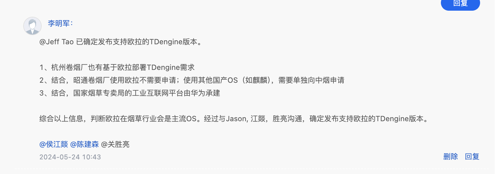

# 需求说明：支持 Euler 操作系统

TS-4851

## 1. 需求背景

在[需求报告：国产化平台支持](https://taosdata.feishu.cn/wiki/K8ahwuV2giGk84kni0TcG81WnXe)中，肖波提出国产操作系统、国产芯片支持的需求。该需求已被产品部接收，当有具体项目需求时开展。

## 2. 优先级要求

新项目“杭州卷烟厂”存在“Euler 操作系统”需求，按项目时间规划，要求在 2024-06-20 前完成。

## 3. 需求描述

### 3.1 操作系统

```sql
NAME="openEuler"
VERSION="22.03 (LTS-SP1)"
ID="openEuler"
VERSION_ID="22.03"
PRETTY_NAME="openEuler 22.03 (LTS-SP1)"
ANSI_COLOR="0;31"
```

### 3.2 硬件信息

```sql
架构：                   x86_64
  CPU 运行模式：         32-bit, 64-bit
  Address sizes:         48 bits physical, 48 bits virtual
  字节序：               Little Endian
CPU:                     8
  在线 CPU 列表：        0-7
厂商 ID：                AuthenticAMD
  型号名称：             Hygon C86 7390 32-core Processor
    CPU 系列：           15
    型号：               6
    每个核的线程数：     1
    每个座的核数：       2
    座：                 4
    步进：               3
    BogoMIPS：           5399.99
```

## 4. 附录

李明军会尝试与客户协调硬件环境

