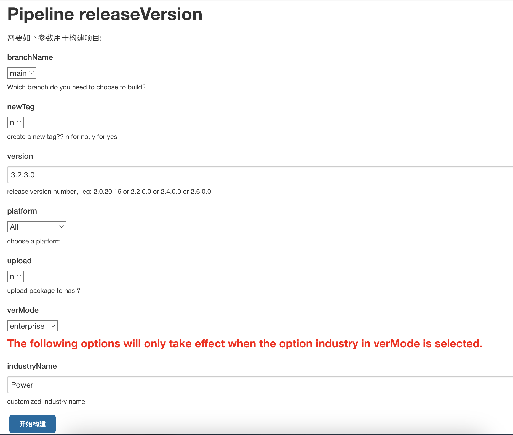

# TDengine 行业版

## 1. 背景

业务侧希望使用灵活的定价策略和产品功能组合面向不同行业不同付费能力的客户，在价格和产品功能上都能够体现出明显的差异。
需求文档详见：[需求说明：TDengine 行业版](https://taosdata.feishu.cn/wiki/XUx6wcgCeiJ8EEk4eBacGzvnnMb)

## 2. 变更历史

| 日期 | 版本 | 负责人 | 主要修改内容 |
| --- | --- | --- | --- |
| 2024/5/8 | 0.1 | Wade Zhang | 确定文档框架和内容分工 |
| 2024/5/23 | 0.2 | Wade Zhang | 根据 Review 意见修改，收缩范围，不与 OEM 混杂（统一），统一各组件 -V 的输出 |
| 2024/7/17 | 0.3 | Kaili Xu | 4.1 宏定义增加 TD_DATAIN_MONGODB |
| 2024/8/22 | 0.4 | Kaili Xu | 4.1 宏定义增加 TD_FUNC_DATA_SYNC TD_DATAIN_CSV 宏定义删除： ~~TD_FUNC_CSV~~ |
| 2025/2/24 | 0.5 | Kaili Xu | 4.1 宏定义增加 TD_FUNC_TD_GPT |
| 2025/05/09 | 0.6 | Kaili Xu | 4.1 宏定义增加 TD_DATAIN_SPARKPLUGB |

## 3. 定义

1. TDengine enterprise： 包含 TDengine 所有可选功能，某项可选功能是否可以使用取决于其是否被授权
2. TDengine industry：TDengine 行业版，包含 TDengine 部分可选功能，某项可选功能是否可以使用取决于其是否被授权；但未包含在该行业版中的某个可选功能也可以被授权，在其被授权后相当于自动被添加到了该行业版的某个具体部署实例中。

## 4. 行为说明

### 4.1 编译时行为

在编译 taosd 时为每项可选功能设计一个宏，根据该宏是否被设置决定该功能是否被包含在 `show grants` 的默认输出列表中。产品名称也有一个相应的宏，该宏在打包开源版、企业版及行业版时输入的是不同的值。

| 宏定义 | 说明 |
| --- | --- |
| TD_INDUSTRY | TDengine 行业版标识, e.g. -DTD_INDUSTRY=true |
| TD_PRODUCT_NAME | 产品名称，如 TDengine Enterprise Edition 或 TDengine Power Edition, e.g. -DTD_PRODUCT_NAME="Product Name" |
| TD_FUNC_STREAM | `流计算` 功能 (Stream), e.g. -DTD_FUNC_STREAM=true |
| TD_FUNC_SUBSCRIPTION | `数据订阅` 功能 (Subscription) |
| TD_FUNC_AUDIT | `审计日志` 功能 (Audit) |
| ~~TD_FUNC_CSV~~ | `~~CSV 导入~~`~~ 功能 (CSV)~~ 通过 insert into xxx FILE 写入不再限制，去掉该宏定义 |
| TD_FUNC_VIEW | `视图` 功能 (View) |
| TD_FUNC_MULTI_TIER_STORAGE | `多级存储` 功能 (Multi-Tier Storage) |
| TD_FUNC_DATA_BAK_RESTORE | `数据备份与恢复` 功能 (Data Backup & Restore)DTD_FUNC_AUDIT |
| TD_FUNC_DATA_SYNC | `数据同步` 功能 (Data Synchronization) |
| TD_FUNC_OBJECT_STORAGE(<=3.3.6) TD_FUNC_SHARED_STORAGE(>=3.3.8) | `对象存储(S3)` 功能 (Object Storage) `共享存储(S3)` 功能 (Shared Storage) |
| TD_FUNC_ACTIVE_ACTIVE | `双活` 功能 (Active-Active) |
| TD_FUNC_DUAL_REPLICA_HA | `双副本` 功能(Dual-Replica HA) |
| TD_FUNC_DB_ENCRYPTION | `数据库加密` 功能(Database Encryption) |
| TD_FUNC_TD_GPT | TDgpt 功能 |
| TD_DATAIN_OPC_DA | `OPC DA` 数据源 |
| TD_DATAIN_OPC_UA | `OPC UA` 数据源 |
| TD_DATAIN_PI | `Pi` 数据源 |
| TD_DATAIN_KAFKA | `Kafka` 数据源 |
| TD_DATAIN_INFLUXDB | `InfluxDB` 数据源 |
| TD_DATAIN_MQTT | `MQTT` 数据源 |
| TD_DATAIN_AVEVAHISTORIAN | `avevaHistorian` 数据源 |
| TD_DATAIN_OPENTSDB | `OpenTSDB` 数据源 |
| TD_DATAIN_TDENGINE_2_6 | `TDengine 2.6` 数据源 |
| TD_DATAIN_TDENGINE_3_0 | `TDengine 3.0` 数据源 |
| TD_DATAIN_MYSQL | `MySQL` 数据源 |
| TD_DATAIN_POSTGRES | `PostgreSQL` 数据源 |
| TD_DATAIN_ORACLE | `Oracle` 数据源 |
| TD_DATAIN_MSSQL | `SqlServer` 数据源 |
| TD_DATAIN_MONGODB | `MongoDB` 数据源 |
| TD_DATAIN_CSV | `CSV` 数据源 |
| TD_DATAIN_SPARKPLUGB | `SparkplugB` 数据源 |
| TD_DATAIN_ORC | `ORC` 数据源 |
| TD_DATAIN_KINGHIST | `KingHistorian` 数据源 |
| TD_DATAIN_PULSAR | `Pulsar` 数据源 |
| TD_DATAIN_PSPACE | `pSpace` 数据源 |
| IDMP_FUNC_BASIC | IDMP 时序属性数量 IDMP 非时序属性数量 IDMP 元素数量 IDMP 服务器数量 IDMP CPU 核数 IDMP 用户数量 |
| IDMP_FUNC_VERSION_CTRL | IDMP 版本控制 |
| IDMP_FUNC_DATA_FORECAST | IDMP 数据预测 |
| IDMP_FUNC_DATA_DETECT | IDMP 异常检测 |
| IDMP_FUNC_DATA_QUALITY | IDMP 数据质量 |
| IDMP_FUNC_AI_CHAT_GEN | IDMP 智能问答 |
| TD_LAX_MACHINE_CODE_CHK | 集群未授权时，是否跳过机器码检查：取值为 true， 跳过机器码检查；取值为 false，进行机器码检查，默认值为 false。|

### 4.2 打包行为

#### 4.2.1 输入

在通过 Jenkins Job 打包时可以选择打包类型： Enterprise 或 Industry。还需要输入行业名称，如 “Power" 或 "Gasoline"，相应生成的完整的产品名称为
如 TDengine Enterprise Edition
    TDengine Power Edition
    TDengine Gasoline Edition
由此生成的安装包名称为：TDengine-<Enterprise|IndustryName>-<platform>-<version>.tgz
1. TDengine-Enterprise-Linux-x64-3.3.1.0.tgz（企业版）
2. TDengine-Power-Linux-x64-3.3.1.0.tgz（行业版）

#### 4.2.2 功能列表

Enterprise 默认包含所有可选功能，而  Industry 默认所有可选功能均不包含，打包时可以选择具体的可选功能列表。

#### 4.2.3 UI



### 4.3 运行时行为

#### 4.3.1 show grants

- `show grants/show grants full` 命令在初始安装后默认只展示打包时选中的可选功能。对 TDengine Enterprise 来说，行为没有任何变化。对 TDengine Industry 来说，打包时选中的功能以及在运行时通过授权码激活的功能都会被展示出来。
- 针对 TDengine 社区版/企业版/行业版/云服务版，`show grants` 命令 version 字段前半部分均显示**完整的产品名称**，后半部分的取值包括：community(社区版)、trial(企业版-未授权)、official(企业版-已授权)、cloud(云服务版)。
```python
taos> show grants \G;
*************************** 1.row ***************************
     version: TDengine Power Edition trial
 expire_time: 2024-04-13 09:49:08
service_time: 2024-04-03 09:49:04
     expired: false
       state: ungranted
  timeseries: unlimited
      dnodes: unlimited
   cpu_cores: unlimited
Query OK, 1 row(s) in set (0.004996s)
```

#### 4.3.2 授权

授权机制与 TDengine Enterprise 完全相同，没有任何变化。打包时未选择的功能也可授权。

#### 4.3.3 taos shell console

taos shell console 和 `taos ``-V` 中涉及输出产品名称的地方，显示完整的产品名称。

#### 4.3.4 版本输出

1. 以下工具的命令行参数 `-V` 中要输出生成的完整的产品名称，并需要按下节的描述统一 `-V` 的输出格式
- taosd -V
- taos -V
1. 以下工具的命令行参数 `-V` 不输出产品名称，但需要统一一下输出格式，下面是 taosX 的输出（修正后）
```shell {wrap}
$ taosx -V
taosx version: 3.3.0.3 (core-1.6.1)
git: 8f63a1935db58d0927406fcff4bb1887fdad9de5
build: linux-x86_64 2024-05-18 08:10:00 +08:00
```

其格式抽象如下，其中 <> 为占位符，无 <> 包括的为常量字符串，[] 表示可选占位符
```shell {wrap}
<component_name> version: <version> [internal version] # internal version 可选，只有 taosx 需要
git: <full commit ID>
[gitOfInternal: <full commit ID>] # 如果代码来自多个仓库，如 taosd 这里放 TDinternal 仓库的 commit ID，其它组件应该没有这个需要
build: <platform> <date> <time> <timezone>
```

- taosAdapter -V
- taosKeeper -V
- taosX -V
- taos-explorer -V
- taosx-agent -V
- udfd -V
- taosBenchmark -V
- taosdump -V
1. 以行业版 TDengine Power 为例，统一后的 `taosd -V` 输出的版本信息如下：
```bash {wrap}

## 5. taosd -V

TDengine Power Edition
taosd version: 3.2.3.0 compatible_version: 3.0.0.0
git: e27fdcff254b7bd0e0ad2f825e0414da4c0f37dc
gitOfInternal: 1fa6f400b011e78e72a75bbc903ca8c34212e2d5
build: Linux-x64 2024-02-29 22:16:43 +0800
```

#### 5.0.1 日志

上节各组件的日志中涉及产品名称的地方，要替换为正确的完整产品名称。

#### 5.0.2 taos-explorer

1. 展示授权的地方直接使用 `show grants` 的输出
2. 在创建 data in 任务的地方，用户可创建的数据源列表也取决于 `show grants` 的输出

## 6. 性能

无性能影响

## 7. 兼容性

无兼容性问题

## 8. 运维

无特别的运维要求

## 9. 使用场景

面向行业用户，需要灵活的定价策略和功能列表。

## 10. 约束和限制

无

## 11. 常见错误和排查

暂无

## 12. 可观测性

taos shell 和 taos-explorer 的行为已在产品行为中说明

## 13. 安装和卸载

无特殊要求

## 14. 文档

无需修改官网文档
但对于 企业版文档，其所包含的文档建议直接使用 TDengine Enterprise 的完整文档，即不对文档做裁剪。

## 15. 参考文档

## 16. 附录
