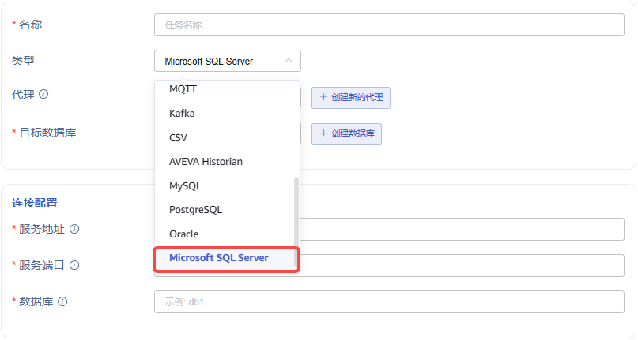
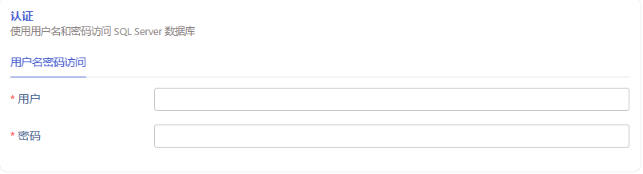
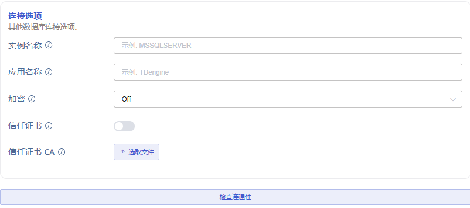
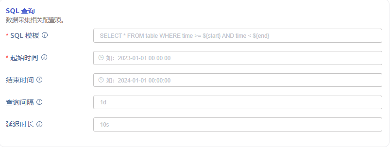

# Data In: SQL Server

## 1. 背景

在之前的版本中，taosx 已经支持将关系型数据库 MySQL、Oracle 与 PostgreSQL 中的数据迁移至 TDengine。Microsoft 公司的 SQL Server 也是市场占有率很高的关系型数据库之一，taosx 也有必要支持从 SQL Server 数据源中进行数据迁移。

## 2. 变更历史

| 日期 | 版本 | 负责人 | 主要修改内容 |
| --- | --- | --- | --- |
| 2024/05/21 | 0.1 | @张元湃 | 初稿 |
|  |  |  |  |
|  |  |  |  |
|  |  |  |  |

## 3. 定义

- 关系型数据库（RDBMS）：此处仅指 SQL Server。
- 数据源参数类型：
  - string：表示字符串类型参数，choices 列如果有值，表示应从列表中选择。
  - duration: 表示时间间隔，其在 DSN 中是形如 `1d` `5m` `10s` 的时间长度字符串。
  - datetime: 表示时间戳，其在 DSN  中是 RFC3339 格式字符串，形如：`2024-02-04T00:00:00+08:00`。
- explorer 时区：指 explorer 页面右上角由用户指定或浏览器默认选择的时区，它默认代表用户所处地理位置的时区，输入时间与输出时间都以此为基础进行转换

## 4. 行为说明

### 4.1 添加数据源

Explorer 数据源列表中，增加数据源 Microsoft SQL Server。


### 4.2 SQL Server 数据源 UI

SQL Server 数据源，使用与 MySQL 基本一致的 UI 展示结构，包括：`连接信息`、`SQL 查询`、`Transformer`、`高级选项`四大部分。

#### 4.2.1 连接信息

连接信息包括基本连接配置、认证和连接选项三部分：
- 连接配置：包括服务地址、端口与数据库名。
<quote-container>
注：SQL Server 安装后默认没有开启使用 IP 访问，需要在“配置管理工具”中开启 TCP/IP 并设置好静态端口等配置项。
</quote-container>


- 认证：包括用户名与密码。


- 连接选项：包括实例名称与应用名称等可选连接参数。


连接选项参数说明如下：

| ID | Name | Description | Type | Choices |
| --- | --- | --- | --- | --- |
| instance_name | 实例名称 | SQL Server 实例名称，默认未指定 | string |  |
| application_name | 应用名称 | 设置应用程序名称，用于标识连接的应用程序，默认未指定 | string |  |
| encryption | 加密 | 设置是否使用加密连接 | string | Off：仅对登录过程使用加密 On：尽可能加密所有内容 NotSupported：不加密任何内容 Required：加密所有内容，如果不可能则失败 |
| trust_cert | 信任证书 | 设置是否信任服务器证书 | bool | 如果设置为 true，则不会验证服务器证书，直接信任接收 |
| trust_cert_ca | 信任证书 CA | 设置是否信任服务器证书 CA | file | 如果设置，除了系统信任库之外，还将根据给定的CA证书验证服务器证书。 注：如果开启 trust_cert 则不能设置 trust_cert_ca，否则将引起异常 |

- 连通性检查在连接信息之后。

#### 4.2.2 SQL 查询

Explorer 查询页面使用基于时间窗口的分段查询计划。根据起止时间（start, end）和查询间隔时间窗口（interval），确定查询计划。


各参数列表如下：

| ID | Name | Description | Type |
| --- | --- | --- | --- |
| sql | SQL 模板（SQL Template） | 用于查询的 SQL 语句。 | string |
| start | 起始时间（Start Time） | 应用于查询语句的起始时间。 | datetime |
| end | 结束时间（End Time） | 应用于查询语句的结束时间。 | datetime |
| interval | 查询间隔（Interval） | 用于分段查询的时间间隔。 | duration |
| delay | 延迟时长（Delay） | 用于同步未来时刻数据的等待时长。 与 InfluxDB、Historian 等数据源描述保持一致。 | duration |

- SQL 模板中必须使用预定义的时间占位符，且应**同时包含起止**时间，且起止时间占位符必须**成对出现**，且**允许多组**时间占位符：
  - 时间戳起止 `${start}` `${end}`：表示 RFC3339 格式时间戳，如： `2024-03-14T08:00:00+0800`
  - 无时区时间戳起止 `${start_no_tz}` `${end_no_tz}`: 表示不带时区的 RFC3339 字符串：`2024-03-14T08:00:00`。
  - 日期起止：`${start_date}` `${end_date}`：表示仅日期，如：`2024-03-14`。
  - 时间起止：`${start_time}` `${end_time}`：表示仅时间，如：`08:00:00`。
- `**start**`**, **`**end**`：分段查询的起止时间记为 `[start, end)` ，使用左闭右开区间。**起始时间为必选项**。**结束时间为可选项**，不选时，同步将不会停止（即通过连续查询达到有延时的实时同步的目的）。
- `**interval**`：查询间隔时间窗口，将 `[start, end)` 分割为多个时间片，分别查询。
- `**delay**`**：**延迟时长。此参数仅在查询起止时间包含未来时间时有意义。在时间 `end` 到达时，延迟 `delay` 时长再进行查询，以等待该查询时段内的数据写入完毕。

##### 4.2.2.1 分库分表

如果有按时间分库分表的需求，即表名中包含日期（如 `table_202403` 为 2024 年 3 月数据表），可配合 `interval` 参数在 SQL 模板的表名中使用时间占位符：

| name | description | Example |
| --- | --- | --- |
| Y | 年，完整的公历年表示，零填充的 4 位整数。 | 2001 |
| y | 年，公历年除以 100，零填充的 2 为整数。 | 01 |
| m | 月，整数月份(01 - 12) | 07 |
| b | 月，月份英文的缩写（3 个字母） | Jul |
| B | 月，月份英文全拼 | July |
| d | 日，日期的数字表示(01 - 31)，零填充的 2 位整数 | 08 |
| j | 日，一年中的第几天（001 - 366），零填充的 3 位整数。 | 189 |
| F | 日，相当于 `${Y}-${m}-${d}` | 2001-07-08 |

可以使用如下时间占位符的组合：

| Ymd | 日，完整的年月日表示，中间没有空格 | 20010708 |
| --- | --- | --- |
| ymd | 日，完整的年月日表示，中间没有空格，年为 2 位数字 | 010708 |
| md | 日，月日的数字表示，中间没有空格 | 0708 |
| dm | 日，日月的数字表示，中间没有空格 | 0807 |
| Yj | 日，以一年中的第几天表示的日期，中间没有空格 | 2001189 |
| yj | 日，以一年中的第几天表示的日期，中间没有空格，年为 2 位数字 | 01189 |

需要注意：
1. 查询时，如果包含日占位符，时间分片后的结果不得跨日；如果包含月占位符，时间分片后的结果不得跨月；如果包含年占位符，时间分片后的结果不得跨年。
2. 占位符 `y` `m` 不加单引号会作为数字，忽略 01 前面的 0 变为 1
3. 占位符 `F` 需要加单引号，否则 2024-04-24 会导致语法错误
4. 在 concat 中使用 ${b} 与 ${B} 时，例如 `select concat(${Y}, '', ${b}) as newcol`，需要用户自行添加单引号，修改为 `select concat(${Y}, '', '${b}') as newcol`，否则处理后的 sql 中会将 `Jul` 作为列名进行查询。

##### 4.2.2.2 任务状态变更

使用分段查询功能下，其任务状态变更条件和结果如下：
1. 任务执行完毕，进入 **已完成 **状态
2. 任务执行出错，进入 **已中断 **状态，并继续重试，同步任务以上次执行成功的 end' 作为新的 start' 开始执行。
3. 任务配置编辑时，**不允许**修改基础 SQL 语句。
4. 任务配置修改后，启动任务时需要对新的 start, end 及 checkpoint 的关系重新计算。如果修改了 end，且 end < checkpoint，则直接结束。

#### 4.2.3 Transformer （数据映射）

SQL Server 的数据映射部分，与 MySQL 数据源保持一致：


需要注意：
1. 时间戳列映射到 TDengine 表时，如果原始类型是 TIMESTAMP 类型，不需要转换；如果是字符串类型，支持 RFC3339 格式字符串自动解析，其他情况需要拼接完整时间戳字符串后才能入库；日期、时间在不同列的，拼接合并后方可入库。

#### 4.2.4 高级选项

支持设置读并发数与批次大小：


## 5. 性能

关系型数据库暂时没有性能测试报告，无性能参考基准。

## 6. 兼容性

使用了与 MySQL 等数据源相关的 rust 库，增加 dependencies 与 features 后可能产生兼容性问题，但概率极小。

## 7. 运维

无。

## 8. 使用场景

### 8.1 历史数据迁移

使用自定义 SQL 或过去时间分段查询，达到迁移历史数据的目的。

### 8.2 实时数据同步

使用未来时间分段查询，可达到迁移实时数据的目的。
<quote-container>
如果没有结束时间，taosx 可持续迁移实时数据；如果结束时间在一个未来时间，等任务进行到这个未来时间时会结束。
</quote-container>

### 8.3 分库分表

#### 8.3.1 按日期分表

假设我们有按照日期格式 `20240708` （2024 年 07 月 08 日）这样的日期分表的数据库：
```sql {wrap}
create table meters_part_20240708(
  id int,
  ts time,
  current float,
  voltage int,
  phase float
);

insert into meters_part_20240708 values(1, "08:00:00", 2.1, 10, 0.1)
```

我们可以使用日期占位符构建如下 SQL 模板：
```sql {wrap}
select id, concat('${F}', 'T', ts, '+08:00') as ts, current, voltage, phase
  from meters_part_${ymd};
```

其对应到 `20240708` 日期的表 SQL 如下：
```sql {wrap}
select id, concat('2024-07-08', 'T', ts, '+08:00') as ts, current, voltage, phase
  from meters_part_20240708;
```

SQL 查询结果如下表：

| ts | id | current | voltage | phase |
| --- | --- | --- | --- | --- |
| 2024-07-08T08:00:00+08:00 | 1 | 2.1 | 10 | 0.1 |

之后使用 Transformer 功能可以进行进一步的数据映射。

#### 8.3.2 宽表列转行

假设我们有表 `mytable`，每分钟数据均为单独列，共 m00...m59 总计 60 列时序值（以下示例中我们仅用了 6 列，并插入了日期为 2024-04-04 ，时间为 01:00 - 01:05 的数据）
```sql {wrap}
create table mytable(
  id int,
  dt date,
  hour smallint,
  m00 int,
  m01 int,
  m02 int,
  m03 int,
  m04 int,
  m05 int
);

insert into mytable values(1, '2024-04-04', 1, 0,1,2,3,4,5);
```

在我们 Transformer 支持 pivot （转置，行转列，或列转行）前，我们可以使用关系型数据库 union all 进行预处理以达到列转行的目的：
```sql {wrap}
SELECT concat(dt, 'T', LPAD(hour, 2, '0'), ':00:00+0800') AS m, m00 AS value FROM mytable
UNION ALL
SELECT concat(dt, 'T', LPAD(hour, 2, '0'), ':01:00+0800') AS m, m01 AS value FROM mytable
UNION ALL
SELECT concat(dt, 'T', LPAD(hour, 2, '0'), ':02:00+0800') AS m, m02 AS value FROM mytable
UNION ALL
SELECT concat(dt, 'T', LPAD(hour, 2, '0'), ':03:00+0800') AS m, m03 AS value FROM mytable
UNION ALL
SELECT concat(dt, 'T', LPAD(hour, 2, '0'), ':04:00+0800') AS m, m04 AS value FROM mytable
UNION ALL
SELECT concat(dt, 'T', LPAD(hour, 2, '0'), ':05:00+0800') AS m, m05 AS value FROM mytable;
```

在这里的示例代码中，我们得到了期望的时序的结果，将以上 SQL 转为模板，或预先在数据库中创建视图后再用视图编写 SQL 模板，就可以使用我们的功能实现入库了。

| id | m | value |
| --- | --- | --- |
| 1 | 2024-04-04T01:00:00+0800 | 0 |
| 2 | 2024-04-04T01:01:00+0800 | 1 |
| 3 | 2024-04-04T01:02:00+0800 | 2 |
| 4 | 2024-04-04T01:03:00+0800 | 3 |
| 5 | 2024-04-04T01:04:00+0800 | 4 |
| 6 | 2024-04-04T01:05:00+0800 | 5 |

## 9. 约束和限制

1. SQL Server 数据库连接当前不支持 socket 直连。
2. 暂时不支持以下类型：
   - text/ntext 类型，建议使用 VARCHAR(MAX)/NVARCHAR(MAX) 代替
   - image 类型，建议使用 VARBINARY(MAX) 代替
   - xml 类型
3. 暂时处理异常的类型：
   - numeric、decimal
   - geography、geometry
   - Hierarchyid
   - money、smallmoney
   - date、datetime、datetime2、datetimeoffset、smalldatetime、time、timestamp

## 10. 常见错误和排查

1. 连接错误在检查数据源时显示在 Explorer。
2. 创建任务和更新任务配置时，检查数据源可用性。
3. SQL 查询参数检查相关错误消息：
   - 当 SQL 语句中不含时间占位符或时间占位符不成对（仅包含 start*，或 end*）时，报错：invalid sql template, missing start and end.
   - 当 SQL 语句不合法时，报错：You have an error in your SQL syntax: xxx （具体错误信息）

## 11. 可观测性

可观测性所涉及的范围同其他数据源（Flat 类型数据源，如 MQTT、Historian）一致。
需要 @佘彦杰在 在 taosx TDinsight 中添加 SQL Server 数据源监控面板。

## 12. 安装和卸载

无。

## 13. 文档

- **需要**修改企业版文档
- **不需要**修改官网文档

## 14. 参考文档

[ColumnType in tiberius - Rust](https://docs.rs/tiberius/latest/tiberius/enum.ColumnType.html)
[Data Type Usage - SQL Server](https://learn.microsoft.com/en-us/sql/relational-databases/native-client-odbc-results/data-type-usage?view=sql-server-ver15)
[[How To]如何给SQL Server配置证书](https%3A%2F%2Flearn.microsoft.com%2Fzh-cn%2Farchive%2Fblogs%2Fapgcdsd%2Fhow-tosql-server)

## 15. 附录

### 15.1 分段查询实现方案

在实现中，SQL 模板中的时间占位符将被各分段时间范围替换。例如，SQL 语句为  `select * from table where name = 'abc' and ts >= ${start} and ts < ${end}`，起始时间为 `2024-02-04 00:00:00 +08:00`，结束时间为 `2024-02-14 00:00:00 +08:00`，时间窗口为 1 天，则分段查询第一条语句将是：`select * from table where name = 'abc' and ts >= '2024-02-04T00:00:00+08:00' and ts < '2024-02-05T00:00:00+08:00'`，以此类推。
为了实现持续同步，我们使用“延迟时长”参数，对查询的起止时间做了如下约定：
- 对于一次查询任务，延迟时长记为 delay，当前时间记为 now ，起始时间记为 start'，结束时间记为 end'。
- 执行时刻 now >= end' + delay 时（表示这是一个历史数据查询），执行查询语句。
- 执行时刻 now  < end' + delay 时（未到结束时间，表示这是一个未来或实时数据查询），需要等待到 end' + delay 时刻到达，才执行查询。
- 每次查询写入成功后，更新 checkpoint 为 end'，作为断点续传的依据。
这样，我们将历史数据查询和实时数据同步使用统一的参数达成目的。

### 15.2 断点续传

仅当使用分段查询时支持断点续传。使用分段查询时，并且并发数大于 1 时，taosx 会同时处理多个时间段的数据迁移子任务，此时，任务中断会记录多个断点信息（sub_id:timestamp），但在下次启动任务时，taosx 会计算其中最早的时间作为断点续传位置。

### 15.3 数据类型映射关系对照表

| SQL Server 字段类型 | Sample Data | Arrow 类型 | TDengine 类型 |
| --- | --- | --- | --- |
| tinyint | i8 | Int8 | TINYINT |
| smallint | i16 | Int16 | SMALLINT |
| int | i32 | Int32 | INT |
| bigint | i64 | Int64 | BIGINT |
| real | f32 | Float32 | FLOAT |
| float | f64 | Float64 | DOUBLE |
| decimal | String | Utf8 | NCHAR |
| numeric | String | Utf8 | NCHAR |
| char | String | Utf8 | NCHAR |
| nchar | String | Utf8 | NCHAR |
| varchar | String | Utf8 | NCHAR |
| varchar(MAX) | String | Utf8 | NCHAR |
| nvarchar | String | Utf8 | NCHAR |
| nvarchar(MAX) | String | Utf8 | NCHAR |
| text | String | Utf8 | NCHAR |
| ntext | String | Utf8 | NCHAR |
| bit | String | Utf8 | NCHAR |
| binary | String | Utf8 | NCHAR |
| varbinary | String | Utf8 | NCHAR |
| varbinary(MAX) | String | Utf8 | NCHAR |
| date | String | Utf8 | NCHAR |
| datetime | String | Utf8 | NCHAR |
| datetime2 | String | Utf8 | NCHAR |
| datetimeoffset | DateTime | Timestamp(TimeUnit::Nanosecond, None) | TIMESTAMP |
| smalldatetime | String | Utf8 | NCHAR |
| time | String | Utf8 | NCHAR |
| timestamp | String | Utf8 | NCHAR |
| geography |
| geometry |
| hierarchyid |
| image | String | Utf8 | NCHAR |
| money | String | Utf8 | NCHAR |
| smallmoney | String | Utf8 | NCHAR |
| sql_variant |
| uniqueidentifier | String | Utf8 | NCHAR |
| xml | String | Utf8 | NCHAR |

### 15.4 时间条件带时区查询

为了解决时区引发的使用混乱问题，我们将用户在 explorer 中输入的 sql 与 start/end 均赋予“explorer 时区”的属性，下面将举例说明：
```plaintext {wrap}

## 16. 用户输入：

sql: select * from test where ts >= ${start} and ts < ${end}
start: 2024-04-01 00:00:00+08:00
end: 2024-05-01 00:00:00+08:00

## 17. taosx 处理：

1. 得到“explorer 时区”的字符串 start=2024-04-01 00:00:00 end=2024-05-01 00:00:00
2. 在“explorer 时区”的连接中执行 sql 语句 select * from test where ts >= '2024-04-01 00:00:00' and ts < '2024-05-01 00:00:00';
```

与此同时，taosx 中拆分任务的时间段也赋予“explorer 时区”的属性，按照“explorer 时区”的 day 进行拆分查询。
<quote-container>
注意1：按时间分表的问题，需要保证 explorer 时区、表名时区、查询字段时区三者一致，否则将会出现在 table_20240401 表中查询 ts=2024-04-02 02:00:00 数据的可能性。
注意2：只有 datetime2 与 datetimeoffset 支持使用 start/end 查询，datetime 与 smalldatetime 只能使用 start_no_tz/end_no_tz 查询，而 timestamp 不能用作查询条件
</quote-container>

### 17.1 时间类型的特殊处理

1. 由于 timestamp 类型与时间戳无关，只是数据修改发生的相对顺序，所以按原二进制数组迁移
2. datetime/smalldatetime/datetime2 存储基于数据库服务器时区的时间，与客户端时区无关，所以需要将他们按照字符串格式进行迁移
3. Datetimeoffset 存储带有时区信息的时间，可以按照客户端时间进行相应的转换，它将使用时间类型进行迁移
