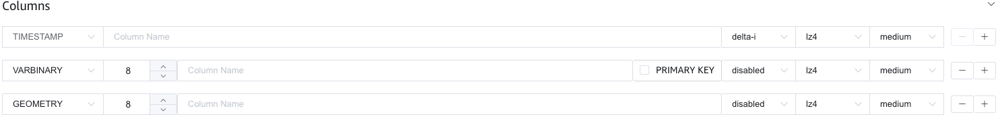
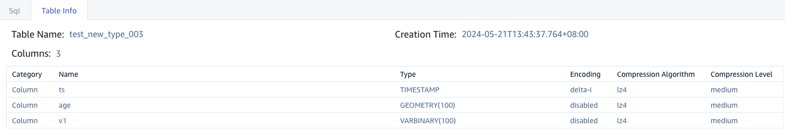
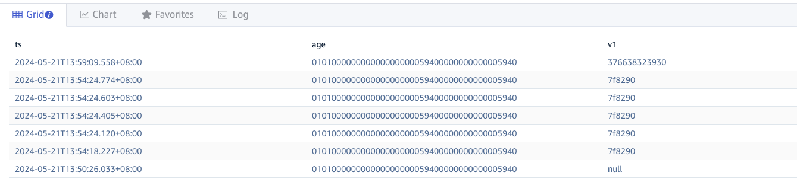
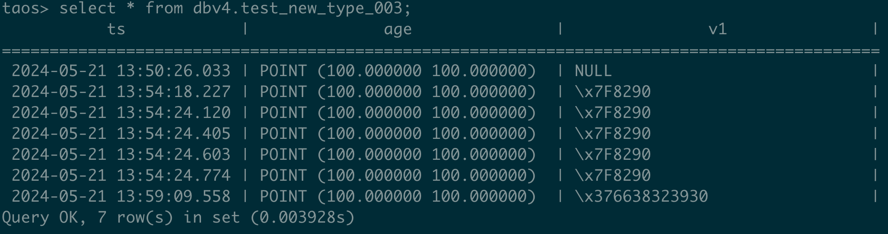

# Explorer-支持 Geometry/Varbinary 数据类型

## 1. 背景

自 3.1.1.0 起，TDengine 支持[VARBINARY 数据类型](https://taosdata.feishu.cn/wiki/WWJkwPD6LiKKTxkfihjcclXjnSe)和[Geometry 类型支持](https://taosdata.feishu.cn/wiki/H3GnwOiEMiqBjGkzr1WcoLgynYc)，Explorer 中需要建表语句支持Geometry/Varbinary 类型。

## 2. 变更历史

| 日期 | 版本 | 负责人 | 主要修改内容 |
| --- | --- | --- | --- |
| 2024/5/22 | 0.1 | 顾香 | 初稿 |

## 3. 定义

无。

## 4. 行为说明

### 4.1 Explorer 需要支持在建表时配置类型增加 Geometry/Varbinary

包括：
1. 数据浏览器树形窗口创建超级表数据列和标签列
2. 数据浏览器树形窗口创建普通表数据列
3. DataIn 部分支持 Transformer 的数据源配置数据映射时创建超级表数据列和标签列

其中：
- Geometry 长度可输入为数据列为最大长度为 65,517 字节，标签列最大长度为 16,382 字节
- Varbinary 长度可输入为数据类型列最大长度为 65,517 字节，标签列最大长度为 16,382 字节
- Varbinary/Geometry 压缩增强行为同 Varchar，但不支持复合主键

### 4.2 Explorer 支持类型Geometry/Varbinary展示

包括：
1. 数据浏览器树形窗口查看超级表信息
2. 数据浏览器树形窗口查看普通表信息

1. 数据浏览器树形窗口查询数据
插入数据的 sql 为 insert into dbv4.test_new_type_003 values(now,'point(100 100)','\x7F8290')
 现状是：Explorer 调用 rest/sql 接口查询时返回的值与 taos shell 中返回的不一致
最终想要的是两者保持一致的显示，目前初步讨论的结果：
-  rest/sql 增加参数，确保返回结果与 taos shell 保持一致，需要 taosadapter 侧进行修改 
- Native 连接时，确保返回结果与 taos shell 保持一致，由@张元湃修改 修改 

## 5. 性能

无。

## 6. 兼容性

Explorer 仅对 3.1.1.0 以上版本显示 VARBINARY 此特性，3.1.0.0 以上版本显示 Geometry ，对旧版本保持原 UI。即 Explorer 能够根据 TDengine 版本自适应展示不同的行为。

## 7. 运维

无。

## 8. 使用场景

无。

## 9. 约束和限制

无。

## 10. 常见错误和排查

无。

## 11. 可观测性

无变化。

## 12. 安装和卸载

无变化。

## 13. 文档

- **需要**修改企业版文档：需要对此特性添加说明，修改截图等。
- 不需要修改官网文档。参考文档

## 14. 附录

无。
