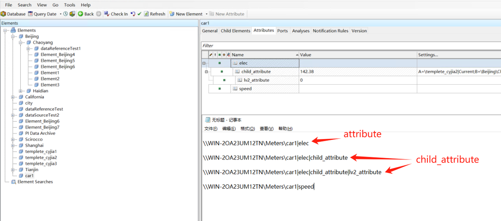
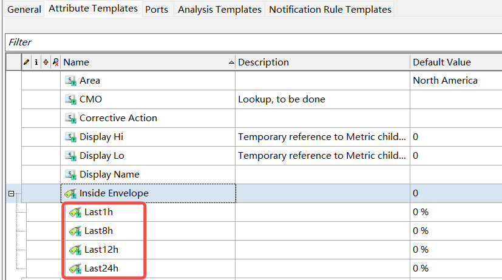

# PI 数据源支持 Child Attribute

## 1. 背景

PI system 的 element 的 Attibute 可以有 Child Attibute, 例如下图中名称为 Inside Envelope 的 Attribute


目前 taosX 的 PI 数据源尚不支持同步 Child Attibute，且潜在客户 Cargill 必须要这个功能，因此开发此功能。
详见 JIRA： 
TS-4755

## 2. 变更历史


| 日期 | 版本 | 负责人 | 主要修改内容 |
| --- | --- | --- | --- |
| 2025/5/14 | 0.1 | 丁博 | 初稿 |
|  |  |  |  |
|  |  |  |  |
|  |  |  |  |

## 3. 定义

1. **Attribute:**
一个具体的指标，例如电压值，电流值等。注意和 point 区分，attribute 的具体数值可以来源于一个 PI Point（data reference），但是 PI Point 没有 UOM, attribute 为它增加了 UOM, 例如电流 A, mA 等；Attribute 也可能并不是一个 PI Point ，而是 string builder,  fomula 等。Attribute 可以分为两大类，静态属性和动态属性，静态属性可以作为 TDengine 的 tag, 动态属性可以作为 TDengine 的 Column。
1. **Child Attribute**
需要在 Attribute 下创建，和 Attribute 具有相同的特性，区别是在 path 中需要包含父级 Attribute。


## 4. 行为说明

1. 将动态的 Child Attribute 映射为 TDengine 的普通列。 
2. 将静态的 Child Attribute 映射为 TDengine 的 TAG 列。
3. 虽然 PI 从理论上不限制 Child Attibute 的深度，我们只同步第一级的 Child Attibute。
4. Child  Attribute Name 到列名的映射规则（注意这里仅仅是默认规则，用户可以通过修改模型配置文件修改默认规则）
  - 将 Father Attribute Name 和 Child Attribute Name 中的大写字母转小写，将非 小写字母数字和下划线替换为 下划线 _
  - 将转换后的 father_attribute_name 和转换后的  child_attribute_name 再用下划线连接 
1. Child Attribute 是静态还是动态的判断规则和普通 Attribute 一致。(由连接器实现)。

## 5. 性能

在本次开发过程中，会同时做以下性能优化：
1. 
  TD-30055

1. 
  TD-30056

性能优化之后，我们的期望对于 10 万 elements，能在 3 分钟内返回配置信息。
启动任务后，在 20 秒之内就能看到数据。

## 6. 兼容性

不兼容老的 taosX 版本和连接器版本。

## 7. 运维

无

## 8. 使用场景

1. 1. 当用户创建的 Child Attribute 起到标签的作用时，taosX 能默认将 Child Attribute 转换为标签。
2. 当用户创建 Child Attribute  是为了将类似的属性归到一起时，taosX 也能给这些类似的属性添加相同的前缀，且在默认的表结构中是相邻的列。

## 9. 约束和限制

约束：无
限制：只支持第一级 Child Attribute。

## 10. 常见错误和排查

无

## 11. 可观测性

无

## 12. 安装和卸载

无

## 13. 文档

不需要

## 14. 参考文档

[PI 连接器实现总结（2024年5月版本）](https://taosdata.feishu.cn/wiki/I3OUwocXvivph3k3KvAc8sL3nfe)
[PI Transform 连接器开发文档](https://taosdata.feishu.cn/wiki/WuTKwsleRieVyDk7B07ckKXWnEf)
[PI System Transformation](https://taosdata.feishu.cn/wiki/HSwGwyCBoiBYEXkCjcicNQhBnyb)

## 15. 附录

连接器在多列模式下返回的 JSON 数据结构不变，只不过 Child Attribute 的名字前要添加 Father Attibure Name, 例如对于截图中的 Child Attribute


返回的数据应该为
```json
 "Attributes": [
                {
                    "Name": "Inside Envelope",
                    "Type": "Float",
                },
                {
                    "Name": "Inside Envelope|Last1h",
                    "Type": "Float",
                },
                {
                    "Name": "Inside Envelope|Last8h",
                    "Type": "Float"
                },
                {
                    "Name": "Inside Envelope|Last12h",
                    "Type": "Float"
                },
                {
                    "Name": "Inside Envelope|Last24h",
                    "Type": "Float"
                }
         ]
```

注意：
获取配置时，只需要在 template 域保留 attribute 的name和类型，element 域的 attributes 需要全部删除（用不到，速度考虑）
