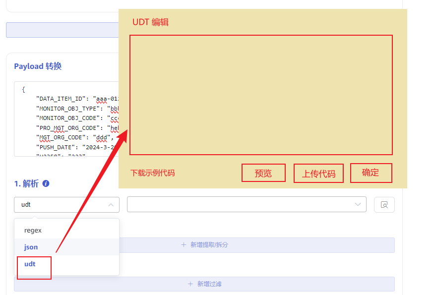

# Transformer parser 支持 UDT 和动态更新

## 1. 背景

目前河北电力分布式光伏从营销用采系统 Kafka 消费数据入库 TDengine，拟采用 taosX 替换之前采用的nifi方案。

### 1.1 数据解析

Kafka 数据示例如下：
```json {wrap}
{
    "DATA_ITEM_ID": "aaa-0123456",
    "MONITOR_OBJ_TYPE": "bbb",
    "MONITOR_OBJ_CODE": "ccc",
    "PRO_MGT_ORG_CODE": "hebei",
    "MGT_ORG_CODE": "ddd",
    "PUSH_DATE": "2024-3-20 12:23:30",
    "U2358": "223",
    "U2359": "219",
    "PHASE_FLAG": "1",
    "DATA_POINT_FLAG": "3",
    "DATA_DATE": "2024-3-20",
    "CMD_TYPE": "eee",
    "PRODUCT_CODE": "fff",
    "DEV_ID":"xxx-1",
    "TERMINAL_ID":"zzz"
}
```

数据采用具有一定业务规则的 JSON 格式，在 “DATA_DATE” 这一天内采集的数据汇总在一个 json object 中给出，其中不同时刻的数据在字段 “UHHmm” 中，比如 18:23 的数据，在字段 U1823 中。
依据此规则，上例中可以解析出两条采集数据：
```json {wrap}
{"ts": "2024-3-20 23:58:00", "value": "223"}
{"ts": "2024-3-20 23:59:00", "value": "219"}
```

### 1.2 数据过滤且动态更新过滤条件

Kafka topic 中混合存放了普通用户电能表、分布式光伏电能表信息，业务需求是仅导入分布式光伏电能表的采集数据，忽略掉其他采集数据。同时分布式光伏电能表在持续部署中，需要不断地增加 DEV_ID 列表项。期望能够提供机制，可以动态地添加新的过滤项，从而收集新加入的电能表数据。
示例数据如下，期望根据标红的`DEV_ID`属性过滤出需要的数据。
```json {wrap}
{
    "DATA_ITEM_ID": "aaa-0123456",
    "MONITOR_OBJ_TYPE": "bbb",
    "MONITOR_OBJ_CODE": "ccc",
    "PRO_MGT_ORG_CODE": "hebei",
    "MGT_ORG_CODE": "ddd",
    "PUSH_DATE": "2024-3-20 12:23:30",
    "U2358": "223",
    "U2359": "219",
    "PHASE_FLAG": "1",
    "DATA_POINT_FLAG": "3",
    "DATA_DATE": "2024-3-20",
    "CMD_TYPE": "eee",
    "PRODUCT_CODE": "fff",
    "DEV_ID":"xxx-1",
    "TERMINAL_ID":"zzz"
}
```

## 2. 变更历史

| 日期 | 版本 | 负责人 | 主要修改内容 |
| --- | --- | --- | --- |
| 2024/05/09 | 0.1 | 周营昭 | 初稿 |
| 2024/05/10 | 0.2 | 周营昭 | 合并河北电力2个需求在当前 FS 定义的产品行为中解决。 |
| 2024/05/13 | 1.0 | 周营昭 | 线下 review，按照会议中大家意见修改后定稿 |

## 3. 定义

1. UDT：User Defined Transformer，即用户自定义数据转换，在 taosX transform 中 UDT 采用 rhai 脚本语言编写并应用于解析步骤，参考https://rhai.rs/book/about/index.html

## 4. 行为说明

### 4.1 Parser UDT 机制

在 Explorer 中已经可以在 Parse 步骤选择 regex 或 json 解析方式，本次新增一种用户自定义解析数据的方式，简称 "UDT" (User Defined Parser) 。
如下图，解析规则中新增选项 UDT；选择 UDT 后，自动弹出输入框，可以在其中输入 UDT 脚本，也可以上传文件。不管是哪种方式，都将覆盖原有的 parser 规则。点击“确定”保存脚本后，立即触发 parser 预览，后台服务做语法检查和运行，返回预览结果，有语法错误则提示给用户。


点击`上传代码`，可以选择提前准备好的 UDT 代码文件，上传后内容加载到编辑框中，可以在线修改；点击`确认`，保存编辑框中的最终代码并触发预览；点击`预览`，则提交给 taosX 服务器执行脚本，对示例数据进行解析，可查看预览结果。
可以点击“下载示例代码”获取完整的代码示例文件。

### 4.2 Parser UDT 接口定义

**输入**： 参数名 data，类型为~~ JSON 格式的~~~~字符串~~，解析后的 json object
**输出**： ~~json array 字符串~~ 节省序列化和反序列化的过程，使用 map 数组
**说明：**
taosX 使用 json 解析 UDT 返回的字符串获取 json object 数组。
如果返回空 array，则表示未解析到有效数据，无需进行后续处理。
获取到多条数据，则逐条应用 transform 规则，写入目标表。
**UDT 返回数据示例**：
单条：[{"key": "value"}]
多个: [{"key": "value1"}, {"key": "value2"}]
空：[]
非法: 不是以`[`开头，以`]`结尾的有效 json array 字符串。

### 4.3 过滤条件实现

用户可以在 UDT 中实现自己期望的过滤条件，如果有符合过滤条件的数据则返回，否则返回空 json 数组，如下伪代码：
```javascript {wrap}
let raw_json = JSON.parse(data);
if (!filter(raw_json.DEV_ID)) {
    return "[]";
}
```

### 4.4 动态更新 UDT【废弃】

<callout emoji="bulb" background-color="light-orange" border-color="light-orange">
由于河北电力项目的过滤项有70万条数据，而且无法用简单逻辑表达，只能使用集合类过滤的方法。这种方式无法满足需求，修改方案。
</callout>

提供动态更新 UDT 的 http rest api 接口。

| URL | /api/-/tasks/{taskId}/parser | taskId 对应当前要更新的 data in，数据源列表中可以查看这个id. |
| --- | --- | --- |
| method | POST |  |
| header | Authorization: Basic ${秘钥} | 其中秘钥为 ${用户名}:${密码}经过Base64后的字符串，比如默认用户密码 root:taosdata 生成的秘钥为：cm9vdDp0YW9zZGF0YQ== |
| body | { "parse": { "value": {"UDT": "script"} } } | 其中 script 需要根据实际业务数据编写。 |
| Http status: 200 返回数据：{"code": 0, msg: null} | 成功 |
| Http status: 401 返回数据：{"code": 401, msg: "authentication failure"} | 权限认证失败，header 中的 Authorization 信息认证失败。 |
| Http status: 400 {"code": 400, msg: "script error: xxxx"} | 过滤表达式编写错误，msg 中会给出具体的语法错误。 |

调用接口成功后，对应的 data in task 自动应用新的数据解析器.
优点：高性能，在初步解析时过滤掉不需要的数据。

### 4.5 UDT 插件

使用 UDT 插件，可以扩展业务自定义逻辑代码，不耦合在 taosx 产品代码中。
1. taosx udt parser 中加载 `plugins/udt/`下的动态库；
2. 在脚本中引入动态库，调用动态库方法。
```bash
import "libhebeipower" as plugin;

if (!plugin::check_in_white_list(dev_id)) {
    return [];
}
```

如上例，则是动态加载 `plugins/udt/libhebeipower.so`后，调用这个动态库里的方法`check_in_white_list`。

## 5. 性能

无。

## 6. 兼容性

无。

## 7. 运维

1. 需要熟悉 rhai 脚本语法
2. 动态更新 UDT 需要获取要更新的taskId，通过数据源列表可以查看 taskId。

## 8. 使用场景

本示例展示如何使用 UDT 编写用 DEV_ID 过滤数据的 UDT 并应用，以及在业务逻辑需要更新过滤条件时如何更新 UDT。
1. 准备 UDT 代码：示例代码如下 (目前是伪代码）：
```javascript {wrap}
function filterDevice(dev_id) {
    // 后续设备列表有变更时，修改这个部分的白名单和黑名单
    return ["white1", "white2"].contains(dev_id) 
        && !["black1", "black2"].contains(dev_id);
}

let raw_json = JSON.parse(data);
if (!filterDevice(row_json.DEV_ID)) {
    return "[]";
}

// 列转行
let share_data = {};
let data_as_row = [];
for (let key in raw_json) {
    if (/^U\d{4}$/.test(key)) {
        data_as_row.push({
            "ts": `${raw_json.DATA_DATE} ${key.substr(1, 2)}:${key.substr(3, 2)}:00`,
            "value": raw_json[key]
        });
    } else if (key != "DATA_DATE") {
        share_data[key] = raw_json[key]
    }
}

// 共享属性赋给行数据
data_as_row.forEach((d) => {
    Object.assign(d, share_data);
});

return JSON.stritify(data_as_row);
```

1. 应用 UDT: 创建 kafka data in 任务，选择使用 UDT parser，上传准备好的 UDT 代码，保存任务后，获取 taskId。
2. 检查效果：检查 TDengine 表，是否成功采集新加设备数据。
3. 动态修改 UDT：当需要修改过滤条件时，需要先修改 UDT 脚本，然后重复上面的第 2 步，即在 Explorer UI 上传新的 UDT 脚本。或者调用 restapi 接口`/api/-/tasks/{taskId}/parser`。更新 UDT 脚本。然后重复上面的第3步，检查新规则应用是否正确。新规则生效可能略有延迟，延迟时间取决于当前正在处理的数据批次的数据量，正常情况下应该在秒级。

## 9. 约束和限制

限制：外部调用接口`/api/-/tasks/{taskId}/parser`时间频率控制在分钟级以上。
目前支持 4 种数据类型：int、float、string、bool.

## 10. 常见错误和排查

无。

## 11. 可观测性

无。

## 12. 安装和卸载

无。

## 13. 文档

无。

## 14. 参考文档

1. [需求报告：taosX支持从参数名中提取数据](https://taosdata.feishu.cn/wiki/N8sOwexWxiZZzxk12wncGtzvnOg)
2. [需求报告：taosX支持动态筛选条件](https://taosdata.feishu.cn/wiki/EOxEwn3VDi8trNkJJYXcFx3qn1g)

## 15. 附录

### 15.1 河北电力动态库

动态库中回去监测白名单文件的变化，内容有变化时，加载到 HashSet：WHITE_LIST 中。
```rust
static WHITE_LIST: Lazy<Arc<RwLock<HashSet<String>>>> =
    Lazy::new(|| Arc::new(RwLock::new(HashSet::new())));

// 定义常量，用于存储白名单文件路径
static WHITE_LIST_FILE_PATH: &str = "/usr/local/hebeipower/white.txt";
// static WHITE_LIST_FILE_PATH: &str = "D:\\tmp1\\whitelist.txt";

// 定义全局变量，用于存储白名单文件的修改时间
static WHITE_LIST_FILE_MODIFIED_TIME: Lazy<std::sync::Mutex<std::time::SystemTime>> =
    Lazy::new(|| std::sync::Mutex::new(std::time::SystemTime::now()));

#[allow(improper_ctypes_definitions)]
#[no_mangle]
pub extern "C" fn module_entrypoint() -> Shared<Module> {
    let seed_values: [u64; 4] = [2, 0, 2, 7];
    set_hashing_seed(Some(seed_values)).unwrap();

    thread::spawn(move || {
        let mut watcher =
            notify::recommended_watcher(|res: Result<Event, notify::Error>| match res {
                Ok(event) => {
                    match event.kind {
                        notify::EventKind::Modify(ModifyKind::Any)
                        | notify::EventKind::Modify(ModifyKind::Data(_)) => {
                            println!("file modified:{:?}", event);
                            init_white_list_with_file(WHITE_LIST_FILE_PATH).unwrap();
                        }

                        _ => {}
                    }
                    println!("{:?}", event);
                }
                Err(e) => {
                    println!("watch error: {:?}", e);
                }
            })
            .unwrap();

        watcher
            .watch(
                Path::new(WHITE_LIST_FILE_PATH),
                notify::RecursiveMode::Recursive,
            )
            .unwrap();

        loop {
            std::thread::sleep(std::time::Duration::from_secs(600000));
        }
    });

    // 加载模块时，初始化白名单
    init_white_list_with_file(WHITE_LIST_FILE_PATH).unwrap();

    exported_module!(udt_plugin_api).into()
}

fn init_white_list_with_file(file_path: &str) -> Result<(), String> {
    let file = std::fs::File::open(file_path).map_err(|e| e.to_string())?;
    // 获取文件的修改时间
    let metadata = file.metadata().map_err(|e| e.to_string())?;
    let file_modify_time = metadata.modified().map_err(|e| e.to_string())?;
    let mut white_list_file_modified_time = WHITE_LIST_FILE_MODIFIED_TIME.lock().unwrap();
    if (*white_list_file_modified_time) == file_modify_time {
        return Ok(());
    }
    *white_list_file_modified_time = file_modify_time;

    let mut white_list = WHITE_LIST.write().unwrap();
    white_list.clear();

    let reader = std::io::BufReader::new(file);
    for line in reader.lines() {
        let content = line.map_err(|e| e.to_string())?;
        white_list.insert(content);
    }

    Ok(())
}

// The plugin API from rhai can be used to create your plugin API.
#[rhai_dylib::rhai::plugin::export_module]
pub mod udt_plugin_api {
    use rhai::INT;
    use rhai_dylib::rhai::plugin::ImmutableString;

    /// Computing something and returning a result.
    #[rhai_fn(global)]
    pub fn check_in_white_list(dev_id: ImmutableString) -> bool {
        let white_list = WHITE_LIST.read().unwrap();
        white_list.contains(dev_id.as_str())
    }

    #[rhai_fn(global)]
    pub fn check_in_white_list_int(dev_id: INT) -> bool {
        let white_list = WHITE_LIST.read().unwrap();
        white_list.contains(&dev_id.to_string())
    }
}
```


### 15.2 河北电力 rhai 脚本

```bash
import "libhebeipower" as plugin;

let idev_id = parse_int(data["DEV_ID"]);
if (!plugin::check_in_white_list_int(idev_id)) {
    return [];
}

let result = [];
let share_data = #{};

for (k, i) in data.keys() {
    if (k.len == 5 && (k.starts_with("U0") || k.starts_with("U1") || k.starts_with("U2"))) {
        let ymd = data["DATA_DATE"].split('-');
        if ymd[1].len == 1 { ymd[1] = "0" + ymd[1] } 
        if ymd[2].len == 1 { ymd[2] = "0" + ymd[2] } 
        let item = #{"_ts": `${ymd[0]}-${ymd[1]}-${ymd[2]} ${k.sub_string(1,2)}:${k.sub_string(3,2)}:00`, "_value": data[k]};
        result.push(item);
    } else if (k != "DATA_DATE") {
        share_data.set(k, data[k]);
    }
}

for (item, i) in result {
    result[i] += share_data;
}

result
```
