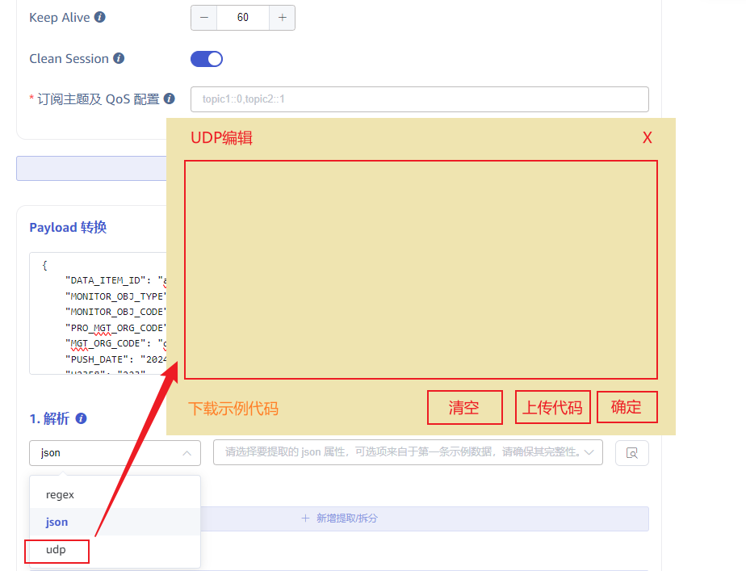

# taosX UDP 用户手册

本文展示如何使用 UDP 编写用 DEV_ID 过滤数据的 UDP 并应用，以及在业务逻辑需要更新白名单或者黑名单。
1. 准备 UDP 代码：示例代码如下 (目前是伪代码，实施阶段由 TDengine 交付团队提供）：
```javascript {wrap}
function filterDevice(dev_id) {
    // 后续设备列表有变更时，修改这个部分的白名单和黑名单
    return ["white1", "white2"].contains(dev_id) 
        && !["black1", "black2"].contains(dev_id)
}

let raw_json = JSON.parse(data);
if (!filterDevice(row_json.DEV_ID)) {
    return "[]";
}

// 列转行
let share_data = {};
let data_as_row = [];
for (let key in raw_json) {
    if (/^U\d{4}$/.test(key)) {
        data_as_row.push({
            "ts": `${raw_json.DATA_DATE} ${key.substr(1, 2)}:${key.substr(3, 2)}:00`,
            "value": raw_json[key]
        });
    } else if (key != "DATA_DATE") {
        share_data[key] = raw_json[key]
    }
}

// 共享属性赋给行数据
data_as_row.forEach((d) => {
    Object.assign(d, share_data);
});

return JSON.stritify(data_as_row);
```

1. 应用 UDP: 创建 kafka data in 任务，选择使用 udp parser，上传准备好的 udp 代码，保存任务后，获取 taskId。


1. 检查效果：检查 TDengine 表，是否成功采集新加设备数据。
2. 动态修改白名单和黑名单：调用 restapi 接口`/taosx/tasks/{taskId}/filter`，更新过滤dev_id 的白名单和黑名单。。

| URL | `/taosx/tasks/{taskId}/filter` | taskId 对应当前要更新的 data in，数据源列表中可以查看这个id. |
| --- | --- | --- |
| method | POST |  |
| header | Authorization: Basic ${秘钥} | 其中秘钥为 ${用户名}:${密码}经过Base64后的字符串，比如默认用户密码 root:taosdata 生成的秘钥为：cm9vdDp0YW9zZGF0YQ== |
| body | { "black": ["black1", "black2"], "white": ["white1", ...] } | 只能提供白名单或者黑名单。 |
| Http status: 200 返回数据：{"code": 0, msg: null} | 成功 |
| Http status: 401 返回数据：{"code": 401, msg: "authentication failure"} | 权限认证失败，header 中的 Authorization 信息认证失败。 |
| Http status: 400 {"code": 400, msg: "params error"} |  |
