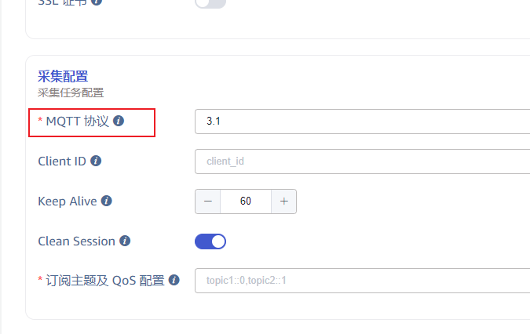
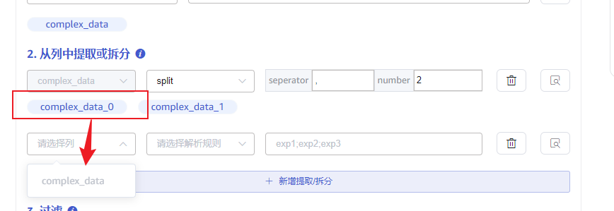
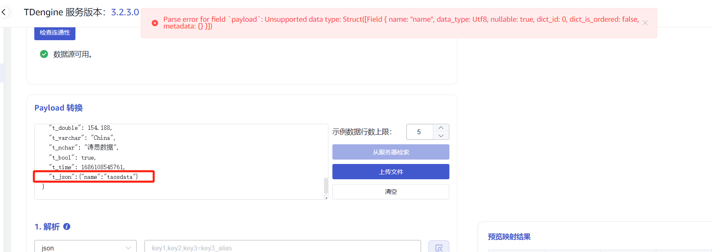
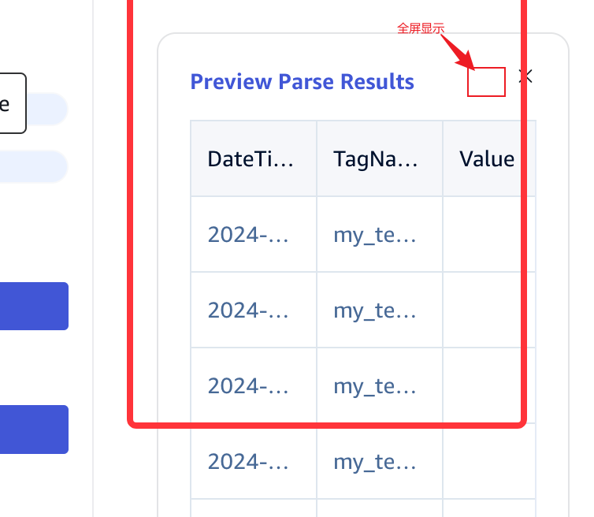
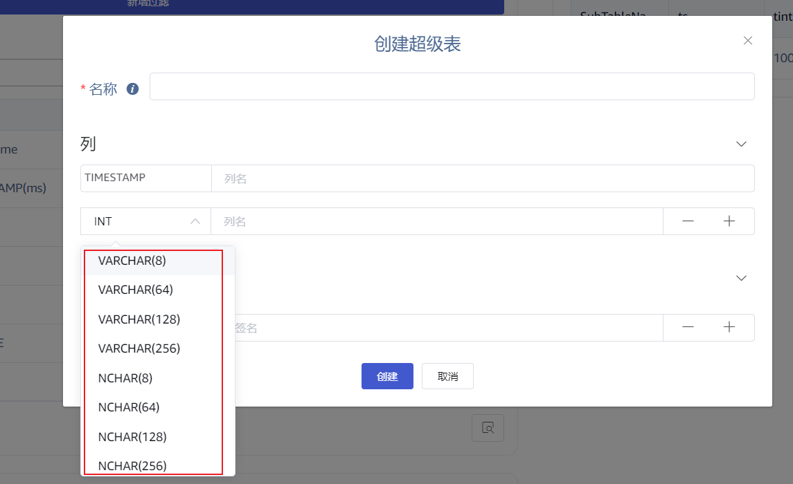
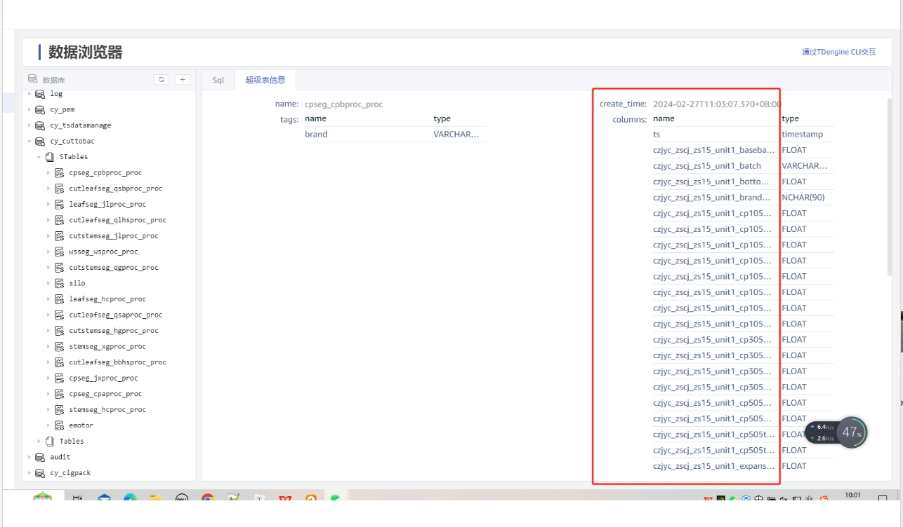
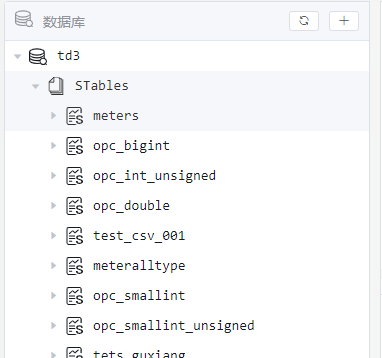

# taosX 1.7.0-Explorer 优化项

## 1. Transform 优化

### 1.1 Duration/Timeout 输入框统一

[TD-28866](https://jira.taosdata.com:18080/browse/TD-28866)   <Dev Done>
这类之前的输入方式是一个 文本框，需要输入类似于 `12Days`，对用户不友好，后面的时间单位太过于灵活。
期望使用组合输入框，可选的时间单位可配置。

### 1.2 必填项显示

必填标志放到 label 前 ，保持对齐。

### 1.3 从服务器获取示例数据(mqtt/kafka)

Chait 在一个 TS 中提到的问题，要求必须支持。
这个工作量不小，需要专门的 task 任务跟踪【下个版本】

### 1.4 支持列的二次拆分

待讨论，是否要做？我建议暂不考虑。
[TD-29650](https://jira.taosdata.com:18080/browse/TD-29650)
提取拆分的字段可以出现在后续的列名中。

### 1.5 修改拆分规则后，mapping 部分如何处理

建议方案：修改规则后，对于使用直接字段mapping的字段，如果源字段不存在，则情况对应规则，其他规则(format、expr）等，不做任何处理；

保持原状，预览提示错误。

### 1.6 JSON 解析规则

[TD-29342](https://jira.taosdata.com:18080/browse/TD-29342)
{"a": {"b":1,"c":"dd"}}
a_b = 1
a_c = "dd"
$.a.b=a_b
1. 目前不支持嵌套的 JSON 格式，期望能够自动解析，字段名使用下划线连接的多层级属性。
2. 是否还要提供 JSON 解析规则编辑？上次给 Jeff 演示时，Jeff 提出来可以不需要用户选择

建 jira , 解析更加复杂的 json,  确定支持的json 规则，嵌套和数组

### 1.7 mapping 表达式和 filter 表达式 校验

[TD-29651](https://jira.taosdata.com:18080/browse/TD-29651)
是否要添加校验？实现起来有些难度，使用 rhai 表达式运算，需要预判返回结果类型。
暂不考虑。

### 1.8 预览数据优化 支持

[TS-4602](https://jira.taosdata.com:18080/browse/TS-4602)   <Dev Done>

## 2. 数据浏览器

### 2.1 创建超级表是否保留这种字段类型 (Dev Done)

云服务只有 VARCHAR类型，长度都是自定义；没有预定义长度的VARCHAR，应该以哪个为准？
按照云服务 统一()

### 2.2 收藏语句持久化存储 feature-下个版本

持久化到哪里？ Explorer sqlite
explorer 服务上做一个文件存储；
按照登录的数据库用户存储，每个用户有自己的收藏语句存储文件，用户间不能共享？或者做成一个存储文件，所有用户间可共享？建议做成前者。

### 2.3 查询宽表，前端查询慢

[TS-4719](https://jira.taosdata.com:18080/browse/TS-4719)
数据表的字段很多时（900列），前端渲染慢

### 2.4 查看超级表信息

做成一个表格，三列： 字段分类、名称、类型。

### 2.5 数据浏览器 Hierachy 视图迁移 feature，下个版本

从云服务已经实现的新版本视图迁移到企业版。

## 3. 其他

### 3.1 Task VIEW 模式下载配置文件 

PI 、 OPC 都有这样的需求。
[TS-4663](https://jira.taosdata.com:18080/browse/TS-4663)

### 3.2 单独的查看模式

和修改区分开；查看模式下，可以下载。

Mqtt clientId 的实现机制修改
改成前缀

Endpoint port 统一风格

## 4. 讨论汇总结论

### 4.1 UI优化项，taosX 1.7.0 内完成

1. Duration/Timeout 输入框统一[工作量较大] [TD-28866](https://jira.taosdata.com:18080/browse/TD-28866) 【已实现】
2. 必填项对齐显示优化 [TD-29963](https://jira.taosdata.com:18080/browse/TD-29963) 【已实现】
3. 修改拆分规则后，mapping 部分保持现状不做清除，在预览数据时应该提示错误。 【已实现】
4. 预览数据优化，支持全屏预览 【已实现】
5. 创建超级表，去掉 VARCHAR(n) 的快捷方式 【已实现】
6. 优化大宽表查询慢 [TS-4719](https://jira.taosdata.com:18080/browse/TS-4719)
7. endpoint/point 输入方式统一采用分离方式[存在兼容性问题，潜在工作量大]

### 4.2 新 feature

1. 从服务器获取示例数据 (mqtt/kafka)【taosx 1.8.0】[TD-29958](https://jira.taosdata.com:18080/browse/TD-29958) 【已实现】
2. JSON解析, 支持更加复杂的 json(数组和嵌套)，支持的规则和边界待具体讨论。【taosX 1.8.0】[TD-29955](https://jira.taosdata.com:18080/browse/TD-29955)
3. 收藏查询语句持久化存储【taosX 1.8.0】[TD-29959](https://jira.taosdata.com:18080/browse/TD-29959)
4. 数据浏览器 Hierachy 视图【taosX 1.8.0】[TD-29960](https://jira.taosdata.com:18080/browse/TD-29960)
5. Data in task 配置的查看页面和修改页面区分开，查看页面中配置文件可直接下载【taosX 1.7.0】[TD-29961](https://jira.taosdata.com:18080/browse/TD-29961) 【已实现】
