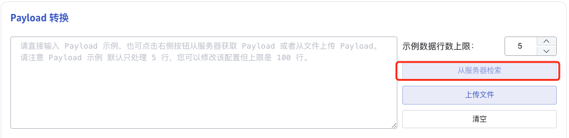

# 数据源获取示例数据

## 1. 背景

目前，kafka 和 mqtt 数据源不能“从服务器检索”获取示例数据。这个 FS 的目标是：
1. 梳理数据源获取示例数据的接口；
2. Kafka 和 mqtt 支持“从服务器检索”获取示例数据。
相关JIRA：

TD-29958

## 2. 变更历史

| 日期 | 版本 | 负责人 | 主要修改内容 |
| --- | --- | --- | --- |
| 2024-05-30 | v0.1 | @杨志宇 | 初稿 |
|  |  |  |  |
|  |  |  |  |

## 3. 定义

无

## 4. 行为说明

### 4.1 获取示例数据的接口

所有数据源获取示例数据，都使用下面的接口：

| **接口** |
| --- |
| **描述** |
| **参数** | **说明** | 必填 | 默认值 |
| dsn | 数据源的 dsn，包含参数 get_sample_limit：示例数据行数上限 | 是 | 无 |
| via | Agent id，当任务配置了 agent 时有值，任务不使用 agent 为空。 | 否 | 无 |
| timeout | 从数据源服务器检索示例数据的最大超时时间，单位为秒，默认为 30 秒。 | 否 | 30 |
| **request 示例** |
| **response 示例** |
| **Response 说明** |

### 4.2 获取示例数据失败

如果“从服务器检索”示例数据失败，返回错误信息，前端提示用户。Response 如下：
```json {wrap}
{
    "code": 65535,
    "message": "get sample data timeout",
}
```

### 4.3 Kafka 获取示例数据

从 Kafka 服务器检索示例数据时，dsn 中包含需要的参数，包括：

| **参数** | **说明** | 必填 | 默认值 |
| --- | --- | --- | --- |
| bootstrap_servers | 连接 Kafka 参数 | 是 |  |
| topics | Kafka 的 topic | 是 |  |
| offset | offset | 否 | Earliest |
| get_sample_limit | 示例数据行数上限 | 否 | 5 |
| get_sample_timeout | 获取示例数据的超时时间，超过 timeout 没有获取到数据就返回 1. 在 timeout 内，检索示例数据达到 get_sample_limit，直接返回； 1. 检索示例数据达到 timeout，且示例数据不为空，则返回数据； 1. 检索示例数据达到 timeout，且示例数据为空，返回空数组。 | 否 | 30 sec |

- 使用连接参数 bootstrap_servers 建立到 Kafka 服务器的连接， 从指定的 topics 中拉取不超过 max_sample_rows 条示例数据。
- 获取示例数据时，使用临时的 group 且不提交 offset commit。
Kafka 返回的 Response，只有 input 部分，且只有一个 payload 字段，如下：
```json {wrap}
{
    "input": [
        {"payload": "{\"ts\":1699324881000,\"location\":\"Beijing\",\"deviceid\":3720,\"current\":7.5"},
        ...
    ]
}
```

### 4.4 Mqtt 获取示例数据

从 Mqtt 服务器检索示例数据时，dsn 中包含需要使用的参数，包括：

| **参数** | **说明** | 必填 | 默认值 |
| --- | --- | --- | --- |
| address | MQTT 地址 | 是 |  |
| version | MQTT 协议版本 | 是 |  |
| topics | 订阅主题及 QoS 配置 | 是 |  |
| get_sample_limit | 示例数据行数上限 | 否 | 5 |
| get_sample_timeout | 获取示例数据的超时时间，超过 timeout 没有获取到数据就返回。 1. 在 timeout 内，检索示例数据达到 get_sample_limit，直接返回； 1. 检索示例数据达到 timeout，且示例数据不为空，则返回数据； 1. 检索示例数据达到 timeout，且示例数据为空，返回空数组。 | 否 | 30 sec |

从 mqtt 服务器检索示例数据的流程：
1. 使用 dsn 中的参数生成 taosx-mqtt 的配置文件；
2. 创建接收 mqtt 数据的线程： sample_receiver；
3. 调用 taosx-mqtt，订阅 mqtt 数据；
4. sample_receiver 线程接收示例数据，如果数据达到 get_sampel_limit 或等待时间超过 timeout，则退出；
5. 将接收到的示例数据返回给前端。
Mqtt 的 response，只有 input 部分，且只有一个 payload 字段，如下：
```json {wrap}
{
    "input": [
        {"payload": "{\"ts\":1699324881000,\"location\":\"Beijing\",\"deviceid\":3720,\"current\":7.5"},
        ...
    ]
}
```

### 4.5 UI 变动

Kafka 和 mqtt 的“从服务器检索”变为可用。


## 5. 性能

这个 FS 对性能没有影响。

## 6. 兼容性

无

## 7. 运维

无

## 8. 使用场景

1. Kafka 获取示例数据
2. Mqtt 获取示例数据

## 9. 约束和限制

无

## 10. 常见错误和排查

无

## 11. 可观测性

无

## 12. 文档

无

## 13. 参考文档

无

## 14. 附录1: mqtt 的 rust crate

https://crates.io/search?q=mqtt
