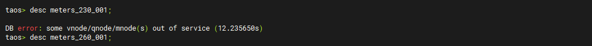
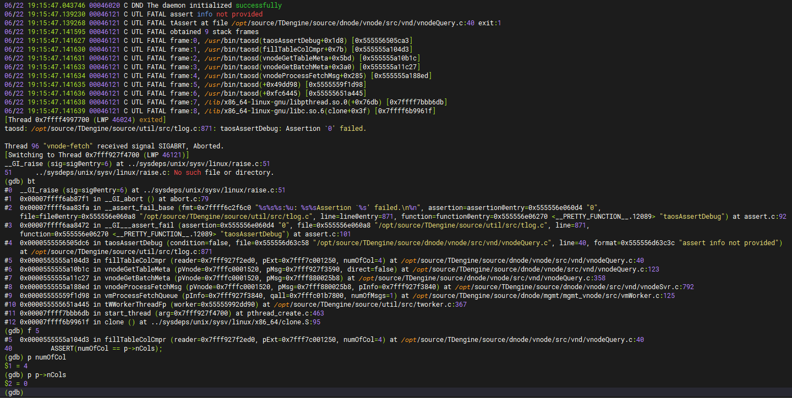
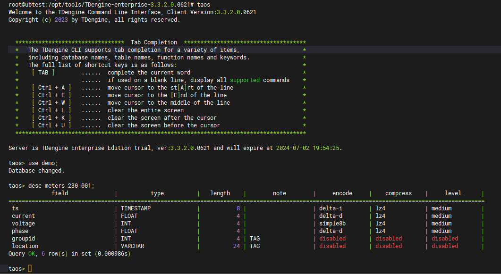

# TD-29677 describe 超级表时taosd crash问题测试报告

## 1. 测试目标

验证TDengine升级的兼容性，确保升级到新版本后，WAL中待创建的表，在TDengine升级后，“desc 超级表名”可以正常查看。

## 2. 变更历史

| Date | Version | Owner | Memo |
| --- | --- | --- | --- |
| 2024/06/22 | 0.1 | Cris Pei | Draft |

## 3. 测试结论

问题修复，测试通过

## 4. 已知问题和限制

无

## 5. 测试资源及环境

测试平台：Linux Ubuntu18 x64
测试资源：本机虚拟机
测试版本：V3.3.2.0.0621 commit（3fd11ef67a10280889b3318c15296046512e6d5a）

## 6. 测试范围及方法

### 6.1 测试方法：

先使用V3.2旧版本升级到问题修复前的V3.2.4.0新版本复现问题，然后再升级到最新发布版本V3.3.20.62101，按照同样的复现步骤验证问题已经修复。

### 6.2 测试范围：

TDengine版本升级后的兼容性，具体指的旧版本中WAL中待创建的超级表在新版本中可以使用命令“desc 超级表名”查看。

## 7. 测试数据

创建大量超级表，格式如下：
"create stable demo.meters_%03d_%03d(ts timestamp, current float, voltage int, phase float) tags (groupid int, location varchar(24));" % (ccy_no, no)，其中ccy_no是并发进程号，no是进程内的序号。

## 8. 测试步骤：

### 8.1 复现步骤：

1. 下载并运行旧版本TDengine V3.2 commit（17689c464bfba60ea33a3bb8225d7291d42c78ad）；
2. 运行脚本，创建大量（1万以上）创建超级表请求；
3. 在TDengine处理创建超级表请求过程中，kill掉taosd进程，中断TDengine创建超级表的处理；
4. 升级TDengine到问题修复前的版本V3.2.4.0 commit（34f7dc4782c3c2cc9982b2c313cc515cee0ed4cb），并运行TDengine;
5. 在taos命令行中通过命令“desc 超级表名”查看，触发问题；

1. 查看taosd进程已经crash，coredump调用栈与问题描述一致，问题复现;

### 8.2 测试结果：

依次根据复现步骤进行测试，确保升级到新版本后，WAL中待创建的表，在TDengine升级后，“desc 超级表名”可以正常查看，问题已经解决。

