# TS-4918 行业版测试

## 1. 测试目标

1. 对行业版的界面（安装包命名、Taos Shell的输出）进行测试，是否符合规范
2. 确保行业版功能完备，通过 License 进行控制，对照企业版
Fun Spec：[TDengine 行业版](https://taosdata.feishu.cn/wiki/KIkbwAUJwif3Alkxz2Acn2e6nOf)

## 2. 变更历史

| Date | Version | Owner | Memo |
| --- | --- | --- | --- |
| 2024/06/12 | 0.1 | Astro |  |
| 2024/06/12 | 0.2 | Astro | 根据评论进行更新 |
| 2024/06/17 | 0.3 | Astro | 在测试结论中更新当前进度 |
| 2024/06/18 | 0.4 | Astro | 更新Arm64测试结果 |
| 2024/06/27 | 0.5 | Astro | 添加编译宏功能测试 |

## 3. 测试结论

1. 三平台信息展示相关问题测试完成，所有JIRA问题均已修复，测试通过
2. 标准版和行业版相互覆盖安装场景测试完成，windows在运行中无法覆盖安装，已存在jira，其他测试通过

## 4. 已知问题和限制

无

## 5. 测试资源及环境

#### 5.0.1 Linux x64

测试平台：Linux x64
测试资源：本机虚拟机
测试版本：V3.3.1.0

#### 5.0.2 Linux arm64

测试平台：Linux arm64
测试资源：192.168.1.204
测试版本：V3.3.1.0

## 6. 测试范围及方法

### 6.1 测试方法：

1. 下载安装包，查看安装包名称是否符合规范 
2. 打开 Taos Shell 查看是否符合规范（登录信息，版本信息，授权信息等）

### 6.2 测试范围：

1. 安装包
2. 所有 taos cli 工具

## 7. 测试数据

下载自 jenkins 的安装包

#### 7.0.1 Linux x64

<view type="1">

  > ⚠ 嵌入文件，需在飞书中查看 (token: SNeObLeCloGOTWxk9aBcQsEYnXf)

</view>

#### 7.0.2 Linux arm64

<view type="1">

  > ⚠ 嵌入文件，需在飞书中查看 (token: PSFSb5W1WohzZ9xgQPTcWKshn0g)

</view>

#### 7.0.3 Windows

<view type="1">

  > ⚠ 嵌入文件，需在飞书中查看 (token: FeOEbQeIdo6DUbxxTRNco8LtnKf)

</view>

## 8. 测试用例

### 8.1 安装包名称规范测试

1. 目标：测试安装包名称是否符合规范
2. 期望测试结果：安装包符合 `TDengine-<IndustryName>-<Version>-<Platform>.tar.gz` 规范
3. 测试结果：符合规范

### 8.2 Taos Shell 登录信息规范测试

1. 目标：测试 taosShell 展示信息是否规范
2. 期望测试结果：
```python
Server is Power trial Edition, ver:3.2.3.0 and will expire at 2024-04-13 09:49:04.
```

1. 测试结果：

#### 8.2.1 Linux x64


1. 结果：与预期输出不符，需确认 @肖平 @张玮绚

#### 8.2.2 Linux arm64


1. 结果：与预期输出不符

#### 8.2.3 Windows

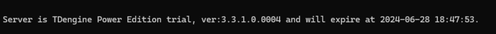

1. 结果：与预期输出不符

### 8.3 Taosd 版本信息规范测试

1. 目标：测试 `taosd -V` 展示信息是否符合规范
2. 期望测试结果：
```plaintext
taosd -V
Power Edition: 3.2.3.0 compatible_version: 3.0.0.0
gitinfo: e27fdcff254b7bd0e0ad2f825e0414da4c0f37dc
gitinfoOfInternal: 1fa6f400b011e78e72a75bbc903ca8c34212e2d5
buildInfo: Built Linux-x64 at 2024-02-29 22:16:43 +0800
```

1. 测试结果：

#### 8.3.1 Linux x64

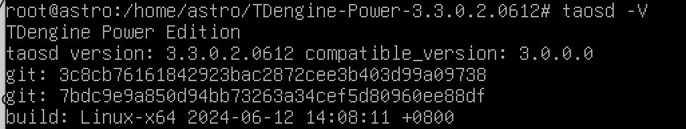

测试结论：符合预期

#### 8.3.2 Linux arm64

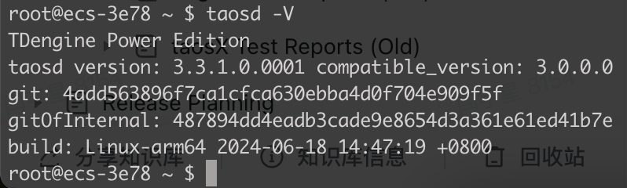

测试结论：符合预期

#### 8.3.3 Windows

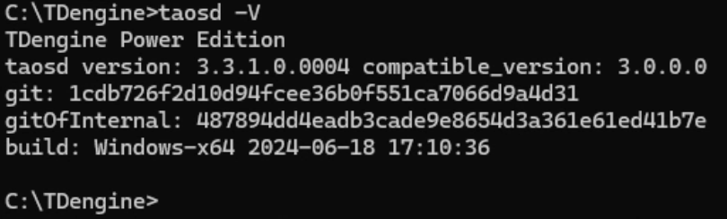

测试结论：符合预期

### 8.4 Taos 授权信息规范测试

1. 目标：测试 `show grants` 版本信息 `version` 字段内容是否符合规范
2. 期望测试结果：
```sql
taos> show grants \G;
*************************** 1.row ***************************
     version: TDengine Power trial Edition
 expire_time: 2024-04-13 09:49:08
service_time: 2024-04-03 09:49:04
     expired: false
       state: ungranted
  timeseries: unlimited
      dnodes: unlimited
   cpu_cores: unlimited
Query OK, 1 row(s) in set (0.004996s)
```

1. 测试结果：

#### 8.4.1 Linux x64

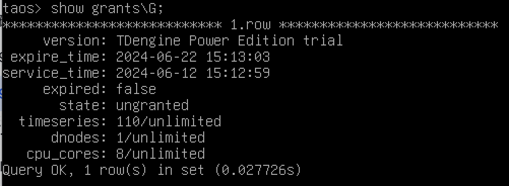

测试结论：不符合预期

#### 8.4.2 Linux arm64

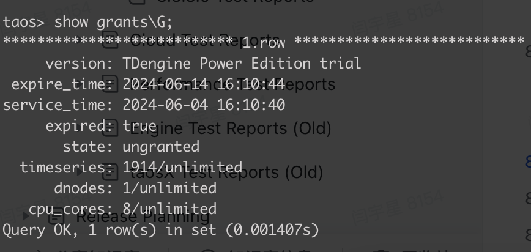

测试结论：不符合预期

#### 8.4.3 Windows

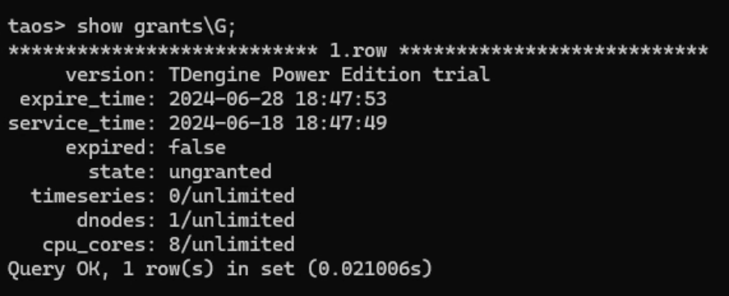

测试结论：不符合预期

### 8.5 详细授权信息展示规范测试

1. 目标：测试 `select * from ins_grants_full` 输出的授权信息，只显示 License 授权的功能
2. 期望测试结果：
```python
           grant_name           |          display_name          |             expire             |             limits             |
====================================================================================================================================
 stream                         | stream                         | 2024-04-13 09:49:08            | unlimited                      |
 subscription                   | subscription                   | 2024-04-13 09:49:08            | unlimited                      |
 view                           | view                           | 2024-04-13 09:49:08            | unlimited                      |
 audit                          | audit                          | 2024-04-13 09:49:08            |                                |
 csv                            | csv                            | 2024-04-13 09:49:08            |                                |
 storage                        | multi_tier_storage             | 2024-04-13 09:49:08            |                                |
 backup_restore                 | backup_restore                 | 2024-04-13 09:49:08            |                                |
 opc_da                         | OPC_DA                         | 2024-04-13 09:49:08            | {"number":1, "speed":-1, "e... |
 opc_ua                         | OPC_UA                         | 2024-04-13 09:49:08            | {"number":1, "speed":-1, "e... |
 pi                             | Pi                             | 2024-04-13 09:49:08            | {"number":1, "speed":-1, "e... |
 kafka                          | Kafka                          | 2024-04-13 09:49:08            | {"number":1, "speed":-1, "e... |
 influxdb                       | InfluxDB                       | 2024-04-13 09:49:08            | {"number":1, "speed":-1, "e... |
 mqtt                           | MQTT                           | 2024-04-13 09:49:08            | {"number":1, "speed":-1, "e... |
 avevahistorian                 | avevaHistorian                 | 2024-04-13 09:49:08            | {"number":1, "speed":-1, "e... |
 opentsdb                       | OpenTSDB                       | 2024-04-13 09:49:08            | {"number":1, "speed":-1, "e... |
 td2.6                          | TDengine2.6                    | 2024-04-13 09:49:08            | {"number":1, "speed":-1, "e... |
 td3.0                          | TDengine3.0                    | 2024-04-13 09:49:08            | {"number":1, "speed":-1, "e... |
Query OK, 17 row(s) in set (0.005170s)
```

1. 测试结果

#### 8.5.1 Linux x64

未授权时授权过期也显示出来，需要确认是否符合预期？
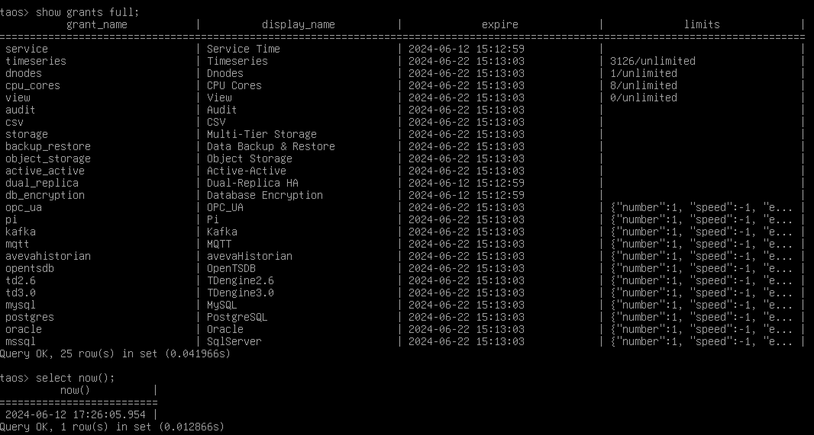

未授权
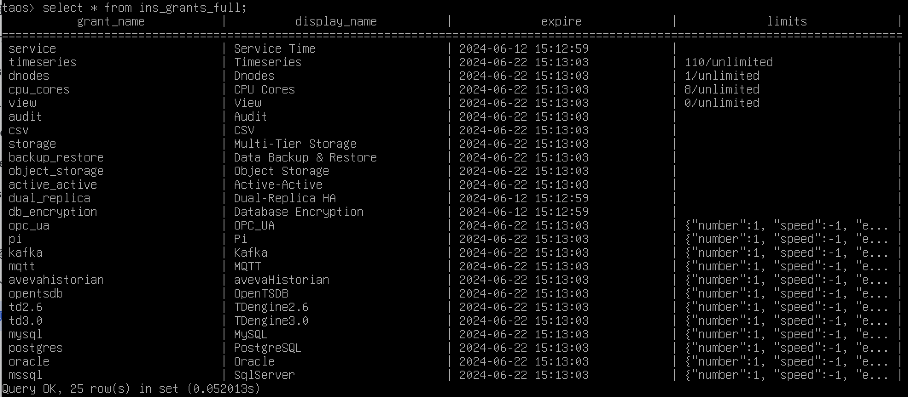

电力版没有 subscription 功能，使用报错，符合预期
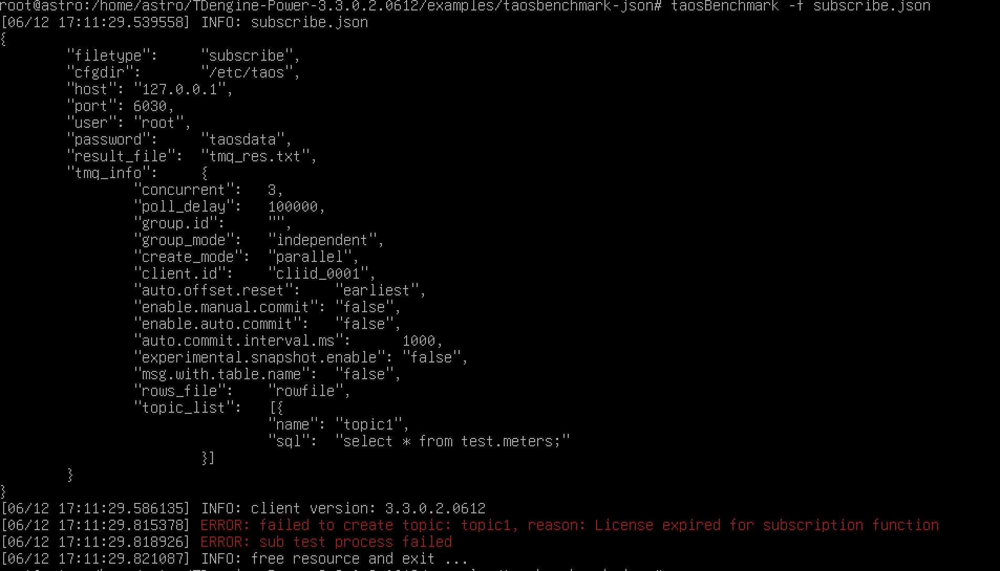

数据库加密授权过期，使用报错，符合预期
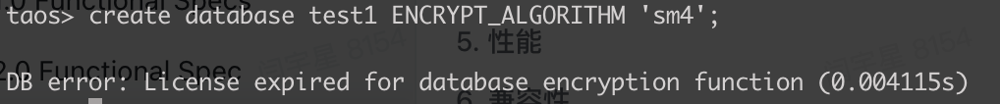

授权后
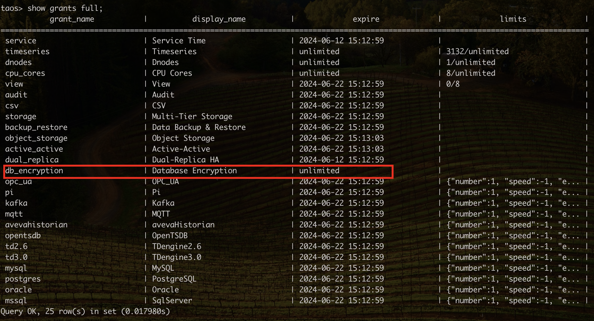

成功使用数据库加密功能创建数据库，符合预期
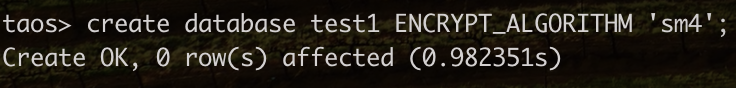

#### 8.5.2 Linux arm64

未授权
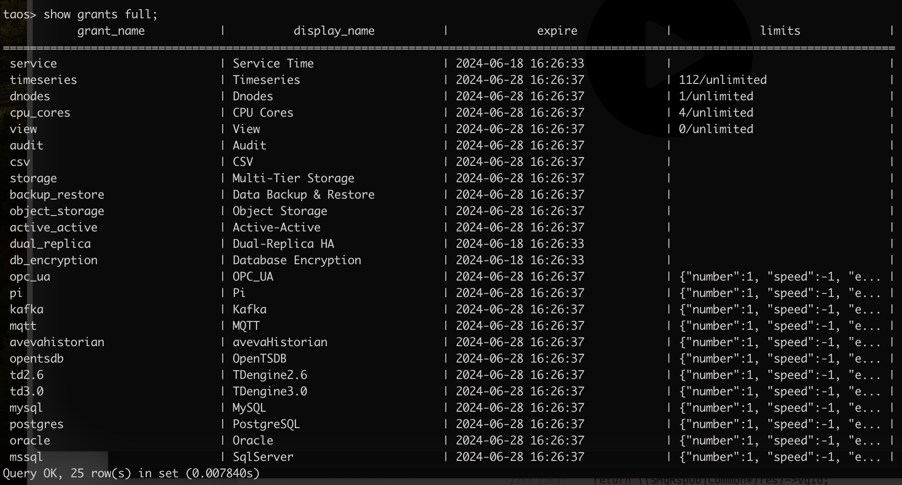

电力版没有 subscription 功能，使用报错，符合预期
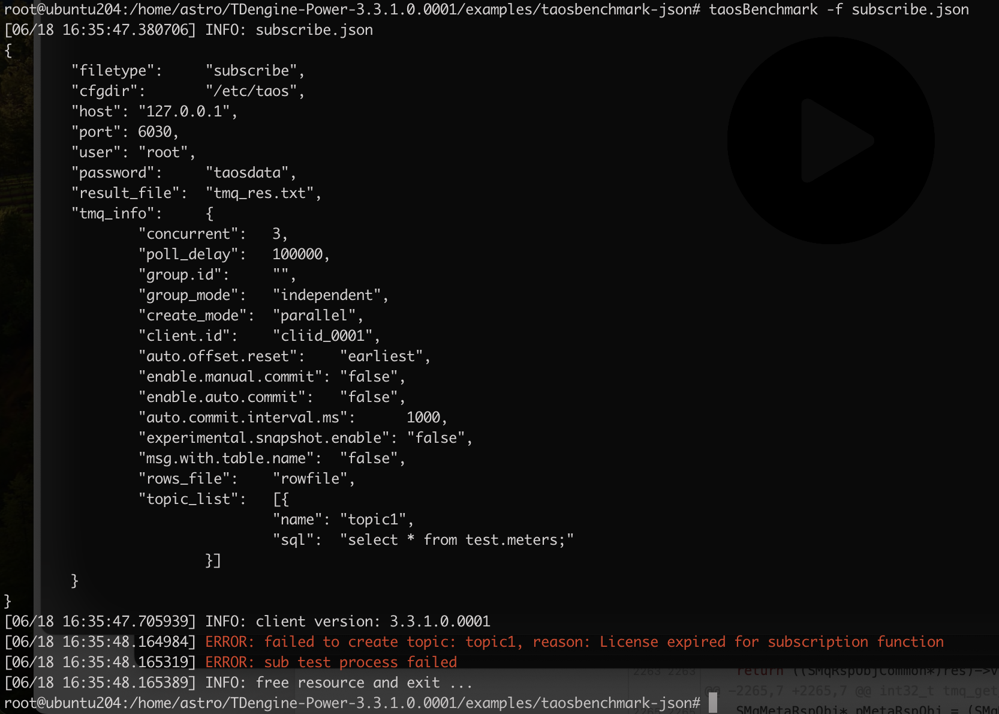

数据库加密授权过期，使用报错，符合预期
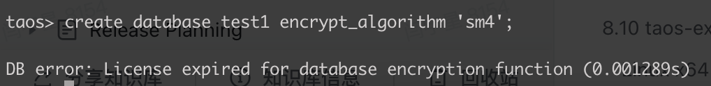

4.2. 授权后
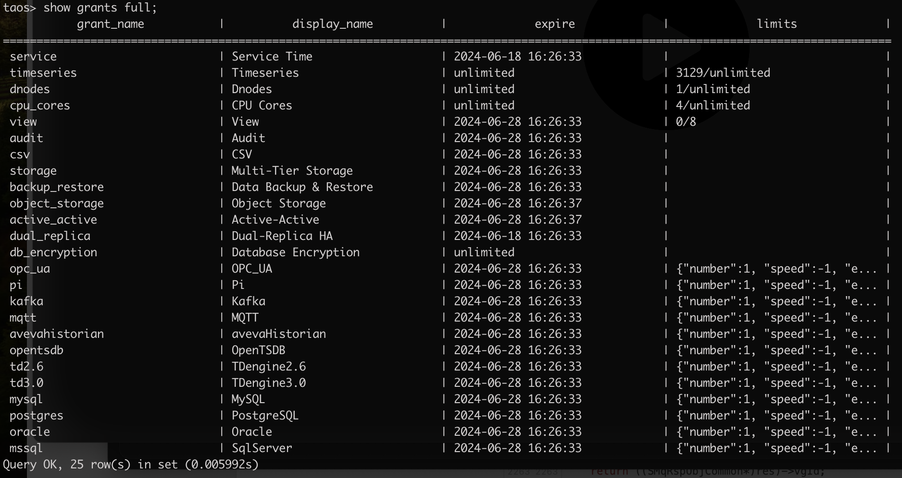

使用数据库加密功能成功，符合预期
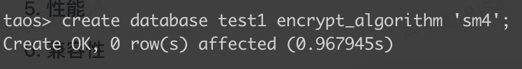

#### 8.5.3 Windows

未授权
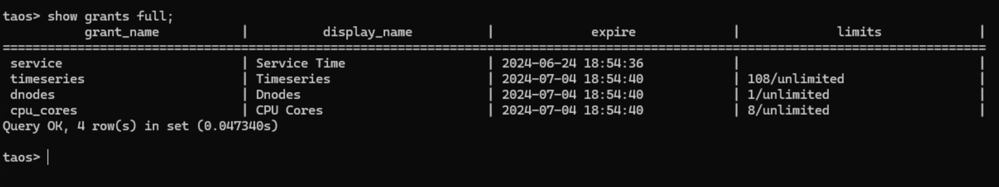

未授权的订阅功能提示授权过期
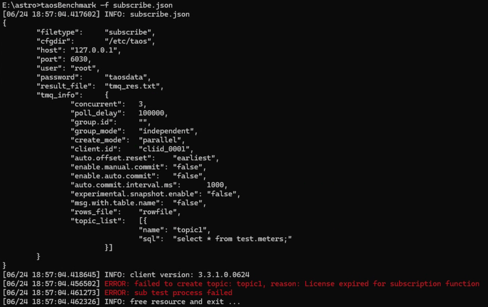

数据库加密未授权
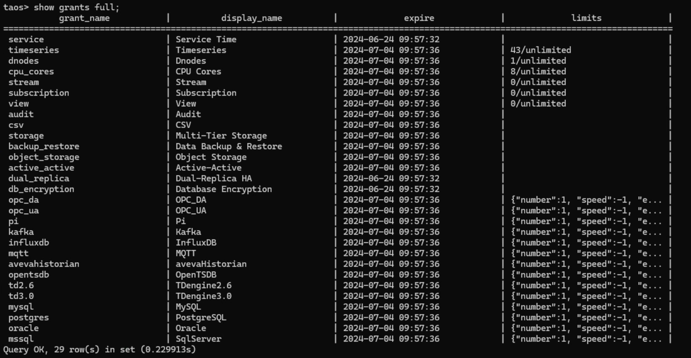

使用数据库加密功能，提示授权过期，符合预期
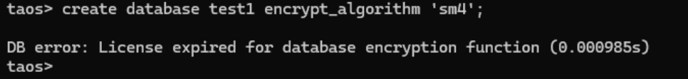

授权后
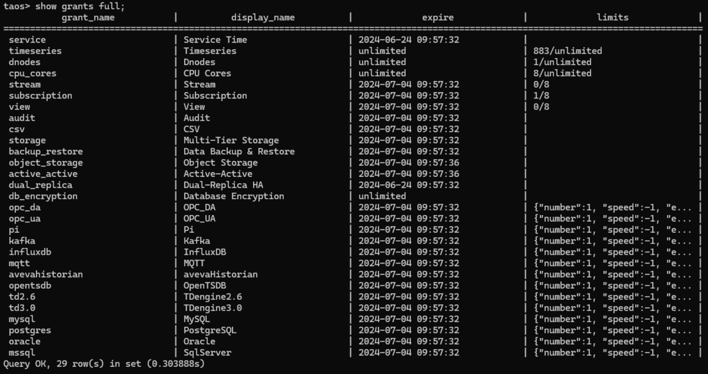

成功创建加密数据库
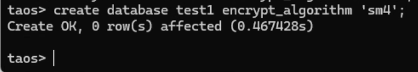

### 8.6 taos 版本信息规范测试

1. 目标：测试 `taos -V` 输出是否符合规范
2. 期望测试结果：输出完整产品信息，并带有行业相关字样
3. 测试结果

#### 8.6.1 Linux x64

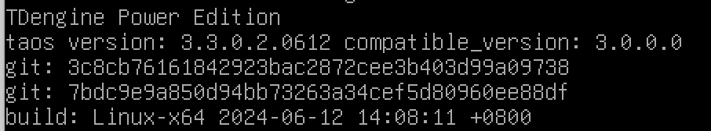

测试结论：符合预期

#### 8.6.2 Linux arm64

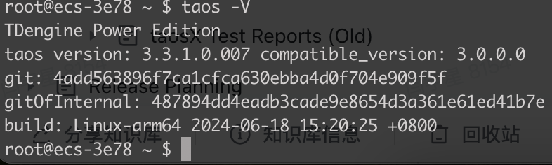

测试结论：符合预期

#### 8.6.3 Windows

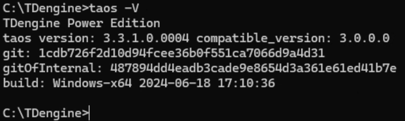

测试结论：符合预期

### 8.7 Taosx 版本信息规范测试

1. 目标：测试 `taosx -V` 输出是否符合规范
2. 期望测试结果：
```sql {wrap}
<component_name> version: <version> [internal version] # internal version 可选，只有 taosx 需要
git: <full commit ID>
[git: <full commit ID>] # 如果代码来自多个仓库，如 taosd 这里放 TDinternal 仓库的 commit ID，其它组件应该没有这个需要
build: <platform> <date> <time> <timezone>
```

1. 测试结果

#### 8.7.1 Linux x64

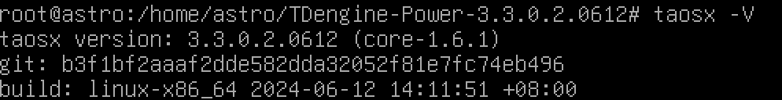

测试结论：符合预期

#### 8.7.2 Linux arm64

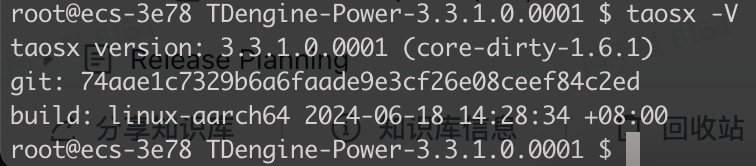

测试结论：符合预期

#### 8.7.3 Windows

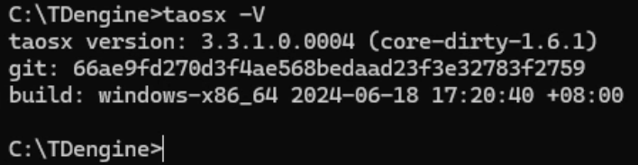

测试结论：符合预期

### 8.8 taos-Adapter 版本信息规范测试

1. 目标：测试 `taosadapter -V` 输出是否符合规范
2. 期望测试结果：
```sql {wrap}
<component_name> version: <version> [internal version] # internal version 可选，只有 taosx 需要
git: <full commit ID>
[git: <full commit ID>] # 如果代码来自多个仓库，如 taosd 这里放 TDinternal 仓库的 commit ID，其它组件应该没有这个需要
build: <platform> <date> <time> <timezone>
```

1. 测试结果

#### 8.8.1 Linux x64

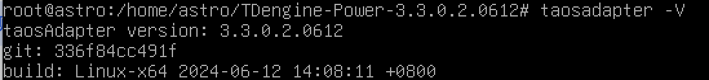

测试结论：符合预期

#### 8.8.2 Linux arm64

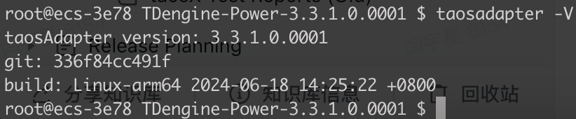

测试结论：符合预期

#### 8.8.3 Windows

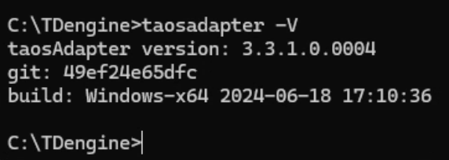

测试结论：符合预期

### 8.9 taosKeeper 版本信息规范测试

1. 目标：测试 `taosKeeper -V` 输出是否符合规范
2. 期望测试结果：
```sql {wrap}
<component_name> version: <version> [internal version] # internal version 可选，只有 taosx 需要
git: <full commit ID>
[git: <full commit ID>] # 如果代码来自多个仓库，如 taosd 这里放 TDinternal 仓库的 commit ID，其它组件应该没有这个需要
build: <platform> <date> <time> <timezone>
```

1. 测试结果

#### 8.9.1 Linux x64

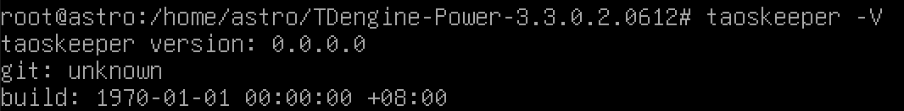

Git 未正确输出，不符合预期

#### 8.9.2 Linux arm64

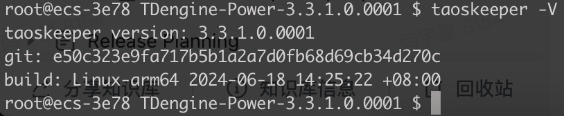

测试结论：符合预期

#### 8.9.3 Windows

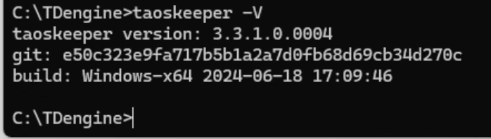

测试结论：符合预期

### 8.10 taos-explorer 版本信息规范测试

1. 目标：测试 `taos-explorer -V` 输出是否符合规范
2. 期望测试结果：
```sql {wrap}
<component_name> version: <version> [internal version] # internal version 可选，只有 taosx 需要
git: <full commit ID>
[git: <full commit ID>] # 如果代码来自多个仓库，如 taosd 这里放 TDinternal 仓库的 commit ID，其它组件应该没有这个需要
build: <platform> <date> <time> <timezone>
```

1. 测试结果

#### 8.10.1 Linux x64

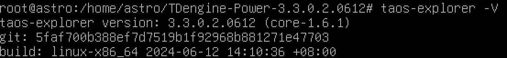

测试结论：符合预期

#### 8.10.2 Linux arm64

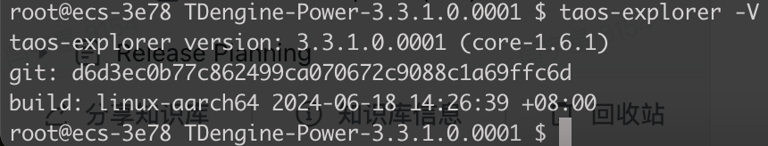

测试结论：符合预期

#### 8.10.3 Windows

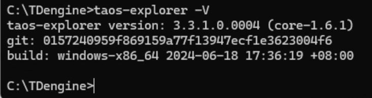

测试结论：符合预期

### 8.11 taosx-agent 版本信息规范测试

1. 目标：测试 `taosx-agent -V` 输出是否符合规范
2. 期望测试结果：
```sql {wrap}
<component_name> version: <version> [internal version] # internal version 可选，只有 taosx 需要
git: <full commit ID>
[git: <full commit ID>] # 如果代码来自多个仓库，如 taosd 这里放 TDinternal 仓库的 commit ID，其它组件应该没有这个需要
build: <platform> <date> <time> <timezone>
```

1. 测试结果
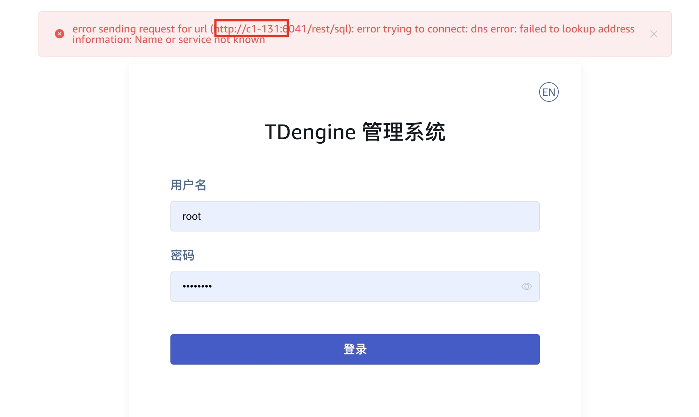

### 8.12 udfd 版本信息规范测试

1. 目标：测试 `udfd -V` 输出是否符合规范
2. 期望测试结果：
```sql {wrap}
<component_name> version: <version> [internal version] # internal version 可选，只有 taosx 需要
git: <full commit ID>
[git: <full commit ID>] # 如果代码来自多个仓库，如 taosd 这里放 TDinternal 仓库的 commit ID，其它组件应该没有这个需要
build: <platform> <date> <time> <timezone>
```

1. 测试结果

#### 8.12.1 Linux x64

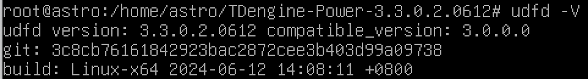

测试结论：符合预期

#### 8.12.2 Linux arm64

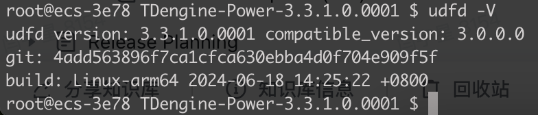

测试结论：符合预期

#### 8.12.3 Windows

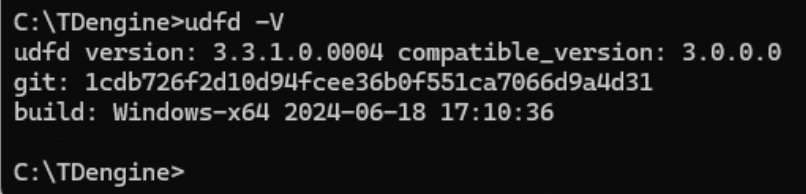

测试结论：符合预期

### 8.13 taosBenchmark 版本信息规范测试

1. 目标：测试 `taosBenchmark -V` 输出是否符合规范
2. 期望测试结果：
```sql {wrap}
<component_name> version: <version> [internal version] # internal version 可选，只有 taosx 需要
git: <full commit ID>
[git: <full commit ID>] # 如果代码来自多个仓库，如 taosd 这里放 TDinternal 仓库的 commit ID，其它组件应该没有这个需要
build: <platform> <date> <time> <timezone>
```

1. 测试结果

#### 8.13.1 Linux x64

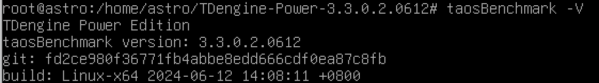

测试结论：不符合预期，不需要显示行业版产品信息

#### 8.13.2 Linux arm64

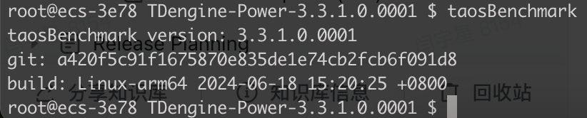

测试结论：符合预期

#### 8.13.3 Windows

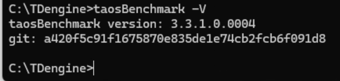

测试结论：缺少 build 信息

### 8.14 taosdump 版本信息规范测试

1. 目标：测试 `taosdump -V` 输出是否符合规范
2. 期望测试结果：
```sql {wrap}
<component_name> version: <version> [internal version] # internal version 可选，只有 taosx 需要
git: <full commit ID>
[git: <full commit ID>] # 如果代码来自多个仓库，如 taosd 这里放 TDinternal 仓库的 commit ID，其它组件应该没有这个需要
build: <platform> <date> <time> <timezone>
```

1. 测试结果

#### 8.14.1 Linux x64

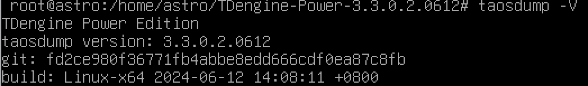

测试结论：不符合预期，不需要产品信息
最新版输出有空格
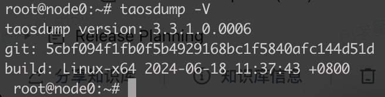

不符合预期
已修复
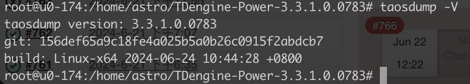

#### 8.14.2 Linux arm64

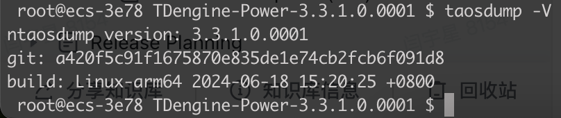

测试结论：不符合预期，开头多了个 "n" 字符，结尾多了个空格
已修复
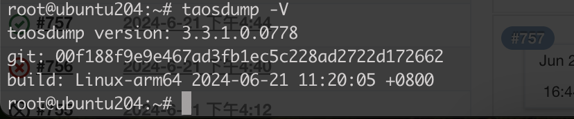

#### 8.14.3 Windows

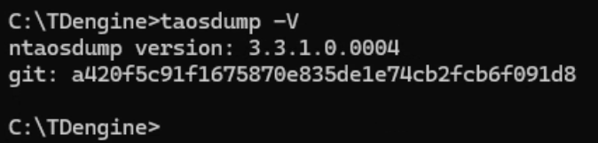

测试结论：不符合预期，开头多了 "n" 字符，结尾缺少 build 信息
已修复
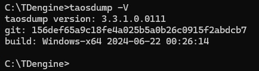

### 8.15 日志信息规范测试

1. 目标：日志中涉及产品名称的地方，要替换为正确的完整产品名称。
2. 测试结果：

#### 8.15.1 Linux x64

下列日志文件中，暂未发现有涉及产品名称的地方
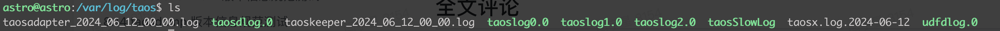

#### 8.15.2 Linux arm64

下列日志文件中，暂未发现有涉及产品名称的地方
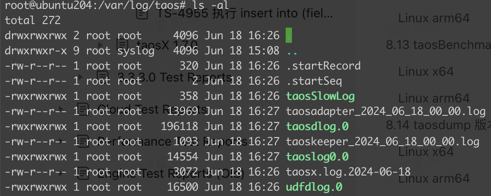

### 8.16 行业版覆盖标准企业版安装

#### 8.16.1 Linux x64

1. 标准企业版不停机，行业版直接安装：行业版会把标准版先停机后再覆盖安装，测试各项未发现问题，插入的数据可正常查询
2. 标准企业版停机，行业版覆盖安装：测试各项未发现问题，企业版插入的数据可正常查询
3. 标准企业版使用 rmtaos 删除所有数据后，安装行业版：测试各项未发现问题

#### 8.16.2 Linux arm64

1. 标准企业版不停机，行业版直接安装：行业版会把标准版先停机后再覆盖安装，测试各项未发现问题，插入的数据可正常查询
2. 标准企业版停机，行业版覆盖安装：测试各项未发现问题，企业版插入的数据可正常查询
3. 标准企业版使用 rmtaos 删除所有数据后，安装行业版：测试各项未发现问题

#### 8.16.3 Windows

1. 暂时无法在正在运行taosd时覆盖安装
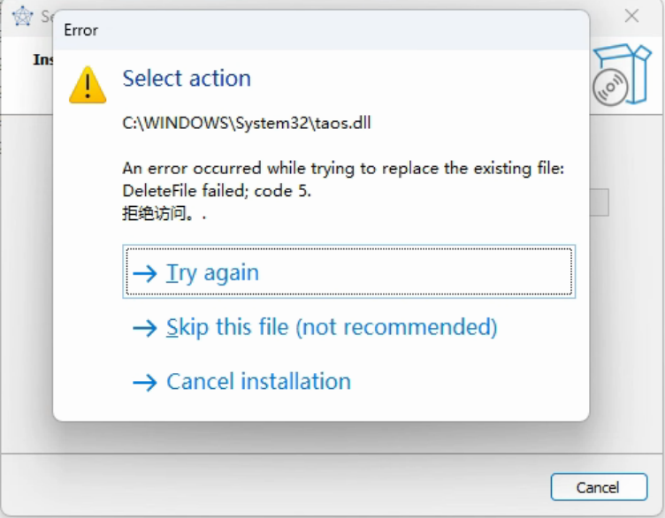

1. 标准企业版停机，行业版覆盖安装：测试各项未发现问题，插入的数据可正常查询
2. 标准企业版使用卸载程序卸载并删除所有数据后，安装行业版：测试各项未发现问题

### 8.17 标准版覆盖行业版安装

#### 8.17.1 Linux x64

1. 行业版不停机，标准企业版直接安装：标准企业版会把行业版先停机后覆盖安装，测试各项未发现问题，插入的数据可正常查询
2. 行业版停机，标准企业版覆盖安装：测试各项未发现问题，行业版插入的数据可正常查询
3. 行业版使用 rmtaos 删除所有数据后，安装标准企业版：测试各项未发现问题

#### 8.17.2 Linux arm64

1. 行业版不停机，标准企业版直接安装：标准企业版会把行业版先停机后覆盖安装，测试各项未发现问题，行业版插入的数据可正常查询
2. 行业版停机，标准企业版覆盖安装：测试各项未发现问题，行业版插入的数据可正常查询
3. 行业版使用 rmtaos 删除所有数据后，安装标准企业版：测试各项未发现问题

#### 8.17.3 Windows

1. 行业版停机，标准企业版覆盖安装：测试各项未发现问题，行业版插入的数据可正常查询
2. 行业版使用卸载程序卸载并删除所有数据后，安装标准企业版：测试各项未发现问题

### 8.18 宏为关闭状态的各功能测试

#### 8.18.1 Linux x64

当前开启的功能项仅4项
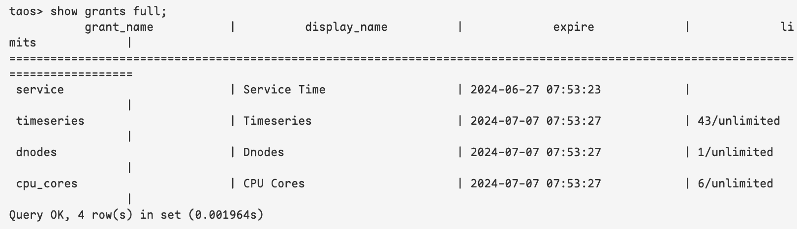

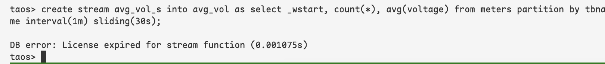

流计算功能不可用，符合预期
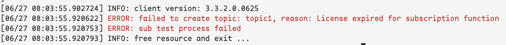

订阅功能不可用，符合预期
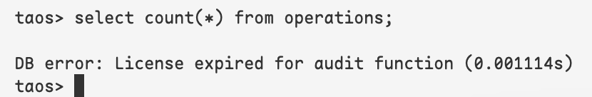

审计功能不可用，符合预期
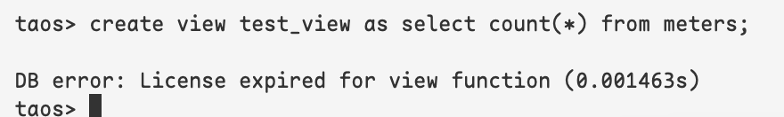

视图功能不可用，符合预期
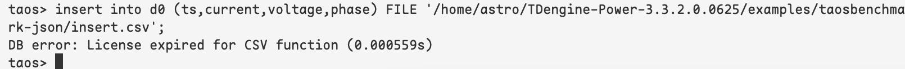

CSV 导入功能不可用，符合预期
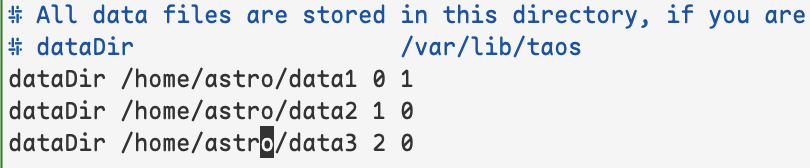

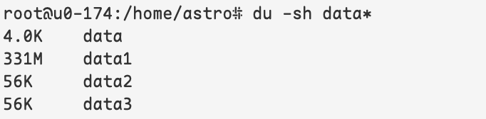

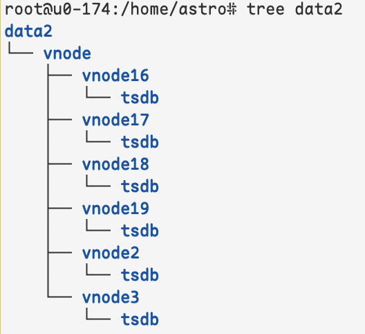


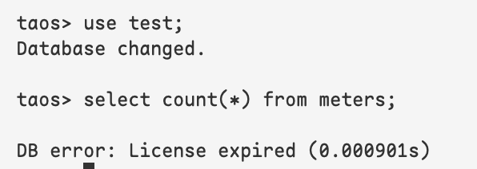

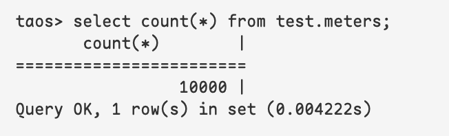

多级存储的三个数据目录中均有数据，但是无法查询任何一个表，多级存储功能不可用，注释掉多级存储配置后重启，数据又可以查询了，说明不是 License 整体过期而是多级存储过期，符合预期
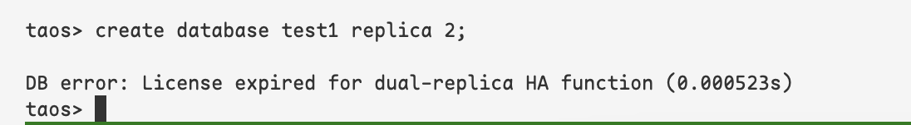

双副本功能不可用，符合预期
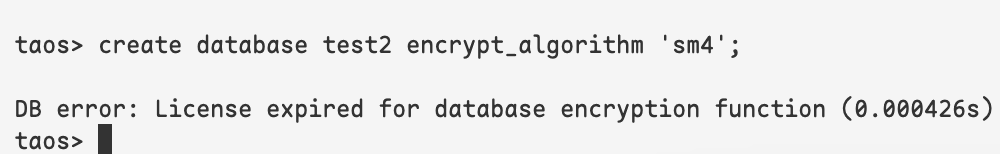

数据库加密功能不可用，符合预期
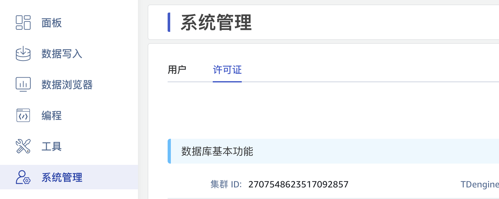

数据备份与恢复功能隐藏无法使用，符合预期

首先使用标准企业版写入数据
配置文件
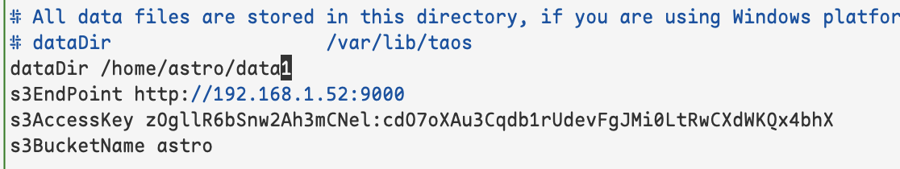

写入数据后执行s3migrate database test 和 trim database test
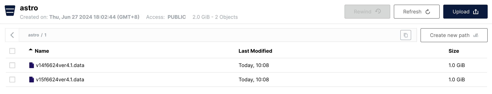

数据上传到minio，说明对象存储正常运行
删除minio上的文件，安装+启动行业版，插入同样的数据，执行 s3migrate database test 和 trim database test
等待一段时间，仍然没有数据上传
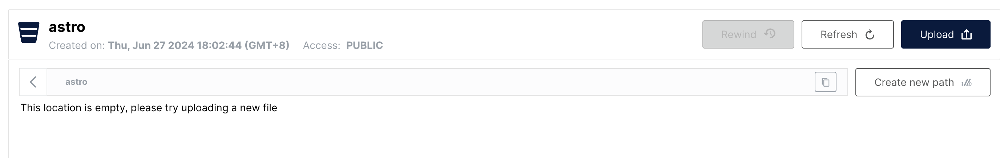

对象存储功能符合预期

#### 8.18.2 Linux arm64

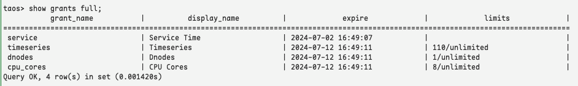

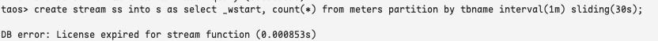

流计算不可用，符合预期
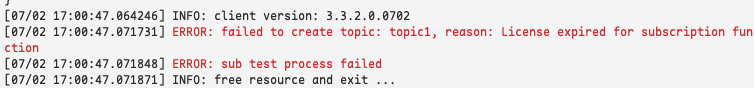

订阅功能不可用，符合预期
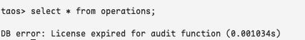

审计功能不可用，符合预期
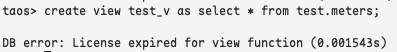

视图功能不可用，符合预期
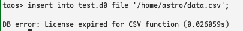

csv导入功能不可用，符合预期
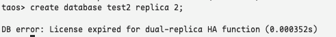

双副本功能不可用，符合预期
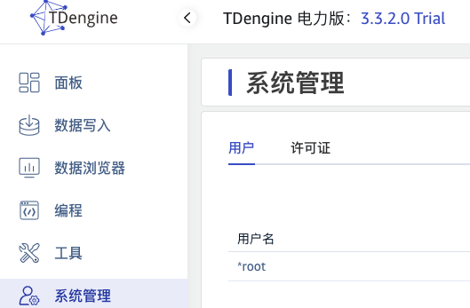

数据库备份与恢复功能隐藏不可用，符合预期
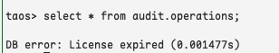

所有数据均无法查询，多级存储功能不可用，符合预期
s3存储
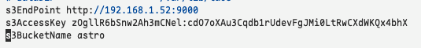

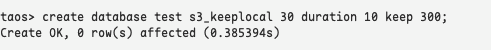

插入30天之前的数据
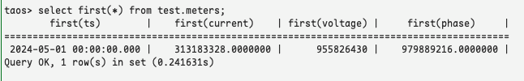

执行 s3migragte 和 trim database
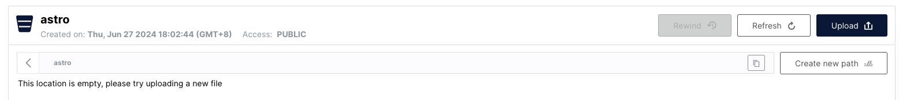

数据文件未上传，符合预期

#### 8.18.3 Windows

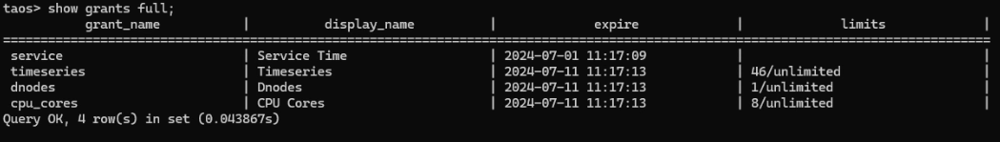

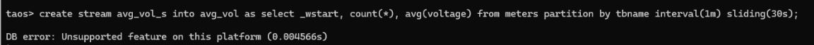

Windows 暂不支持流计算
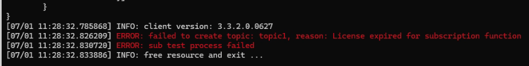

订阅功能不可用，符合预期
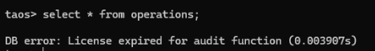

审计功能不可用，符合预期
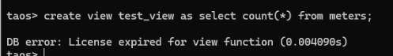

视图功能不可用，符合预期
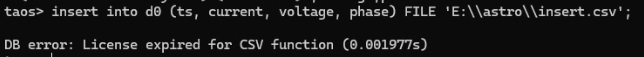

csv 导入功能
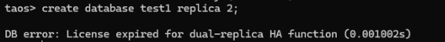

双副本功能不可用，符合预期
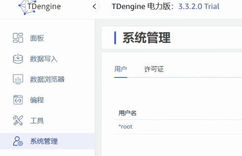

数据库备份与恢复功能隐藏不可用，符合预期
数据目录配置为多级存储后
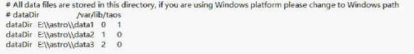

所有数据均无法查询
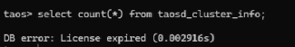

多级存储功能未授权无法使用，符合预期
s3存储功能
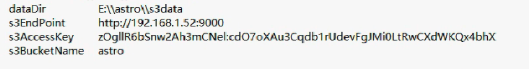

```sql
create database test s3_keeplocal 30 duration 10 keep 300;
```

插入 30天内及 30-60天内的数据，执行 s3migrate database和 trim database命令
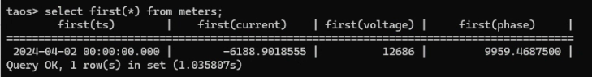

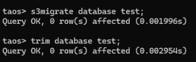

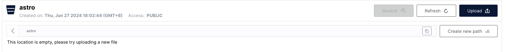

数据没有上传到 minio，符合预期

## 9. 参考文档

Jira 链接：
TS-4918

## 10. JIRA 问题列表

1. 
  TD-30648

1. 
  TD-30647

1. 
  TD-30643

1. 
  TD-30571

1. 
  TD-30570
